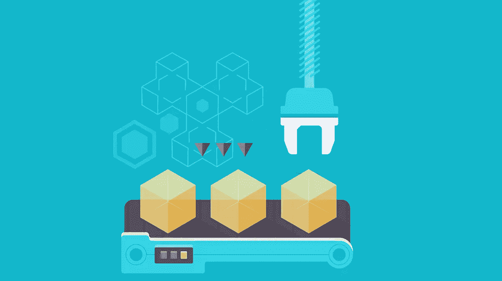

# 成功的产品发布战略的三个要素

> 原文：<https://www.sitepoint.com/product-launch-strategy/>

事实证明童子军一直都是对的。充分的准备是成功的产品发布与闯入邻居后院的产品发布的区别。

如果你想让你的产品离开轨道，你需要一个计划。

根据 Bplans 的数据，有计划的公司比没有计划的公司增长快 30 %,而 71%的快速增长公司都有计划。

但是制定计划需要时间，而且每天都有如此多的新产品推出，许多企业家觉得如果他们不立即行动，他们就会被落在后面。只需访问产品策展平台 [Product Hunt](http://producthunt.com) 就能了解这个市场有多拥挤。自 2013 年 11 月成立以来，该网站已编制了一个包含 15，000 种产品的常青数据库。仅在一个网站上，每天就有近 30 个产品发布。

考虑到这些数字，很容易看出有人可能会感到压力，急于将他们的产品推向市场。但是压力是水肺潜水员要考虑的事情，而你不是水肺潜水员。

花时间以正确的方式推出你的产品。从解决这三个要素开始计划它的发布。

## 分配

分销——你将如何向你的目标市场提供你的产品或功能。

太多的创业公司把所有鸡蛋都放在营销篮子里，而忽略了分销，但这两者同样重要。你可以创造自“给世界买一杯可乐”以来最伟大的营销活动，但是如果你不能把你的产品摆在你的顾客面前，你将永远被困在那座山上跳舞。

要创建强大的分销战略，您需要完成以下工作:

#### 注意:如果你还没有研究和分析你的理想客户，把这篇文章放进你的口袋，然后[阅读这篇关于开发客户档案的文章](http://sixteenventures.com/ideal-customer-profile)。

*   确定你的客户更有可能在网上还是在实体店购买你的产品。
*   在不牺牲质量的前提下，找出最具成本效益的方式将产品展示在客户面前。
*   建立你的分销渠道。它们是直接的还是间接的？两者都有？直销渠道的一个例子是通过 Etsy 销售你的产品。间接分销渠道的一个例子是通过中间商销售你的产品，如批发商或零售商。
*   考虑最终用户的需求。如果你卖衣服，他们需要试衣间吗？你的产品需要现场演示吗？你的产品是有人会特意去找的东西，还是更多的是一种冲动购买？
*   考虑产品的需求。它容易腐烂吗？它太大了吗？是不是极度脆弱？它需要特定的显示设置吗？

回答这些问题将使你的分销策略规划更加简单。

例如，膳食订阅服务 [Plated](https://www.plated.com) 需要创建一个分销策略，将预包装的食材快速、安全地送到客户手中。他们决定在网上销售他们的产品，并使用间接分销渠道，食品从农民到履行中心再到顾客。为确保快速交货，Plated 在全国各地设有多个履行中心。知道他们的产品是多么容易腐烂，该公司设计了一个创新的包装系统，保持其内容长达 24 小时冷。

## 促进

促销——你将告诉你的目标市场什么，以及你将如何告诉他们。

在计划产品发布时，至关重要的是，您的促销策略应在产品发布前开始，并持续到产品发布期结束。

分销前促销的目的是激起对产品的兴趣，并在分销开始时让买家排队。根据产品的不同，促销活动可能在上市前一个月、半年甚至一年开始。

### 促销策略

#### 网站(全球资讯网的主机站)

你的网站是你企业的脸面，所以确保它是一张人们暂时不会介意看的脸。确保它的搜索引擎友好，设计巧妙，组织良好。

尽量在产品发布前至少六周完成所有的网站文案。确保你所有的网页至少提前两周完成。两周前就开始用你的产品的图片和视频吸引用户，并持续发布内容直到发布。

#### 博客

博客是接触潜在客户并保持他们兴趣的一种简单有效的方式。使用你的博客向人们更新你的产品的进展，你可能收到的任何新闻，以及与你的业务相关的任何重大事件或公告。总是包括“即将发布”的帖子，偷偷看一眼，让人们谈论。

#### 社会化媒体

利用 Twitter 和脸书等社交媒体平台是让每个人都了解最新产品新闻的另一种方式。类似于你的博客，通过先睹为快和“即将发布”的帖子来制造轰动。专注于让你的社交媒体信息可以分享，这样就能接触到尽可能多的潜在客户。

#### 电子邮件营销

如果你已经有一个用户群，电子邮件营销是让他们对你的产品发布感到兴奋的好方法。像博客帖子和社交媒体消息一样，您可以使用电子邮件来分享您的最新产品新闻。您还可以向人们发送您的博客帖子、您的网站或任何其他相关在线内容的链接。别忘了在你的发布日发邮件！并确保它包含适当数量的感叹号。另外，[Ramit Sethi 要遵循一个好的产品发布顺序](http://www.copygrad.com/2014/05/09/the-17000-word-beast-ramit-sethi-created-to-launch-his-new-course/)。

#### 压

无论是挖掘你现有的网络还是给博主发邮件，尽你所能获得媒体报道。在发布前六周，开始让媒体了解你的产品。两周前，开始向他们推销你的故事。推销时，一定要突出引人注目的产品功能和独特的卖点。让别人很容易写一篇关于你的产品的文章或者发一条关于它的功能的微博。不要让他们为新闻角度工作。给他们。

## 支持

在你发布产品之前，你需要有一个客户支持系统。谁知道呢，你可能第一天就需要它。

强大的支持系统也是长期成功的必要条件。事情会出错，当它们出错时，你需要做好准备并有能力修复它们。否则你的客户体验会受到影响，当这种情况发生时，其他一切都会受到影响。你知道吗，需要 [12 次积极的客户体验才能弥补一次未解决的消极体验](http://www.helpscout.net/75-customer-service-facts-quotes-statistics/)？呀。

这里有一些关于建立一个强大的客户支持系统的建议。

*   决定如何处理客户反馈。你会把它纳入你的商业战略吗？你会回应反馈吗？
*   确保您拥有应对任何情况的必要技术。例如，你的网站有足够的带宽来处理额外的流量吗？你的电话系统怎么样？
*   自动化任务以帮助解决重复性问题。例如，您可以发布常见问题，或者设置对常见问题的固定回复。
*   创建一个危机剧本，为任何可能的灾难建立协议，如被起诉、负面新闻或安全漏洞。确保所有人员都可以随时拿到这份行动手册。
*   对于客户支持的恐怖故事，请查看 Groove HQ 的[全部内容](https://www.groovehq.com/blog/downtime)。

## 关于计时的一个注记

*   不要在重大节假日推出。
*   如果你已经有很多测试用户，周一和周二是上线的最佳时间。
*   如果你依赖第三方来促进你的发布，确保你在一个适合他们的时间表的日子发布
*   如果你的产品有竞争对手，找出他们何时推出。你想单挑吗？你想等到市场熟悉竞争产品后再推出自己的产品吗？记住，如果你没有真正准备好，不要急着在市场上击败你的竞争对手。

## 分享这篇文章