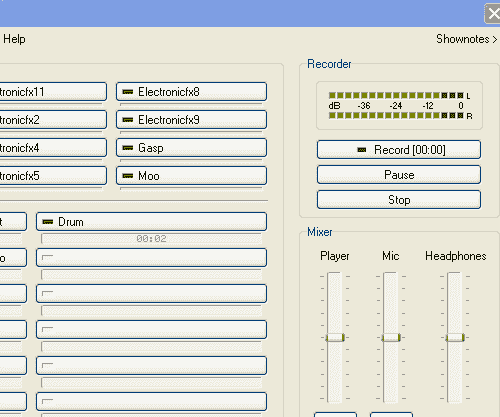

# Podtastic！我们其他人的专业播客

> 原文：<https://www.sitepoint.com/professional-podcasting/>

使用互联网传送音频并不新鲜。自 90 年代末以来，流媒体音频在互联网上一直很活跃，但这与播客相去甚远。播客是两种技术的完美结合:RSS 规范和 MPEG Level 3 (MP3)压缩算法。Dave Winer 在 RSS 规范方面的工作和 Adam Curry 在广播方面的经验结合在一起，为世界带来了播客——预先录制的音频节目能够在听众睡觉时自动下载到他们的音频播放器中。

虽然播客的完整历史超出了本文的范围，但如果我不指出一些关键的日期和人物，那将是我的失职。在 2000 年 10 月，Tristan Louis 提出了联合提要封装的想法。大约在同一时间，RSS 格式的作者 Dave Winer 和许多音乐校友 Adam Curry 讨论了相同的概念。Winer 的回应是在 RSS 0.92 规范中创建了 enclosure 元素，并于 2001 年 1 月 11 日在他的个人博客中附上了一首 Grateful Dead 歌曲，证明了这一点。随之而来的是名副其实的开发人员和企业家蜂拥而至，争相创建应用程序和服务来支持这一新媒体。对于那些渴望了解细节的人来说，维基百科有一个极好的播客条目，可以解渴。

这篇文章会给你一个播客的完整介绍；结束时，你应该处于一个很好的位置来建立，录制，并向大众分发你自己的播客！但是，在我们卷起袖子动手之前，了解一些基本知识是很重要的。

##### 一点背景

单词 podcasting 是单词 broadcasting 和 iPod 的组合。不管它在名字中的突出位置如何，iPod 并不是听播客所必需的。任何旧的 MP3 播放器都可以，事实上，许多播客已经开始以 MP3 以外的格式制作节目。

和任何好的舞蹈一样，播客需要两个人。播客是制作节目的人，听众在舞池的另一端，等待每个节目出现在他们的音频播放器中。让这一切成为可能的应用是 [podcatcher](http://en.wikipedia.org/wiki/Podcatcher) 。podcatcher 是一个应用程序，它被设计用来读取 RSS 提要，并寻找预示二进制文件路径的神奇附件元素。podcatcher 足够聪明，不仅可以去下载 enclosure 元素中指示的文件，而且只有当文件不在 pod catcher 的档案中时才这样做。

乍一看，可能很难理解为什么播客优于直接下载音频文件或流媒体点播内容。对于所有这些收听音频内容的方法，有许多争论，但好的争论集中在生活方式上:播客允许那些不整天坐在电脑前的人收听节目。设置一个 podcatcher，每晚加载一个音频播放器来播放新的节目，以便在路上、公共汽车上或钓鱼时播放，这并不麻烦。播客也解决了和博客一样的“长尾”问题。地方广播电台很难为制作没什么兴趣话题的节目建立商业案例。播客就不是这样了。和博客一样，播客市场的进入壁垒几乎不存在；因此，可用主题的广度令人震惊。

##### 螺母和螺栓

创建一个播客不是一件容易的事。录制、编辑和编码音频文件的技术方面并不难掌握，但是将这些知识与好的内容、得体的声音和时间感结合起来可能是一个相当大的挑战。

***数字音频编辑***

在你的播客之旅中，你首先需要的是一个好的编辑器。编辑器是一种记录并允许编辑音频的软件(更准确的说法是数字音频编辑器或数字音频工作站)。针对所有平台和价位，有许多不同风格的编辑器。Audacity 可能是目前最流行的编辑器。Audacity 受欢迎的原因有很多，但最重要的是它可用于 Windows、Mac 和 GNU/Linux；界面成熟直观；而且是免费的(比如免费和自由软件基金会)。

在商业方面，CastBlaster(由 Adam Curry 亲自负责)是最有前途的工具。Audacity 缺少的 CastBlaster 的主要功能是“提示”曲目并按下按钮播放它们的能力。使用 Audacity 时，必须停止录音，并将所需的声音剪辑移到适当的位置。有了 CastBlaster，只需按一个按钮就可以开始、停止和暂停这些剪辑，这可以使节目更加自然。CastBlaster 仍处于测试阶段，试用版只能录制十分钟的节目。因为它只适用于 Windows，所以我暂时坚持使用 Audacity。

***ID 标记者***

许多音频文件格式都能够包含信息标签。通常，这些标签是关于节目的简短信息，如标题、日期、录制艺术家、长度、评论和图片。任何称职的音乐播放器都可以显示这些标签中包含的信息。

作为一名播客，当你发布你的节目时，你必须花时间填写至少一些标签。与音乐不同，播客一集可能不容易识别，听众应该能够快速浏览屏幕，看看他们在听什么和谁在听。随着播客在听众之间共享，这一信息变得更加重要，因为听众可能真的不知道他们在听什么。

MP3 和 OGG Vorbis 文件格式支持包含 ID 标签。Audacity 和 CastBlaster 都提供了在节目完成时“标记”节目的功能，但是在这两种情况下，提供的标记都是有限的。许多播客可能会选择使用第三方外部标签应用程序来访问更多标签。对于 GNU/Linux， [Easy Tag](http://easytag.sourceforge.net/) 是一个强大的、免费的 ID tagger 对于 Windows， [Multi ID3](http://www.softpedia.com/get/Multimedia/Audio/Tag-Editors/Multi-ID-Tag-Editor.shtml) 使用频繁(虽然 Windows Media player 内置了一些标签功能)；对于 Mac 来说， [MP3tagger](http://www.hitsquad.com/smm/programs/Mp3Tagger_mac/) 似乎符合要求，尽管作为一个 Java 应用程序，它应该可以在任何平台上运行。

音频文件仍然被视为“音乐”文件，因此 ID 标签字段的一些名称不能很好地与播客交叉，但至少，您应该填写的标签是:

*   **艺人:**你的名字！人们喜欢知道他们在听谁。
*   **标题:**节目名称。该字段中的数据将在玩家的屏幕上显著滚动。节目名称应该包括名称、剧集编号和发布日期。所有这些信息都是听众需要弄清楚他们以前是否听过这一集，并想知道他们在听什么的信息。
*   **流派:**挑选播客如果有；如果没有，请手动输入。一些编辑器(如 Audacity)提供了一个有限的下拉列表框，列出了不包括“播客”的类型这就是为什么我用简易标签来标记我的节目的主要原因。

一般来说，播客听众也听其他类型的音频。它们中的许多都有巨大的音频库，这些音频库是根据这些 ID 标签中包含的信息组织起来的。花时间恰当地填写标签可以让你更受听众的喜爱。

***硬件***

是时候揭露我的秘密了:我是一个成功的播客，已经做了将近一年的节目，但是我对麦克风几乎一无所知。在我的极客生活中，我总是避免硬件，更喜欢软件的神秘感，这种偏好已经影响到我的播客生活。幸运的是，播客并不需要一个好的麦克风。

麦克风可能是整个播客行业最大的炒作点。必须记住，我们在这里谈论的是演讲，或者主要是演讲播客。如果你想录制一张音乐专辑，那么这些信息对你没有任何好处。在播客世界里，关注“如何以低于 200 美元的价格进入播客”和“为什么你应该花不少于 100 美元买一个麦克风”的资源数不胜数。这都是垃圾。我最贵的麦克风是一个 30 美元的 Audio-Technica，是我从当地的无线电小屋买的。说实话，我很少用那个麦克风，因为每次录音通常有两个人，所以我们使用当地 Radio Shack 的 25 美元 NeXXt 耳机。诚然，我们确实有一个混合器，但我不认为自从我们开始播客以来，我们总共花了 200 美元。和博客一样，在播客的世界里，内容才是王道——而不是装饰品。当心那些“愿意”以 200 美元卖给你所有你需要的东西的人。如果你买不起一副像样的耳机，就无法进入播客领域，那你就找错了方向。

我知道有些播客读了这篇文章后会摇头，但是我邀请任何人尝试一个便宜的麦克风和编辑器。使用一些技巧和适当的设置可以创造奇迹。虽然最低水平的质量肯定是需要保持你的听众理智(回来！)，一个 25 美元的头戴式麦克风对于录音来说绰绰有余。

不过，我还是推荐一个混音器。混音器是一种简单的设备，允许播客将多组输入(通常是麦克风，但不总是)插入到一个声卡中。想象一个像 Y 形电缆一样的双通道混音器，但是每个输入都有一个音量控制。混音器的神奇之处在于那些音量控制，它们让你可以控制每个输入的音量。考虑到这一点，混音器只有在节目中有多个输入时才有用，比如共同主持人或 DVD 播放器中的音乐。如果你要单干，花钱买搅拌机是浪费钱。

在播客真正得到认可之前，找到拥有更大的 1/4 英寸插孔的硬件混音器比大多数电脑耳机的 3.5 毫米插孔要容易得多。一般来说，有 3.5 毫米插头的混音器更贵，所以我选择购买一个便宜的 1/4 英寸插孔的混音器，花 5 美元买适配器。我的混音器只有输入插孔，这意味着当我们录制节目时，我们耳机的麦克风插头插入混音器，但我们耳机的耳机插头插入直接连接到声卡输出插孔的 y 形电缆。这有点麻烦，但比另一种选择便宜得多:既有输入插孔又有输出插孔的混频器。

随着播客的发展，播客们尝试新事物。发展良好的一个领域是移动播客——从活动中或在上班的路上播客变得非常流行，这样做需要一些特殊的设备。当我研究移动播客时，我想象着随身携带笔记本电脑、耳机和电缆，但一个小小的研究很快就消除了这种误解。近来技术有所进步，现在许多音频播放器都带有内置麦克风。这些播放器/录音机将记录和编码成 WAV 或 MP3 格式，这使得文件很容易拉进 Audacity 或 CastBlaster 并合并到一个节目中。其中一些录音机比其他的要好，但我收到了一些听众用廉价播放器播放的非常高质量的剪辑。

***其他软件***

在软件方面，一个好的编辑器和一个标记器是你在播客世界起步所需要的一切。然而，随着你的节目越来越受欢迎，与地理位置不在你附近的客人交谈可能会更好。电话采访如今在播客上很常见，但这是怎么做到的呢？一句话: [Skype](http://www.skype.com/) 。有一些其他的选择，但 Skype 是目前播客的最佳选择。

Skype 是一种互联网电话应用程序，使用互联网拨打和接听语音电话。Skype 也有即时通讯组件，但我推荐 Skype 的原因是它很成熟；客户端有 Windows，GNU/Linux，Mac，我们都可以用；有一些工具可以很好地记录 Skype 通话。此外，以合理的费用,{ \ f 6713 Skype }提供拨打普通电话号码和接听普通电话号码的方式，这意味着您的受访者不需要有{ \ f 6713 Skype }帐户，甚至不需要知道{ \ f 6713 Skype }是什么。

为了记录 Skype 通话，我使用 Hot Recorder，但有一个 Outlook 工具栏插件可以记录通话，其他一些新兴的应用程序，如 FreeCorder，也可以完成这项工作。不过有一点需要注意的是，我强烈建议无论你用什么程序来记录 Skype 通话，都要确保它能够在不同的轨道上记录你和你的通话者(Hot Recorder 就是这样做的)。我有许多电话变得“不同步”,虽然这在谈话进行中并不明显，但当电话被拉进音频编辑器时，这是非常明显的。如果您和您的呼叫者在不同的音轨上，您可以再次同步音轨，单独播放每个参与者的音量，并消除对话双方可能出现的任何干扰噪音。

我希望有一个体面的方法来记录 GNU/Linux 的 Skype 通话，但是，除了一些笨拙的脚本，没有。因此，我在 Windows box 和 Hot Recorder 上使用 Skype 来记录我的 Skype 通话。


*Windows FTP 客户端 SmartFTP 主屏幕*

根据您打算用来提供播客的服务，您可能需要熟悉文件传输协议(FTP)客户端。FTP 客户端本质上是一个美化了的 Windows 资源管理器，它允许您将文件从您的计算机传输到网络上的其他服务器。一般来说，在您提供了一些登录凭证(您的提供商已经提供给您)之后，FTP 客户端会向您显示两个包含文件列表的窗格。一个窗格显示本地计算机的文件系统；另一个显示远程服务器的文件系统。传输文件通常就像将文件从一个窗格拖放到另一个窗格一样简单。[智能 FTP](http://www.smartftp.com/) 是 Windows 很好的 FTP 客户端， [GFTP](http://gftp.seul.org/) 在 GNU/Linux 用户中很受欢迎， [Fetch](http://fetchsoftworks.com/) 常用于 Mac。

然而，许多更成熟的服务通过 web 界面提供文件上传，所以你可能不需要 FTP 客户端。

***技法***

我能够使用廉价话筒的原因之一是话筒技术。虽然我在这方面并不完美，但是一些关于如何使用麦克风的小建议将会对你的廉价麦克风大有帮助。

*   如果可能的话，买一个麦克风上有一点泡沫屏幕的耳机麦克风。当你说话的时候，这个屏幕会让你的声音少一些“风”。
*   调整麦克风的位置，不要放在嘴的正前方。放在你嘴的旁边或上面或下面效果很好。目的是将话筒移出你口中的主流气流。当你尝试新的位置时，请记住这一点，不要将麦克风移到鼻子的气流路径中。
*   尽量不要说“pop”或“ess”。爆音是当你对着麦克风发出一个很重的 P 音时产生的声音。当你说一个“S”字的时候，向麦克风里吹气，就会发出“S”的声音。正确放置麦克风和麦克风屏幕会减少这些影响，但注意一下你说话的方式也会有所帮助。
*   正常化，正常化，正常化！标准化是一种消除给定音频轨道的高点和低点的方法。一场演出的声音水平会有突然的波动，这是很自然的——例如，当有人笑的时候——但是这些波动很容易把听众的耳朵震掉。Audacity 让您能够规范化您的记录，但我在 CastBlaster 中没有看到类似的功能。一旦录制了节目或曲目，标准化就作为最后一步完成了。要在 Audacity 中正常化一个轨道，用鼠标选择该轨道，然后选择 Effect -> Normalize。我将所有的音轨单独标准化，然后将节目导出为 MP3 或 OGG Vorbis 格式。

***显示笔记***

许多播客用户在旅途中收听。这意味着他们通常不能从你的播客中记下他们想要记住的重要信息的网址或句子。为了解决这个问题，每一集播客都应该有节目说明。

演出笔记通常写在演出博客上，虽然没有关于创建演出笔记的硬性规定，但笔记至少应该包含:

*   对节目的一分钟一分钟的报道，让人们迅速找到他们感兴趣的部分。
*   链接到节目中提到的所有内容，这样听众可以获得关于你提到的内容的更详细的信息。
*   节目中给出的任何技术或复杂步骤或说明的书面副本。
*   联系方式，比如节目的邮箱地址(别忘了在节目里提到节目博客的地址！).

##### 音频文件编码

保存一个节目(称为编码)似乎是一个相对无害的任务，但是有几个变量可以极大地影响节目的质量和文件大小。在质量和文件大小之间找到一个好的平衡是很重要的，因为你的听众会想要他们能得到的最高质量，尽管通常他们不会愿意花 40 分钟下载节目。

首先，这里有一个关于文件格式的初级读本。

到目前为止，MP3 文件格式是播客最常见的音频格式。大多数(如果不是全部的话)音频编辑器能够编码成 MP3 格式，所有音频播放器都能够播放 MP3。然而，有一个问题迫在眉睫。当音频内容的创作者和消费者都疯狂地使用 MP3 格式的时候， [MP3 格式](http://www.mp3licensing.com/)的拥有者正悄悄地开始实施他们的专利。汤姆森多媒体和 Fraunhofer Gesellschaft 持有 MP3 格式的专利，这可能会给我们带来潜在的许可和资金问题。

不幸的是，OGG·沃尔比斯是 MP3 格式的主要竞争对手。与 MP3 不同，专利不会拖累 OGG·沃尔比斯。顺便说一下，OGG Vorbis 格式通常简称为“OGG”，尽管除了 Vorbis 之外还有许多压缩方案可以用于 OGG。OGG 是一个真正的开源项目，所有人都可以免费使用和开发。

在技术方面，OGG 提供了与 MP3 格式相当(在许多情况下更好)的压缩；OGG 也默认支持[可变比特率(VBR)](http://en.wikipedia.org/wiki/VBR) 。VBR 是一个过程，通过该过程，音频编辑器可以在文件的不同部分使用不同的比特率对文件进行编码，而不是在整个文件中强制使用恒定的比特率。最终结果是更高质量的音频文件，通常会占用更多的空间。早期的 MP1 和 MP2 格式没有 VBR 功能，但 MP3 格式有。一般来说，用与非 VBR MP3 相同的设置编码的 OGG 文件会更小；然而，今天的许多音频播放器不支持 OGG 格式。每年，便携式音频播放器市场对 OGG 的支持都在增长，但它远非无处不在。我的回应是提供每集的两个版本——一个 MP3(因为不这样做无异于自杀)和一个 OGG(因为我想支持开放格式)。

下一节将讨论 MP3 最重要的编码设置。当您编码为 OGG 格式时，您的编辑器可能会也可能不会提供这些设置。例如，Audacity 不提供 OGG 编码的比特率和采样率设置。它只是提供了一个 0 到 10 的滑动条。我在这个滑动条上将 OGGs 编码为零。

如果你用的是 MP3(你的编辑器为 OGG 提供了这些设置),就必须考虑比特率和采样率。比特率定义为音频文件中每秒的位数。如今，我们通常谈论每秒几千比特(kbps ),但原则是一样的:比特率越高，声音质量就越高。不幸的是，比特率越高，文件也越大。

第二个考虑因素是采样速率。采样率定义为音频流转换为数字文件的频率，单位为千赫兹(kHz)。你可以把采样率想象成编码器从音频流中取出一段并将其编码成数字信号的频率。适用于比特率的原则在这里也适用，采样速率越高，声音质量就越高(最终文件也越大)。

给定节目最合适的比特率和采样率将完全取决于其内容。找到速率和文件大小的完美匹配对播客来说是一个圣杯。一般的经验法则是，音乐应该以较高的比特率和采样速率录制，而语音可以以低得多的设置录制。我以 22kHz 的采样率和 48kbps 的比特率对我的语音播客进行编码，这通常会产生一个每 15 分钟节目大约 6MB 的文件。以下是一些常见的基准，可以帮助您入门，但请记住，实验是关键:

*   纯语音播客:22kHz/48kbps
*   带音乐的语音:44.1kHz/64-96kbps
*   主要是音乐:44.1kHz/128-192kbps

##### 使用 Audacity 或 CastBlaster 录制节目

关于如何使用 Audacity 或 CastBlaster 的完整教程超出了本文的范围，但是接下来是一些简单明了的通用步骤。

***胆大妄为***


*主 Audacity 窗口，显示已加载并准备编辑的内容*

*   插上麦克风/耳机。
*   按下红色录音按钮，开始讲话。
*   按停止或暂停按钮休息一下。注:当您继续录制时，按停止按钮将终止当前曲目并开始一首新曲目。继续录制时，按下暂停按钮将继续播放同一首曲目。
*   如果您不喜欢某个轨道的结果，请单击左侧控制块左上角的 X 按钮来丢弃该轨道。
*   使用“项目”->“导入音频”菜单项引入其他预先录制的音频文件。注意:使用时间偏移工具将轨迹移动到您想要的位置。时移工具是 Audacity 窗口左上角的按钮，上面有一个双箭头图形。
*   使用鼠标选择音频片段，使用效果菜单应用过滤器，如回声和静音。
*   使用项目->编辑 ID3 标签来输入 MP3 ID 标签。如果您打算以 OGG Vorbis 格式导出文件，您必须使用第三方应用程序(如 Easy Tag)手动输入标签。
*   使用文件->导出为 OGG Vorbis 创建一个 OGG 文件。
*   使用文件->导出为 MP3 创建 MP3 文件。注意:由于前面提到的许可限制，Audacity 不能开箱即用地编码 MP3。您必须找到并下载 libmp3lame 库来编码 MP3，并使用 File-> Preferences-> File Formats-> Find Library 按钮告诉 Audacity 它在哪里。然后可以导出为 MP3。
*   不要忘记做一个普通的文件->保存来保存原生*。aup 文件。*。aup 文件包含所有单独的轨道，这使得编辑更加容易。您导出的 MP3 或 OGG 文件将只是单个轨道，这使得编辑很困难。想想*。aup 文件，相当于 Photoshop 的*。psd 文件。如果你有，你可以随心所欲地编辑。如果你没有，你将需要一个向导来编辑你的作品。

***卡斯特布拉***

记住 CastBlaster 还在测试阶段，但是因为它有如此强大的功能，我觉得它值得一提。


*局部 CastBlaster 主窗口*

*   插上麦克风/耳机。
*   转到创建选项卡。如果您知道您将需要哪种外部音频，请按任意空白按钮打开文件浏览器窗口。找到您想要的文件，然后单击确定。必要时重复。
*   前往“编辑”标签来设定开始点和结束点，编辑掉轨道中您不满意的部分。
*   转到描述选项卡，输入 ID 标签信息。
*   转到“发布”选项卡以保存您的节目。如果您在“配置”选项卡上填写了服务器详细信息，也可以在此上传您的节目。
*   转到“配置”选项卡，设置采样速率和比特率，并输入服务器信息。
*   为了方便保存演示笔记，请单击主 CastBlaster 窗口右上角的“显示笔记文本”链接，打开一个文本编辑器。这些笔记稍后可以粘贴到博客条目中。

请注意，虽然 CastBlaster 具有导入和控制外部音频剪辑的卓越能力，但它缺乏 Audacity 提供的许多精细控制。我也想念编码成 OGG Vorbis 格式的能力。诚然，Audacity 的完整工具集可能会让一些第一次接触播客的人不知所措，所以 CastBlaster 对事物的“更高视角”可能会吸引一些人。

##### 生成 RSS 提要并托管文件

如前所述，外壳元素是整个播客系统的关键。RSS 提要只是一个 RSS 提要，除非它有一个 enclosure 元素。然后，它就成了分发二进制文件的媒介。对于技术倾斜，外壳元素是`<item>`的子元素。enclosure 元素有三个必需的属性:二进制文件的 URL(必须是 http)、文件的长度(以字节为单位)和文件格式。典型的 podcast enclosure 元素如下所示:

```
<enclosure url="http://www.mypodcastsite.com/media/myshow_20060202_12.mp3" length="16276324" type="audio/mpeg">
```

作为一名播客，您需要使用 enclosure 元素提供适当的 RSS 提要。这是听众能够使用他们的播客来获取你的节目的唯一方法。我们已经讨论过有一个展示博客或其他类型的网站来提供展示笔记的必要性，那么提供所有这些的最佳方式是什么呢？

基本上有两种看情况的方法。我更喜欢将 show blog feed 和 podcast feed 看作是同一个东西，并从一个来源提供它们(来自我的 show blog 的一个 feed)。其他人更喜欢将他们的博客订阅源与他们的播客分开，事实上有些网络要求播客订阅源只包含播客。我不理解这个要求，因为播客收集者会忽略文本博客条目，只对出现 enclosure 元素的条目进行操作，但一些网络无论如何都坚持这一点。

一体化服务的一些良好起点如下:

*   [解放辛迪加](http://www.libsyn.com)提供整合的博客/播客解决方案，起价为每月 5 美元。
*   Podbus 提供简单的托管和 feed 类型的服务，或每月 4-6 美元的集成博客/播客服务。

“仅订阅源”服务的一些起点如下:

*   播客托管提供了一项服务，它获取播客并生成一个 RSS 源，你可以在任何网站上使用——基本上是一种“自带博客”类型的服务——每月 20 美元。
*   Blip 媒体是完全免费的。我觉得用起来有些混乱，但是价格是对的。
*   我们的媒体也是免费的，由 T2 互联网档案馆和 T4 Drupal 提供支持。

我用过 Blipmedia(当时还是 r.Podcaster)、Ourmedia 和解放联合组织。没有一个是完美的，但解放辛迪加是我的家。托管播客涉及的带宽和磁盘空间并不小，许多服务低估了他们需要的资源。无论如何，请随意查看免费服务，但要保持警惕。给听众带来麻烦的提要是他们会很快取消订阅的提要。

一些博客软件现在也支持 enclosure 元素。如果你在你自己的服务器上运行你自己的博客(并且你认为你能处理带宽)，你可能想要调查你的博客软件是否能创建封闭元素。如果是这样，你可以主持你自己的节目。

最后，你可能想知道有多少人在听你的节目。这是播客的一个棘手的领域，因为直接下载和播客收集者的混合。直接下载很容易统计，但是 podcatcher 点击量就有点棘手了。因为一个 podcatcher 本质上是一个 RSS 聚合器，它会在每次启动时检查所有订阅的提要。不管是否有新的节目要下载，该检查通常被认为是命中。目前，两个似乎可行的解决方案是使用解放的联合组织进行托管(他们在他们的统计中做了很多工作)或通过 [Feedburner](http://www.feedburner.com) 推送你的订阅。这两个服务在试图使他们的统计数据正常化方面都取得了很大的进步。

##### 听众

您的听众可以通过两种方式下载您的音频文件。他们要么使用播客应用程序，要么直接从你的网站下载播客。

正如我已经提到的，“podcatcher”是对那些能够订阅 RSS 提要、识别 enclosure 元素、检查它是否已经下载了 enclosure 元素所指示的文件并在没有下载时获取它的应用程序的亲切称呼。播客捕捉器让播客看起来像是“选角”。理想情况下，podcatcher 在晚上运行，下载收听者订阅的所有媒体。这给用户一种他们能够“点击并播放”大型媒体文件的印象。

老实说，我不确定有多少人实际上使用了 podcatchers。当然，在半夜下载媒体的想法是不错的，但是我们的统计数据显示，少于 50%的听众实际上使用了 podcatcher 软件。大多数人选择直接下载的方式，只要访问我们的网站下载每一集。当 iTunes 4.9 开始支持 podcatching 功能时，这一数据略有改变，但仍然有不到 50%的听众使用任何类型的 podcatcher。

##### 促进

你建了，他们不一定会来。你需要宣传你的节目，让人们知道他们可以查看。除了在你自己的博客上推销它，你的播客还有几个地方需要被看到。

到目前为止，这篇文章主要关注的是将要单飞的独立播客。但是还有另一种类型的播客——网络播客。乍一看，网络和目录似乎是一样的，但它们之间有一些根本的区别。

一个网络，比如播客网(T1)或 T2 科技播客网(T3)，通常对建立品牌感兴趣。我们从博客爆炸中学到的一个教训是，草根媒体的信噪比很高。在煤堆里很难找到钻石。播客网络试图通过将他们的品牌与高质量的节目联系起来来缓解这个问题。这个想法是，如果我想找到一个关于钓鱼的播客，我更有可能查看网络而不是公开目录，因为网络上的这种节目(理论上)会有一定的质量、可信度和制作频率。

开放目录，如[播客巷](http://www.podcastalley.com)或播客泡菜，就是目录。没有会员要求或质量或频率的保证。任何人都可以注册，他或她的节目将出现在目录中。公平地说，大多数目录都有某种分级系统，允许节目听众表明他们喜欢哪些节目，但这是一个相当主观的衡量标准。在你我之间，我敢打赌，现在最受欢迎的播客是独立的，而不是网络节目。

目录和网络各有利弊。如果节目的听众倾向于投票，目录中的独立节目可以获得巨大的成功，但很难让你的节目受到关注。一个电视网实际上保证了高听众人数，但在许多电视网里，你将不得不签字转让你对该节目的部分或全部权利，所以你不会真正“拥有”它。想要一些数字吗？好吧。我在播客网络上的 GNU/Linux 用户秀平均每场有 2000 多名听众。我的目录中的独立播客平均大约 200 个。你在哪里发布你的播客取决于你对一个非常重要的问题的回答:所有权对你有什么价值？

##### 货币化

播客赚钱。当我说出这句话时，有些人悲伤地看着我，我明白为什么。说白了，播客不赚钱。还没有。很像博客的开始，没有广告客户愿意把他们的品牌和一个流氓播客联系在一起，这个流氓播客可能会说各种各样的肮脏的事情来玷污他们的名声。然而，一些名字已经接受了播客广告。GoDaddy、GoToMeeting 和摩托罗拉已经在播客广告上花了钱，但与这些天花在博客广告上的钱相比，这只是小钱，而且都是网络广告。播客会有钱赚，但现在还没有。

在我恰当地处理这个话题之前，我应该抛出一个警告:一般来说，听众并不热衷于在播客中做广告的想法。由于播客广告收入几乎肯定会与下载量挂钩，如果你的听众离开了，你的播客赚钱可能会伤害而不是帮助你。只向你的听众推销他们可能真正感兴趣的广告，尽量少放广告。

有两种显而易见的方式来赚钱的播客:

1.  在节目的开头或结尾加上广告。这可以手动完成，但许多服务已经开始出现，它们会自动为您完成这项工作。通过这些服务，每次下载的平均费用约为 5-10 美分。你将不得不自己决定你的路线在哪里，但是在我有 500 个或更多的听众之前，我不会考虑在我的节目中放广告。此类服务的另一个考虑因素是您的节目源。为了在你的节目中投放广告，广告插入服务将不得不接触到你的内容。一般来说，这需要以下过程:您的原始提要到达服务，然后通过服务的提要到达最终侦听器。有时候你可以使用 Feedburner 来解决这些小问题，但是当节目进行到高潮时，改变你的 feed 地址至少会让你失去一些听众。

更新的，也许不太明显的盈利方式是使用按下载付费的模式。像 BitPass 这样的服务是围绕着对数字媒体收取小额费用的想法建立起来的。在行业术语中，这被称为微支付服务，因为这些媒体的成本相当低(大多数情况下低于 5 美元)。一些播客开始尝试这种将节目货币化的方法，但我认为前景并不光明。

我对播客的按下载付费模式持怀疑态度，因为它打破了整个播客收集模式。诚然，我们的统计数据显示很多人没有使用播客收集程序，但使用 BitPass 拦截下载将保证没有人可以使用播客收集程序来收听你的节目。其次，一个 45 分钟的播客实际上值多少钱？这种模式可能适用于本质上具有指导性或教育性的播客，但我看不出有多少人会花 25 美分去听你那种典型的娱乐播客。未来会告诉我们哪种货币化方案效果最好。

##### 试试你自己的手

在一天结束的时候，播客是一个很大的工作量，但它可以是非常有益的。去年我们通过播客总共赚了 110 美元，但是其他的回报也很大。我从做 GNU/Linux 节目中获得的曝光率让我接触到了 GNU/Linux 世界的一些有影响力的人物，比如理查德·斯托尔曼、尼克·皮特里、Doc Searls、Marcel Gagne 和 Mark Rais。这些联系越来越多，我现在每隔几周就要接受采访，主题是播客和为 Linux Journal 和 SitePoint 等出版物写文章。这种类型的奖励，而不是从一场演出中获得直接的金钱收益，很可能是未来几年的典型。

像许多事情一样，播客从远处看似乎很简单，但仔细观察就会变得复杂。重要的是要记住，在播客中，内容是王道。只要你有一个麦克风，一个编辑器，并且可以为你的节目制作一个合适的 RSS 源，你就可以开始在电视上播放可靠的内容。最终，你的听众会根据你的内容留下或离开，而不是广告、漂亮的博客或昂贵的硬件。所以坐下来，创造一些实在内容，带上麦克风，让人们听到！

## 分享这篇文章