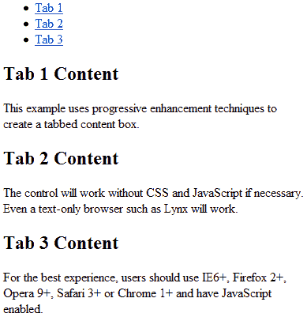

# 渐进增强技术 HTML

> 原文：<https://www.sitepoint.com/progressive-enhancement-1-html/>

在我之前的文章中，我们讨论了[渐进增强](https://www.sitepoint.com/progressive-enhancement-graceful-degradation-basics/)和[为什么它通常是比优雅降级](https://www.sitepoint.com/progressive-enhancement-graceful-degradation-choice/)更好的选择。这是演示如何使用渐进式增强技术构建一个简单的选项卡式框的三部分系列的第一部分。

## 网页层

网页分为三层:

1.  **HTML** 定义了文档内容和结构
2.  **CSS** 定义了布局和样式— *它增强了 HTML*
3.  **JavaScript** 定义了页面功能，如客户端表单验证、动画和效果——*它可以增强 HTML 和 CSS*

HTML 是你唯一可以信赖的层。大多数浏览器都会显示一些东西——即使您向只支持 HTML 3.2 的设备提供 XHTML 1.1 内容。

大多数浏览器都提供 CSS，但支持程度各不相同。用户可以禁用 CSS 或者指定他们自己的样式表，而不是你的样式表。一些浏览器，如屏幕阅读器或 Lynx 可能会完全忽略你的 CSS。

最后，JavaScript 是最不可靠的技术层。大多数浏览器都支持 JavaScript，但是解释器引擎各不相同，很多人出于安全原因禁用了这种语言。用户使用 JavaScript 的可能性因网站而异，但一般来说，多达 5%的访问者不会启用脚本。

## 豪华的内容

POSH 是“普通老式语义 HTML”的首字母缩写。这个术语是由[微格式社区](http://microformats.org/wiki/posh)创造的，但是对于所有努力构建结构良好、可访问、语义有效的 HTML 的开发人员来说，这是一个有用的概念:

*   使用语义元素和属性，例如:`h1`代表你的主标题，`p`代表段落，`table`代表数据表格(不是演示文稿)，等等。
*   必要时使用语义 id 和类名
*   尽可能使用最简单、最少的 HTML
*   验证您的代码。

在下面的例子中，我们将构建一个选项卡框。该代码是一个简单的客户端小部件，但是相同的概念可以在整个开发过程中使用。几乎任何你能想到的控件都会有一个豪华的对等物。

## 构建标签框 HTML

在最基本的层面上，选项卡式的框是到相关内容的页面内链接的列表。因此，HTML 结构可以定义如下:

```
 <!-- tabs (links) -->
<ul class="tabs">
	<li><a href="#tab1">Tab 1</a></li>
	<li><a href="#tab2">Tab 2</a></li>
	<li><a href="#tab3">Tab 3</a></li>
</ul>

<!-- tab content -->
<div class="tabcontent">

	<div id="tab1">
		<h2>Tab 1 Content</h2>
		<p>This example uses progressive enhancement techniques to create a tabbed content box.</p>
	</div>

	<div id="tab2">
		<h2>Tab 2 Content</h2>
		<p>The control will work without CSS and JavaScript if necessary. Even a text-only browser such as Lynx will work.</p>
	</div>

	<div id="tab3">
		<h2>Tab 3 Content</h2>
		<p>For the best experience, users should use IE6+, Firefox 2+, Opera 9+, Safari 3+ or Chrome 1+ and have JavaScript enabled.</p>
	</div>

</div> 
```

这个页面几乎可以在任何支持 HTML 4.01 或 XHTML 1.0 的浏览器中运行。旧的浏览器将继续显示内容，即使链接不像预期的那样工作。

[](https://blogs.sitepointstatic.com/examples/tech/pe/pe-html.html "view example page")

*注意:*
语义 HTML 纯粹主义者会指出代码没有遵循时髦的指导方针，因为它有缺陷。我同意—内容不需要 div。添加它们是因为它将允许我们创建一个更好的纯 CSS 解决方案，并简化我们的 JavaScript 代码。

在一个完美的世界里，你的 HTML 应该是简单的，不关心布局和功能。不幸的是，web 开发并不完美，经常需要做出妥协。为 CSS 或 JavaScript 钩子添加一两个额外的标签不会破坏网站的稳定性；只是不要做不必要的事。

在我的下一篇文章中，我们[添加了一个 CSS 层](https://www.sitepoint.com/progressive-enhancement-2-css/)让它看起来更漂亮，在不影响功能的情况下提高可用性。

**资源链接:**

*   [查看纯 HTML 标签控件](https://blogs.sitepointstatic.com/examples/tech/pe/pe-html.html)

**本系列其他零件:**

*   [渐进增强技术 1:HTML](https://www.sitepoint.com/progressive-enhancement-1-html/)
*   [渐进增强技术 2:CSS](https://www.sitepoint.com/progressive-enhancement-2-css/)
*   [渐进增强技术 3:JavaScript](https://www.sitepoint.com/progressive-enhancement-3-javascript/)

**相关阅读:**

*   [渐进增强和适度退化:概述](https://www.sitepoint.com/progressive-enhancement-graceful-degradation-basics/)
*   [渐进增强与优雅退化:做出选择](https://www.sitepoint.com/progressive-enhancement-graceful-degradation-choice/)
*   [不应发布受支持浏览器列表的 5 个理由](https://www.sitepoint.com/5-reasons-to-avoid-supported-browser-lists/)
*   [微软 Office Online:针对受支持浏览器列表的案例](https://www.sitepoint.com/case-against-official-browser-support/)
*   谁在使用 ARIA？

## 分享这篇文章