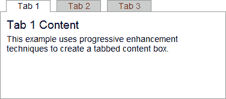

# 渐进增强技术 JavaScript

> 原文：<https://www.sitepoint.com/progressive-enhancement-3-javascript/>

在我之前的文章中，我们用简单的老式语义 HTML 和不显眼的 CSS 样式构建了一个标签控件。这是一个由三部分组成的系列的最后一篇文章，演示了如何使用渐进增强技术构建一个简单的选项卡式框。

## 不稳定的脚本

JavaScript 是风险最大的网页层。HTML 支持是有保证的，CSS 也有可能，但是 JavaScript 可能不可用或者被禁用。这是否会影响你的网站取决于你的受众，但是，一般来说，你可以预期有 5%的用户没有启用脚本。这是一个很大的比例——肯定高于 Safari、Chrome 或 Opera 的市场份额。

浏览器实现也有差异。幸运的是，JavaScript 是一种通用语言，我们可以解决兼容性问题。例如，IE5 不提供数组 push()方法，但是我们可以检测它何时丢失并自己添加它:

```
 if (!Array.prototype.push) {
	Array.prototype.push = function(item) { this[this.length] = item; };
} 
```

注意:给本地对象添加新的属性或方法有点冒险，但这是另一篇文章的主题。

许多 JavaScript 框架提供了克服浏览器不一致性的功能。下面显示的标签框控制代码是作为一个 [jQuery](http://jquery.com/) 插件构建的。它提供了一个可以在任何页面上实现的可重用组件，jQuery 将有助于客户端编码的更普通的方面，比如 DOM 操作和事件委托。

您应该知道 jQuery 和其他库提供有限的浏览器支持。虽然我们的标签框可以在 IE5 和 IE5.5 中工作，但是 jQuery 不支持这些浏览器，脚本将会失败。在这个例子中这不是一个大问题，因为标签框不需要 JavaScript 就能运行。然而，在使用它之前，您应该总是根据您选择的库的限制来检查您的需求。

最后，jQuery 爱好者会知道 UI API 中已经支持选项卡，并且还有许多其他预构建的控件可用。大多数会比这个例子更好——代码有意保持简短，以展示渐进增强技术。

## 支持 JavaScript 的 CSS

如果没有 JavaScript，我们的标签框使用滚动内容部分。我们的脚本必须移除滚动条，但是我们仍然可以使用 JavaScript 控制的 CSS 来指定:

```
 /* tab control CSS: JavaScript progressive enhancements */
.tabcontent.active
{
	overflow: hidden;
} 
```

因此，当标签框初始化时，插件将对外部内容`div`应用一个“active”类。

## 开发 jQuery TabControl 插件

完整的代码可以在 [jquery.tabcontrol.js](https://blogs.sitepointstatic.com/examples/tech/pe/jquery.tabcontrol.js) 中找到。当页面加载完毕后，JavaScript 会查找任何带有“tab”类的标签，并为找到的每个节点创建一个 TabControl 对象的新实例。为该节点分配了一个 TabControlInitialized 属性，以防止两个或多个对象指向同一个 HTML 代码。

初始化两个重要的变量:

*   (这个。)选项卡属性将包含所有选项卡的节点及其关联内容
*   (这个。)活动属性存储当前突出显示的选项卡。

```
 // jQuery plugin definition
$.fn.TabControl = function() {

	// tab control object
	function TabControl(list) {

		if (list.TabControlInitialized) return;
		else list.TabControlInitialized = true;

		this.List = list;
		this.Tab = {};
		this.Active = null; 
```

在下一个片段中，T 的值被设置为 this(当前对象实例),这样就可以在下面的循环中引用它。每个标签都被识别，并且它链接到的 ID 被提取(见下面的中的 [LinkId 方法)。然后，选项卡和内容节点存储在选项卡对象中:](#linkid)

```
 var T = this;

		// find and initialize all tabs
		$("li a[href^=#]", list).each(function() {

			var id = T.LinkId(this);
			var content = $("#"+id);
			content = (content.length > 0 ? content[0] : null);

			// link/content object
			T.Tab[id] = {
				link: this,
				content: content
			}; 
```

循环的最后一部分执行以下操作:

1.  “active”类被添加到内容的容器中(带有“tabcontent”类的`div`)。这将删除滚动条，如上所述。
2.  点击事件处理程序被应用于**所有引用选项卡内容的**链接，包括选项卡本身(参见下面的 [TabSwitch 方法)。](#tabswitch)
3.  所有选项卡和内容都被禁用(参见下面的[激活方法)。](#activate)
4.  确定当前活动的选项卡。这通常是第一个选项卡，除非在页面 URL 中指定了另一个 ID。

然后激活活动选项卡:

```
 // set content holder class
			if (content !== null) $(content.parentNode).addClass("active");

			// event delegation
			$("a[href=#"+id+"]").click(function(e) { T.TabSwitch(e) });

			// deactivate tab
			T.Activate(id, false);

			// is tab active?
			if (T.Active === null || "#"+id == location.hash) T.Active = id;

		});

		// show active tab/content
		this.Activate(this.Active);

	} 
```

最后，我们有三种方法。第一个是 LinkId，返回从链接的 href 属性中提取的页面内 Id(也删除了“#”):

```
 // returns linked ID
	TabControl.prototype.LinkId = function(link) {
		return link.href.replace(/.*#(.+)$/, "$1");
	}; 
```

当单击选项卡(或指向选项卡内容的任何链接)时，将调用 TabSwitch 方法。它会停止浏览器的默认操作，停用旧标签，并重新激活新标签。

当点击一个指向选项卡式内容的链接时，如果它不在屏幕上，最后几行将页面平滑地滚动到选项卡框。链接跳转到普通 HTML 中的内容位置，但是我们的代码已经取消了那个事件，并用一个更好的效果代替了它。

```
 // tab click event handler
	TabControl.prototype.TabSwitch = function(e) {

		e.preventDefault();

		var id = this.LinkId(e.target);
		if (id != this.Active) {

			// hide old tab
			this.Activate(this.Active, false);

			// switch to new tab
			this.Active = id;
			this.Activate(this.Active);

		}

		// scroll to tab box if required
		var html = $('html,body');
		var lt = $(this.List).offset().top, lh = $(this.List).height();
		var st = Math.max(html.scrollTop(), $("body").scrollTop()), wh = $(window).height();
		if (lt < st || lt+lh > st+wh) html.animate({scrollTop: lt}, 500);

		return false;
	}; 
```

最后，Activate 方法接受两个参数；选项卡 ID 和 true 或 false 来激活或停用选项卡及其内容:

```
 // activate or deactivate a tab
	TabControl.prototype.Activate = function(id, show) {

		if (this.Tab[id]) {
			if (show !== false) {
				$(this.Tab[id].link).addClass("active");
				if (this.Tab[id].content) this.Tab[id].content.style.display = "block";
			}
			else {
				$(this.Tab[id].link).removeClass("active");
				if (this.Tab[id].content) this.Tab[id].content.style.display = "none";
			}
		}

	}; 
```

我们逐渐增强的选项卡框现在已经完成— [查看示例页面](https://blogs.sitepointstatic.com/examples/tech/pe/pe-html-css-js.html)。即使 CSS、JavaScript 或两者都被禁用或失败，它也应该在所有浏览器中工作。有[小需要发布一个浏览器支持列表](https://www.sitepoint.com/5-reasons-to-avoid-supported-browser-lists/)！

[](https://blogs.sitepointstatic.com/examples/tech/pe/pe-html-css-js.html "view example page")

**资源链接:**

*   [查看 HTML、CSS 和 JavaScript 选项卡控件](https://blogs.sitepointstatic.com/examples/tech/pe/pe-html-css-js.html)
*   [查看 JavaScript 文件 jquery.tabcontrol.js](https://blogs.sitepointstatic.com/examples/tech/pe/jquery.tabcontrol.js)
*   [查看 HTML 和 CSS 标签控件](https://blogs.sitepointstatic.com/examples/tech/pe/pe-html-css.html)
*   [查看 CSS 文件，pe.css](https://blogs.sitepointstatic.com/examples/tech/pe/pe.css)
*   [查看纯 HTML 标签控件](https://blogs.sitepointstatic.com/examples/tech/pe/pe-html.html)
*   [**下载所有示例源代码**](https://blogs.sitepointstatic.com/examples/tech/pe/progressive-enhancement.zip)

**本系列其他零件:**

*   [渐进增强技术 1:HTML](https://www.sitepoint.com/progressive-enhancement-1-html/)
*   [渐进增强技术 2:CSS](https://www.sitepoint.com/progressive-enhancement-2-css/)
*   [渐进增强技术 3:JavaScript](https://www.sitepoint.com/progressive-enhancement-3-javascript/)

**相关阅读:**

*   [渐进增强和适度退化:概述](https://www.sitepoint.com/progressive-enhancement-graceful-degradation-basics/)
*   [渐进增强与优雅退化:做出选择](https://www.sitepoint.com/progressive-enhancement-graceful-degradation-choice/)
*   [不应发布受支持浏览器列表的 5 个理由](https://www.sitepoint.com/5-reasons-to-avoid-supported-browser-lists/)
*   [微软 Office Online:针对受支持浏览器列表的案例](https://www.sitepoint.com/case-against-official-browser-support/)
*   谁在使用 ARIA？
*   [如何开发一个 jQuery 插件](https://www.sitepoint.com/how-to-develop-a-jquery-plugin/)
*   [如何构建自动扩展的 Textarea jQuery 插件(第一部分)](https://www.sitepoint.com/build-auto-expanding-textarea-1/)

## 分享这篇文章