# ProtoPie，高保真原型工具，将改善您的工作流程

> 原文：<https://www.sitepoint.com/protopie-prototyping-tool/>

*本文最初发表于 [ProtoPie](https://www.protopie.io/blackfriday-01/?utm_source=sitepoint&utm_medium=referral&utm_campaign=black-friday-new-users&utm_content=article) 。感谢您对使 SitePoint 成为可能的合作伙伴的支持。*

作为一名设计师，与利益相关者沟通是非常重要的。仅仅用静态的 UI 设计、模型、线框甚至简单的点击原型来快速准确地传达设计和交互想法是行不通的。

这是托尼·金的想法。在谷歌担任交互设计师期间，他希望轻松快速地构建高度交互的原型，以便能够清晰地分享自己的想法，并最终弥合他和利益相关者之间的差距。

他手头的工具不允许他轻松快速地完成这项工作。简单的工具不能提供 Kim 所寻求的高保真度，而用于更高级的原型制作的其他工具通常具有陡峭的学习曲线和/或所需的编码，从而导致冗长的原型制作过程。

这就是智慧结晶 proto pie T1 的诞生过程。

本文将向您简要介绍什么是 ProtoPie，它的理念，以及为什么您应该采用 ProtoPie 作为您的主要原型工具来改进您的工作流。

## 什么是 ProtoPie？

[https://www.youtube.com/embed/7BELOI3C7lg](https://www.youtube.com/embed/7BELOI3C7lg)

ProtoPie 是一款功能强大的高保真原型制作工具，适用于 Mac 和 Windows 上的移动应用程序，使设计人员能够利用智能设备传感器，轻松快速地构建最先进、高度交互式的原型，并可在任何设备上部署和共享。

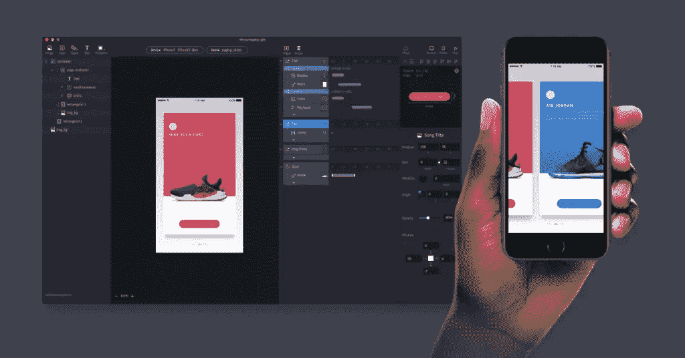

ProtoPie 背后的理念是高保真原型应该简单快速地完成。

ProtoPie 的创始人托尼·金解释说:“我相信高保真原型制作。就用户交互方式而言，任何设计师都应该做出类似真实交易的原型。”

由于高保真交互是设计过程中的关键，围绕交互的 ProtoPie 黄金公式简单、直接，就像贯穿 ProtoPie 的一根线:

**交互=对象+触发+响应**

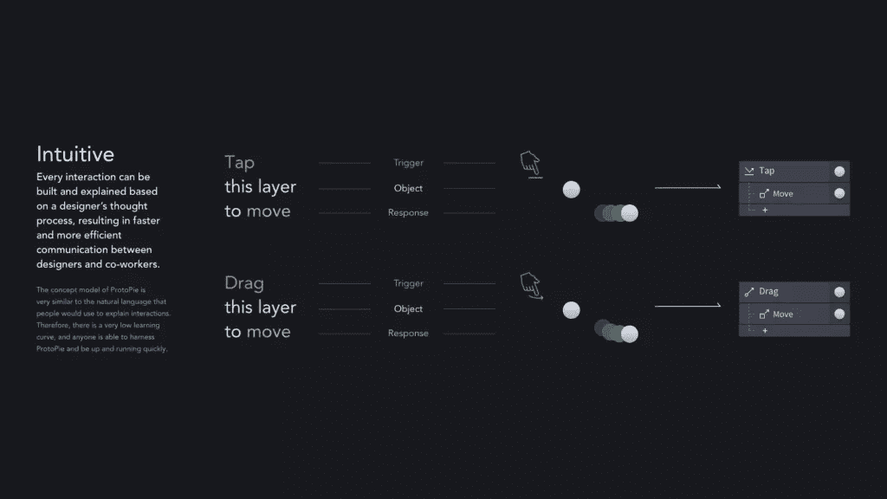

这个概念模型作为 ProtoPie 用户界面的基础，降低了构建高保真原型的门槛，同时使学习曲线真正渐进。由于 ProtoPie 的易用性、渐进的学习曲线和直观的用户界面，ProtoPie 获得了 2017 年红点奖界面设计奖。

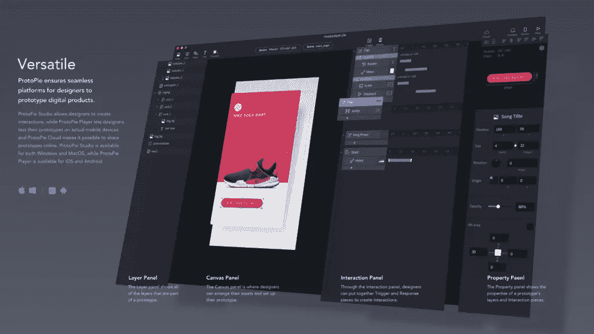

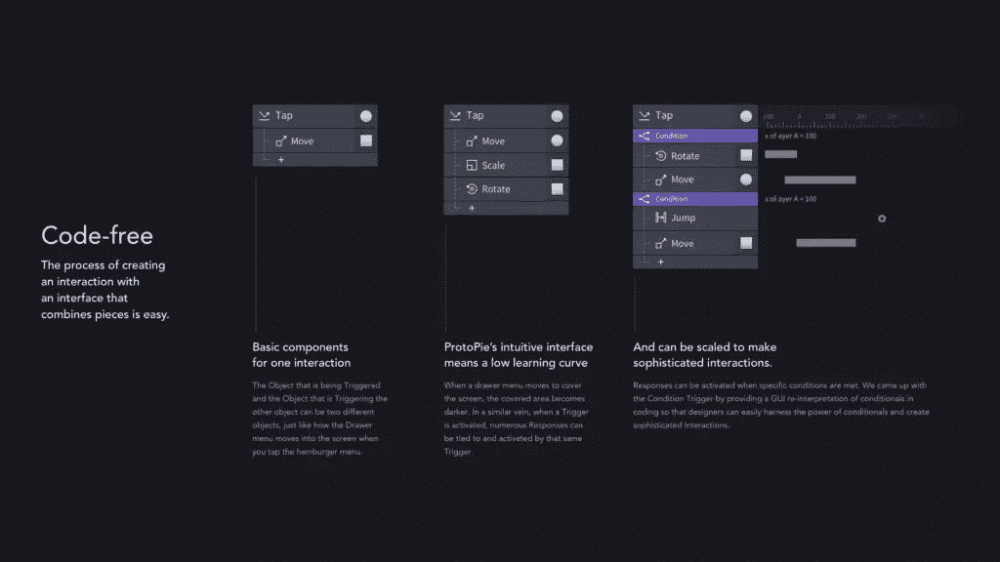

## ProtoPie 能做什么？

现在你可能已经知道，ProtoPie 的核心目的是让设计师能够轻松快速地构建高保真原型。

许多设计师仍然认为没有编码的高级原型是不可能的。这根本不是真的。通过将一些高保真交互拼凑在一起，你可能在几分钟内就已经有了一个可工作的交互原型。

请看这里，ProtoPie 展示了根据黄金公式创建交互是多么容易，您可以立即测试它。

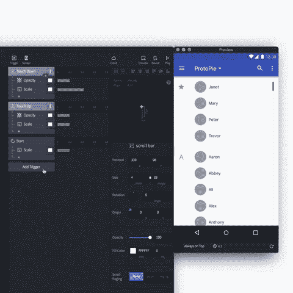

ProtoPie 通过支持智能设备中的传感器而区别于其他工具。要让原型在部署到任何智能设备上时都感觉像真的一样，只需考虑内置传感器。ProtoPie 支持的传感器有倾斜度、声音、指南针、3D 触摸和接近度。

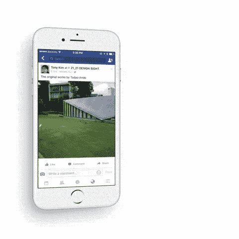

但不止于此。您可以使用 ProtoPie 在多个设备之间创建交互。这为设计者创造高保真原型提供了更多的自由。使用 ProtoPie 中的 Send response 和 Receive 触发器，可以在设备间建立链接时发送和接收当前消息。

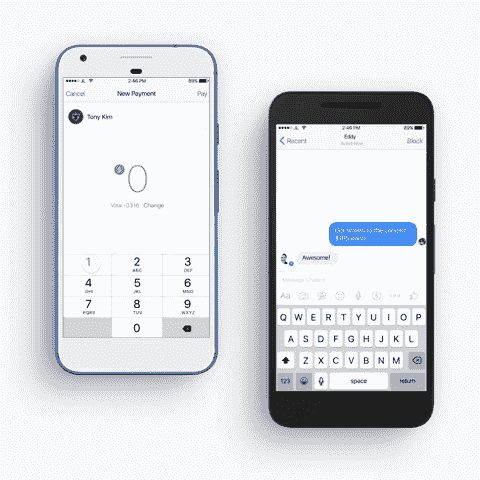

除了能够轻松快速地创建高保真原型之外，设计师还可以选择如何部署并与利益相关者分享他们的作品。

*   您可以使用 proto pie Player(iOS 和 Android 上都有)和 ProtoPie Cloud 来轻松地与利益相关者共享原型。
*   您可以使用 ProtoPie 播放器、桌面浏览器或移动浏览器运行和测试原型。
*   您可以将原型保存在本地设备上。

因此，有很多方法可以部署和共享原型。你想怎么做由你决定。

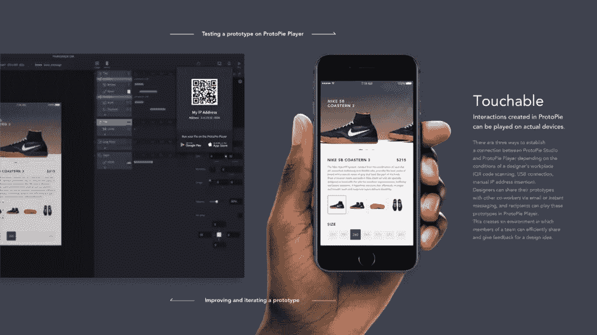

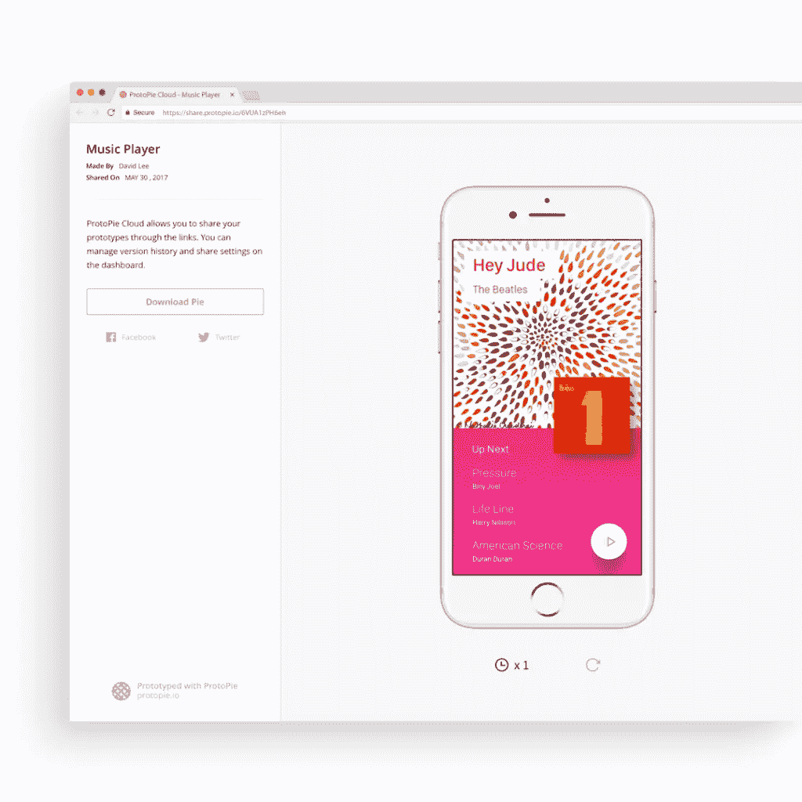

## 为什么 ProtoPie 会改进你的设计工作流程？

大多数设计师在敏捷环境中工作，倾向于短时间的迭代。这意味着设计师需要能够适应变化，并快速向利益相关者交付原型，从快速验证到全面的可用性测试。ProtoPie 的易用性和快捷性将帮助您以一种完全符合敏捷方法的方式快速构建和迭代。同时，ProtoPie 会给你开发复杂和详细的原型的可能性，展示真实和有用的用户交互，把用户放在一切的中心。

此外，ProtoPie 有助于您和您的设计团队与开发人员沟通，因为可以将高级的、高度交互的原型和规范交给他们。它在设计者和开发者之间架起了一座桥梁，使整个工作流程更加高效。

通过从 Sketch 和 Adobe XD CC 等设计工具无缝导入您的设计，您可以立即开始拼凑交互。此外，您可以对您的设计进行更改，然后轻松地重新导入它们。您可以轻松地在设计和原型制作之间来回切换，最终确保顺利的设计和原型制作工作流程。

当今时代，现实世界数字产品的高保真原型不再是多余的东西。相反，如果你重视以用户为中心，这是设计过程中的一个关键部分。

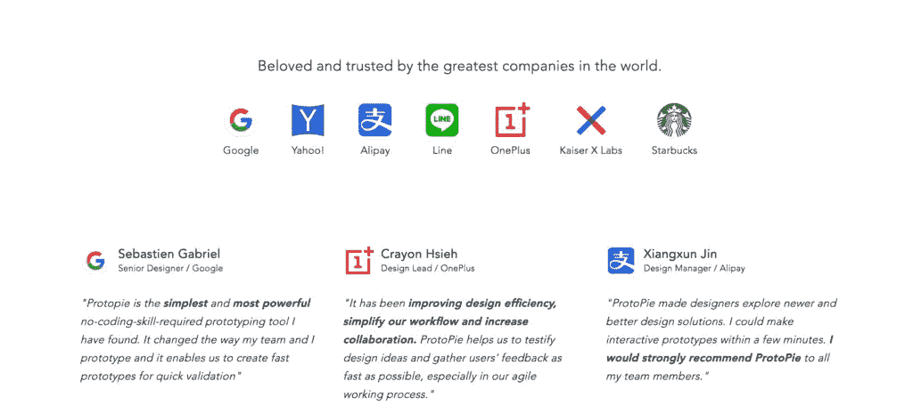

知名公司的设计师，如谷歌，雅虎！星巴克已经将 ProtoPie 作为他们日常工具集的一部分，并随后改进了他们的工作流程。

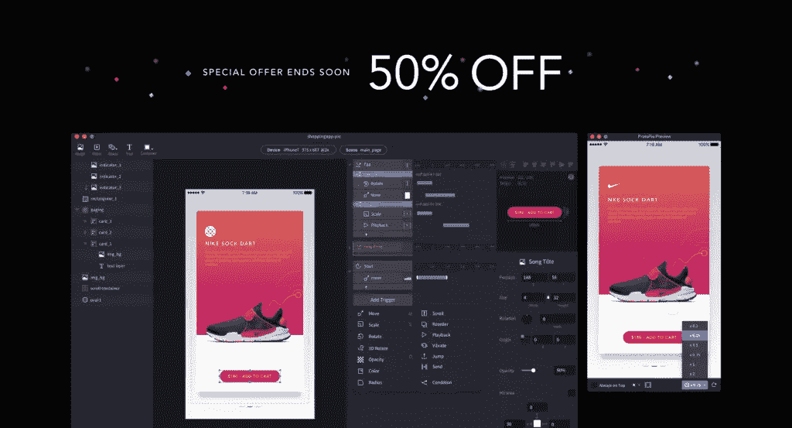

仅在本月底(2017 年 11 月 30 日)之前，您可能会获得一年许可证的五折优惠。[先免费试用 ProtoPie】。](https://www.protopie.io/blackfriday-01/?utm_source=sitepoint&utm_medium=referral&utm_campaign=black-friday-new-users&utm_content=article)

## 分享这篇文章