# 为什么用 Adobe XD 制作原型是最完整的设计解决方案

> 原文：<https://www.sitepoint.com/prototyping-with-adobe-xd/>

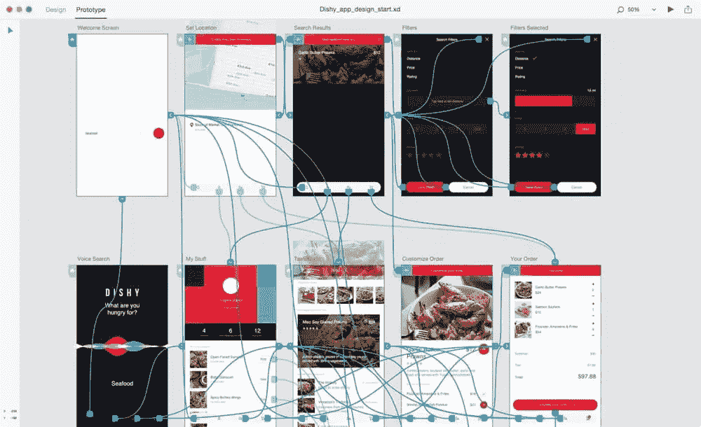

尽管 Adobe XD 仍然相对较新，但它的反响非常好。因此，我想我们应该做一个快速但有趣的教程，说明如何用 Adobe XD 设计和原型制作完美地融入到一个工具中，而不会让应用程序感觉太笨重。事实上，Adobe XD 非常简单，一旦你知道如何使用，它就非常容易使用。

不久前，我[对比了 Adobe XD 和 Sketch](https://www.sitepoint.com/adobe-xd-sketch-will-result-best-ux/) 。虽然 Sketch 仍然是设计用户界面的绝佳选择，但对于那些从 Photoshop 或 Fireworks 等其他 Adobe 应用程序转向的用户来说，Adobe XD 显然是赢家。

使用 Sketch，您需要安装扩展，并且很可能订阅第三方服务来添加任何原型功能，而 Adobe XD 本身就提供这些工具。

另外，如果您已经订阅了 Adobe Creative Cloud，那么您就已经拥有了 XD 的全部功能！设计+原型+反馈都集成在一个应用程序中，你还能要求什么呢？

现在也可以在 Windows 上使用了！

让我们通过在一个移动应用程序中设计和原型制作两个屏幕来深入了解 Adobe XD。

注意:本教程中使用的示例基于 Adobe XD 的免费的 [Cactaceae UI 工具包](https://www.blackphant.com/portfolio/cactaceae-free-ui-kit)。

有兴趣更详细地了解 Adobe XD 吗？查看我们的新书，[快速启动 Adobe XD](https://www.sitepoint.com/premium/books/jump-start-adobe-xd) ！花 19 美元购买电子书，或者注册成为高级会员，作为订阅的一部分。[你也可以通过奥雷利](http://shop.oreilly.com/product/9780995382619.do)拿到一本实体拷贝。

## 用 Adobe XD 制作原型:低保真度线框

Adobe XD 使快速模拟低保真度线框变得超级容易。能够快速设计低保真度线框*意味着我们可以在创建提供出色用户体验的布局方面取得巨大进步，同时不必太担心视觉效果(起初)。让我们举例说明我们的第一个想法，这样我们可以尽快从我们的队友那里得到反馈——当有更多的大脑在甲板上时，想法发展得更快。*

 *每个人都有适合自己的设计工作流程——当设计低保真度的线框时，我有一个严格的规则，只使用文本和形状(除非绝对必要)。为一个我们可能无法前进的布局设计图标、来源图像和定义样式有什么用呢？以下是你现在需要的重要键盘快捷键。

*   选择工具(V)
*   矩形(R)
*   椭圆形
*   第(1)行
*   文本(T)
*   画板(A)

让我们模拟一个想法。

首先创建一个画板( **A** )，并从右侧的检查器中选择“Android Mobile”画板。

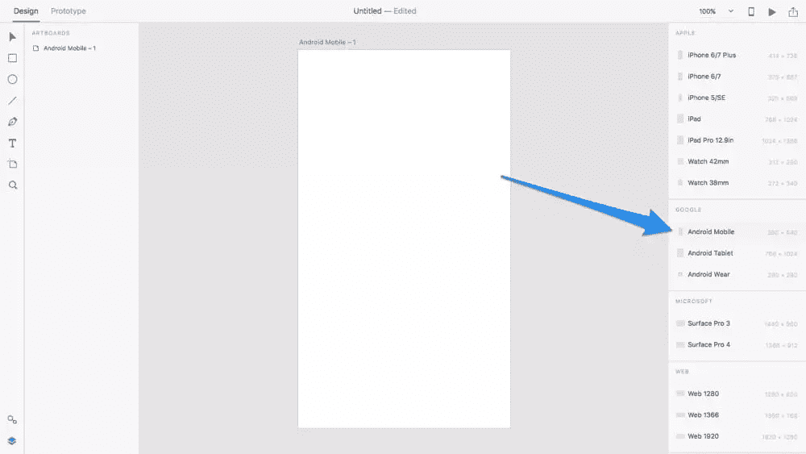

现在，使用*左侧*的工具栏、*或*上面提到的键盘快捷键，在画布上绘制一些形状来构建你的布局。如果它增加了进一步的清晰度，或者如果有任何空间没有考虑到，使布局看起来混乱，然后添加一个或两个图像来描述这个空间将被用来做什么，就像我下面做的那样。

非常基本的图标也很好，只要你不浪费大量的时间来解释它们。请记住，我们的目的是用反馈来验证我们的想法，只有在这之后，我们才应该分配更多的时间来使它看起来有吸引力。

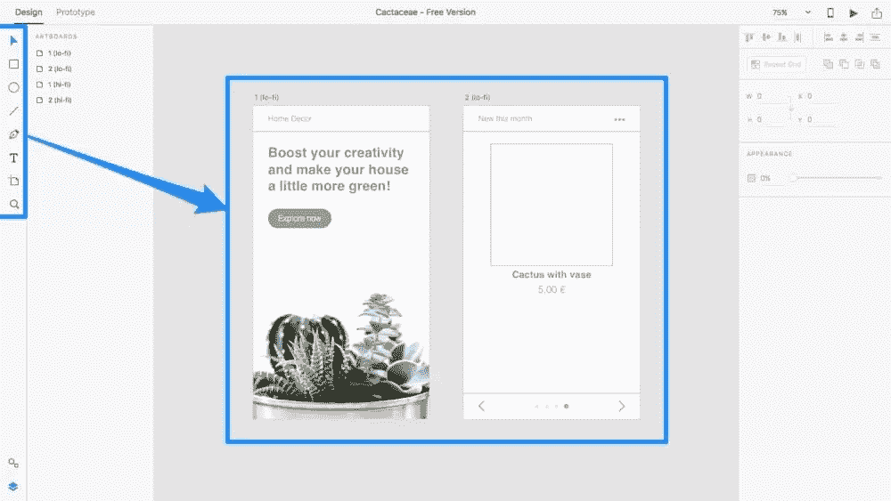

如果你有兴趣看看快速迭代与 Sketch 相比如何，请查看我的[比较概述](https://www.sitepoint.com/adobe-xd-sketch-will-result-best-ux/)。

## 原型交互和用户流

我们现在有了一个粗略的模型。是时候展示这两个屏幕是如何连接的了——用户如何从一个屏幕切换到下一个屏幕？我的意思是，这就是用户界面的意义所在，对吗？帮助用户从 A 到 B？

使用左上角的选项卡切换到“原型”工作区。您会注意到这个工作区与*设计*工作区没有太大的不同；主要区别在于没有**检查器，当我们在画布上选择对象时，我们有机会将点击目标链接到另一个画板，而不是对它们进行样式化(因此没有检查器)。**

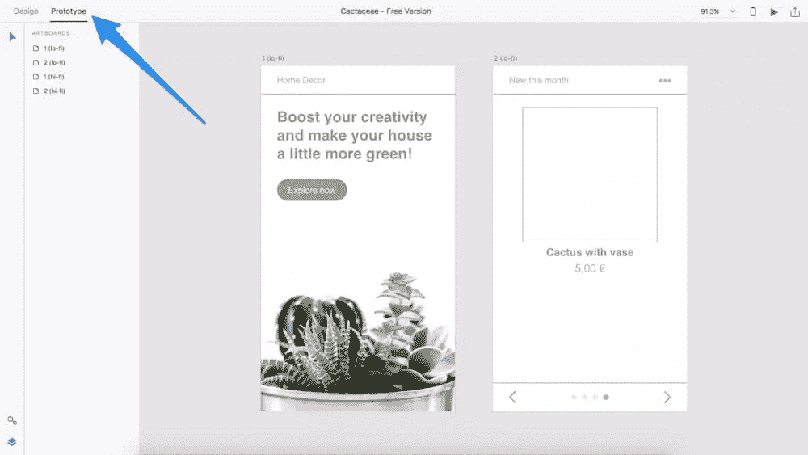

如果你跟随我的例子，选择“现在探索”按钮，你会注意到一个蓝色的，可拖动的手柄出现在它的右侧。将此手柄拖到相邻的画板中。太棒了，你创造了一个用户流！

在很短的时间内，我们将学习如何在真实设备中测试这个用户流，但现在，让我们指定用户将经历的转换类型以及动画将持续多长时间。

当您将句柄放入目标画板时，会出现一个模态。您将看到以下设置:

*   *目标*:我们已经指定了目标
*   *过渡*:当用户从一个屏幕移动到下一个屏幕时产生的效果(“无”是网站的默认选项，而“向左/向右滑动”是本地移动应用的标准选项)
*   *缓动*:动画发生时的加速度(例如，**缓动**动画在开始时会更快，然后随着动画的停止而变慢)
*   *持续时间*:动画完成需要多长时间

如果你有兴趣了解更多，可以看看我写的关于[季节和动画](https://www.sitepoint.com/animations-using-easings-to-craft-smarter-interactions/)的文章！

在我们的例子中，为*过渡*设置选择“向左滑动”,并保留其他设置的默认选项。

## 分享原型和收集反馈

当你准备好分享你的线框并收到一些反馈时，点击*原型*工作空间窗口右上角的分享图标，然后点击“创建链接”。

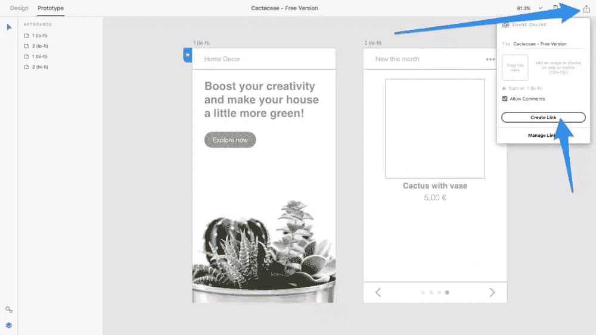

接下来，与您的队友分享这个链接，然后他们将能够在浏览器中查看模型，对其进行评论，甚至像真正的用户一样使用鼠标点击原型。

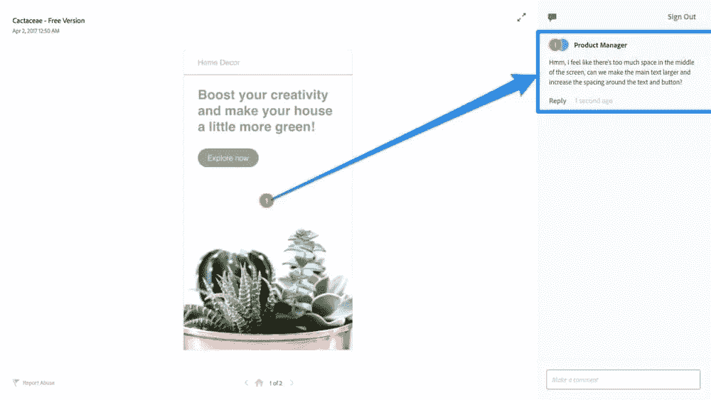

## 桌面预览与设备预览

*“难道* *我*必须创建一个共享链接来测试原型吗？”。

当然不是！您可以测试原型，以确保所有屏幕在任何时候都正确链接——只需点击“桌面预览”图标(播放图标)并单击离开。如果只有你，桌面预览更理想。

快速提示:你甚至可以用原型给自己录音——只需点击桌面预览窗口中的录音按钮！

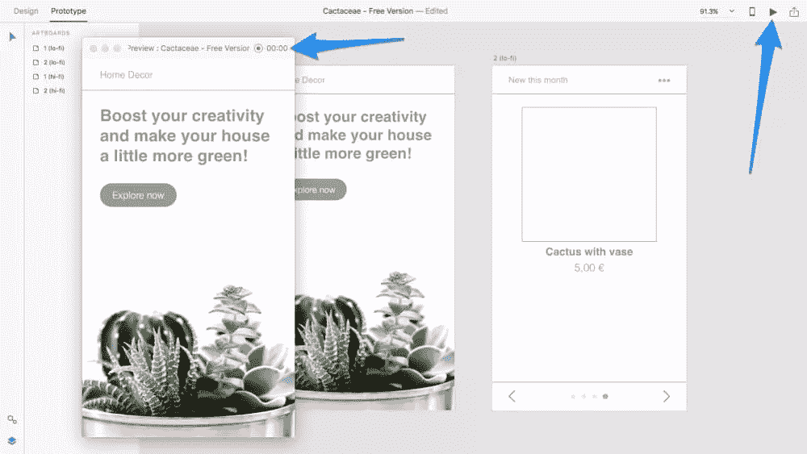

*设备预览*让你(或你的队友)完成同样的事情，但在一个真实的设备中；毕竟，移动应用程序是为拇指而不是鼠标设计的，对吗？点击“设备预览”图标(设备图标)并按照说明操作:

*   下载适用于 [iOS](https://itunes.apple.com/us/app/adobe-experience-design-preview-your-prototypes/id1146597773) 或 [Android](https://play.google.com/store/apps/details?id=com.adobe.sparklerandroid) 的 Adobe XD 移动应用
*   通过 USB 连接到设备
*   决定是否启用“热点提示”
*   从原型中选择一个屏幕开始

*注意:热点提示允许测试用户在导航原型时获得额外的帮助——这对不完整的原型很有用，但是，完整的原型应该禁用热点提示以提供“真实”的体验。*

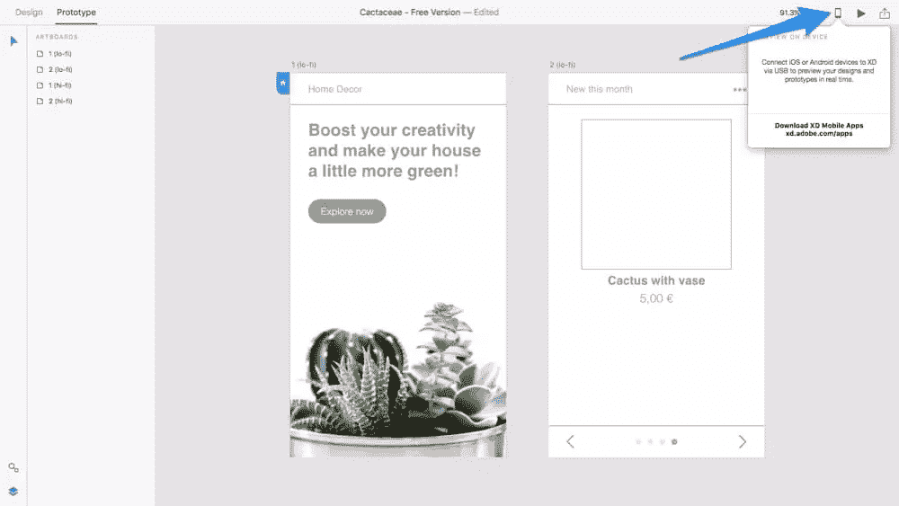

## 用 Adobe XD 制作原型:高保真设计

太好了，我们快到了！现在，让我们假设我们已经收到了一些反馈，并且我们的概念已经在现实环境中得到某种程度的验证(即，在使用*设备预览*的真实设备中)。切换回“设计”工作区，使用右侧的检查器将任何视觉美感(不透明度、填充、边框、阴影、圆角半径等)应用于布局(即，根据反馈进行任何初始布局调整之后)。

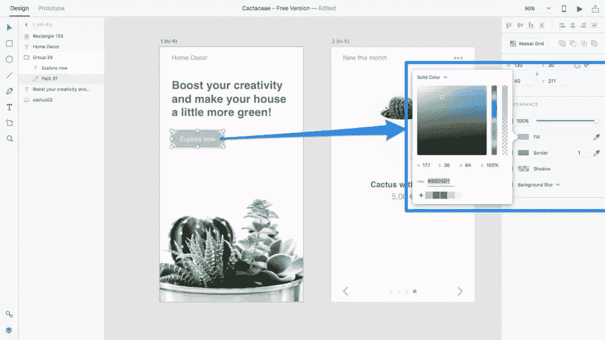

高保真原型设计通常是用户界面设计中最耗时的部分，但是有一些方法可以大大加快这个工作流程。首先，有[重复网格](https://www.sitepoint.com/adobe-xd-tutorial-a-pain-free-way-to-import-assets/)，它允许我们水平和/或垂直平铺组件，并保持它们在视觉上的一致性，尽管具有完全独特的内容，可以直接在(*中拖放，即，如果你一次将 4 个图像拖入网格，Adobe XD 将直观地将一个图像分配给网格中的每个平铺！*)。

单击检查器中的“重复网格”开始(或使用键盘快捷键: **⌘/Ctrl + R** )，然后使用可拖动手柄水平或垂直(在本例中是垂直)平铺组件。

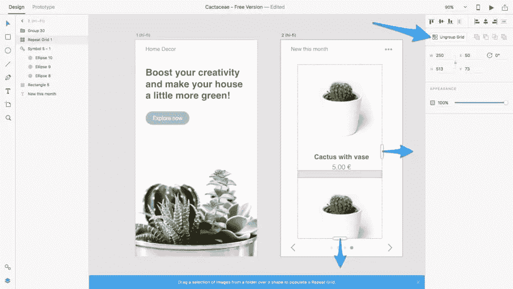

## 保持符号的视觉一致性

第二，有*符号*，当各种实例分散在多个画板上时，它允许您保持某些组件的视觉一致性。当您更改一个符号化组件的一个实例时，它们都会更改，从而实现视觉上的一致性并为您节省大量时间。如果你以前用过素描，你会非常熟悉符号的用法。

当你有一个你知道你会反复使用的组件时，选择它并使用键盘快捷键 **⌘/Ctrl + K** 把它变成一个符号；然后，稍后，您可以切换到符号列表( **⌘/Ctrl + Shift + Y** )，并将该符号的一个实例拖动到画板中。

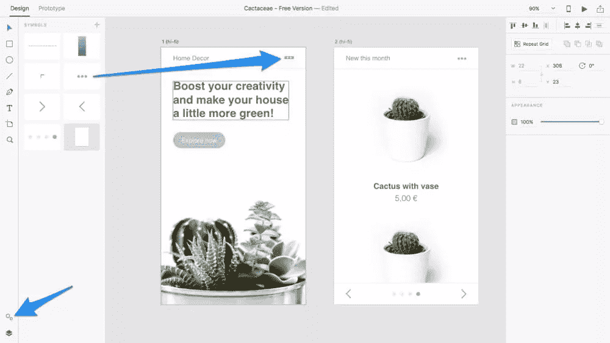

## 结论

我还能说什么呢？试试看！还是**免费**！

深信不疑，但需要一本入门指南？查看[跳转开始 Adobe XD](https://www.sitepoint.com/premium/books/jump-start-adobe-xd) 。花 19 美元购买电子书或注册成为高级会员。[你也可以通过奥赖利](http://shop.oreilly.com/product/9780995382619.do)拿到纸质版。

## 分享这篇文章*