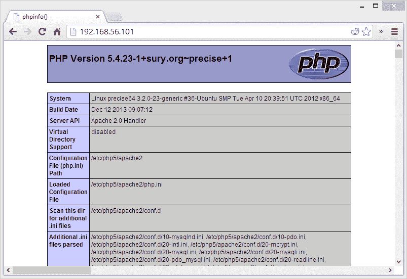
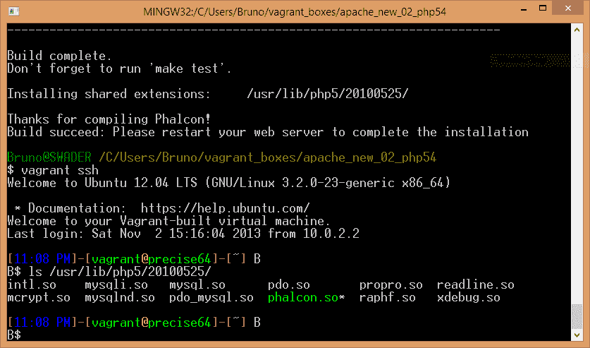

# 为 Phalcon(和其他工具)提供漫游

> 原文：<https://www.sitepoint.com/provisioning-phalcon-tools-vagrant/>

Matthew Setter 的上一篇关于 PuPHPet 的文章介绍了基于 GUI 的流浪虚拟机的创建。PuPHPet 是一个非常棒的工具，可以非常快速地启动和运行开发环境，并且提供了一些非常简洁的默认选项。

但是如果我们想超越默认设置呢？例如，如果我们想安装一个不属于默认发行版并且不存在于包管理器中的 PHP 扩展，该怎么办？

在本教程中，我们将确保在运行`vagrant up`时默认安装了 Phalcon 框架。在一个流浪的虚拟机上预先安装软件被称为[供应](http://docs.vagrantup.com/v2/provisioning/index.html)。

## 做好准备

请在阅读这篇文章之前浏览一下 Matthew 的文章。只需确保下载一个现成的支持 PHP 的 VM。

在这个特殊的例子中，我在 Ubuntu 上使用了 PHP 5.4(5.5 还不能通过 PuPHPet 使用它)，但是如果你已经有了自己习惯的配置，请随意使用它——只是要确保在继续之前你能进入一个好的 phpinfo 屏幕。确保您的 PHP 配置工作正常，并且您可以通过浏览器访问虚拟机并执行 PHP 脚本，如

```
<?php
phpinfo();
```

理想情况下，您的浏览器应该显示如下内容:



## 资源调配的基础

vagger 提供了几种将软件配置到虚拟机中的方法。有木偶(PuPHPet 是基于什么)，厨师，码头工人，等等。我们将使用的是非常好的旧 shell 命令——如果我们将它传递给它的配置设置，那么 Vagrant 可以执行我们编写的 shell 文件。

所以，假设你需要安装文本编辑器`joe`并且想通过 shell 来完成。在您的 PuPHPet 文件夹的`shell`子文件夹中，您将创建一个包含以下内容的`joe.sh`文件:

```
#!/bin/bash
sudo su
apt-get install joe
```

这个 shell 脚本首先将自己标识为可由 bash 执行(可选)，请求超级用户权限，然后通过常规渠道安装 joe。为了实际执行这个命令，我们通过添加以下代码行来修改 PuPHPet 文件夹中的 lavover file

```
config.vm.provision :shell, :path => "shell/joe.sh"
```

在最后一个`config.vm.provision...`行/块下。现在，如果我们在 PuPHPet 文件夹中运行`vagrant up`,我们的虚拟机将在启动后立即安装`joe`。

## 安装 Phalcon

根据 Phalcon 的在线安装说明，编译过程非常简单:

```
git clone git://github.com/phalcon/cphalcon.git
cd cphalcon/build
sudo ./install
```

然而，我们还需要在 PHP 配置中输入 phalcon.so，重启服务器，并确保所有的[先决条件](http://docs.phalconphp.com/en/latest/reference/install.html#requirements)都已安装(它们已经安装好了，PuPHPet 已经为我们完成了)。让我们一步一步来。

再次在`shell`子文件夹中，创建文件`install_phalcon.sh`。给它以下内容:

```
#!/bin/bash
sudo su
git clone git://github.com/phalcon/cphalcon.git
cd cphalcon/build
./install
cd ..
cd ..
rm -rf cphalcon
```

现在，如果您在运行`vagrant destroy`之后重新运行`vagrant up`，您可以在 PHP 扩展文件夹中看到 phalcon.so 扩展:



然而，为了实际使用它，需要将 phalcon.so 添加到 PHP 配置中。添加之后，我们还需要重新加载服务器，以便加载新的配置。通过在底部添加以下语句来改进上面的 shell 文件:

```
echo 'extension=phalcon.so' > /etc/php5/mods-available/phalcon.ini
ln -s /etc/php5/mods-available/phalcon.ini /etc/php5/cli/conf.d/phalcon.ini
ln -s /etc/php5/mods-available/phalcon.ini /etc/php5/apache/conf.d/phalcon.ini
ln -s /etc/php5/mods-available/phalcon.ini /etc/php5/fpm/conf.d/phalcon.ini

service apache2 restart
```

首先，我们在`/etc/php5/mods-available`目录中创建一个`phalcon.ini`文件。我们可以将它直接回显到 php.ini 中，但这样更简洁。然后，我们将新创建文件符号链接到 PHP 可以运行的所有位置:Apache、命令行和 FPM。这样，我们所有潜在的 PHP 运行时都可以使用 Phalcon。最后，我们重启 Apache。

如果您现在尝试运行`vagrant up`(在运行`vagrant destroy`之后)，您会注意到在您重新访问浏览器中的 VM IP 之后，phpinfo 屏幕显示 Phalcon 已加载。

但是如果服务器进程的名称不同呢？比如如果是“httpd”，或者只是“apache”，而不是“apache2”？此外，如果我们有不同的发行版呢？在 CentOS 上`phalcon.ini`应该转到`/etc/php.d/`，在其他发行版上应该转到其他位置。最后，如果我们只做一个`vagrant halt`，然后运行`vagrant up`，但是使用`--provision`标志强制重新配置，会怎么样？如果已经安装了 Phalcon，直接忽略它不是更好吗？

幸运的是，slogsdon 为我们考虑到了所有这些。他构建了一个优秀的 Phalcon 安装 shell 脚本，成熟的 IF 子句等等，甚至创建了一个 [phalcon-tools](http://docs.phalconphp.com/en/latest/reference/tools.html) 安装脚本。

考虑到以上所有因素，要安装 Phalcon，请将 [install_phalcon.sh](https://github.com/slogsdon/vagrant-phalcon/blob/master/provision/shell/install_phalcon.sh) 放入 PuPHPet 下载的 shell 文件夹中，并像我们之前对`joe`所做的那样将其添加到 provisioner 中。如果你想安装 Phalcon 工具，用[install _ Phalcon-devtools . sh](https://github.com/slogsdon/vagrant-phalcon/blob/master/provision/shell/install_phalcon-devtools.sh)做同样的事情。这就是你所要做的——这个脚本适用于不同的服务器和设置，所以你所要做的就是运行它。

现在你也可以有一个现成的现成的 Phalcon 安装准备开发在弹指之间。当然，你需要做一些额外的调整来让 URL 重写在 Nginx 上工作(只需遵循 [Phalcon docs](http://docs.phalconphp.com/en/latest/reference/nginx.html) )，但是一旦 PHP 安装并加载了扩展，困难的部分就结束了。更好的是，您可以使用这种方法在任何 PuPHPet 支持的环境中安装 phal con——Digital Ocean、Rackspace 或 AWS。只需将 slogsdon 的 shell 插入到 provision 设置中，就可以开始了！

## 结论

在本教程中，我们介绍了通过 shell 进行供应的基础知识，并安装了带有引导虚拟机的 Phalcon(和 joe)。Matthew Setter 的后续文章即将发布，它将处理从 PuPHPet 下载的配置设置的进一步定制。

为了熟悉流浪者和木偶的完整工作流程，请继续关注这个系列，因为它将变得更加有趣！

如果你有任何意见，不确定性，问题或只是一般的反馈，请在下面的评论中留下，我会尽我所能尽快解决它！如果你有自己的设置并想与我们分享，请通过 [+BrunoSkvorc](http://google.com/+BrunoSkvorc) 与我联系，我们会好好谈谈。

## 分享这篇文章