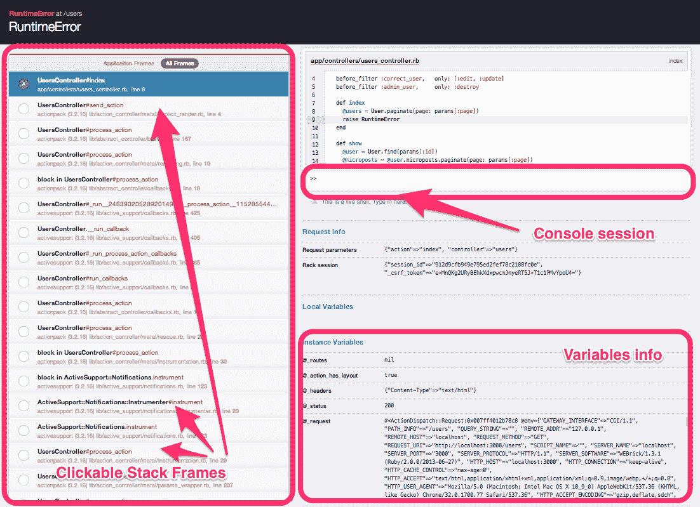

# 用栏杆撬(和朋友)

> 原文：<https://www.sitepoint.com/pry-friends-rails/>


在我的前一篇文章中，我们研究了 Pry，它是 Ruby 提供的标准 IRB shell 的一个非常强大的替代品。

对于那些与 Rails 一起工作人来说，您会很高兴知道 Pry 会支持您。在本文中，我们将看到 Pry 极大地改进我们的 Rails 工作流的各种方式。

请注意，Pry 与 Ruby 1.9.3 及更高版本配合使用效果最佳。

## 获取示例应用程序

对于我们的示例应用程序，我们将使用 Michael Hartl 为 Rails 3 教程编写的应用程序。

要获取应用程序:

```
git clone git@github.com:benjamintanweihao/sample_app.git
```

## 安装带导轨的撬杆

你*可以通过将 [`pry-rails`](https://github.com/rweng/pry-rails) 宝石添加到你的宝石文件中来*将`pry`安装到轨道上:

```
gem 'pry-rails', :group => :development
```

或者你可以用[爵士手](https://github.com/nixme/jazz_hands)得到*那个*和其他好东西。

```
group :development do
  gem 'jazz_hands'
end
```

开箱即用，Jazz Hands 不仅包括`pry-rails`，还包括其他细节，例如:

*   漂亮的印刷
*   窥探博士
*   撬遥控器
*   窥探调试器
*   窥探堆栈浏览器

一旦解决了这个问题，回到`sample_app`目录并安装所有必要的依赖项:

```
bundle install
```

### 设置数据库

```
rake db:schema:load
```

注意，有些人可能需要在上面的命令前面加上前缀`bundle exec`。

在我们开始有趣的事情之前，最后一件事是:在您的主目录中创建`.pryrc`:

```
% touch ~/.pryrc
```

用您选择的编辑器填写:

```
Pry.config.editor = 'vim'
```

## 发射撬

…是微不足道的。简单地做一个

```
rails c
```

你会看到一个`pry`控制台:

```
% rails c
Loading development environment (Rails 3.2.16)

Frame number: 0/3
[1] sample_app »
```

## 探索 Rails 项目

Pry 为您提供了一些无需打开单个文件即可浏览项目的工具。

### `show-models`

我们要做的第一件事是看看这个项目包含哪些*模型*。这正是`show-models`告诉你的:

```
[1] sample_app »  show-models
Micropost
  id: integer
  content: string
  user_id: integer
  created_at: datetime
  updated_at: datetime
  belongs_to :user
Relationship
  id: integer
  follower_id: integer
  followed_id: integer
  created_at: datetime
  updated_at: datetime
  belongs_to :followed
  belongs_to :follower
User
  id: integer
  name: string
  email: string
  created_at: datetime
  updated_at: datetime
  password_digest: string
  remember_token: string
  admin: boolean
  has_many :followed_users (through :relationships)
  has_many :followers (through :reverse_relationships)
  has_many :microposts
  has_many :relationships
  has_many :reverse_relationships
```

非常牛逼！注意，输出中有一些非常漂亮的语法高亮显示。

### `show-routes`

是我经常做的事情。有时，当我在一个控制台会话中时，切换窗口/标签来显示路线会很不方便和令人分心。

直到`show-routes`出现:

```
[2] sample_app »  show-routes
following_user GET    /users/:id/following(.:format) users#following
followers_user GET    /users/:id/followers(.:format) users#followers
         users GET    /users(.:format)               users#index
               POST   /users(.:format)               users#create
      new_user GET    /users/new(.:format)           users#new
     edit_user GET    /users/:id/edit(.:format)      users#edit
          user GET    /users/:id(.:format)           users#show
               PUT    /users/:id(.:format)           users#update
               DELETE /users/:id(.:format)           users#destroy
      sessions POST   /sessions(.:format)            sessions#create
   new_session GET    /sessions/new(.:format)        sessions#new
       session DELETE /sessions/:id(.:format)        sessions#destroy
    microposts POST   /microposts(.:format)          microposts#create
     micropost DELETE /microposts/:id(.:format)      microposts#destroy
 relationships POST   /relationships(.:format)       relationships#create
  relationship DELETE /relationships/:id(.:format)   relationships#destroy
          root        /                              static_pages#home
        signup        /signup(.:format)              users#new
        signin        /signin(.:format)              sessions#new
       signout DELETE /signout(.:format)             sessions#destroy
          help        /help(.:format)                static_pages#help
         about        /about(.:format)               static_pages#about
       contact        /contact(.:format)             static_pages#contact
```

有另一个非常有用的特性:对于较大的 Rails 项目，简单地显示所有的路线很容易淹没你的屏幕，让你流泪。

让我们看看`show-routes`还有什么能力。给命令加上前缀`?`):

```
[3] sample_app »  ? show-routes

From: /usr/local/var/rbenv/versions/2.0.0-p247/lib/ruby/gems/2.0.0/gems/pry-rails-0.3.2/lib/pry-rails/commands/show_routes.rb
Number of lines: 6

Usage: show-routes [-G]

show-routes displays the current Rails app's routes.

    -G, --grep      Filter output by regular expression
    -h, --help      Show this message.
```

因此，如果我想回忆是`sign_up`还是`signup`，我可以快速过滤:

```
[3] sample_app »  show-routes -G sign
        signup        /signup(.:format)              users#new
        signin        /signin(.:format)              sessions#new
       signout DELETE /signout(.:format)             sessions#destroy
```

要显示所有的`POST`动作:

```
[4] sample_app »  show-routes -G POST
               POST   /users(.:format)               users#create
      sessions POST   /sessions(.:format)            sessions#create
    microposts POST   /microposts(.:format)          microposts#create
 relationships POST   /relationships(.:format)       relationships#create
```

### 牛逼印刷牛逼。

(注意:这不是撬杆的一部分，而是用 Jazz Hands 安装的。如果需要，你可以通过独立安装 gem 来获得 [awesome_print](https://github.com/michaeldv/awesome_print) 。)

当你做`Model.all`的时候，结果通常是一片莫名其妙的混乱。这里有一个关于`awesome-print`如何减轻这种痛苦的例子(我继续前进，创造了一些`Micropost`记录):

```
[5] sample_app »  Micropost.all
  Micropost Load (0.2ms)  SELECT "microposts".* FROM "microposts" ORDER BY microposts.created_at DESC
=> [
  [0] #<Micropost:0x007ff7dcda7038> {
            :id => 2,
       :content => "Sure is! Wait till you combine it with Rails!",
       :user_id => 1,
    :created_at => Mon, 27 Jan 2014 15:13:35 UTC +00:00,
    :updated_at => Mon, 27 Jan 2014 15:13:35 UTC +00:00
  },
  [1] #<Micropost:0x007ff7dd66e770> {
            :id => 1,
       :content => "Hello! Isn't Pry awesome?",
       :user_id => 1,
    :created_at => Mon, 27 Jan 2014 15:13:21 UTC +00:00,
    :updated_at => Mon, 27 Jan 2014 15:13:21 UTC +00:00
  }
]
```

一旦你习惯了这种漂亮的格式、彩色编码的输出，你就再也不会回到普通的老式`rails console`了。

### `show-doc`

不要忘记整个文档都在手边:

```
[6] sample_app »  cd Array
[7] sample_app(../Array) »  show-doc each_cons

From: enum.c (C Method):
Owner: Enumerable
Visibility: public
Signature: each_cons(arg1)
Number of lines: 14

Iterates the given block for each array of consecutive <n>
elements.  If no block is given, returns an enumerator.

e.g.:
    (1..10).each_cons(3) { |a| p a }
    # outputs below
    [1, 2, 3]
    [2, 3, 4]
    [3, 4, 5]
    [4, 5, 6]
    [5, 6, 7]
    [6, 7, 8]
    [7, 8, 9]
    [8, 9, 10]
```

## 排除故障

Pry 真正的亮点是它的调试功能。让我们有目的地直接从 Pry 引入一个 bug 到我们的项目中。

首先，导航到`UsersController`:

```
[8] sample_app »  cd UsersController
[9] sample_app(../UsersController) »
```

## `show-source`

回想一下，我们可以用`show-source`命令检查文件源:

```
[10] sample_app(../UsersController) »  show-source

From: /Users/rambo/Desktop/sample_app/app/controllers/users_controller.rb @ line 1:
Class name: UsersController
Number of monkeypatches: 4\. Use the `-a` option to display all available monkeypatches
Number of lines: 74

class UsersController < ApplicationController
  before_filter :signed_in_user,
                only: [:index, :edit, :update, :destroy, :following, :followers]
  before_filter :correct_user,   only: [:edit, :update]
  before_filter :admin_user,     only: :destroy

  def index
    @users = User.paginate(page: params[:page])
  end

  def show
    @user = User.find(params[:id])
    @microposts = @user.microposts.paginate(page: params[:page])
  end

  # Other code omitted ...
end
```

### `edit-method`

现在，让我们介绍一下`index`动作中的 bug:

```
[10] sample_app(../UsersController) »  edit index
```

注意，vim(或者您之前配置的任何编辑器)出现了，光标直接位于方法定义的开头。

现在，只需在`index`动作的底部添加一个`raise`:

```
def index
  @users = User.paginate(page: params[:page])
  raise # <-- Add this
end
```

保存并退出后，您将返回到控制台。

### 使用`binding.pry`进行调试

很明显，当你导航到`http://localhost:3000/users`的时候，它就炸了。

让我们假设你在应用程序中遇到一些错误。以下是我通常采取的步骤:

*   `cd`入班
*   `edit`令人不快的方法
*   添加`binding.pry`

让我们回到我们的控制台，这样做:

```
def index
  @users = User.paginate(page: params[:page])
  binding.pry
  raise
end
```

这一次，导航到`http://localhost:3000/users`。然而，注意浏览器并没有爆炸，而是把 T2 挂在了那里。

检查启动 rails 服务器的控制台窗口。你会注意到还有另一个为你准备好的牧师会议:

```
Frame number: 0/66

From: /Users/rambo/Desktop/sample_app/app/controllers/users_controller.rb @ line 9 UsersController#index:

     7: def index
     8:   @users = User.paginate(page: params[:page])
 =>  9:   binding.pry
    10:   raise
    11: end

[1] sample_app(#<UsersController>) »
```

在此进程中，您可以轻松检查范围内的所有变量。

我们可以检查`@users`的内容:

```
[3] sample_app(#<UsersController>) »  @users
=> [
  [0] #<User:0x007f847f108168> {
                 :id => 1,
               :name => "Benjamin Tan Wei Hao",
         :created_at => Mon, 27 Jan 2014 14:18:22 UTC +00:00,
         :updated_at => Mon, 27 Jan 2014 14:18:22 UTC +00:00,
              :admin => false
  }
]
```

让我们试试`params`:

```
[2] sample_app(#<UsersController>) »  params
=> {
      "action" => "index",
  "controller" => "users"
}
```

`session`作品太:

```
[4] sample_app(#<UsersController>) »  session
=> {
   "session_id" => "812d9cfb949e795ed2fef78c2188fc0e",
  "_csrf_token" => "e+MnQKg2URyBEhkXdxpwcmJnyeRT5J+Tc1PGMvYpoU4="
}
```

完成后，您可以继续使用`edit method_name`移除`binding.pry`和`raise`。

此外，记住`exit`，否则请求将被无限期阻塞。

## 更好的误差

有时候，你需要`binding.pry`去探索变量和跟踪方法。这也是打动你的程序员朋友/同事的好方法。

但是当你这样做的时候，你会很快意识到它会慢慢变成一个麻烦。谢天谢地，有了 [`better_errors`](https://github.com/charliesome/better_errors) 宝石，所有的仪式都不用了。

### 装置

```
group :development do
  gem "better_errors"
  gem "binding_of_caller"
end
```

正如[自述](https://github.com/charliesome/better_errors#security)所言，**不要**将此归入`production`组。

我在`UsersController#index`中再次包含了`raise`错误。如果你看一下浏览器，通常的 Rails 错误页面被更好的页面所取代:



## 包扎

希望我再一次让你相信了 Pry 的伟大。也许您甚至会受到启发，使用这里的一些技术来改进您的 Rails 工作流。

快乐窥探！

## 分享这篇文章