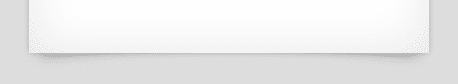
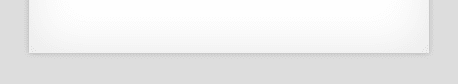
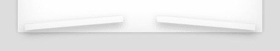

# 如何创建没有图像的 CSS3 卷纸

> 原文：<https://www.sitepoint.com/pure-css3-paper-curls/>

在我之前的帖子中，我们发现了如何在没有额外 HTML 元素或图像的情况下创建[语音气泡](https://www.sitepoint.com/pure-css3-speech-bubbles/)和[丝带](https://www.sitepoint.com/pure-css3-ribbons/)。它们是通过将 CSS3 效果应用于:before 和:after 伪元素来实现的。在这篇文章中，我们将使用类似的技术来创建一个 CSS3 纸卷曲效果。

纸质卷发已经流行了好几年了。观众看到的是一个看起来很自然的轻微弯曲的盒子，但实际上，这是由元素底部的阴影产生的视错觉:



直到最近，你还需要在 Photoshop、Gimp 或其他图形软件包中创建阴影图像。理想情况下，它应该是一个 24 位透明的 PNG，可以覆盖在任何背景上——但这将导致旧浏览器出现问题。

幸运的是，CSS3 提供了一个很好的选择，有几个好处:

*   这种效果可以在现代浏览器中使用，但不能在不支持它的浏览器中使用。
*   阴影可以覆盖在任何背景上，而不需要额外的图像。
*   该效果可以应用于任何大小的元素。
*   代码是可重用的，使用的字节比基于图像的阴影少得多。
*   阴影很容易配置。您可以通过一些代码调整来更改颜色或深度。

首先，让我们创建一个 HTML 元素:

```
 <div class="box">My box</div> 
```

内外都涂上一点阴影:

```
 .box
{
	position: relative;
	width: 500px;
	padding: 50px;
	margin: 0 auto;
	background-color: #fff;
	-webkit-box-shadow: 0 0 4px rgba(0, 0, 0, 0.2), inset 0 0 50px rgba(0, 0, 0, 0.1);
	-moz-box-shadow: 0 0 4px rgba(0, 0, 0, 0.2), inset 0 0 50px rgba(0, 0, 0, 0.1);
	box-shadow: 0 0 5px rgba(0, 0, 0, 0.2), inset 0 0 50px rgba(0, 0, 0, 0.1);
} 
```



我们现在需要在底部左右边缘添加卷曲效果。这是通过创建两个:before 和:after 伪元素来实现的，它们是:

1.  使用 CSS3 转换进行旋转和倾斜(所有最新的浏览器都支持带有供应商前缀的转换)
2.  位于底部边缘，并且
3.  给定一个方框阴影。



我们现在可以使用`z-index: -1`移动主框后面的元素。因此，只有他们的影子的边缘变得可见:


伪元素 CSS 代码:

```
 .box:before, .box:after
{
	position: absolute;
	width: 40%;
	height: 10px;
	content: ' ';
	left: 12px;
	bottom: 12px;
	background: transparent;
	-webkit-transform: skew(-5deg) rotate(-5deg);
	-moz-transform: skew(-5deg) rotate(-5deg);
	-ms-transform: skew(-5deg) rotate(-5deg);
	-o-transform: skew(-5deg) rotate(-5deg);
	transform: skew(-5deg) rotate(-5deg);
	-webkit-box-shadow: 0 6px 12px rgba(0, 0, 0, 0.3);
	-moz-box-shadow: 0 6px 12px rgba(0, 0, 0, 0.3);
	box-shadow: 0 6px 12px rgba(0, 0, 0, 0.3);
	z-index: -1;
} 

.box:after
{
	left: auto;
	right: 12px;
	-webkit-transform: skew(5deg) rotate(5deg);
	-moz-transform: skew(5deg) rotate(5deg);
	-ms-transform: skew(5deg) rotate(5deg);
	-o-transform: skew(5deg) rotate(5deg);
	transform: skew(5deg) rotate(5deg);
} 
```

这需要很多厂商前缀的代码来达到效果，但是它比一个图形需要更少的字节和 HTTP 请求。

[**请看演示页面**](https://blogs.sitepointstatic.com/examples/tech/css3-paper-curl/index.html) 举例。它在 IE9、Firefox、Chrome、Safari 和 Opera 中都能正常工作。IE6、IE7 和 IE8 优雅地降级，不会显示任何阴影效果。所有的 CSS 代码都包含在 HTML 源代码中。

如果你喜欢读这篇文章，你会爱上[可学的](https://learnable.com?utm_source=sitepoint&utm_medium=link&utm_campaign=learnablelink)；向大师们学习新技能和技术的地方。会员可以即时访问 SitePoint 的所有电子书和互动在线课程，如 [Learn CSS3](https://learnable.com/courses/learn-css3-203?utm_source=sitepoint&utm_medium=link&utm_campaign=learnablelink) 。

对本文的评论已经关闭。对 CSS3 有疑问？为什么不在我们的[论坛](https://www.sitepoint.com/forums/forumdisplay.php?53-CSS-amp-Page-Layout?utm_source=sitepoint&utm_medium=link&utm_campaign=forumlink)上问呢？

## 分享这篇文章