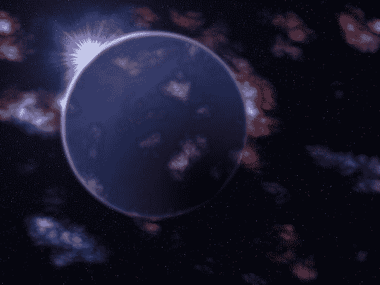
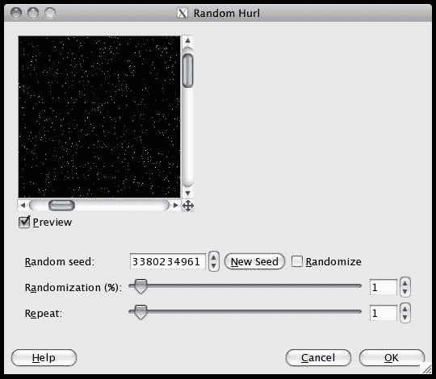
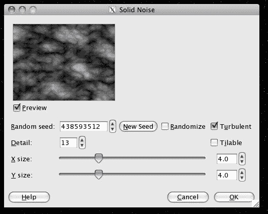
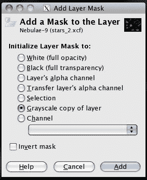

# 用小本经营推动像素:把 GIMP 带出来

> 原文：<https://www.sitepoint.com/pushing-pixels-shoestring-gimp/>

Adobe 的 Photoshop 是大多数网页设计师事实上的图像编辑软件。但是，如果你刚刚起步，又没有足够的资金来购买，那么知道有比这更省钱的选择是有好处的。一个主要的例子是 GIMP(GIMP)(*G*nu*I*mage*M*animation*P*program)，它是一个免费的、开源的、基于像素的图像编辑器。虽然它缺少 Photoshop 一些更好的省时功能和高级选项，而且它的界面可能有点古怪，但它可以成为快速勾画设计的一个很好的选择。价格当然是无与伦比的。

为了向您介绍 GIMP 的一些特性，我将带您创建一个以空间为主题的桌面背景图像。当我们结束时，你将会很好地理解:

*   选择管理

*   层管理

*   图层蒙版

*   梯度

*   刷子

*   图层混合模式

*   过滤

这是最终图像的样子:

**图一。最终的背景图像**

这可能看起来需要做很多工作，但是你会惊讶地发现，只要稍微了解一下 GIMP 的过滤器和图层特性，就可以轻松完成。

如果你还没有在你的系统上安装 GIMP，你可以从 http://www.gimp.org/downloads/下载。对于本教程，我将使用 GIMP 的 2.6.7 版本，这是撰写本文时的最新版本。如果您使用的是旧版本，我们将使用的一些功能可能会有所不同或缺失。

当您启动 GIMP 时，您首先会注意到的一个方面是各种“docks”(比如层、工具箱等等)被分割在多个窗口中。一开始这可能会让你迷失方向，但是你会慢慢习惯的。如果你不小心关闭了其中一个窗口，你可以去窗口 > 最近关闭的码头重新打开它。

我们将分三步创建我们的空间图像。首先，我们将做一个背景星空。然后我们会添加一些彩色的星云；最后，我们将添加一个大行星坐在中间，从它的后面露出一个星爆效果。

**note:** Note for Mac users

Mac 上的 GIMP 运行在 X 窗口环境中。这意味着，与您通常的做法相反，您将使用 **Ctrl** 而不是 **Command** 作为键盘快捷键——就像其他人一样。

## 星星

我们想要的第一个元素是黑色背景上的星星。我们将首先打开一个新文档(**Ctrl**++**N**或 File > New )。让它大到足以覆盖你的桌面。我把我的图像放大到 1024×768 像素，但是你可以随意把你的图像放大，因为你可以随时缩小它。

要给背景图层填充黑色，首先从工具箱窗口中选择桶填充工具(或者按**Shift**+**B**)。然后单击顶部(前景)色样(就在所有工具图标的下面)，并选择纯黑色。在你的新图像上点击任何地方，它将被黑色填充。

为了创建星星，我们将使用投掷过滤器。从菜单中选择过滤器 > 噪音 > 投掷。在对话框中，将随机化降低到 1%，点击新种子生成一个新的随机星域。点击 OK ，黑色背景现在应该是星星点缀了。

**图二。创建星域**

尽管有一些问题。首先，创建的星星太鲜艳了，所以我们将使用颜色 > 去饱和来移除颜色。我们还想要一个稍微不那么密集的星域，所以我们将打开色阶对话框颜色 > 色阶——并将上方栏左侧的黑色箭头拖向右侧，使其变薄。你会看到大多数星星消失了。

## 星云

接下来我们要添加一些星云。新建一个图层(**Shift**+**Ctrl**+**N**)，命名为“星云”，设置背景颜色为透明(以后的图层会记住这个)。从菜单中选择滤镜 > 渲染 > 云彩 > 固体噪点。在对话框中，勾选湍流框。用不同的 X 尺寸、 Y 尺寸和细节设置来创建你想要的星云类型，然后点击确定。(如果应用了不想要的滤镜，可以随时使用**Ctrl**+**Z**撤销。)

**图 3。添加星云**

固体噪声滤波器已经用云覆盖了整个图像，这对于我们的目的来说是不期望的。要过滤掉较亮的区域，再次使用级别对话框，这次将顶部栏的左手箭头向右拖动大约四分之一。

我们现在有一些漂亮的云，但是你可能会注意到星星已经消失了。这是因为新的星云层已经完全覆盖了背景层。我们需要使新图层的一些部分透明，我们可以用图层蒙版来实现。在图层对话框中(如果它是隐藏的，你可以用**Ctrl**+**L**)右击你为星云创建的图层，选择添加图层蒙版。选择图层的灰度副本，点击添加。

**图 4。添加图层蒙版**

我们已经创建了一个图层蒙版，使选定的图层半透明。图层蒙版实际上非常简单:它们只是黑白地图，指示相关图层的哪些部分是可见的。白色区域是透明的，黑色区域是不透明的，灰色区域越接近白色越半透明。现在你看不到面具。为了显示它，你需要右键点击图层并选择显示图层蒙版(和编辑图层蒙版，如果它没有被选中)。现在，您可以像处理普通图层一样处理图层蒙版-添加渐变，用画笔绘制，用色阶或曲线调整。

然而，这对于我们的形象来说是不必要的。取消选中显示图层蒙版，看一看:由于我们是通过复制原始星云图层来制作图层蒙版的，所以它唯一透明的部分是有星云的区域。所以星星在图像的其他部分完全可见。

不过纯白色的星云有点暗淡——我们需要添加一些颜色。创建一个新层，并将其命名为“颜色”然后选择画笔工具( **P** )，选择最大的“模糊”画笔——【圆形模糊(19)】——拖动比例滑块到 10.0(给你一个 190 像素的画笔大小)。打开工具箱中的笔刷动态子菜单，确保只有右下角的(随机颜色)检查处于活动状态。这将在绘制时产生前景色和背景色之间的随机变化。点击工具箱中的两个颜色样本并选择您想要的颜色，为前景和背景选择两种互补色(例如红色和蓝色)。

现在开始在星云上涂抹颜色。不要紧，如果污点完全覆盖他们，我们会马上修复。如果你希望每个星云都是不同的颜色，你可以选择更多的颜色对。

**图 5。给星云添加颜色**

当你完成后，只需在图层对话框中改变图层的模式为颜色，你会看到污点消失，只剩下它们的颜色。实际上，颜色层会给它下面的任何层上色。为了使颜色只应用于星云，我们将合并层:确保颜色层在层对话框中的星云层正上方(你可以通过拖动它们来重新排序层)，然后右键单击颜色层并选择向下合并。这将合并成一个层，结合他们的内容。

现在我们的星云是五颜六色的，但是看起来还是有点扁。为了使它们更加细致和立体，我们可以使它们的某些部分比其他部分更亮。为此，复制新合并的图层(右键单击图层并选择复制)并将默认设置的柔光滤镜(滤镜 > 艺术 > 柔光)应用到新图层。然后，使用橡皮擦(**shift**+**e**)工具和一个大的模糊笔刷，去除发光层的区域。这可能很棘手；记住，如果你想再试一次，你可以用**Ctrl**+**Z**来撤销你的操作。

## 分享这篇文章