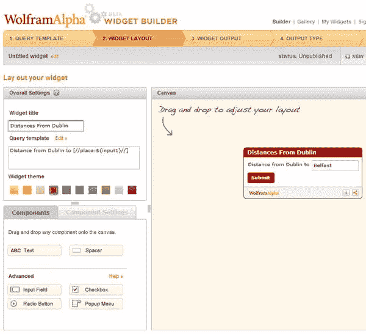
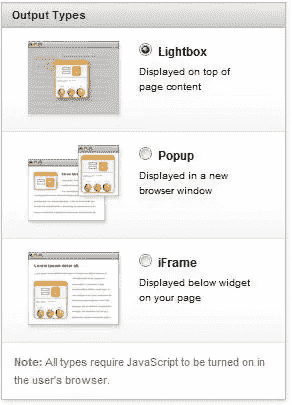
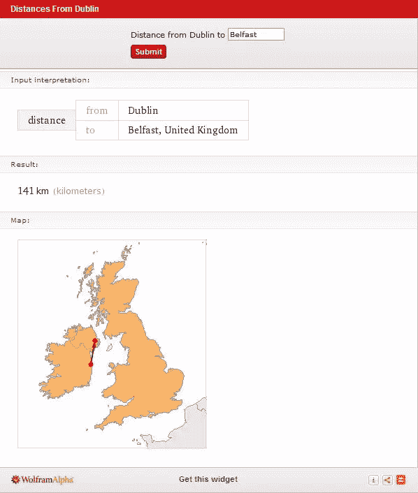
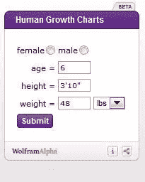
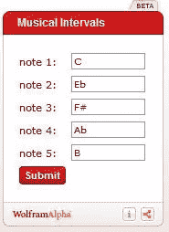
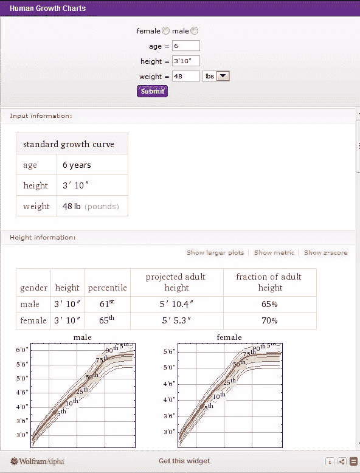

# 使用 Wolfram Alpha Widget Builder 在您的网站上放置超级智能的 Widget

> 原文：<https://www.sitepoint.com/put-super-smart-widgets-on-your-site-with-wolfram-alpha-widget-builder/>

分析引擎 Wolfram Alpha 现在向设计师、开发者和网络用户提供小部件，这些小部件将在他们的网站和博客上提供计算结果。除了使用[现有的小部件](http://developer.wolframalpha.com/widgets/gallery/featured/)，用户还可以从头开始构建自己的小部件。如果你以前没有使用过 [Wolfram Alpha](http://www.wolframalpha.com/) ，它看起来很像其他搜索引擎，但不同的是，它通过计算结构化数据的答案来直接回答事实查询，而不是提供文档或网页的列表。它使用 Mathematica 和一个巨大的数据集来编译查询的答案和图形。查询的一个例子是类似“10 颗最近的星星”或“巴拉克·奥巴马出生在哪里”。

这些小部件是构建在 Wolfram Alpha 查询之上的迷你应用程序。widget builder 允许用户在网站上设计和显示交互式 widget，并在 Twitter、电子邮件和脸书上分享它们。构建器本身使用起来相当简单，其特点是可以通过拖放界面来创建查询、设计表单以及选择颜色和布局。举个简单的例子，我创建了一个小部件来计算从都柏林到任何其他地方的距离。创建查询时，可以定义查询的哪些部分是变量，所以我最初的查询是“从都柏林到贝尔法斯特的距离”，我将贝尔法斯特设为变量。您不必担心编写任何代码，构建器会为您完成所有工作。

您可以选择从您的小部件输出什么样的信息，以及当用户按下提交按钮时它将如何显示。

对于我的简单小部件，提交的结果如下所示:

**设计**

这些小部件看起来干净整洁。这里有两个现有部件的例子，你可以直接使用，也可以根据自己的需要进行修改。

 

填写一些数据后，点击提交，会出现一个弹出框，显示您的答案。正如你在下面看到的，答案是真实的，包括图表和表格。

[使用条款和条件](http://developer.wolframalpha.com/widgets/widgetbuilderterms.html)声明这些小工具仅供个人使用，不得用于商业网站，但这对网站所有者来说是一个很好的发展，可以为他们的网站增加额外的交互性和有用的信息。

## 分享这篇文章