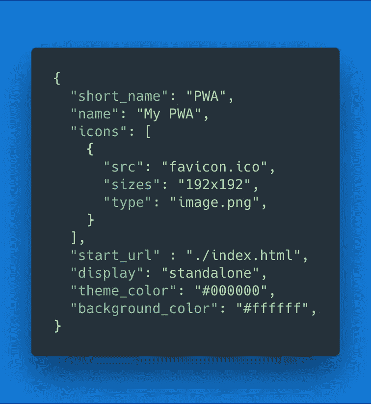
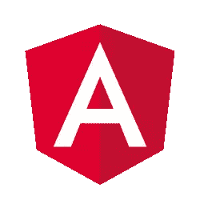
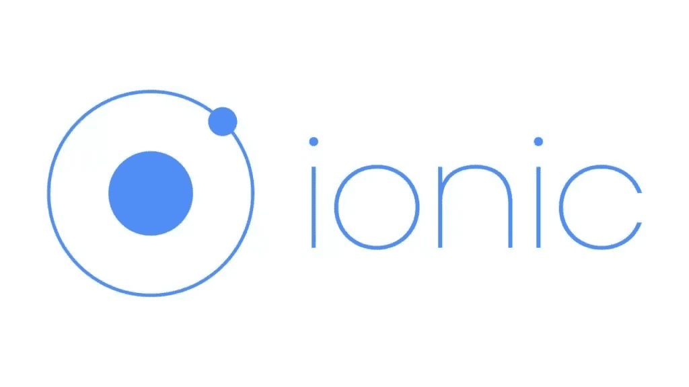

# CSS 和 PWAs:构建渐进式 Web 应用程序的一些技巧

> 原文：<https://www.sitepoint.com/pwa-css-considerations/>

**近年来，我们看到在线体验发生了许多重大转变，主要来自移动设备的激增。网络的发展已经把我们从网站的单一版本，带到了桌面与移动版本，带到了根据屏幕大小进行调整的响应网站，然后到了本地移动应用程序，这些应用程序要么将桌面体验重新创建为本地应用程序，要么充当响应版本的网关。**

所有这些的最新版本是[渐进式网络应用](https://developers.google.com/web/progressive-web-apps/) (PWA)。PWA 是一个软件平台，旨在为网站/应用程序用户结合网络和本地体验的优点。

在这篇关于 CSS 和 PWAs 的文章中，我们将讨论一些在创建开发 PWAs 所需的 CSS 时可以使用的技术。

## 什么是 pwa？

PWA 有三个主要特征。正如您将看到的，web 应用程序的进步之处在于“修复”了通常与 web 应用程序相关的问题，采用了一些本机应用程序使用的技术来解决这些问题。

1.  **可靠**。PWA 应该像本机应用程序一样可靠地加载(无论网络状态如何)。这与网页相反，如果设备与网络断开连接，网页通常不会加载。

2.  **快**。PWA 的性能应该独立于地理、网络速度、负载或其他超出最终用户控制的因素。

3.  **接合**。PWAs 应该模仿原生应用的沉浸式全屏体验，而不需要应用商店，甚至支持推送通知等功能。


还有[其他特性](https://developers.google.com/web/fundamentals/codelabs/your-first-pwapp/) PWA 特性，但是现在，我们将只讨论上面描述的最重要的特性。

谷歌一直处于推动这类应用的最前沿，但 PWAs 的采用一直在加快，供应商和网络上的许多其他公司都在帮助采用和接受 PWAs 的概念。

以下是出席 2018 年 [Cloudfest](https://www.cloudfest.com/) 的[杜达](https://www.duda.co/)首席执行官伊泰·萨丹的评论:

> 渐进式网络应用代表着网页设计和在线状态管理发展的下一个巨大飞跃……它们吸收了原生应用的最佳方面，如丰富的功能体验和离线访问的能力，并将它们融入到响应式网站中。这为用户创造了不可思议的网络体验，无需下载任何东西到他们的设备上。
> 
> 任何向客户提供网页设计服务的人都会想要提供 PWAs，因为随着时间的推移，就像移动和响应性网页设计一样，它将成为行业标准。

## 发展公共福利援助需要什么？

开发一个 PWA 与开发一个标准的 web 应用程序并没有什么不同，并且有可能升级您现有的代码库。注意，对于部署，HTTPS 是一个需求，尽管您可以在本地主机上进行测试。下面讨论了应用程序成为 PWA 的要求。

### 1.创建清单文件

PWAs 必须可以通过访问过的网站直接安装，这意味着不需要第三方应用商店来安装应用程序。

为了实现这一点，该应用程序需要提供一个 [manifest.json 文件](https://developers.google.com/web/fundamentals/web-app-manifest/)，这是一个 json 文件，允许开发人员控制 PWA 如何出现，需要启动什么以及其他参数。

典型的清单文件如下所示。正如我们所看到的，属性设置了许多外观和感觉设置，这些设置将在应用程序将要安装的设备的主屏幕上使用。



PWA 的样式从清单文件开始，但是这一部分并不涉及真正的 CSS。它只是简单的[属性](https://developers.google.com/web/fundamentals/web-app-manifest/#key_manifest_properties)，定义了应用程序的名称、图标、原色等等。

### 2.使用服务人员

服务工作者本质上是一种特定类型的 web 工作者，实现为独立于浏览器运行的 JavaScript 文件，因此它能够拦截网络请求，缓存或从缓存中检索资源，并在必要时传递推送消息。

服务人员使 PWA 真正具备离线能力。

### 3.安装站点资产，包括 CSS

服务人员第一次注册时，会触发一个安装事件。这是安装所有站点资产的地方，包括应用程序所需的任何 CSS、JS 和其他媒体和资源文件:

```
self.addEventListener('install', function(e) {
e.waitUntil(
  caches.open('airhorner').then(function(cache)
  {
    return cache.addAll([
    '/',
    '/index.html',
    '/index.html?homescreen=1',
    '/?homescreen=1',
    '/styles/main.css',
    '/scripts/main.min.js',
    '/sounds/airhorn.mp3'
    ]);
  })
);
}); 
```

只要基本需求得到满足，开发 PWAs 与开发 web 应用程序没有太大的不同。

这是 CSS 开始参与的地方，定义的文件将用于设计渐进式 web 应用程序的样式。

## CSS 和 PWAs:一些考虑

在考虑 CSS 和 PWAs 时，我们需要记住一些事情。所有这些都是在开始开发渐进式 web 应用程序之前需要做出的决定。

### 应用程序应该遵循特定平台的用户界面吗？

如果我们选择一个平台而不选择另一个平台(比如说 Android 而不选择 iOS ),我们可能会疏远我们没有考虑到的那部分观众，或者让他们处于不利地位。

我们也把我们的命运绑在这个平台上——无论是好运气还是坏运气。平台设计也很有可能随着不同版本的发展而改变。

我认为应该尽可能避免供应商搭售。

### 平台无关的设计

基于我们之前的考虑，理想的情况是选择一个平台中立的设计。

如果选择了这条路，我们应该确保结果不会在形式和功能上偏离本机平台公开的 UI 太多。

人们需要使用标准行为并执行广泛的用户测试，以确保在特定平台上没有引入 UX 问题。例如，强烈建议避免定制组件，选择标准 HTML5 控件，浏览器可以针对 UI 和最佳体验进行优化。

### 设备功能

pwa 的前进方向是成为适用于所有平台(包括桌面)的整体解决方案，尽管目前他们主要关注设备。截至 2018 年 5 月， [Chrome 支持桌面上的 PWAs](https://developers.google.com/web/updates/2018/05/dpwa)，其他厂商也将很快支持这一功能。

您的 CSS 和样式考虑需要考虑所有这些因素，并从一开始就为此进行设计。

然而，使用 PWA 的美妙之处在于，您可以使用 CSS 和服务工作者实现的组合，根据可用的资源来增强或限制功能。

### 优雅的退化和渐进的增强

CSS 通常能够优雅地后退；任何不支持的属性都会被忽略。

话虽如此，我们还需要确保关键元素有正确的备用方案，或者没有遗漏任何重要的样式。

优雅降级的另一种方法是渐进增强。这是我们在进行 PWA 时应该始终牢记的一个概念。例如，在尝试使用服务工作者 API 之前，我们应该先测试它的支持，使用如下代码:

```
if (!('serviceWorker' in navigator)) {  
  console.log('Service Worker not supported');
  return;
} 
```

这种逻辑的变体可以用于处理不同的用例，例如特定平台的样式，以及我们稍后将提到的其他内容。

### 一般建议

尽管 pwa 在用户体验方面有很多优势，但在处理不同技术的细微差别时，它们将很多责任转移给了开发人员。

作为一名开发人员/产品经理，我理解用户需求和有限的开发资源之间的微妙平衡，我总是建议找到一个涵盖尽可能多的用例的中间地带，而不会给开发和测试团队带来太多的开销。

材料设计等设计标准和 Bootstrap 等框架的出现，有助于建立平台无关的设计。

使用的实际框架通常能够处理不同功能的设备，而设计学校提供跨平台的同质外观和感觉，允许开发人员专注于应用的特性和功能。

另一方面，如果您更愿意采用整个独立的观感，您将能够使用您的服务人员来完成这项工作。

JavaScript 提供了许多函数，可以帮助根据可用的平台和功能做出决策。因此，您可以使用代码测试平台，然后相应地应用样式表。

例如， [navigator.platform](https://developer.mozilla.org/en-US/docs/Web/API/NavigatorID/platform) 方法返回应用运行的平台，而 [navigator.userAgent](https://developer.mozilla.org/en-US/docs/Web/API/NavigatorID/userAgent) 返回正在使用的浏览器。

在检测浏览器时，浏览器代理是不可靠的，因此下面的代码更多的是一个概念的演示，而不是应该在实际环境中使用的代码。

navigator.platform 是一种更可靠的方法，但是大量的可用平台使得在我们的示例中使用它很麻烦。

```
/**
* Determine the mobile operating system.
* This function returns one of 'iOS', 'Android', 'Windows Phone', or 'unknown'.
*
* @returns {String}
*/

function getMobileOperatingSystem()
{
  var userAgent = navigator.userAgent || navigator.vendor || window.opera;
  // Windows Phone must come first because its UA also contains "Android"
  if (/windows phone/i.test(userAgent))
  {
    return  "Windows Phone";
  }

  if (/android/i.test(userAgent))
  {
    return  "Android";
  }

  if (/iPad|iPhone|iPod/.test(userAgent) && !window.MSStream)
  {
    return  "iOS";
  }

  return  "unknown";
  // return “Android” - one should either handle the unknown or fallback to a specific platform, let’s say Android
} 
```

使用上面的`getMobileOperatingSystem()`的返回值，您可以相应地注册一个特定的 CSS 文件。

从上面的代码中，我们可以看到这样的逻辑会变得非常复杂并且难以维护，所以我只建议在不适合平台无关设计的情况下使用它。

另一个选择是使用更简单的配色方案，只将 CSS 应用于与底层操作系统匹配的主要样式，尽管在用户已经为其设备换肤的情况下，这仍然可能“中断”。

## PWA 框架

当学习如何开发 PWA 时，手动创建一切是很棒的:这是学习构建渐进式 web 应用程序的所有基础概念的极好方式。

一旦你熟悉了所有重要的方面，你就可以开始使用一些工具来帮助你，提高你的开发效率。

与大多数开发场景一样，框架可以使 PWAs 的开发更快、更有效。

这些框架中的每一个都使用特定的 CSS 技术来确保开发过程是可维护的、可伸缩的，并且满足开发者和最终用户的需求。

通过使用这样的框架，您可以确保您的 PWA 在大多数设备和平台上都能很好地工作，因为这些框架通常具有跨平台的能力，尽管它们可能提供有限的向后兼容性。当你决定用什么来开发你的渐进式网络应用时，这是你需要做的另一个决定。通过使用框架，您放弃了从头开始编写所有内容时所拥有的一些控制权。

下面我们将推荐一些框架/工具，它们可以用来帮助 PWAs 的开发。

不过，给你一个建议:当涉及到性能时，框架会增加很多开销。

我们建议您只在开始时使用这些资源，最终选择不使用它们，并使用平台无关的设计，使用最少的、精简的样式表。

### 1.[创建 React 应用](https://github.com/facebook/create-react-app)


React 通过使用像 [Create React App](https://github.com/facebook/create-react-app) 这样的库，拥有了允许开发 PWA 的所有组件。

[这是用这个库](https://www.sitepoint.com/progressive-web-apps-a-crash-course/)创建 React PWA 的一个很好的例子。

### 2.[角度](https://angular.io/)



鉴于 Angular 是谷歌的产品，以及我们如何看到该公司推动 PWAs，Angular 完全支持 PWAs 也就不足为奇了。

如果你习惯使用 Angular，你可以考虑使用它作为你的框架选择。

Angular 2+使用以下命令通过框架支持 PWA 特性(如服务人员和清单文件)的本地实现:

```
ng add @angular/pwa --project project_name 
```

[这是一篇很棒的文章，指导你创建一个带角度的 PWA](https://blog.angulartraining.com/progressive-web-apps-for-angular-6-and-beyond-f7e4b9a2f9fa)。

### [离子型](https://ionicframework.com/pwa)



Ionic 是 PWAs 的另一个框架。框架

*   利用 Angular 支持使用 web 技术创建本地应用
*   使用 Cordova 在手机等设备上运行应用程序
*   具有内置的服务工作器和清单支持。

这是一个高级框架，包括许多面向开发人员和面向团队的特性，如快速原型，以加快开发速度。

## PWAs 和绩效

渐进式网络应用的基础之一仍然是快速和引人入胜的用户体验。

因此，在考虑 CSS 时，需要确保尽可能精简。

这是框架开始遭受损失的一个方面。它们添加了您没有使用的额外 CSS 资源，这会降低 PWAs 的性能。

您可能需要记住一些注意事项:

*   在服务器上使用 HTTP/2
*   使用类似于`rel=preload`的提示来允许早期获取关键的 CSS 和其他资源
*   使用 [NetworkInformationAPI](https://developer.mozilla.org/en-US/docs/Web/API/NetworkInformation) 和缓存实现来访问缓存的资源，而不是下载它们
*   将关键的 CSS 直接内联到 HTML 文档中以优化性能——这通常应该在文件夹之上的任何地方进行
*   保持资源尽可能少
*   缩小你所有的 CSS 资源，并实现其他优化，如压缩资源，优化图像和使用优化的图像和视频格式。

谷歌关于性能的指导方针还有其他你应该记住的细节。

### 谷歌灯塔

说到性能，Google Lighthouse 是一个专门围绕提高网站和渐进式网络应用程序性能的性能监控工具。


曾经是 Chrome 插件的 Lighthouse ，如今内置了 Chrome 开发者工具。它可以用来对 progressive web 应用程序运行测试。该测试会生成一份报告，其中包含大量的详细信息，可以帮助您将开发保持在 PWA 的性能参数范围内。

## 包扎

同时使用 CSS 和 PWAs 与使用 CSS 开发 web 应用程序或网站有一些不同(特别是在性能和响应方面)。然而，大多数可以用于 web 开发的技术都可以适用于渐进式 web 应用程序的开发。无论你是使用框架还是从头开始构建，都要权衡利弊，做出明智的决定，然后坚持下去。

## 分享这篇文章