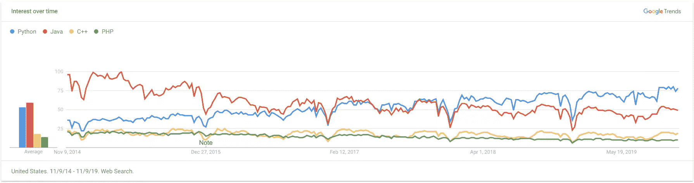
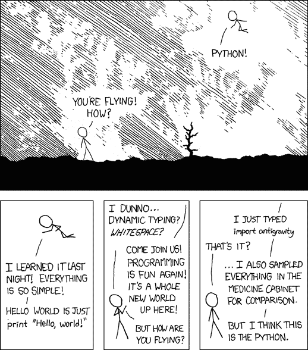

# Python 的趋势:当今最热门的语言中什么最热门

> 原文：<https://www.sitepoint.com/python-trends-whats-hot/>

Python 可以说是当今的编程语言*。我们将探讨为什么会这样，Python 社区中的当前趋势是什么，以及如果您不想落后的话，您可能想要了解哪些包和工具。*

 *如果你在考虑应该投入时间和精力在哪种编程语言上，你现在可以停止搜索了。是 Python。

好吧，这太简单了。不可否认的是，你不会仅仅因为一个 Java 项目“热门”，就一头扎进这个已经开发多年的项目，将所有代码移植到 Python 中。编程语言是达到目的的一种手段，你必须仔细考虑采用给定技术的成本/收益。

也就是说，当事情朝着某个方向大规模发展时，这一定意味着什么。一段时间以来，事情一直朝着 Python 发展。

想要提高您的 Python 技能并在快速增长的市场中脱颖而出吗？查看 [SitePoint Premium](https://www.sitepoint.com/premium/library) ！你会找到一些书籍来帮助你入门(比如《Python 学徒】中的[)和发展工作技能(比如《Python 中的前端测试](https://www.sitepoint.com/premium/books/the-python-apprentice/)】)。使用 Python 大师[提高您的技能，并访问超过 400 本关于 web 设计和开发的书籍和课程的不断增长的图书馆。](https://www.sitepoint.com/premium/books/the-python-master/)

## 向国王致敬

实际上，如今每一门本科 IT 课程都是用 Python 来教授的——而不仅仅是由公司在 T2 或大学在 T4 提供的计算机科学入门课程。即使是关于数据科学、人工智能或定量金融的高度专业化的课程——不久前还会使用 R、MATLAB 或 C++等语言——现在也经常完全用 Python 来教授。

查看过去五年截至 2019 年的趋势，比较 Python、Java、C++和 PHP:

很有说服力，不是吗？

更长时间内更全面的语言列表呢？当然可以:

[https://www.youtube.com/embed/Og847HVwRSI](https://www.youtube.com/embed/Og847HVwRSI)

## 那是怎么发生的？

有[吨](https://www.quora.com/What-makes-Python-so-good)吨[吨](https://medium.com/@trungluongquang/why-python-is-popular-despite-being-super-slow-83a8320412a9)吨[的文章](https://www.techrepublic.com/article/why-python-is-so-popular-with-developers-3-reasons-the-language-has-exploded/)探讨为什么 Python 如此受欢迎，但作为复习，让我们在这里开始一场激烈的争论，并简要讨论它与其他语言相比如何:

*   **易学**。与 [C++](https://isocpp.org/) 或 [Java](https://en.wikipedia.org/wiki/Java_(programming_language)) 不同，Python 相对来说更容易接近，即使对于完全没有经验的人来说也是如此——这就是为什么它是编程入门课程的首选语言之一。
*   **通用**。与 [PHP](https://www.php.net/) (用于 web 编程)或 [R](https://www.r-project.org/) (用于统计分析)不同，Python 适用于许多任务。
*   **新旧**。不像 [Visual Basic](https://docs.microsoft.com/en-us/previous-versions/visualstudio/visual-basic-6/visual-basic-6.0-documentation?redirectedfrom=MSDN) (它似乎没有经受住时间的考验)或 [Go](https://golang.org/) (这是一个相当新的，2009 年 11 月)，Python 是一个相对*古老的语言(1990 年)，在积极的开发中，它已经被证明是非常成熟的。*
*   **电池包含在**中。与提到的所有语言*不同，Python 有一个庞大的所谓的[标准库](https://docs.python.org/3/library/)，涵盖了从特定领域到一般任务的各种任务。*

所有这些使得 Python 成为一种语言，在这种语言中，几乎任何东西都可以非常容易地原型化，([甚至不使用汇编程序的微控制器！](https://www.raspberrypi.org/))并立即推出[最小可行产品](https://en.wikipedia.org/wiki/Minimum_viable_product)。

更重要的是——是的，这很偏颇，但是……——*Python 很有趣！*

但足够的赞美；让我们挖一点。我将重点介绍几个展示 Python 威力的工具。当然，还有更多有待发现。

## 人工智能

人工智能如今无处不在(我敢打赌你会发现一个随着人工智能的出现而无法改进的过程)，这是一个广阔的研究领域，Python 肯定会在这个领域大放异彩。

毫不奇怪，您会发现数据科学部分有一些共同之处，所以让我们稍后再来看看更多的包吧！

### 包装

*   **[PyTorch](https://pytorch.org/)** 。基于 [Torch](http://torch.ch/) 的新机器学习框架。它通过 GPU 实现强大的加速来利用[深度神经网络](https://en.wikipedia.org/wiki/Deep_learning#Deep_neural_networks) (DNN)，从而快速获得动力。
*   **[【scikit】-学习](https://scikit-learn.org/)** 。一个非常易于使用的机器学习库(例如，[用六行代码](https://www.youtube.com/watch?v=cKxRvEZd3Mw)训练一个监督学习算法)，拥有简单高效的数据挖掘和数据分析工具。
*   **[张量流](https://www.tensorflow.org/)** 。更多的机器学习，但是有了[数据流](https://en.wikipedia.org/wiki/Dataflow_programming "Dataflow programming")和[可区分的](https://en.wikipedia.org/wiki/Differentiable_programming "Differentiable programming")编程。对于使用神经网络开发深度学习模型也非常强大。

## 云开发

你能想到的所有集成，包括移动、[物联网](https://en.wikipedia.org/wiki/Internet_of_things)(物联网)、各种 API，甚至以代码 (IaC)的形式管理和供应[基础设施——所有这些都意味着云。](https://en.wikipedia.org/wiki/Infrastructure_as_code)

作为一名 Python 程序员，这意味着你有机会在[无服务器](https://en.wikipedia.org/wiki/Serverless_computing)执行模型中开发[微服务](https://en.wikipedia.org/wiki/Microservices)。

### 包装

*   **[Django 休息框架](https://www.django-rest-framework.org/)** 。一个强大而灵活的工具包，用于构建可浏览的 web APIs。它支持序列化、身份验证策略和视图定制等特性。在 Django 上运行，也有很好的记录。
*   **[鼠兔](https://github.com/pika/)** 。 [RabbitMQ](https://www.rabbitmq.com/) 的纯 Python 实现，这是一个高规模、高可用性的[消息代理](https://en.wikipedia.org/wiki/Message_broker)，允许跨不同平台和系统的异步消息传递。
*   **[无服务器架构](https://serverless.com/)** 。虽然是在 Node.js 中开发的，但 if 提供了[大量关于如何构建 Python 应用并将其部署到亚马逊网络服务(AWS)、谷歌云平台(GCP)和微软 Azure 的例子](https://github.com/serverless/examples)。

另外，熟悉一下**[AWS Lambda](https://aws.amazon.com/lambda/)****[亚马逊 API 网关](https://aws.amazon.com/api-gateway/)****[云函数](https://cloud.google.com/functions/)****[Azure 函数](https://azure.microsoft.com/services/functions/)** 也不错。这些是亚马逊、谷歌和微软的服务，你将使用它们将你的 Python 代码实际部署到云中。

## 加密货币和金融

我不会在这里讨论比特币和其他加密货币是否是经济泡沫(它们是！)，因为那样会引发无休止的激烈争论。

但有一点是肯定的:*区块链技术的应用不仅仅局限于加密货币和 ICO T1。)

如果你想深入事物的金融方面，你可以将这些知识应用于所有金融市场——包括加密货币。

### 包装

Python 主要用作服务器端语言，而不是客户端语言(比如钱包)。记住这一点，*要开发区块链，你实际上可以使用诸如 TensorFlow 和 Django* 之类的框架(更多细节请分别参见 AI 和 web 开发部分)。

也就是说，有几个区块链和金融相关的包可能会派上用场，比如**[api-v1-client-python](https://github.com/blockchain/api-v1-client-python)**(区块链比特币开发者 API)，以及**[SmartPy](https://smartpy.io/)**(Tezos 的智能合约语言)。

对于定量分析，检查熊猫(见数据科学部分)和 **[Zipline](https://www.zipline.io/)** (一个 pythonic 算法交易库)。

## 数据科学

就像人工智能一样，Python 已经庄严地证明了它在数据科学领域中的地位，比如 R 和 MATLAB。

说实话，虽然并不意味着是通用工具，但与 Python 相比，这些其他语言在性能和功能方面确实有优势。然而，现在情况不同了，因为 Python 已经走过了漫长的发展道路，而且*在 Python 中几乎没有你不能有效执行的任务——如果不是更有效的话——就像在其他平台上一样*。Python 仍然是一种通用语言，这意味着它能为你做更多的事情。

### 包装

*   **[NumPy](https://numpy.org/)** 。Python 遇到了 MATLAB:支持大型多维数组和矩阵的线性代数，以及操作它们的大量高级数学函数。
*   **[熊猫](https://pandas.pydata.org/)** 。高性能、易于使用的数据结构，用于数据分析，尤其是数字表格和时间序列的数据操作。看看[这个数据学校](https://www.dataschool.io/easier-data-analysis-with-pandas/)的视频系列！
*   。科学和技术计算的例程，包括统计、优化、数值积分、插值、特殊函数、 [FFT](https://en.wikipedia.org/wiki/Fast_Fourier_transform) 、信号和图像处理以及 [ODE](https://en.wikipedia.org/wiki/Ordinary_differential_equation) 解算器。

## Web 开发和移动应用

是的，web 开发还是 2020 年的事情！谁知道呢？如果你问我，不仅网络开发还需要很多年，而且网络和移动应用之间的界限只会变得更加模糊。

不可否认，Python 可能不会在这里发挥主导作用，但有一个优势:*你可以更容易地管理项目，在*周围移动团队成员，因为你正在工作的生态系统的其他终端*也将*用 Python 开发。

换句话说，作为一个 Python 玩家，你可以玩很多游戏。

### 包装

*   **[烧瓶](https://palletsprojects.com/p/flask/)** 。一个轻量级的 web 应用框架。作为一个[微框架](https://en.wikipedia.org/wiki/Microframework)，它不需要特殊的工具或库，这也意味着没有数据库抽象层。但有时极简主义和性能是游戏的名称。
*   **[姜戈](https://www.djangoproject.com/)。“*有期限的完美主义者的网络框架*”(我很喜欢这个口号！)快速、安全和可伸缩，它的[对象关系映射](https://en.wikipedia.org/wiki/Object-relational_mapping) (ORM)和它的模型-模板-视图(MTV)系统是如此之好，以至于许多人甚至将[用于与网络无关的工作](https://www.caktusgroup.com/blog/2011/10/24/django-without-web/)。Instagram、Spotify、Pinterest、Dropbox 甚至 YouTube 都是用 Django 构建的网站的例子。**
*   **[基维](https://kivy.org/)T3**和[蜂产品](https://beeware.org/)** 。简而言之，Kivy 用于开发跨平台的 GUI，而 BeeWare 用于开发本地的多平台应用，包括桌面和移动应用。与 Ionic 相比，他们仍然是谦虚的玩家，但在不久的将来事情可能会改变。**

## 额外:你应该拥有的工具

**[iPython](https://ipython.org/)** 最初是作为“交互式计算”(实时键入和执行代码)的工具出现的，但很快一群开发人员意识到其背后的想法有如此大的潜力，他们创建了 **[项目 Jupyter](https://jupyter.org/)** 作为副产品。

后来， **[JupyterLab](https://jupyter.org/try)** 出现了，它将“笔记本接口”(可执行代码、输出和可以共享的注释)的概念带到了下一个层次，支持一系列语言，而不仅仅是 Python。[试试吧](https://jupyter.org/try)！

最后，以一种类似于 R Studio 的[闪亮](https://shiny.rstudio.com/)的方式，Jupyter 生态系统引入了*将 Jupyter 笔记本变成独立的网络应用*。检查 Voilà仪表盘的[图库](https://voila-gallery.org/services/gallery/)。印象相当深刻。

因此，如果你还没有熟悉这些工具的话，*你真的应该熟悉这些工具*。它们将极大地简化你的工作流程，允许更快的测试和代码共享。

## 包裹

没有什么是永恒的，也许最明显的是在它里面。如果我们可以从介绍中的[最流行的编程语言 1965–2019](https://www.youtube.com/watch?v=Og847HVwRSI)片段中得出一些结论，那就是编程语言的统治来来去去。没错，现在的国王是一条[无毒蛇](https://en.wikipedia.org/wiki/Pythonidae)，但如果有一天你听到群众的哗然: *[国王死了，国王万岁！](https://en.wikipedia.org/wiki/The_king_is_dead,_long_live_the_king!)*

虽然这看起来不会很快发生，但是我们在这里讨论的许多工具和软件包肯定会被竞争对手放弃、中断、放弃或接管。我们知道，尽管学习用新方法或新工具做事很有趣，但如果你已经有了一个工作流程，这也可能是一种痛苦。但是，嘿，如果我们希望事情保持不变，我们就不会谈论技术，对吗？

所以，保持警惕，时刻保持警惕，关注[PyCon](https://www.python.org/community/pycon/)s——你所在城市的[会议](https://pycon.org/)和[YouTube](https://www.youtube.com/results?search_query=pycon)上的视频——看看即将发生的新事情。不要回避偶尔尝试新事物。这样，你会保持良好的身材。

* * *

**使用 [SitePoint Remote](https://www.sitepoint.com/jobs/) 找到您的下一份远程 Python 工作，在这里我们为开发人员、设计师和数字专业人士精心挑选最佳远程工作。**

## 分享这篇文章*