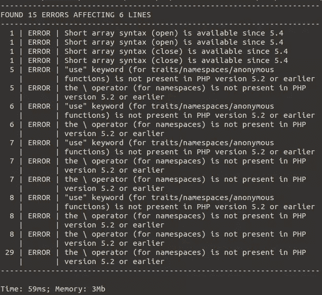

# 快速介绍:phpc 的 phpc 兼容性-你准备好 PHP7 了吗？

> 原文：<https://www.sitepoint.com/quick-intro-phpcompatibility-standard-for-phpcs-are-you-php7-ready/>

迟早有一天，你会需要将你的项目迁移到不同的 PHP 版本。你将如何检查你是否与一个不同于你正在开发的 PHP 版本兼容？

一种可能是总是安装我们想要迁移到的 PHP 版本，运行类似 PHPSA 的`php -l`或[来检查语法错误，检查 PHP 文档中关于迁移的已知问题，并希望一切顺利。或者，我们可以使用一些可用的第三方工具来检查我们项目中 PHP 版本的兼容性。](https://www.sitepoint.com/static-analysis-with-phpsa-php-smart-analyzer/)


## 检查与 PHP 兼容性的兼容性

PHP 兼容性是一套我们可以安装在 T2 PHP cs T3 上的嗅探器。这个工具允许我们检查我们的项目与新旧版本 PHP 的兼容性。如果你不熟悉 [PHP QA 工具](https://www.sitepoint.com/8-must-have-php-quality-assurance-tools/)，PHPCS 是一个基于不同编码标准检查 PHP、JavaScript 和 CSS 不同代码违规的工具。

PHPCompatibility 的当前迭代支持 PHP 7 以下的 PHP 版本。

### 安装 PHP 兼容性

PHP 兼容性可以通过 Pear 或者通过 [Composer](https://www.sitepoint.com/php-dependency-management-with-composer/) 安装。对于这个特殊的例子，我们将使用 Composer 安装 PHPCS，然后直接在它上面部署我们的 PHPCS 兼容性编码标准。

对于本地安装:

```
composer require "squizlabs/php_codesniffer=2.*" 
```

PHPCS 安装完成后，让我们进入位于`/vendor/squizlabs/php_codesniffer/CodeSniffer/Standards`中的 PHPCS `/Standards`文件夹并运行:

```
git clone https://github.com/wimg/PHPCompatibility.git 
```

这个命令将把 PHPCompatibility 编码标准直接部署到我们的 standards 文件夹中，连同已经捆绑在 PHPCS 中的编码标准。要检查 PHPCS 和 PHPCompatibility 是否都已成功安装，只需运行以下命令:

```
./vendor/bin/phpcs -i 
```

这将列出所有已安装的标准。我们应该在其中看到`PHPCompatibility`。

对于全局安装，同样的方法也是有效的，只是要确保使用 Composer 的全局要求:

```
composer global require "squizlabs/php_codesniffer=2.*" 
```

然后将 PHPCompatibility 克隆到以下文件夹中:

```
~/.composer/vendor/squizlabs/php_codesniffer/CodeSniffer/Standards 
```

### 使用 PHPCS

如果你以前从未使用过 PHPCS，从`./vendor/bin/phpcs -h`开始总是好的。这将显示 PHPCS 帮助部分。

在我们深入研究 PHPCompatibility 标准的使用之前，有一些 PHPCS 命令可以帮助我们更快、更有效地进行兼容性测试，并得到我们需要的结果:

*   `-i`–不要打印警告。如果我们有一个很长的消息列表，并且想要过滤掉警告来关注错误，那么这个选项会很有帮助。

*   `-l`–只检查本地目录，不递归。

*   `-p`–显示跑步进度。对大项目特别有用，维持地位。

*   `-i`–显示已安装的编码标准列表。

*   `<file>`–要检查的文件或文件夹。

*   `<extensions>`–要检查的文件扩展名的逗号分隔列表。

*   `<generator>`–使用`HTML`、`Markdown`或`Text`发电机。它强制生成文档，而不仅仅是做检查。

*   `<patterns>`–以逗号分隔的模式列表，用于忽略文件和文件夹(如`vendor`)。

*   `<severity>`–显示错误或警告所需的最低问题严重性。

*   `<standard>`–要使用的编码标准的名称或路径。

*   一些单独的标准也需要特定的配置选项，PHP 兼容性也是如此。该命令的语法如下:

    ```
    phpcs --runtime-set <option> <value>` 
    ```

这个列表远非详尽，但在微调我们的检查时应该很有用。

### 检查兼容性

要检查兼容性，我们可以运行以下命令:

```
./vendor/bin/phpcs --standard=PHPCompatibility --runtime-set testVersion 7 <path> 
```

通过这个命令，我们将使用 PHPCompatibility 标准和我们前面看到的 runtime-set 选项。我们正在检查由`<path>`定义的文件或文件夹与 PHP 7 的兼容性。

该工具将输出类似如下的内容:



注意，如果您正在测试向后兼容性，建议您在可用的最新 PHP 版本上执行 PHPCS。例如，如果你的代码中有关键字`yield`，PHPCS 只有在你的机器上运行 PHP 5.5 或更高版本时才能识别它。如果它知道它是什么，它只会告诉你它在以前的 PHP 版本中不可用。

如果我们只想测试`.php`文件，我们可以使用`<extensions>`选项。将它添加到我们之前使用的命令中:

```
./vendor/bin/phpcs --standard=PHPCompatibility --extensions=php --runtime-set testVersion 7 <path> 
```

对于详细的报告，我们可以使用选项`--report-full=<path>.txt`。

要忽略兼容性测试中的文件或文件夹(例如，前面提到的`vendor`文件夹，以及一个包含测试的文件夹)，我们可以使用选项`--ignore=*/tests/*,*/vendor/* <path>`。这样，就不会对指定的文件和文件夹进行兼容性测试。

我们前面看到的所有 PHPCS 选项都可以用来帮助更好地使用该工具。

### 真实生活的例子

当然，我们也想知道这个工具是否可以帮助我们实现一个真实的、生产类型的应用程序。让我们在一个复杂的应用程序上使用它来看看结果。我为这个选择了 [PHPMailer](https://github.com/PHPMailer/PHPMailer) 。

```
git clone https://github.com/PHPMailer/PHPMailer.git mailer
cd mailer
composer install 
```

这将把 PHPMailer 克隆到`/mailer`文件夹中，并安装它所有的依赖项。之后，我们需要安装 PHPCS 和 PHPCS 兼容性标准:

```
composer require "squizlabs/php_codesniffer"
cd vendor/squizlabs/php_codesniffer/CodeSniffer/Standards
git clone https://github.com/wimg/PHPCompatibility.git 
```

最后，让我们在单个文件上运行 PHP 兼容性标准(我们现在也可以在整个项目上运行它，但是让我们在这个演示中使用单个文件)。

```
./vendor/bin/phpcs --standard=PHPCompatibility --extensions=php --runtime-set testVersion 5.6 class.phpmailer.php 
```

正如我们所看到的，尽管 PHPMailer 还没有为 PHP 5.6 做好准备，但我们已经拥有了升级代码所需的所有信息。

希望这个快速提示工具介绍有所帮助！你如何测试兼容性？

## 分享这篇文章