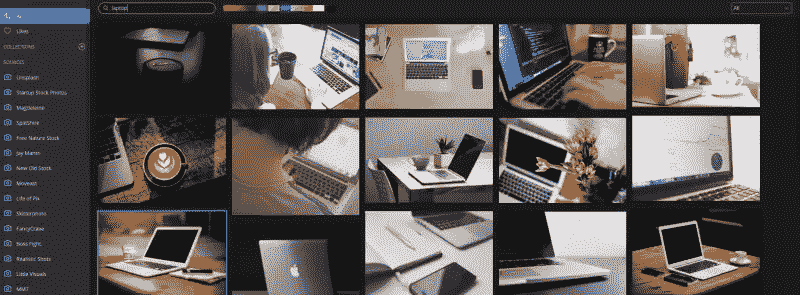

# 快速阅读:用 Zoommy 搜索 11，000 张免费库存照片

> 原文：<https://www.sitepoint.com/quick-read-search-11000-free-stock-photos-zoomy/>

为你的下一个项目寻找高质量的库存照片不仅是一个耗时的过程，也是一个昂贵的过程。

有了数字限制管理、版权、许可证和商标，我们生活在一个不断被提醒要小心不要踩到对方脚趾的时代。避免这样的问题可以避免在项目工作时的大麻烦和“时间下沉”。

这正是 Zoommy App 承诺的目标。

Zoommy 是一个很小但非常有用的照片聚合应用程序，从多个来源收集了数千张公共领域的照片。为了便于使用，这些照片获得了[知识共享零(CC0)许可](https://creativecommons.org/publicdomain/zero/1.0/)的许可，这意味着它们属于公共领域，不受任何限制。

这款应用可以在 Windows、Mac OS X 甚至 Linux 上使用(我对这款应用特别满意)，价格仅为 4 美元。这是轻松获得无限视觉美好的最低代价。您会收到一个应用程序令牌密钥，您可以在您的 Zoommy 安装中使用它。

该应用程序还包括一些其他网站没有的 Zoommy 独家照片。Zoommy 从 30 多个来源获取 CC0 照片，包括 Unsplash、公共领域档案和其他来源。

## 功能:

此外，该应用程序还能够:

*   按颜色过滤照片–从暖色调到冷色调有 10 种颜色可供选择
*   按布局格式(方形、横向或纵向)搜索照片
*   选择的照片可以收藏，下载，组织在收藏或简单地复制的网址
*   照片也可以通过标签搜索

如果你需要的话，你也可以访问照片的原始来源。

该界面简单而有条理，在浏览 Zoommy 聚合的大量照片时提供了响应性体验。

话虽如此，如果您的互联网连接速度较慢，您的体验可能会受到一定程度的影响。由于 Zoommy 上的许多库存照片的分辨率都高于 4K，这可能并不奇怪。

## WordPress 插件

有趣的是，Zoommy 还提供了一个 [WordPress 插件](https://github.com/sharpfuryz/zoommy_wordpress)，它可以无缝地将 Zoommy 库集成到你的 WordPress 安装中。

它在 WordPress 官方网站上还不可用，但是你可以从它的 [GitHub 库](https://github.com/sharpfuryz/zoommy_wordpress)下载，并手动添加到你自己的 WordPress 站点。

如果你对这个插件感到困惑，请查看自述文件。

## 放大了吗？

尽管 Zoommy 不太可能完全取代你的照片搜索程序，但它肯定能帮助你减少照片预算。它还经过精心设计，提供了非常友好的用户体验。

试试吧，在评论中告诉我们你的经历！

## 分享这篇文章