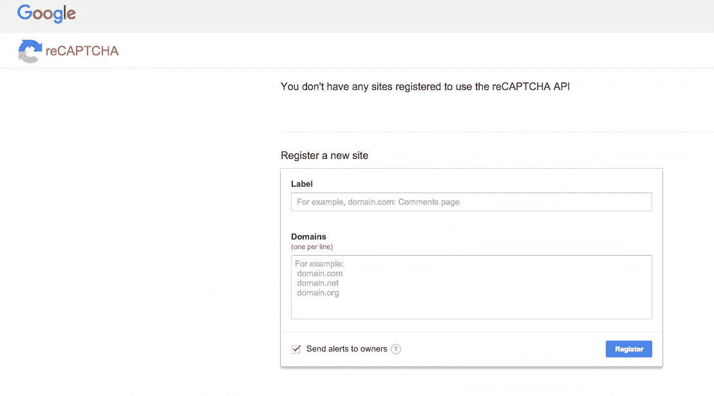

# 快速提示:将 ReCAPTCHA 添加到 Rails 应用程序中

> 原文：<https://www.sitepoint.com/quick-tip-add-recaptcha-to-your-rails-application/>

*这篇文章由[汤姆·帕金](https://www.sitepoint.com/author/tparkin)进行了同行评审。感谢 SitePoint 的所有同行评审员使 SitePoint 的内容尽可能做到最好！*


ReCAPTCHA 是谷歌的一项免费服务，有助于保护网站免受垃圾邮件和滥用。“验证码”是一种区分人类和机器人的测试。这种服务对于拥有大量用户生成内容的网站或 web 应用程序非常重要。这个测试对人类来说很容易解决，但对机器人和其他恶意软件来说却很难搞清楚。

在本教程中，我将展示如何使用 [ReCAPTCHA gem](https://github.com/ambethia/recaptcha/) 将 ReCAPTCHA 集成到您的 Rails 应用程序中。您还将看到如何将它添加到设计中。

我们开始吧！

### ReCAPTCHA 设置

首先，您需要获得一个 [ReCAPTCHA API 密钥](https://www.googln.com/recaptcha/admin)。我假设你已经有一个谷歌账户，但如果没有，注册一个。



在 ReCAPTCHA 页面上，输入您申请的详细信息，然后点击**注册**。您将看到一个包含您的站点密钥和秘密密钥的页面。将它们复制到一个安全的位置，防止这些键被签入源代码控制是明智的。

### Rails 应用程序设置

从终端生成一个新的 rails 应用程序

```
rails new mypets 
```

和`bundle install`

我选择了宠物，因为我喜欢狗，我希望很快得到两只:)

让我们为我们的应用程序生成一个支架:

```
 class='language-bash'rails g scaffold Pet name:string pets_type:string 
```

然后迁移您的数据库:

```
 class='language-bash'rake db:migrate 
```

## 集成 ReCAPTCHA

将以下宝石添加到您的`Gemfile`和`bundle install`中:

```
#Gemfile
gem 'dotenv-rails', :require => 'dotenv/rails-now'

gem "recaptcha", require: "recaptcha/rails" 
```

创建一个**。env** 文件，并将 ReCAPTCHA 键粘贴到其中:

```
RECAPTCHA_PUBLIC_KEY = '<YOUR PUBLIC KEY>'
RECAPTCHA_PRIVATE_KEY = '<YOUR PRIVATE KEY>' 
```

保存文件。打开**。gitignore** 加**。env** 。这确保了您的秘密密钥不会成为提交的一部分，因此它们不会在您的 git repo 中公开可见。

## 为 ReCAPTCHA 配置视图

首先导航到您的控制器，编辑`create`动作，如下所示:

```
#app/controllers/pets_controller.rb

def create
  @pet = Pet.new(pet_params)

  respond_to do |format|
    if verify_recaptcha(model: @pet) && @pet.save
      format.html { redirect_to @pet, notice: 'Pet was successfully created.' }
      format.json { render :show, status: :created, location: @pet }
    else
      format.html { render :new }
      format.json { render json: @pet.errors, status: :unprocessable_entity }
    end
  end
end 
```

这将确保如果 ReCAPTCHA 未被验证，则不会创建新的 pet 对象。

让我们来看看风景。

打开**app/views/pets/_ form . html . erb**并添加 reCAPTCHA 标签:

```
#app/views/pets/_form.html.erb

<%= form_for(@pet) do |f| %>
  <% if @pet.errors.any? %>
    <div id="error_explanation">
      <h2><%= pluralize(@pet.errors.count, "error") %> prohibited this pet from being saved:</h2>

      <ul>
      <% @pet.errors.full_messages.each do |message| %>
        <li><%= message %></li>
      <% end %>
      </ul>
    </div>
  <% end %>

  <div class="field">
    <%= f.label :name %><br>
    <%= f.text_field :name %>
  </div>
  <div class="field">
    <%= f.label :pets_type %><br>
    <%= f.text_field :pets_type %>
  </div>
  <div>
    <%= recaptcha_tags %> <!-- THIS -->
  </div>
  <div class="actions">
    <%= f.submit %>
  </div>
<% end %> 
```

启动 rails 服务器(`rails s`)，将浏览器指向**http://localhost:3000/pets/new**，查看 reCAPTCHA 的工作情况。

## ReCAPTCHA 和设计

[device](https://github.com/plataformatec/devise)是一个灵活的 Rails 认证解决方案。在这一部分中，我将向您展示如何将 ReCAPTCHA 与您的设计模型集成在一起。

将`devise`添加到你的 **Gemfile** 和`bundle install`中。

```
# Gemfile
... other gems ...
gem `devise` 
```

安装`devise`:

```
rails generate devise:install 
```

接下来让我们生成您的`User`模型:

```
rails generate devise User 
```

迁移您的数据库

```
rake db:migrate 
```

我们将需要编辑设备视图，以便生成。

```
rails generate devise:views 
```

使用您的文本编辑器打开您的应用程序布局，并将其粘贴到`body`开始标记的正下方。

```
#app/views/layouts/application.html.erb

<p class="notice"><%= notice %></p>
<p class="alert"><%= alert %></p> 
```

## 集成 ReCAPTCHA

为了让 ReCAPTCHA 工作，您需要像上面那样编辑控制器中的`create`动作。我们还需要在设计控制器上做一些改变。

跟我来。

从您的终端运行这个生成器:

```
rails generate devise:controllers users 
```

这将创建一个包含所有设计控制器的**控制器/用户**文件夹。

使用你的文本编辑器，打开**app/controllers/users/registrations _ controller . Rb**，编辑`create`动作，如下所示:

```
#app/controllers/users/registrations_controller.rb

def create
 if !verify_recaptcha
    flash.delete :recaptcha_error
    build_resource(sign_up_params)
    resource.valid?
    resource.errors.add(:base, "There was an error with the recaptcha code below. Please re-enter the code.")
    clean_up_passwords(resource)
    respond_with_navigational(resource) { render_with_scope :new }
  else
    flash.delete :recaptcha_error
    super
  end
end 
```

现在，导航到**app/views/device/registrations/new . html . erb**并添加 ReCAPTCHA 标记，如下所示:

```
#app/views/devise/registrations/new.html.erb

<h2>Sign up</h2>

<%= form_for(resource, as: resource_name, url: registration_path(resource_name)) do |f| %>
  <%= devise_error_messages! %>

  <div class="field">
    <%= f.label :email %><br />
    <%= f.email_field :email, autofocus: true %>
  </div>

  <div class="field">
    <%= f.label :password %>
    <% if @minimum_password_length %>
    <em>(<%= @minimum_password_length %> characters minimum)</em>
    <% end %><br />
    <%= f.password_field :password, autocomplete: "off" %>
  </div>

  <div class="field">
    <%= f.label :password_confirmation %><br />
    <%= f.password_field :password_confirmation, autocomplete: "off" %>
  </div>

  <div class="field">
    <%= recaptcha_tags %>
  </div>

  <div class="actions">
    <%= f.submit "Sign up" %>
  </div>
<% end %>

<%= render "devise/shared/links" %> 
```

现在，将您的浏览器指向**http://localhost:3000/users/sign _ up**，您将看到 ReCAPTCHA 正在运行。

# 结论

在本教程中，您已经学习了如何将 ReCAPTCHA 集成到您的 Rails 应用程序中。我觉得增加一些关于 Devise 的内容可能会特别有帮助，因为它是如此受欢迎的宝石。尝试在你的应用中添加一些基于 ReCAPTCHA 的安全性，并让我知道效果如何。

我喜欢写一些像这样的快速击中主题，可以立即应用，带来实实在在的好处。我希望你喜欢它。

## 分享这篇文章