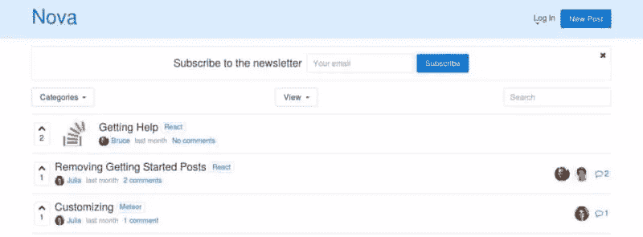
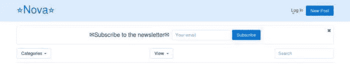
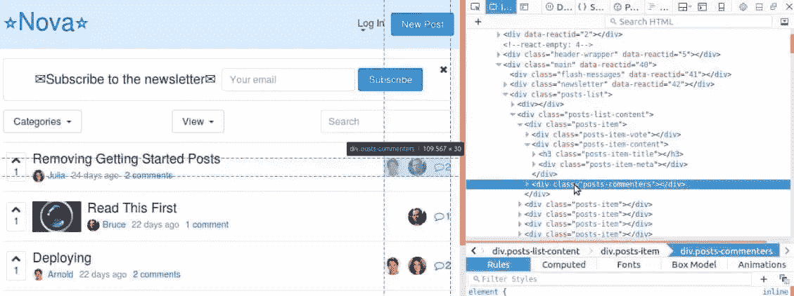
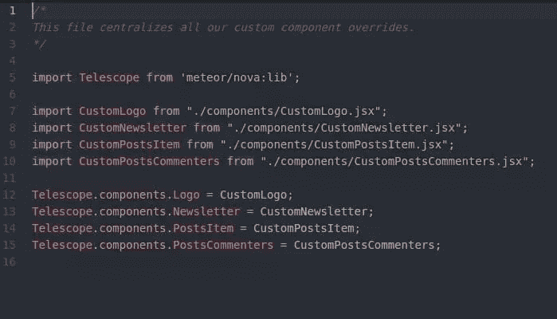
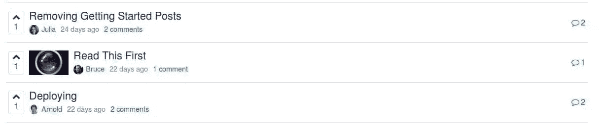
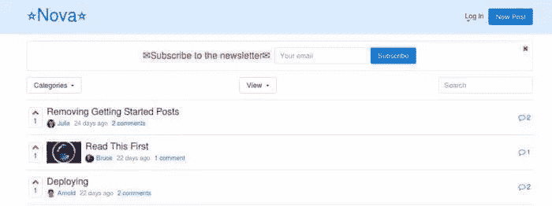

# 快速提示:如何为 Telescope Nova 构建自定义主题

> 原文：<https://www.sitepoint.com/quick-tip-how-to-build-a-custom-theme-for-telescope-nova/>


如果你想快速简单地构建自己的社交网络应用，Telescope Nova 是一个完美的平台。这是一个由 **Sacha Greif** 创建的免费开源项目。app 的**前端开发**部分是用 [React](https://facebook.github.io/react/) 库构建的，后端则由 **Meteor** 框架负责。两者都是用 JavaScript 编写的，JavaScript 是当今最流行的编程语言之一。

由于在工作中我们使用 [Meteor.js](https://www.meteor.com/) 进行**后端开发**，我们几乎不可能不尝试定制 Telescope Nova，这是 **Meteor 应用**中最受欢迎的应用之一。

在这个小技巧中，你将学习如何为 Telescope Nova 创建你自己的自定义主题。但是首先，关于如何设置您的开发环境，我想说几句话。

## 正在安装 Node.js、NPM 和 Meteor.js

在安装 Nova 之前，你需要先安装 Node.js、NPM 和 Meteor.js。如果没有，请继续执行以下安装步骤:

1.  安装 [Node.js](https://nodejs.org/en/) 和 [NPM](https://www.npmjs.com/package/npm) 。如果你使用的是 Windows，并且在安装上有困难，戴夫·麦克法兰的《T4 如何在 Windows 上安装 Node.js 和 NPM》应该会有所帮助
2.  安装 [Meteor.js](https://www.meteor.com/install) 。

## 安装望远镜 Nova

现在让我们在您的本地主机上安装 Nova。在命令行上，键入:

```
git clone https://github.com/TelescopeJS/Telescope.git

cd Telescope

npm install

meteor
```

然后你应该能看到应用程序在`http://localhost:3000/`上运行。



关于安装 Nova 的更多信息，请访问他们的 [GitHub](https://github.com/TelescopeJS/Telescope#first-steps) 说明。

## 创建您的主题包

一旦您的应用程序启动并运行，您就可以按照以下步骤开始自定义其默认外观:

1.  进入你的`Telescope>packages`文件夹。在那里你会找到文件夹`my-custom-package`
2.  复制/粘贴`my-custom-package`文件夹并重命名副本，例如
    ，`custom-theme`。现在您已经创建了自己的包
3.  在你的`custom-theme`包中，找到文件`package.js`并在你的编辑器中打开
    。替换这段代码——`name: “my-custom-package”`——以匹配您的包名。所以在这种情况下，它将是`name: “custom-theme”`
4.  在终端中，导航到您的`Telescope`文件夹并键入:`meteor add custom-theme`以将新包应用到应用程序
5.  然后使用命令启动应用程序:`meteor`
6.  最后，转到`http://localhost:3000`,在那里你会看到这个新的外观，图标周围有
    星形表情符号。



## 定制组件

在继续定制组件之前，这里有一些提醒:

*   您将在`packages>nova-base-components`文件夹中找到您想要更改的大部分组件
*   **千万不要编辑原始文件！您应该只更改您的自定义文件！**
*   别忘了用`className`代替常规的`class`
*   总是写结束的 html 标签，例如`</img>`。

现在，假设你想删除右边的头像。使用浏览器的开发工具的 *inspect element* 功能，您应该会看到相关的类，这将帮助您定位您正在寻找的标记。



接下来，按照以下步骤操作:

1.  通过访问`nova-base-components>lib>posts>PostsCommenters.jsx`找到*postscomenters*组件，并复制其全部内容
2.  在您的包中，创建一个名为`CustomPostsCommenters.jsx`的新文件。路径将是`custom-theme>lib>components>CustomPostsCommenters.jsx`
3.  把之前复制的`PostsCommenters.jsx`的内容粘贴在里面。

原始代码如下所示:

```
import Telescope from 'meteor/nova:lib';
import React from 'react';
import { Link } from 'react-router';
import Posts from "meteor/nova:posts";

const PostsCommenters = ({post}) => {
  return (
    <div className="posts-commenters">
      <div className="posts-commenters-avatars">
        {_.take(post.commentersArray, 4).map(user =>
          <Telescope.components.UsersAvatar key={user._id} user= {user}/>)}
      </div>
      <div className="posts-commenters-discuss">
        <Link to={Posts.getPageUrl(post)}>
          <Telescope.components.Icon name="comment" />
          <span className="posts-commenters-comments-count">{post.commentCount}</span>
          <span className="sr-only">Comments</span>
        </Link>
      </div>
    </div>
  )
}

PostsCommenters.displayName = "PostsCommenters";

module.exports = PostsCommenters;
export default PostsCommenters;
```

要删除头像，您将删除自定义文件中的代码部分**，而不是原始的**，如下所示:

```
<div className="posts-commenters-avatars">
  {_.take(post.commentersArray, 4).map(user =>
  <Telescope.components.UsersAvatar key={user._id} user={user}/>)}
</div>
```

为了让这个定制文件真正覆盖原来的文件，您需要做以下进一步的修改:

找到如下所示的代码部分:

```
const PostsCommenters = ({post}) => {
  return (
    <div className="posts-commenters">
    // more code here
    </div>
  )
}

PostsCommenters.displayName = "PostsCommenters";

module.exports = PostsCommenters;
export default PostsCommenters;
```

编辑它，看起来像下面的代码片段:

```
const CustomPostsCommenters = ({post}) => {
  return (
    <div className="posts-commenters">
    // more code here
    </div>
  )
}

export default CustomPostsCommenters;
```

重要的是，您**总是**通过在名称的**开头**添加单词**自定义**来命名您的自定义文件和组件！文件名的其余部分保持与原始文件相同。

最后要做的是在`components.js`文件中多写几行代码，可以在这里找到:`custom-theme>lib>components.js`:

```
import CustomPostsCommenters from "./components/CustomPostsCommenters.jsx";

Telescope.components.PostsCommenters = CustomPostsCommenters;
```

您需要对每个想要更改的新组件重复上述步骤。您的`components.js`文件将如下所示:



此时，应该会应用所需的更改，您应该不会再在屏幕上看到任何头像。你的主题应该是这样的:



## 自定义 CSS

你不局限于定制你的望远镜新星主题的结构。通过修改样式表，您可以轻松地定制它的外观。

以下是方法。

在您的包中，您应该找到一个名为`custom.scss`的文件，您将在其中编写您的自定义样式。路径应该是:`custom-theme>lib>stylesheets>custom.scss`

如果你更喜欢纯 CSS 而不是 Sass，只需创建一个新文件并将其命名为，例如，`custom.css`。

现在在里面做一个简单的改动，只是为了测试。例如:

```
a {
  color:red;
}
```

保存`custom.css`，然后打开位于`custom-theme>lib>package.js`的`package.js`文件。

找到如下代码部分:

```
api.addFiles([
  'lib/stylesheets/custom.scss'
], ['client']);
```

添加新文件的路径，如下所示:

```
api.addFiles([
  'lib/stylesheets/custom.scss',
  'lib/stylesheets/custom.css'
], ['client']);
```

保存您的工作并等待应用程序重新加载。现在你的链接的颜色应该变成红色了。



查看我们定制的 Nova 主题望远镜的现场版！

## 资源

有关制作自定望远镜主题的更多信息，请查看以下有用资源:

*   [望远镜官方文档](http://docs.telescopeapp.org/v0.15.1/docs/customization-basics)
*   [望远镜 Github repo](https://github.com/TelescopeJS/Telescope)
*   望远镜官方 youtube 教程[第一部分](https://www.youtube.com/watch?v=MXx2SMxtRPc&list=PLBoa_Q6hVeSzChsSi8X8x3FQ8NN2D73fB&index=5)和[第二部分](https://www.youtube.com/watch?v=bSG9tMicUbg&index=6&list=PLBoa_Q6hVeSzChsSi8X8x3FQ8NN2D73fB)

现在轮到你了，添加你自己的定制并在评论中分享结果！

## 分享这篇文章