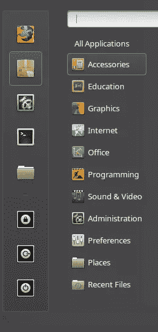
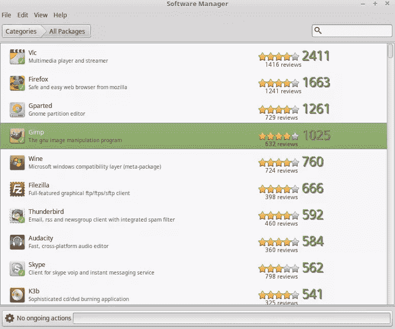
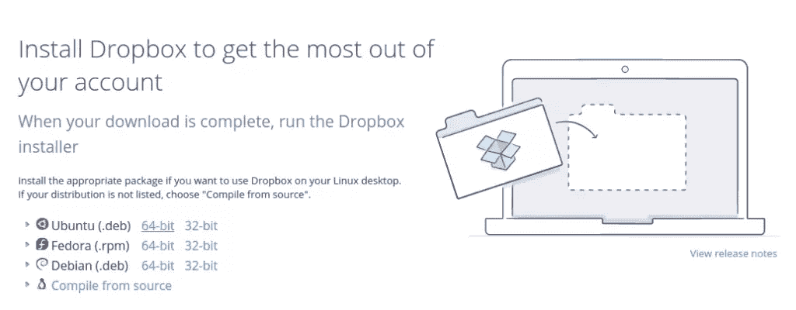
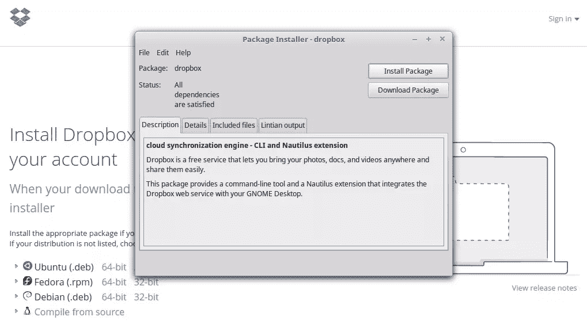
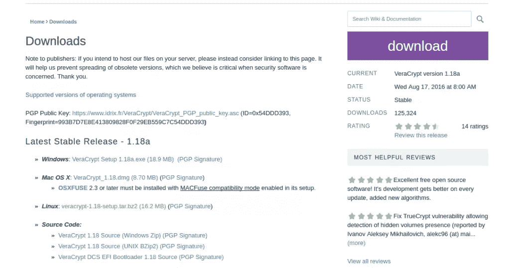
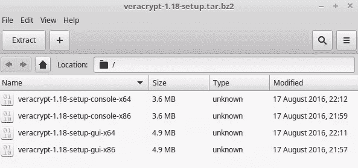
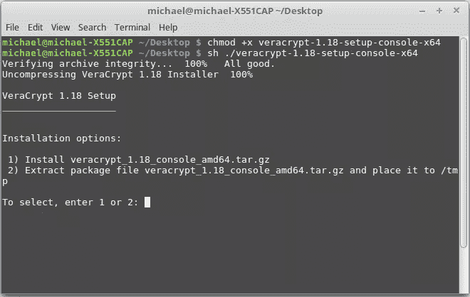

# 快速提示:如何安装。黛比和。Linux 中的 tar 文件

> 原文：<https://www.sitepoint.com/quick-tip-how-to-install-deb-and-tar-files-in-linux/>


在这篇快速教程中，我将解释如何使用终端命令在 Linux 中安装程序。这个特别的教程使用了 **Linux Mint 18** (Cinnamon 64 位)，但是下面提供的命令对于其他版本的 Linux 是通用的，比如 Ubuntu。对于那些刚接触 Linux 的人来说，你可能会熟悉内置的**软件管理器**:



简而言之，软件管理器允许通过简单地搜索可用的程序，然后从管理器安装它来更容易地安装各种程序。例如，如果用户想通过软件管理器安装 GIMP，只需找到程序并安装:



然而，Linux 中的安装通常会比这更复杂，因为通常需要直接从源代码安装程序。在这里，我解释了如何安装两种特殊类型的扩展，这两种扩展经常让 Linux 新手非常头疼。(我刚开始的时候确实是这样！)

我们将看看通过终端安装 **Debian (deb)** 和**Tarball(tar.gz)**文件的方法，本教程将使用的两个例子分别是 **Dropbox** 和 **VeraCrypt** 。通常的免责声明适用于:这两个程序仅用于说明目的，我不认可或促进本文中的任何特定产品。

## 1.通过 deb 文件安装 Dropbox

安装 **deb** 文件会有不同程度的困难。换句话说，一些由 deb 文件组成的程序允许直接安装，而那些包含许多独立 deb 文件的程序通常必须通过终端安装。让我们看看安装 deb 文件中的 Dropbox 例子。

首先，我们选择 Ubuntu 64 位版本(或者适合您系统的版本):



接下来，系统会提示我们直接安装软件包:



虽然这个特殊的 deb 文件很容易安装，但是有些情况下我们必须直接从终端安装 deb 文件。例如，程序可能会提示我们将 deb 文件解压到一个特定的位置，然后从那里安装，而不是直接安装。

以 Dropbox 为例，假设我们被提示提取文件，然后安装。为了便于说明，我们称这个文件夹为`Dropbox_deb`，它存储在我们的下载文件夹中。在这种情况下，我们将:

**a .将我们的目录设置为下载中的 Dropbox_deb 文件夹:**

```
cd ~/Desktop/Dropbox_deb 
```

b .安装。deb 文件使用以下命令:

```
sudo dpkg -i *.deb 
```

## 2.通过 tar 文件安装 VeraCrypt

在某些情况下，用户必须通过 tar 文件进行安装，这是 Linux 中的标准源代码下载。在这里，我们通过一个 **tar.bz2** 文件安装 VeraCrypt(在下图中用黄色文本突出显示):



下载完成后，系统会提示我们提取 **shell (sh)** 文件，在本例中，我们将这些文件提取到桌面:



一旦我们提取了`sh`文件，接下来就是使用适当的终端命令执行它们了。我们看到我们有四个独立的`sh`文件，我们将执行**veracrypt-1.18-setup-console-x64**文件。注意，这个文件末尾没有`.sh`扩展名:如果有，那么我们需要在终端中的文件末尾添加`.sh`。

我们打开终端，将目录设置为 Desktop **(cd ~/Desktop)** ，并运行如下命令:

```
chmod +x veracrypt-1.18-setup-console-x64 
```

```
sh ./veracrypt-1.18-setup-console-x64 
```

完成后，我们看到程序提示我们在终端内部进行完全安装:



注意，为了通过终端卸载程序，需要通过 **sudo apt-get remove** 命令来完成。例如，如果用户希望卸载 Dropbox，可以通过输入以下命令来完成:

```
sudo apt-get remove dropbox 
```

如果您是 Linux 的新手，花些时间熟悉新的操作系统是很重要的，这一点在安装程序时尤为明显，因为许多程序不会自动包含在软件管理器中。这里，我们已经讨论了通常安装在 Linux 上的两种最常见的文件类型，当在这个平台上安装新程序时，上面的命令是需要记住的关键命令。

## 分享这篇文章