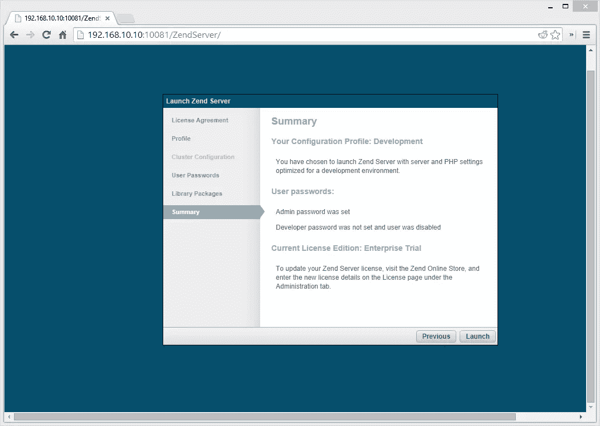
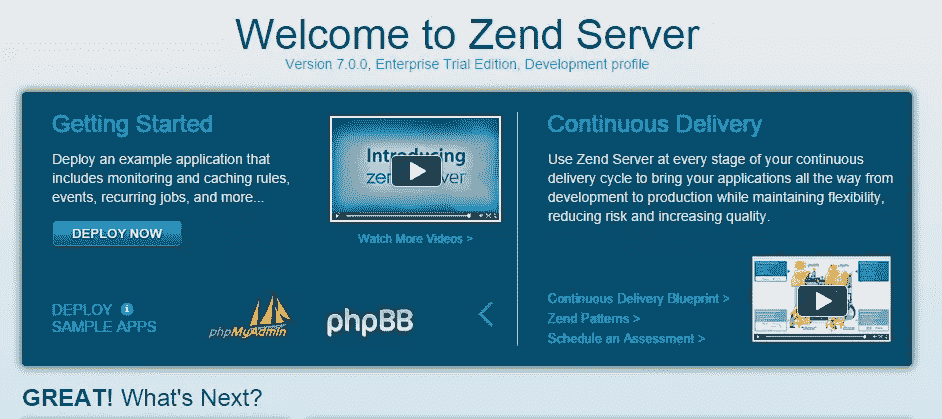
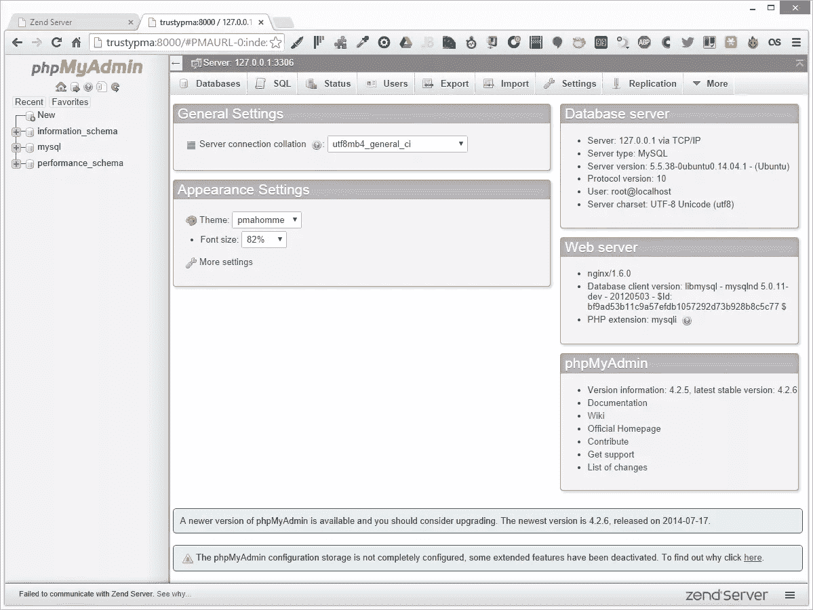

# 快速提示:将 Zend Server 7 安装在 Ubuntu 14.04 的流浪盒上

> 原文：<https://www.sitepoint.com/quick-tip-install-zend-server-7-ubuntu-14-04-vagrant-box/>

我最近看了一下功能强大的应用程序监视器/管理器套件的最新版本 Zend Server 7。这个小技巧将告诉你如何把它安装在一个流浪者盒子上，这样你也可以体验它的功能。

## 步骤 1:安装必备组件

确保你安装了 Virtualbox 和 vagger——越新越好。

## 步骤 2:克隆和引导

克隆这个库。改编自[家园改进版](https://www.sitepoint.com/quick-tip-get-homestead-vagrant-vm-running/)和最初的[家园](https://github.com/laravel/homestead)，这个设置将启动一个基本的可信(Ubuntu 14.04 LTS 64 位)虚拟机。克隆完成后，用`vagrant up`引导。与真正的裸机可信盒的唯一真正区别是我们转发了端口 10081，这是 Zend Server 默认使用的端口。

```
git clone https://github.com/Swader/trustead cd trustead
vagrant up
```

引导完成后，用`vagrant ssh`进入虚拟机。

## 步骤 3:下载并运行安装程序

你可以从 Zend [这里](http://www.zend.com/products/server)下载一个 30 天的试用版安装程序，或者你可以从我们的 CDN 获取一个试用版安装程序实例，就像这样:

```
cd Code wget http://dab1nmslvvntp.cloudfront.net/wp-content/uploads/2014/07/1406030465ZendServer-7.0.0-RepositoryInstaller-linux.tar.gz tar xvzf 1406030465ZendServer-7.0.0-RepositoryInstaller-linux.tar.gz
cd ZendServer-RepositoryInstaller-linux/ sudo ./install_zs.sh 5.5 nginx
```

一旦这些命令被执行，Zend 服务器将被安装并运行。如果您没有安装 Nginx(在默认的 Trusty box 上，您没有安装)，它会把它和您指定的 PHP 版本(在我们的例子中是 5.5)放在一起。

一旦安装完毕，您应该能够通过`http://192.168.10.10:10081`从您的主机浏览器访问 Zend 服务器界面。这个界面将让您从浏览器中完成安装。



## 步骤 4:修复日志权限

为了能够读/写日志，我们需要按照[指令](http://files.zend.com/help/Zend-Server/zend-server.htm#log_file_permissions.htm)给 zend 用户修改日志文件的权限。

```
sudo chmod o+r /var/log/nginx/{access,error}.log
```

## [可选]步骤 5:部署应用程序

或者，部署一个示例应用程序。既然这样，那就用 PhpMyAdmin 吧。

在 VM 中，用`sudo apt-get install mysql-server`安装 MySQL。

在 Zend Server GUI 的主页面向导屏幕上(单击 Overview 时的第一页)，单击“Deploy Apps”下的右箭头，滚动到 PhpMyAdmin。



在 Zend Server GUI 中，遍历安装 PhpMyAdmin 的安装向导(注意关于 root 密码的问题)，当要求给它一个默认服务器时，添加一个新的。我使用了`http://trustypma`并将其添加到主机上的 hosts 文件中，这样我就可以通过`http://trustypma:8000`从主机浏览器访问 Zend Server 的 PhpMyAdmin。



就是这样！您已经安装了 Zend Server 的一个工作实例，具有完整的企业特性。

## 分享这篇文章