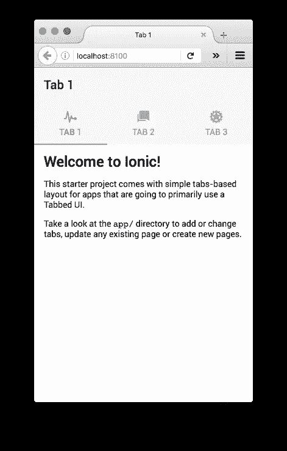
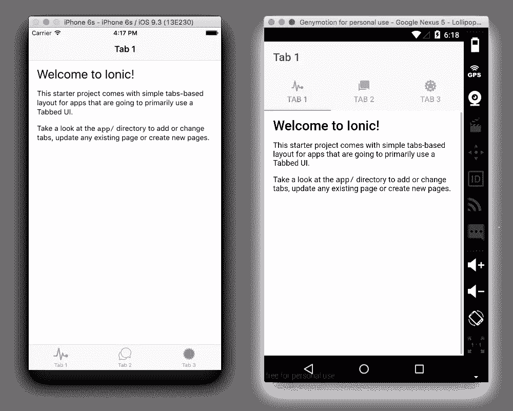

# 快速提示–为 HTML5 应用安装 Ionic 框架

> 原文：<https://www.sitepoint.com/quick-tip-installing-the-ionic-framework-for-html5-apps/>

Ionic 是一个框架，使用你熟悉和喜爱的网络技术 Angular 和 Cordova 来构建混合移动应用。Ionic 2 版本(目前处于测试阶段)利用 Angular 2(也处于测试阶段)和 ES6，如果您愿意，可以选择 TypeScript。它允许您用 HTML、CSS 和 JavaScript 编写一次应用程序代码，并使用相同的代码部署到多个目标，让它们看起来和感觉起来像本机 iOS 和 Android 应用程序。在这个快速技巧中，我将介绍如何安装 Ionic 框架以及如何开始创建一个应用程序。

## 安装

首先从他们的官方包中安装 [Node.js](https://nodejs.org/en/download/) ，[家酿](http://brew.sh/) (Mac)，[巧克力](https://chocolatey.org/)或者[勺子](http://scoop.sh/) (Windows)。Ionic 使用 Node.js 的包管理器 [npm](https://www.npmjs.com/) 进行安装。

在 OSX 和 Linux 上，打开一个终端并运行:

```
npm install -g ionic@beta
npm install -g cordova 
```

在 Windows 上打开命令提示符运行:

```
C:\>npm install -g ionic@beta
C:\>npm install -g cordova 
```

**注意** : Ionic 2 需要`@beta`标签，直到完整版发布。

## 创建项目

Ionic 2 包可以安装 v1 和 v2 项目。用`ionic start <name> --v2`创建一个新的 v2 项目，例如

```
ionic start my-mobile-app --v2
cd my-mobile-app 
```

如果您对 TypeScript 感兴趣，您可以用`--ts`标志包含它。

```
ionic start my-mobile-app --v2 --ts 
```

## 在浏览器中运行

要在浏览器中打开应用程序，请运行:

```
ionic serve 
```

这将编译您的资产并启动一个本地开发服务器。



您现在将处于 ionic 提示符下，要返回到正常提示符，请键入`quit`。

## 添加平台

添加带有`ionic platform add <platform>`的平台，例如

```
ionic platform add ios
ionic platform add android 
```

要构建和运行一个应用程序，你需要为你想要的每个平台安装 SDK。要检查您是否已经安装了所添加平台所需的一切，请运行:

```
cordova requirements 
```

**注意**:要在本地运行 iOS 应用程序，你需要安装 XCode。对于 Android 开发，我建议安装 [GenyMotion](https://www.sitepoint.com/improved-android-emulation-genymotion/) 来帮助仿真设备。

## 在平台上运行

使用`ionic run <platform>`运行应用程序，例如

```
ionic run ios
ionic run android 
```

该命令将重新编译资产，并在设备上安装 Cordova。



Ionic 的一个优点是单一代码库的风格适合每个平台。颜色、字体、图标、表单元素和组件看起来都很像。Ionic 团队也非常重视性能，所以你很难将一个应用程序与它们的同类区别开来。

## 你的申请

应用程序的定制代码位于`app`目录下，只是 HTML 和 JavaScript(或类型脚本)的集合

在开发过程中，你可以用`ionic serve`在浏览器中完成大部分的编码和测试。要在一个设备上测试，你需要用`ionic run <platform>`点击`build`和`run`，以查看模拟器中反映的变化。

## 后续步骤

*   多亏了 Babel 和 Browserify，你可以在你的 Ionic 应用中编写 ES6。
*   默认情况下，Sass 处于启用状态。
*   你可以在你的 HTML 中使用 [Ionic 组件](http://ionicframework.com/docs/v2/components/)或者用 HTML、CSS 和 JS 构建你自己的组件。
*   你有[本地组件](http://ionicframework.com/docs/v2/native/)，它们是 Cordova 插件的包装器，用于访问设备特性。
*   对于简单的应用程序，你可以[主题化它](http://ionicframework.com/docs/v2/theming/theming-your-app/)

如果你以前没有使用过 Cordova，那么值得阅读 SitePoint 的关于安装 Cordova 的快速提示，因为这是 Ionic 的基础。

接下来我推荐 [Ionic 2 教程](http://ionicframework.com/docs/v2/getting-started/tutorial/)，它解释了如何开始使用页面和导航， [SitePoint 有大量关于 Ionic](https://www.sitepoint.com/?s=ionic) 的文章可以深入挖掘。

Ionic 可以非常快速地构建跨平台的移动应用程序，并提供了一个很好的组件库，很容易扩展。尽情享受吧！

## 分享这篇文章