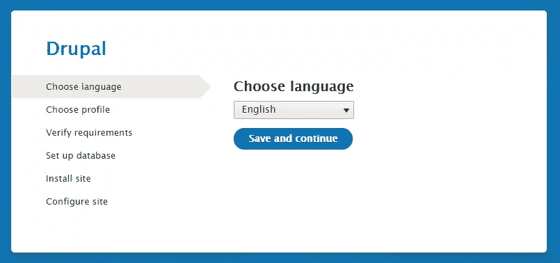
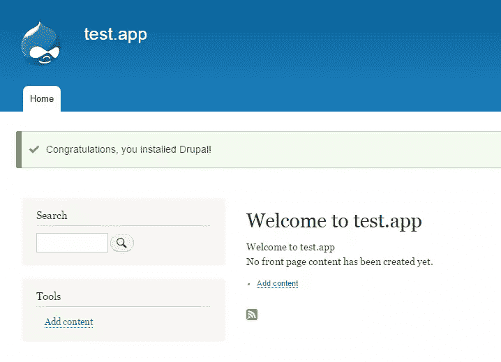

# 快速提示:在不到五分钟的时间内启动并运行 Drupal 8

> 原文：<https://www.sitepoint.com/quick-tip-running-drupal-8-five-minutes/>

在这个[快速提示](https://www.sitepoint.com/blog/)中，我们将安装一个 [Drupal 8，beta 1](https://www.drupal.org/drupal-8.0.0-beta1) 的本地实例。最后，您将拥有一个 Drupal 副本，它不仅可以用 Symfony 包和其他包进行扩展，还可以接受内容并显示给最终用户。

## 步骤 1:准备环境

为了让每个人都有相同的起点，我们将使用我们值得信赖的旧[家园改良版](https://www.sitepoint.com/quick-tip-get-homestead-vagrant-vm-running/)流浪箱。值得注意的是，即使这个技巧是将 Drupal 8 安装到流浪者盒子中，这个过程对于任何基于 Ubuntu 的环境来说都是绝对相同的*。*

因此，多少有些随意，请按照[这篇提示](https://www.sitepoint.com/quick-tip-get-homestead-vagrant-vm-running/)中的说明克隆一个新的 Homestead 改进实例。然后，添加一个新站点，并确保将条目添加到主机的 hosts 文件中。在我的例子中，它是`test.app`并且`Homestead.yaml`看起来像这样:

```
---
ip: "192.168.10.10"
memory: 2048
cpus: 1

folders:
    - map: .
      to: /home/vagrant/Code

sites:
    - map: homestead.app
      to: /home/vagrant/Code/Laravel/public
    - map: test.app
      to: /home/vagrant/Code/drupal

variables:
    - key: APP_ENV
      value: local
```

## 步骤 2:下载并解压缩 Drupal 8 b1

如果您使用的是 VM，请登录并进入保存项目的文件夹。在上面的家园改进装置的情况下，那将是`/home/vagrant/Code`。如果你用的是你自己的 LAMP stack 或者别的什么，只要进入你的项目文件夹。

```
wget http://ftp.drupal.org/files/projects/drupal-8.0.0-beta1.tar.gz
```

下载完成后，解压存档文件，并将结果文件夹重命名为`drupal`。

```
tar -xvzf drupal-8.0.0-beta1.tar.gz
mv drupal-8.0.0-beta1 drupal
```

## 步骤 3:创建数据库

在这种情况下，我们将使用 MySQL。我们还将使用特定于家园的用户/通行证默认值。如果你有自己的环境，根据需要进行调整。关于 PostgreSQL，请参见[这里的](https://www.drupal.org/documentation/install/create-database)。

```
mysqladmin -u homestead -psecret create drupaltest
mysql -u homestead -psecret
```

进入 MySQL 控制台后，执行以下命令:

```
GRANT SELECT, INSERT, UPDATE, DELETE, CREATE, DROP, INDEX, ALTER, CREATE TEMPORARY TABLES ON drupaltest.* TO 'homestead'@'localhost' IDENTIFIED BY 'secret';

exit
```

## 第四步:设置

在这一步中，我们从提供的模板中创建一个设置和服务文件，并让 Drupal 安装程序通过修改权限来编辑它们。

```
cd drupal
cp sites/default/default.settings.php sites/default/settings.php
cp sites/default/default.services.yml sites/default/services.yml
chmod a+w sites/default/settings.php
chmod a+w sites/default/services.yml
chmod a+w sites/default
```

## 第五步:安装

在您主机的浏览器中，输入 URL `test.app:8000/install.php`并按照向导的指示进行操作。



为最快的设置选择标准安装配置文件。如果有兴趣，你可以在这里找到关于这些简介[的更多信息。](https://www.drupal.org/node/1127786)



## 可选的清理和调整

可选但推荐:

1.  移除原始下载的归档文件以释放磁盘空间
2.  激活 [cron](https://www.drupal.org/cron)
3.  将权限改回:

    chmod 644 站点/default/settings . PHP
    chmod 644 站点/default/services . yml
    chmod 755 站点/default

## 结论

如您所见，在您的服务器上添加一个新的 Drupal 安装可以在几分钟内完成，从 total zero 到全功能 CMS。关于 Drupal 安装的其他方面和边缘案例的更多信息，请参见他们的[安装指南](https://www.drupal.org/documentation/install)。

## 分享这篇文章