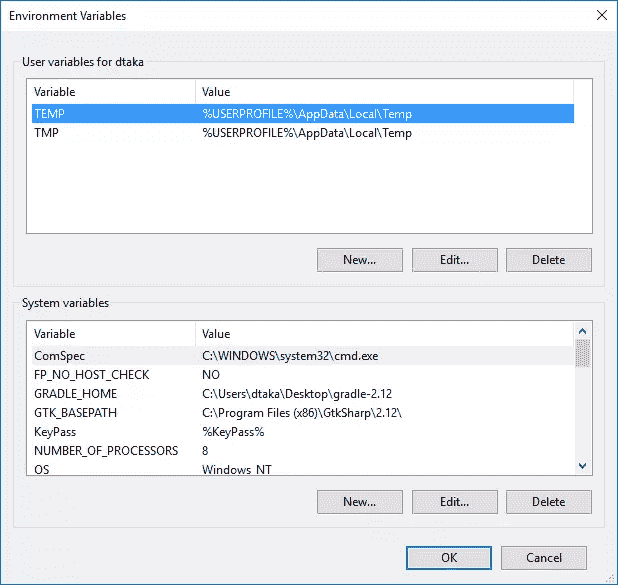
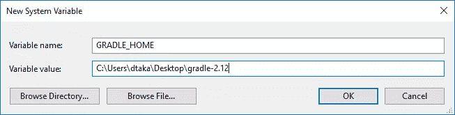
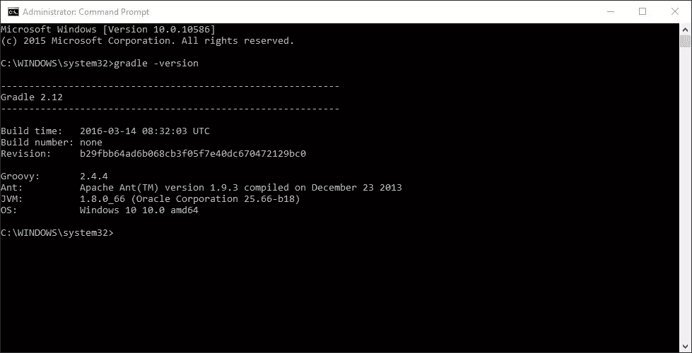
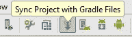

# 快速提示——Gradle 及其如何与 Android Studio 配合使用

> 原文：<https://www.sitepoint.com/quick-tip-what-is-gradle-and-how-does-it-work-with-android-studio/>

# 快速提示–什么是 Gradle，你如何使用它？

*本文于 2016 年 4 月更新，包含了 Android 包装器的详细信息*

Gradle 发布于 2007 年，是一个流行的开源自动化构建系统，它使大型项目的工作变得更加容易。它基于其前辈 [Apache Maven](https://maven.apache.org/) 和 [Apache Ant](http://ant.apache.org/) 的概念，但使用基于 Groovy 的领域特定语言(DSL)和 Java，而不是 XML。

它通过跳过不必要的重新执行较大项目树中的最新项目来加速构建过程。它还使得通过使用一行代码向一个项目添加不同的库变得更加容易。

Gradle 是 Android Studio 的官方构建系统，作为 Android Studio 用户，大多数配置是自动进行的。但我觉得对它如何工作的基本理解对每个 Android 开发者都是有用的。

在这篇文章中，我将给出一个 Gradle 的快速概述，如何使用它和常见问题。

## 独立安装

手动安装是不需要能够建立新的 Android 应用程序，我包括这一节更深入的研究。它与 Android Studio 捆绑在一起，所以如果你想的话，可以跳到 Gradle 基础。

前往[下载页面](http://gradle.org/gradle-download/)获取最新版本的。下载*仅二进制发行版*，在选择的目录中提取文件并添加到您的路径中。

```
GRADLE_HOME=DOWNLOAD_PATH/gradle;
export GRADLE_HOME
export PATH=$PATH:$GRADLE_HOME/bin 
```

### 苹果个人计算机

Gradle 也可以通过[家酿](http://brew.sh/)获得。

### Windows 操作系统

Windows 用户将需要通过在*我的电脑*上*右击*并选择*属性*来编辑环境变量。选择左侧面板上的*高级系统设置*。这将打开*系统属性*窗口。在右下方，点击*环境变量*，将会打开以下窗口。



在*系统变量*下点击*新建*，输入 *GRADLE_HOME* 作为名称，以及解压后的 gradle zip 的路径，点击 *OK* 。



返回*系统变量*，在列表中找到*路径*，点击*编辑*。


如果窗口不同，**注意不要删除已经存在的内容**，而是转到行尾添加一个*半列*(；).在这两种情况下，添加 *GRADLE_HOME%\bin* 并保存更改。

为了检查一切是否正确，打开*命令提示符*(或*终端*)并写入 *gradle -version* 。它在控制台上打印版本号，其他详细信息如下。



## Gradle 基础

打开文本编辑器，创建包含以下代码的新文件:

```
task myFirstTask << {
    System.out.println "First task running..."
} 
```

保存为*gradeletest/build . gradle*(记得选择 *All types* 作为文件类型)。打开一个终端，导航到这个文件夹，键入`gradle -q tasks`显示可运行的任务列表。底部会有一个`Other tasks`部分，下面有一个元素`myFirstTask`。

运行`gradle -q myFirstTask`将执行任务，打印任务体内的行。`-q`在静默模式下执行命令，打印所需的信息，而不是过程。

你想让 Gradle 运行的所有任务都写在 *Groovy* 中，并保存在一个名为 *build.gradle* 的文件中。

您可以添加更多任务，设置相互之间的依赖关系，并设置默认任务。

例如:

```
task anotherTask (dependsOn: myFirstTask) << {
    System.out.println "Another task running..."
} 
```

要使此任务成为默认任务，请在构建文件的开头添加以下行。

```
defaultTasks 'anotherTask' 
```

再次显示任务列表，您会注意到`myFirstTask`不见了。键入`gradle -q`执行默认任务，屏幕上将显示:

```
First task running...
Another task running... 
```

当您有一个大型项目时，不同的项目相互依赖，最好的方法是为每个具有特定任务的项目创建不同的构建文件，为整个项目创建一个构建文件。文件的名称保持不变，但它们位于不同的位置。Gradle 需要一个配置文件来指定要包含的项目。这是 *settings.gradle* 文件，包含以下内容。

```
include ":projectA", ":projectB", ":projectC" 
```

这是可能使用的一小部分选择，我建议阅读[用户指南](https://docs.gradle.org/current/userguide/userguide.html)和 [DSL 参考](https://docs.gradle.org/current/dsl/)以了解更多细节。

## 安卓工作室

Gradle 有几个可用的插件，包括 Android 插件，我将在下面介绍。

打开 Android Studio 并创建一个新项目。默认情况下，它将包含 Gradle 包装。包装器为您安装正确的工具，以及这些工具的正确版本，从而减轻不必要的负担。每个包装器都绑定到 Gradle 的一个特定版本。要了解更多信息，您可以阅读[包装文档](https://docs.gradle.org/current/userguide/gradle_wrapper.html)。

在左边的*项目标签*中，你会注意到两个主要部分， *app* 和 *Gradle Scripts* 。第二部分包含前面提到的文件。您会注意到一个 Android Studio 项目包含一个*build . gradle(Project:AppName)*和一个 *build.gradle(Module:app)* 文件。第一个包含应用程序中所有项目和模块的配置。第二个包含它所包含的模块的特定配置。

在您对这些文件进行任何更改后，您将需要从出现的栏或工具栏上的图标*同步* Gradle。

*同步 Gradle* 将通过比较当前文件与 Gradle 和 Android Studio 维护的项目状态来评估构建文件。如果它发现任何变化，它将只执行那些特定的任务。




*感谢阅读。享受编码和构建！*

## 分享这篇文章