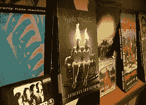
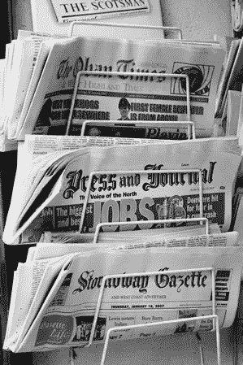
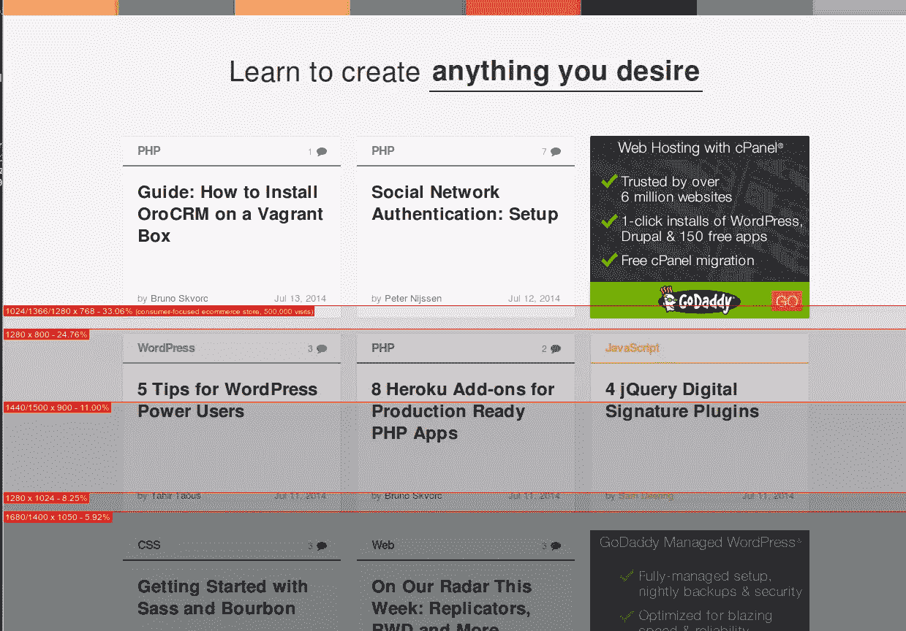
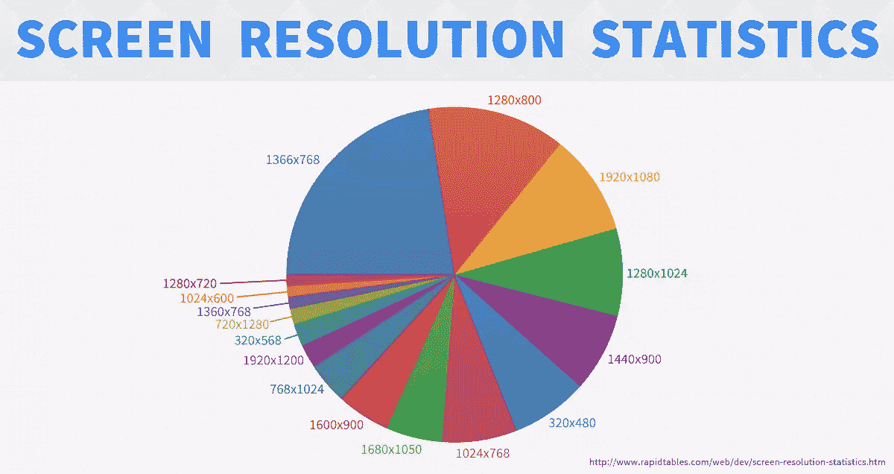
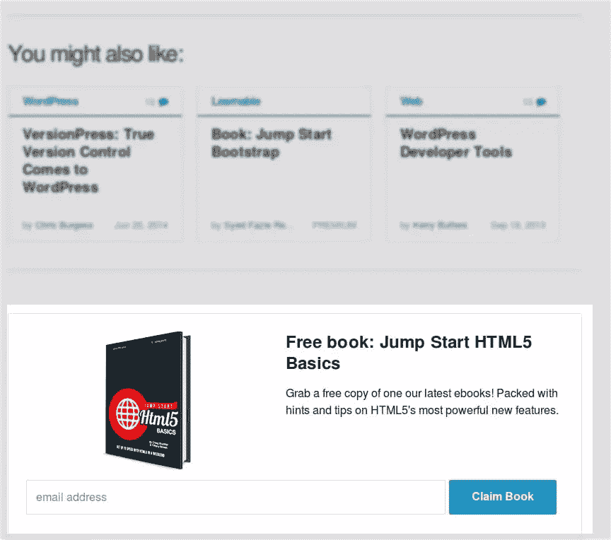

# “the Fold”的悄然消亡

> 原文：<https://www.sitepoint.com/quiet-death-the-fold/>

照片:Xanatos Satanicos Bombasticos 牧师

早在 80 年代末/90 年代初，唱片业就遇到了一个问题。CD 市场欣欣向荣，但是唱片商店(还记得他们吗？)仍然主要被配置成在唱片形状的“桶”中展示和销售黑胶唱片。商店老板不愿意投资改造他们的商店，以获得更短、更深的 CD 格式。

唱片业的回应是发明了“长盒子”(longbox)，这是一个又高又轻的纸板盒子，里面装有经典的 CD 首饰盒和大量的空气，同时重新调整了它的形状，正好是乙烯桶宽度的一半(T3)。两个长盒子很好地并排放进一个桶里。

尽管这显然是对纸板、货架空间和货运量的巨大浪费，但 longbox 在大约 5 年的时间里成为了行业标准。这种情况一直持续，直到有人注意到，简单地支付“一次性”商店改造费用实际上比年复一年地继续生产这些长盒子更便宜。

换句话说，唱片行业竭尽全力让黑胶桶继续存在，即使它们已经不再真正有用——就像其他事情一样，是出于习惯。

### 那么，这和“折叠”有什么关系？

你在网页设计中学到的第一件事是，你需要把重要的部分放在你的网页上，比如标志、菜单、行动号召等等。在最显眼的地方。传统上，顶部最显眼的地方是一片以崇敬的语气谈论的神奇土地——在褶皱之上的*之地。*

在 90 年代末，早期的在线营销人员和他们的客户有时会为网络营销中的许多新技术想法而挣扎——印象、点击、独特——但*“折叠”*是一个容易理解和解释的概念。

“我不在乎你把它放在哪里——只要它在折叠线以上,”这是一个常见的重复。

然而，在 2014 年的生态系统中，屏幕可能会在 300 像素的手机和 4k 显示器之间变化，这整个“折叠”的概念现在是多余的吗？

## 什么是折叠？

首先，让我们澄清什么是折叠。我想你们大多数人都知道，但为了避免任何混淆，这个术语需要定义。

折叠这个词实际上来自于报纸行业。由于报纸通常是对折出售，而不是以全尺寸展示，所以第一页的上半部分——即折页上方的那一半*通常会被潜在买家首先看到。*

没多久就发现，如果第一页的上半部分包含有趣的标题或照片，销售额就会增加。正因为如此，编辑们会选择把一期杂志中最有趣和最重要的内容放在首页，在折页上方。

同样，在网页设计中，人们认为页面最上面的部分吸引了最多的眼球。虽然网站不能像纸一样“折叠”,但折叠的概念是活的，但更准确地描述为卷轴上的“T1”或“T3”上的“T2”。

多年来，折页是网页设计中的一个教条——客户和广告商让我们在折页上方填满他们认为重要的东西。然而，幸运的是技术在发展，现在这种压力正在减少，因为褶皱已经变成了一个移动的前沿，即使你想，你也不能总是跟着它走。

## 折叠在哪里？

不同分辨率下的褶皱位置差异很大。以下是 About.com 给出的一些最流行的分辨率的近似值:

*   640 x 480 折叠大约减少了 310 个像素

*   800 x 600 折叠大约减少了 430 个像素

*   1024 x 768 折叠大约减少了 600 个像素

*   1200 x 1024 折叠大约减少了 850 个像素

*   1600 x 1200 折叠大约减少了 1030 个像素

你会注意到一些流行的分辨率不见了，但即使没有它们，很明显最小屏幕的尺寸(仅在此列表中，而不是在现实生活中)比最大屏幕的尺寸小 3 倍以上(再次强调，仅在此列表中，而不是在现实生活中)。如果你受到客户的压力，要求你把特定的物品严格放在折叠之上，给他们看这个清单，并解释这已经不可能了。

如果你想知道你的网站在不同分辨率下的折叠位置，[这个工具](http://whereisthefold.com/)很有用。

再说一遍，这些只是近似值，你不能盲目跟随。更重要的是，这些数据只有在你的网站被全屏浏览时才适用，你又如何确定你的用户会全屏浏览呢？

## 文件夹不见了！下一步是什么？

当折叠(几乎)消失时，你唯一能做的就是设计无折叠页面。这可能看起来很难，但事实上这和我们大多数人过去几年一直在做的事情没有太大区别。

你可能在不知不觉中设计了无文件夹页面。虽然根据你设计的内容——公司页面、杂志网站、博客、电子商务网站——不同，推荐的内容也不同，但这里有一些如何设计无文件夹页面的建议。

### 如果你(或你的客户)离不开折叠，那就设计最流行的分辨率

该折叠是垂死的，但尝试沟通这一点，以一些顽固的客户，我们任何人都有！有时，很容易说服客户，这种折叠是古老的历史，但在其他情况下，他们甚至不会听到这一点。

如果你有这样的客户，你可以做的一个妥协就是以这样一种方式设计你的网站，对于大多数流行的解决方案(目前是这样)，重要的内容在折叠之上。如此多的屏幕分辨率，如下图所示，这不是一个简单的任务，但是如果你相信客户总是对的，那就没什么可做的了。

我自己不会太热衷于遵循这个建议。更确切地说，如果客户太顽固，不理解关于折叠的最新发展，我们将分道扬镳，但我完全知道在实践中这不可能总是发生。

### 将徽标和导航留在顶部

折叠正在慢慢成为历史，但这并不是你颠倒布局的理由。折叠或不折叠，重要的事情第一！

这就是为什么你应该把图标和导航放在顶部。毕竟，这是用户在任何设备和屏幕分辨率上从你的页面看到的第一件事。

的确，对于较小的设备来说，上面的折叠区域可能只容纳徽标、菜单，也可能只容纳一两行标题，但是这些在任何情况下都必须是绝对可见的。

### 放置参考

与徽标和导航类似，对较长部分的引用也应该放在网站的顶部。这些参考可以只是标题和一两句话，然后是阅读更多和文章本身的超链接。

### 将广告放在底部/相关内容附近

如果你不能在最初的 600-1000 个像素中放满广告并从中获利，这可能会让你心碎，但实际上，将广告放在页面底部或其他地方可能会好得多(侧边栏、相关内容附近的页面正文)。

我知道你们大多数人会记得 Jacob Nielsen 的数据，只有 20%的用户滚动页面，我的建议听起来可能会扼杀你的收入，但实际上许多网站管理员报告说，当广告在底部或任何靠近相关内容的地方时，转化率会更高。

解释很简单。当你的广告在底部或相关内容附近时，它们会转化得更好。这是怎么回事？

例如，看看我们自己的广告在哪里。免费下载框就在文末。在那里，它不会被所有随机访问网站的人看到，但会被那些设法读完文章的人注意到。

在底部或接近相关的东西，你的广告可能会被更少的人看到，但那些看到它的人是真正感兴趣的人，他们往往比一般观众更容易转化。你可能会失去一些来自以上折叠广告的随机转换，但如果你是认真的，你永远不会把你的收入押在随机转换上。

### 测试什么转换最好

和往常一样，在测试你的布局之前，你永远不能确定你是对的。您可以进行 [A/B 分割测试](https://www.sitepoint.com/winning-ab-test-results-misleading/)来比较两种不同布局的表现。

## 结论

虽然折叠还没有完全消亡，也很难被完全遗忘，但由于有这么多不同尺寸的屏幕，它的重要性慢慢地但肯定会消失。

没有折叠，你有更多的自由来放置重要的物品，但另一方面，这种自由也带来了更大的责任。从某种意义上说，当你不得不把所有重要的东西都塞进前 600 个像素时，这要容易得多，而现在你需要更多地思考和测试，以找到这些重要东西的最佳位置。

我，我自己，太高兴了，折叠的死亡可能会减少只有一个 logo，一个菜单和一个 huuuuuge 图片(或者广告，广告，广告)的网站的数量。虽然图像确实会吸引注意力，但对我来说，这种方法是对空间的极大浪费，现在，当折叠变得越来越模糊时，我只希望这些超大的图像也将成为历史！

不要为折叠而悲伤。它的悄然逝去可能是很长一段时间以来设计和可用性领域发生的最好的事情了！

## 分享这篇文章