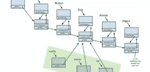

# 本周我们关注的话题:降临节日历和网络成瘾

> 原文：<https://www.sitepoint.com/radar-advent-calendar-internet-addiction/>

## 潮流移动设计

本周，移动设计一直在我们的脑海中，从屏幕尺寸的辩论开始——[iPhone 6 Plus 如何影响我们阅读的地方&观看的地方](http://getpocket.com/blog/2014/11/the-screen-size-debate-how-the-iphone-6-plus-impacts-where-we-read-watch/)，并且有一些关于[中国移动应用 UI 趋势的好报道](http://dangrover.com/blog/2014/12/01/chinese-mobile-app-ui-trends.html)。如果你在使用安卓系统，我们会遇到[的材料设计理念和灵感](http://www.materialup.com/)，一本名为[不要让我思考的必读设计师书籍被重温](https://www.sitepoint.com/dont-make-think-revisited/)——它今天仍然适用。

## 沉迷于网络浏览器

我们还查看了 Chrome 39 中的新功能，包括生成器、动画控制，甚至给 Windows 7 用户带来了 Windows 8 的“沉浸式模式”体验。然而，这并不是唯一值得一试的浏览器，因为 [Yandex 提供了对未来网络浏览器的早期展望](http://www.geek.com/news/yandex-offers-early-look-at-the-web-browser-of-the-future-1610685/)。无论你选择使用哪种浏览器，[作为一名独家网络开发者的生活](https://www.sitepoint.com/life-sole-web-developer/)肯定会很棘手。如果你总是在工作之外上网，你可能会担心你会上瘾，但是网瘾是真的吗？

## 保持 CSS 字体简单

选择一种好的字体可能会很棘手，而组合字体就更难了，所以我们为你总结了完美字体搭配的三个原则。

开发人员必须处理的另一个挑战是 CSS 的冗长。[你可以用 currentColor](http://osvaldas.info/keeping-css-short-with-currentcolor) 保持 CSS 简洁，如果你想要渐变，我们本周有关于[在 Sass](https://www.sitepoint.com/building-linear-gradient-mixin-sass/) 中构建线性渐变混合的很好的报道，对于这个[营销和品牌中的颜色心理学](https://www.helpscout.net/blog/psychology-of-color/)可能也有用。

## 降临节日历和变形 SVG

每年圣诞节前夕， [24 种方式](http://24ways.org/)是我们 web 开发人员的降临日历，给我们提供了新的有趣的方式来处理事情。在其他地方，我们遇到了这个 JavaScript 库，使用 Material Design 的细节过渡，使 [SVG 图标从一个变形到另一个](https://github.com/alexk111/SVG-Morpheus)，为此，这个在线 SVG 编辑器可能对创建一些 SVG 图像也很有用。

深入探究 JavaScript，我们[揭开 JavaScript 变量作用域和提升](https://www.sitepoint.com/demystifying-javascript-variable-scope-hoisting/)的神秘面纱，一些来自 Ruby 开发者的关于原型的有用[见解已经到来。](http://karimbutt.github.io/blog/2014/11/15/the-notion-of-flow/)

另外，在表单上，我们发现[交互式浮动标签](http://azumbrunnen.me/blog/interactive-float-labels/)让人们更容易填写表单，我们可以使用[美人鱼以类似 markdown 的方式从文本](https://github.com/knsv/mermaid)生成图表和流程图。

## 在我们走之前

最后，本周我们了解了[江南 Style 如何打破 YouTube](https://plus.google.com/+youtube/posts/BUXfdWqu86Q) ，我们对 Disqus 说[再见，欢迎讨论](https://www.sitepoint.com/farewell-disqus-hello-discourse/)，对这些文章的评论也与论坛社区分享，帮助我们更好地参与正在进行的对话。

那么哪些链接引起了你的注意呢？在圣诞节来临之前，你会遵循 24 种降临节日历吗？你打算探索新的 Yandex 网络浏览器，还是尝试浮动标签？不管怎样，我们都想听听你的想法。

此外，如果您在实现这里涉及的任何内容时有任何问题，或者只是想就此进行更多的讨论，SitePoint 的论坛现在可以加入对话，提供良好的帮助和协助。

## 分享这篇文章