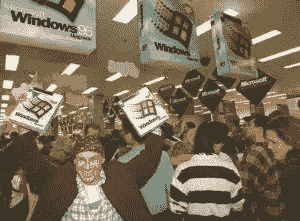

# 在我们的雷达上:highlight.js、linux 和恶作剧

> 原文：<https://www.sitepoint.com/radar-highlight-js-linux-pranks/>

欢迎来到我们的雷达上的另一轮！本周，我们发现了消除 JavaScript bug 的最好方法:我们安慰它。

## 在我们的雷达上:

本周一开始，RyanReese 试图[将 highlight.js 实现到一个现有的站点](https://community.sitepoint.com/t/implementing-highlight-js-into-an-existing-site/116981)中，并且在 html 实体方面遇到了一些问题。这是一个很好的主题，成员们聚集在一起，分享他们对 JavaScript、HTML 和 CSS 的知识，并对 highlight.js 的使用提出质疑。

然后我们继续讨论一个存在性的问题:[“是什么让你不去切换到 Linux？”cpradio 热爱 Linux 的技术方面，并想知道为什么科技界有更多的人没有转换。我们谈到对新技术事物的犹豫，以及让不太懂技术的用户参与进来的困难。](https://community.sitepoint.com/t/what-is-keeping-you-from-switching-to-linux/116829)

本周早些时候是愚人节，我们看了所有的东西，从谷歌非常棒的 Pacman/谷歌地图收购案，到自拍装备。阅读你最喜欢的(和一些不知名的)网站上所有最棒的愚人节恶作剧。

## 简而言之:

csosa 谈[联系表单函数](https://community.sitepoint.com/t/contact-form-function/118130)都觉得 PHP，bodrovis 想了解 rails 中的[活动 feeds，而 RavenVelvet 想知道有没有人](https://community.sitepoint.com/t/activity-feeds-with-rails/113677)[已经预建了一个 PHP7 的流浪者盒子](https://community.sitepoint.com/t/anyone-know-of-a-pre-built-php7-vagrant-box/117064)。

波罗谈到了 JavaScript 框架爆炸，总结了 JavaScript 中的 T2 周，而 cpradio 总结了 T4 周。网。

## 告诉我们你的故事:

看看这个长得像威尔·费雷尔的人有多开心！看看他。如果比尔·盖茨每次都告诉他赢得《扫雷》的秘诀，他会非常高兴。

我最快乐的科技时刻是在我的老式 IBM 机器上安装双层 DVD 刻录机的时候。最困难的部分是让一切正常排列，让它工作是我最自豪的技术时刻。所以现在我们想知道:[你最好的技术时刻是什么时候？](https://community.sitepoint.com/t/what-was-your-happiest-tech-based-moment/118180)

## 分享这篇文章