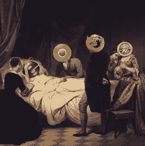

# 在我们的雷达上:问答、实验和浏览器的终结

> 原文：<https://www.sitepoint.com/radar-qa-experiments-end-browsers/>

本周标志着我们论坛激动人心的时刻。我们最严重的发现是打印机由三个主要部分组成:主塑料盒、卡住的纸盘和愤怒的红灯。

## 在我们的雷达上:

我们非常幸运地主持了两个关于 Azure 移动系统的现场问答会议[&，](https://community.sitepoint.com/t/microsoft-q-a-with-sitepoint-azure-mobile-services/115931/)，重点是通知。微软布道者 Andrew Coates[公开了他在 AMS、移动开发和云计算方面的工作。请关注下一次微软 Q & A 会议，这是一次长达一小时的大型会议，有两个令人敬畏的主题，请让我们知道您希望我们在未来与什么样的专家交谈。](https://community.sitepoint.com/t/sitepoint-and-microsoft-live-q-a-session-2-azure-mobile-services-notifications/116431)

这是所有浏览器的终结还是仅仅是 Internet Explorer 的终结？ Ralph 受到一篇媒体文章的启发，我们谈论苹果、手表、Safari 和 IE。如果我们没有浏览器，我们将如何浏览我们的万维网？有趣的想法，并在我们的论坛上发表你的意见。

莫伯恩想知道你的结对编程经验。你是赞成还是反对？和另一个人分享同一个屏幕和桌子有多舒服？它最终会给你更干净的代码吗，还是浪费时间(可能还有个人空间)？)

## 总之

如果你正在找工作，看看这个[非常酷的简历实验](https://community.sitepoint.com/t/cool-resume-experiment/115326)。

帮我们解决这个古老的问题你写的是[还是](https://community.sitepoint.com/t/php-blabla-or-blabla/115717)

看看我们的两个有爱的策展吧，这周的 Javascript 和这周的 T2。网。

## 问微软什么都行！

我们的最后一次问答将在 AEST 时间 4 月 7 日上午 10-11 点举行([查看您的当地时间](http://www.timeanddate.com/worldclock/fixedtime.html?msg=Microsoft+QA+Session&iso=20150407T10&p1=152&ah=1))。这是一个长达一小时的大型现场会议。涵盖跨平台开发，微软技术布道者 Esther Mosad 和 Paul Usher 将谈论 Visual Studio、Phone Gap、Xamarin 和 DevExtreme 的所有内容。[加入我们，或者永远生活在低劣的知识中。](https://community.sitepoint.com/t/microsoft-q-a-session-visual-studio-phone-gap-xamarin-and-devextreme/116763)

## 分享这篇文章