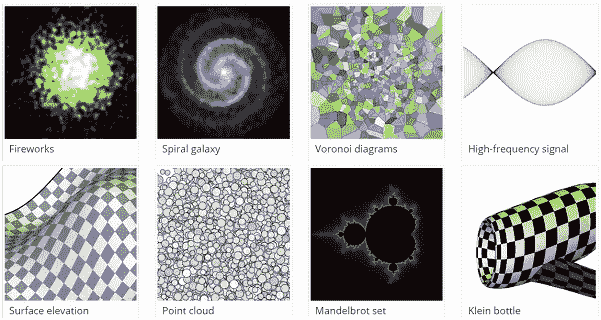

# 本周在我们的雷达上:像 1.0、2.0、3.0 一样简单

> 原文：<https://www.sitepoint.com/radar-week-as-easy-1-2-3/>

欢迎来到《在我们的雷达上》,这是一个来自 web 开发世界的新闻、趋势和其他酷东西的每周综述。

## Gmail 收件箱和设计原则

自几周前宣布以来，Gmail 收件箱的发展突飞猛进。这款应用旨在改善我们处理电子邮件的方式，它的确引起了轰动。这里有关于 Gmail 的[收件箱如何接纳新用户](http://www.useronboard.com/how-inbox-onboards-new-users/)的细节，这里有对其设计的[细节的更深入的观察。](http://blog.brianlovin.com/design-details-inbox-by-google/)

有趣的是，看看交互设计的三大法则应用到了什么程度，为大屏幕智能手机设计的[受到了多少关注。你认为未来的手机将能够检测你如何拿着手机，并调整其界面以适应？](http://www.lukew.com/ff/entry.asp?1927)

## 逃离第七层地狱

Eric 深入研究了 JavaScript 的两大支柱，从[逃离第七层地狱的指南](https://medium.com/javascript-scene/the-two-pillars-of-javascript-ee6f3281e7f3)开始——看看为什么经典继承有一个更好的基于 JavaScript 的解决方案。我们还探索了[如何让你的博客在 560 毫秒内加载](https://www.sitepoint.com/how-make-blog-load-560ms/)，这比看起来更具挑战性。

本周还提出了为 ES6 做准备的愿望，看看今天如何用 6to5 、[编写 ES6 模块，通过 Array 学习不同寻常的技巧。some()](http://webreflection.blogspot.com/2014/10/unusual-tricks-via-array-some.html) ，并探索用[处理不可变对象与 Object.freeze](http://designpepper.com/blog/drips/immutable-objects-with-object-freeze.html) 。对 WebCrypto API 的介绍也于本周发布。

本周出现的其他有趣的 JavaScript 文章有:

*   [与 Node.js/Express 一起从零开始开发 BDD/TDD](http://www.robotlovesyou.com/bdd-tdd/)
*   [骑士](https://github.com/johntitus/node-horseman)–从节点运行幻象
*   [对来自本地系统的代码使用 burp 的 JS 静态代码分析](https://github.com/tomsteele/burpstaticscan)
*   [了解委托 JavaScript 事件](http://codepen.io/32bitkid/blog/understanding-delegated-javascript-events)

## 像 1.0、2.0、3.0 一样简单

框架来了又去，找到一个最适合你的框架可能很有挑战性。本文:[寻找完美的 JavaScript 框架](https://dev.opera.com/articles/perfect-javascript-framework/)查看不同的框架，试图找出哪些可行，哪些不可行。我们还对[定制和现成的框架](https://www.sitepoint.com/front-end-frameworks-custom-vs-ready-use-solutions/)进行了很好的比较，深入研究了每种类型系统的优缺点。

似乎很多系统也该更新到新的 x.0 版本了。

1.  Adobe】发布了括号的 1.0 版本，这是他们的开源编辑器，我们在今年早些时候评论过的[。](https://www.sitepoint.com/review-brackets-editor/)
2.  AngularJS 已经公布 Angular 2 Core，其中[一款期待 Angular 2.0](https://docs.google.com/presentation/d/1XQP0_NTzCUcFweauLlkZpbbhNVYbYy156oD--KLmXsk/preview?sle=true&slide=id.p) 。然而，2.0 的更新带来了麻烦，Angular 正在做许多不向后兼容的改变，引发了关于[为什么像 AngularJS 这样的 web 工具需要不断自我突破](http://readwrite.com/2014/10/30/angularjs-javascript-framework-web-tools-need-to-break-themselves)和[Angular js 是否能保持其统治地位](http://developer.telerik.com/featured/can-angularjs-maintain-dominance/)的讨论。不管这些即将到来的问题，你可以帮助提高你 2.0 之前的技能，并通过构建一个 Gmail 克隆来了解更多关于 AngularJS 的知识。
3.  最近也有关于 jQuery 3.0 的消息，详细介绍了版本号系统的变化，以及浏览器支持策略的变化。

本周我们遇到的其他有趣的文章有:

*   [用 CSS 设计跨浏览器兼容范围输入](http://css-tricks.com/styling-cross-browser-compatible-range-inputs-css/)
*   [特异性图](http://csswizardry.com/2014/10/the-specificity-graph/)
*   [为什么响应式图像很重要](http://alistapart.com/blog/post/why-responsive-images-matter)
*   [Walkway](https://github.com/ConnorAtherton/walkway)——一种制作简单 SVG 元素动画的简单方法
*   [134 字节，用于优化和非常基本的 jQuery like 函数](http://webreflection.blogspot.com/2014/05/134-bytes-for-optimized-and-very-basic.html)

## 轮到你了

本周，我将带您领略美丽的科学视觉化的[忧郁的](http://glumpy.github.io/gallery.html)，基于浏览器的[镜像岛](http://www.rockpapershotgun.com/2014/10/31/mirror-isles-free-puzzler/)的令人费解的反思，以及[每分钟 240 字写作的百年老把戏](https://www.sitepoint.com/trick-to-writing-coding-faster/)。

哪些链接引起了你的注意？你最近在使用 AngularJS 或者其他框架吗，你会开始使用括号代码编辑器，或者尝试停止使用 new 关键字吗？我们很想听听你的想法。

此外，如果你在实现这里涉及的任何东西时有任何问题，或者只是想进一步讨论它， [SitePoint 的论坛](https://www.sitepoint.com/community/)是一个很好的访问地点(你可以用你的谷歌、脸书、推特、GitHub 或雅虎账户登录)。

## 分享这篇文章