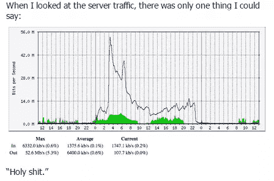
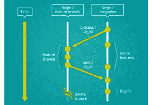

# 本周我们关注的是:带着机关枪的蜜蜂

> 原文：<https://www.sitepoint.com/radar-week-bees-machineguns/>

欢迎来到《在我们的雷达上》,这是我们每周一次的关于新闻、趋势和其他来自 web 开发世界的酷东西的综述。

## 出色的用户体验

本周，人们对 iOS 界面进行了有趣的审视，并探讨了我们如何从在应用和网站上使用 motion 的用户体验中获益。苹果刚刚公布了[有史以来最大的季度收益](http://www.bbc.com/news/business-31012410)，所以他们一定做对了什么。

在类似的全球范围内，Riot Games 一直在对《英雄联盟》的用户进行试验。看看世界上最大的虚拟心理学实验室以及他们如何利用心理学来帮助他们的玩家表现自己。

## 经受住“断网”事件

说到全球，当《PAPER》杂志发表金·卡戴珊(Kim Kardashian)的后端时，他们知道他们的服务器将受到打击。这里有一个安全工作的视角，看看【PAPER Magazine 的 web 工程师如何为 Kim Kardashian 扩展他们的后端，在那里他们很好地利用了带有机枪的[蜜蜂](https://github.com/newsapps/beeswithmachineguns)，这是一个武装(创建)许多蜜蜂(micro EC2 实例)来攻击(负载测试)目标(web 应用程序)的实用程序。

其他网站所有者也开始害怕中国，因为他们的防火长城有时会错误地将数百万用户引向他们的网站，所以这里有一些关于如何保护你的网站免受过多流量影响的好细节。

微软也准备很快取代 ie 浏览器。看看微软为斯巴达项目开发的新渲染引擎[。正在开发的还有](http://www.smashingmagazine.com/2015/01/26/inside-microsofts-new-rendering-engine-project-spartan/)[Vivaldi——Opera](https://vivaldi.com/)的开发者开发的一款新的网络浏览器，号称高度灵活，把用户放在第一位。

## 培养对未来的眼光

本周我们有 [Git workflows for pros](http://www.toptal.com/git/git-workflows-for-pros-a-good-git-guide) 来帮助你的工作流程:这是一个很好的 Git 指南，它给出了分支如何工作的详细细节，以及应该注意的事项。

一些开发人员最近也对框架进行了仔细的思考。约翰有一个[固执己见的 React.js 指南，最佳实践和惯例](http://web-design-weekly.com/2015/01/29/opinionated-guide-react-js-best-practices-conventions/)。詹姆斯[对 ReactJS](http://www.letscodejavascript.com/v3/blog/2014/09/react_review) 进行了非常规的评论，结果相当正面，但他最近的帖子[对 AngularJS](http://www.letscodejavascript.com/v3/blog/2015/01/angular_review) 进行了非常规的评论，更有争议地建议避免它。他们的一个开发人员几个月前离开了，现在可以[引入 Aurelia](http://blog.durandal.io/2015/01/26/introducing-aurelia/) ，它使用 ES6/ES7 特性 transpiled 和 polyfilled 来与今天的 [evergreen 浏览器](http://eisenbergeffect.bluespire.com/evergreen-browsers/)一起工作，甚至在 IE9 上也工作得很好。

## 固执己见的 CSS 乐趣

另一篇有观点的文章是关于 W3C 和 WHATWG 应该死吗？幸运的是，一些解决方案正在被发现，比如如何用一行 CSS 和【ED:删除无用链接】来[居中和裁剪图像。](https://medium.com/@chrisnager/center-and-crop-images-with-a-single-line-of-css-ad140d5b4a87)

享受 CSS 带来的更多乐趣我们看到了一个很好的 CSS 合成和混合指南，克里斯正在享受线条高度带来的[乐趣！](http://css-tricks.com/fun-line-height/)。

## 很酷的东西

最后，本周我们有[电梯传奇](http://play.elevatorsaga.com/)电梯编程游戏，一个关于新特斯拉汽车[的视频有一个名为“疯狂模式”](http://www.businessinsider.com.au/tesla-model-s-insane-mode-video-reactions-2015-1)的按钮——看看当你按下它时会发生什么！

* * *

哪些链接引起了你的注意？你想用带机枪的蜜蜂去砸东西吗？你是否也想从 AngularJS 跳槽，或者想参与固执己见的讨论？特斯拉是不是疯了？！无论哪一个引起了你的兴趣，我们都希望听到你的想法。

## 分享这篇文章