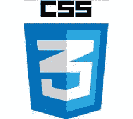

# 本周我们关注的是:Firefox、MV* Frameworks 和 Go

> 原文：<https://www.sitepoint.com/radar-week-firefox-mv-frameworks-go/>

欢迎来到《在我们的雷达上》,这是一个来自 web 开发世界的新闻、趋势和其他酷东西的每周综述。

本周火狐迎来了它的十岁生日。为了庆祝，Mozilla 推出了两个新项目:北极星隐私倡议和 T2 火狐开发者版，这是火狐的新版本，将浏览器的开发工具放在了最前面和最中心。[浏览器](http://usersnap.com/blog/review-new-firefox-browser-built-developers-firefox-developer-edition/)“为开发者打造”的最初评论是积极的，尽管任何期望它搭载全新功能[的人可能会失望](http://www.hongkiat.com/blog/firefox-developer-version/)。对于那些容易怀旧的人，你可能会想提醒自己火狐自 2004 年首次亮相以来已经达到的十个最重要的里程碑。

其他新闻方面，塞特亚·纳德拉对微软的快速改造仍在继续，他们宣布将开源整个。NET 服务器核心栈。与此同时，亚马逊[发布了价格不到 200 美元的语音驱动家庭助手](http://arstechnica.com/gadgets/2014/11/amazon-announces-echo-a-199-voice-driven-home-assistant/)和[Nvidia 的图形专家](http://venturebeat.com/2014/11/11/nvidia-releases-graphics-re-creation-software-that-proves-the-moon-landing-was-real/)证明了登月是真实的，他们发布了图形重建软件，导致他们得出这一结论。

## 星际穿越

今天首先是[使用 stellar.js 库](https://www.sitepoint.com/introduction-parallax-scrolling-using-stellar-js/)介绍视差滚动。对于外行来说:视差滚动是当你滚动时，页面的背景以不同的速度向前景移动。处理得当，它可以用来实现一些[真正疯狂的效果](http://www.sony.com/be-moved/)。

接下来我们有一篇关于[用 JavaScript](https://medium.com/@cpojer/breaking-the-web-with-javascript-48cc406ca98d) 打破网络的文章，它涉及 Firefox 试图为`Array.prototype.contains`实现 ECMAScript 7 的提议。

想要在不同的 JavaScript 对象类型之间共享通用功能，而又不使一种类型从属于另一种类型吗？听起来像是你友好的邻里交往模式的完美案例。

你的 JavaScript 不行吗？也许你应该考虑使用控制台对象的这[五个鲜为人知的函数来帮助你调试。](https://shellycloud.com/blog/2014/11/five-functions-of-the-console-object-you-didnt-know)

令人难以置信的是，jQuery 发布已经快八年了。本文着眼于 jQuery 3.0 的未来，以及这对你我这样的人意味着什么。

这里有一个关于正确完成的[特征检测的快速提示。](http://davidwalsh.name/feature-detection-function-efficiency-javascript)

这就是猫在 13 行 JavaScript 代码中的工作方式。

## 本周流行语:快速眼动

与[迈克尔·史帝普](http://en.wikipedia.org/wiki/Michael_Stipe)无关，雷姆是 CSS3 中引入的计量单位。Rem 代表“根 em”，与 em 单元(相对于其父元素的字体大小)不同，rem 是相对于根元素(几乎总是为< html >元素)的字体大小。

想了解更多信息吗？那么一定要阅读你可能不知道的的 [7 个 CSS 单元。](http://webdesign.tutsplus.com/articles/7-css-units-you-might-not-know-about--cms-22573)

`calc()`是一个 CSS 函数，可以在任何需要<长度>、<频率>、<角度>、<时间>、<数字>或<整数>的地方使用。这里有一个很好的指南，教你如何用 CSS 设计[布局，以及如何用`calc()`解决一些棘手的问题。](https://demosthenes.info/blog/953/Layout-Math-with-CSS-Understanding-calc)

想写写干巴巴，少重复的 CSS？也许[助手类](https://www.sitepoint.com/using-helper-classes-dry-scale-css/)是你应该关注的。

CSS 计数器在 CSS 中保持一个连续的记录(不需要 JavaScript)。作为额外的奖励，他们享受几乎普遍的浏览器支持。俏皮！非常俏皮！

将自己描述为“CSS 网格布局模块超级粉丝”的 SitePoint 作者 [Rachel Andrew](https://www.sitepoint.com/author/rachel-andrew/) 最近[在欧盟 CSSconf 会议上谈到了这个话题](https://www.youtube.com/watch?v=GRexIOtGhBU)。这个报告很值得一看。

## MV*框架:

本周，JavaScript Jabber 小组成员与 Craig McKeachie 讨论了 [MV*框架。讨论的中心是开发人员应该在众多框架中的哪一个上投入时间，以及这些框架的未来。](http://devchat.tv/js-jabber/132-jsj-mv-frameworks-with-craig-mckeachie)

鉴于最近围绕 Angular 2.0 的发布和随后 T2 试图安抚愤怒的开发者的狂热，这个话题变得更加有趣。

通往余烬 2.0 的道路没有引起太多的骚动，但仍然是有趣的线索，这篇关于余烬的演变的文章也是如此。

下面来看看开发人员在使用 Ember 和 Rails 时犯的最大错误，为什么 T2 Ember 是为设计师设计的，以及 T4 如何通过构建 GMail 克隆来学习 AngularJS。

额外链接:Craig McKeachie(见上文)最近在一篇名为 JavaScript MV*框架的文章中也写了关于 SitePoint 框架的文章。

## 去

为了与所有这些周年纪念(FireFox 十年，jQuery 八年)保持一致，本周也标志着 Go 项目(Google 开发的静态类型编程语言)启动五周年。他们的官方博客文章名为“[Go 的五年](http://blog.golang.org/5years)”，回顾了这种语言在过去五年中的发展。

为了庆祝围棋诞生 5 周年，未来一个月 [Gopher Academy](http://blog.gopheracademy.com/) 将出版一系列著名围棋用户的文章。*去*检查他们！(呻吟)

[第一次尝试 Go](http://scotch.io/bar-talk/trying-out-go-for-the-first-time)是一本有趣的读物，讲述了一名前端开发人员和他对 Go 编程语言的第一印象。

如果你精通编程语言，那么你可能也听说过 Rust。[锈去](https://medium.com/@adamhjk/rust-and-go-e18d511fbd95)(为什么那会让我想到洗发水？)是 Adam Jacob(Chef 的 CTO)的一篇博客文章，比较了这两种语言。

想涉猎围棋？这里有一些关于 Go 的介绍性资源，可以帮助你入门。

或者，如果你喜欢更实际的东西，这本[小 Go Book](http://openmymind.net/The-Little-Go-Book/) 是对各种格式的语言的免费介绍。

最后，我们期待已久的 Brad Fitzpatrick(围棋队成员之一)关于围棋现状和未来的演讲终于来了。

附注:如果你有任何围棋问题，请记住 SitePoint 论坛有一个 [Golang 类别](https://community.sitepoint.com/c/golang)。

* * *

这就是这周的全部内容。感谢加入我们。

我将告诉你一个令人震惊的消息，Twitter 即将对其服务进行一些重大改变，还有一份来自德国云公司 T2 的报告，如果你有空间放置它的一些服务器，这家公司将提供免费供暖。

那么哪些链接引起了你的注意呢？你想参与灰烬与棱角的辩论吗？你试过火狐的开发者版吗？你是怎么找到它的？不管怎样，我们都想听听你的想法。

此外，如果你在实现这里涉及的任何东西时有任何问题，或者只是想进一步讨论它， [SitePoint 的论坛](https://www.sitepoint.com/forums/)是一个很好的访问地点(你可以用你的 Google、FaceBook、Twitter、GitHub 或 Yahoo 帐户登录)。

## 分享这篇文章