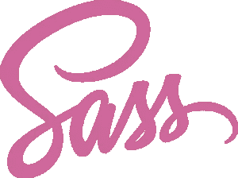

# 本周我们关注的是:Sass 和 JavaScript 的现状

> 原文：<https://www.sitepoint.com/radar-week-sass-state-javascript/>

欢迎来到《在我们的雷达上》,这是一个来自 web 开发世界的新闻、趋势和其他酷东西的每周综述。

在本周的新闻中，围绕微软新浏览器 Spartan 的讨论(我无法让自己写得激动人心)继续着，似乎是它出现在网上的第一张照片。

Elon Musk [在 Reddit](https://www.reddit.com/r/IAmA/comments/2rgsan/i_am_elon_musk_ceocto_of_a_rocket_company_ama/) 上主持了一个“问我任何事情”(AMA)的会议。这里是[他所说的盆栽版](http://venturebeat.com/2015/01/06/7-things-elon-musk-told-us-in-his-reddit-ama-plus-a-cat-video-to-mock-ai-fans/)(加上一个相当奇怪的爱猫视频)，这里是[从他的回答](http://www.entrepreneur.com/article/241540)中获得的三个商业要点。

随着该公司向美国更广泛的用户群开放重新设计的主页，我们得以一瞥 Amazon.com 很快会变成什么样子。

## 预测未来

这是我们工作的快节奏行业的本质，大胆的技术预测比比皆是。有时他们大错特错:

> 垃圾邮件将在两年内成为历史。比尔·盖茨，2004 年

有时他们非常正确:

> 很快就有可能以如此简单的方式向全世界传送无线信息，任何人都可以拥有并操作自己的设备
> ——尼古拉·特斯拉，1909 年

SitePoint 的 Craig Buckler 最近尝试预测水晶球，希望他的预测属于第二类，而不是第一类。

格伦·古德里奇也加入了进来，他瞥了一眼 2015 年 Ruby 的前景

展望 2015 年，英国广播公司的专家预测网络攻击、无处不在的无人机、怪异的智能手机和可穿戴技术的持续崛起(尽管希望不会在一天内全部实现)。

将一个华丽的网站与预测和一些聪明的猜测结合起来，[这是一家动画机构对 2015 年科技发展的看法](http://breadnbeyond.com/future/)。

以下是 2015 年你需要了解的三个基本导航趋势，以及未来一年社交媒体最重要的趋势。

最后，这是世界上最大的公司对 2015 年的计划。

## 本周流行语——Sass

Sass(语法上令人敬畏的样式表)是一个用 Ruby 编写的 CSS 预处理器，通过 Ruby gems(Ruby 包管理器)分发。Sass 之于 CSS 就像 CoffeeScript 之于 JavaScript 一样，用嵌套规则、变量、混合、选择器继承等特性来扩展样式表语言。

Sass 写作机器 Hugo Giraudel 最近发布了一套“非常固执己见”的 Sass 指南，其中他试图解决 Sass 语言的几乎所有方面。你可以[在这里找到指导方针](http://sass-guidelin.es/)，或者[在这里查看他的介绍性博客文章](http://hugogiraudel.com/2015/01/07/introducing-sass-guidelines/)。

Foundation 是一个响应式前端框架。该视频演示了如何在一个新的基础 web 项目中开始使用 Sass 和 Compass。

Sass 允许您编写嵌套的媒体查询，这本身就很棒，但是还可以进一步抽象。[这篇关于 CSS-tricks 的文章向你展示了如何](http://css-tricks.com/approaches-media-queries-sass/)。这些评论也是很好的读物。

将呈现 CSS 的 Sass 与不呈现 CSS 的 Sass 分开会产生微妙但意义深远的好处。

还不相信萨斯适合你吗？初次接触 Sass，不知道从哪里开始？那么你可能会喜欢阅读这本[理解 Sass](http://www.hongkiat.com/blog/easy-sass-guide/) 的简单而容易的指南，它很好地突出了 Sass 的特性集，并附有简单易懂的例子。

## JavaScript 的现状

今年 JavaScript 将迎来 20 岁生日，它已经走过了漫长的道路，从卑微的起点成为世界上最普遍的计算运行时。达伦·琼斯(Darren Jones)最近关注了一下 JavaScript 的发展历程，以及它在离开青少年时代后的发展方向。

[Generation JavaScript](http://manuel.bernhardt.io/2014/12/30/generation-javascript/) 是一篇评论文章，探讨了 JavaScript 世界的快速变化，以及这种变化对语言工作者的影响。

在 2014 年的最后几天，墨尔本的网络开发者 Glenn Maddern 重启了他长期被忽视的 GIF-beatmatching 项目 [DJGif](https://github.com/geelen/djgif) 在他的屋顶上举办新年派对。在这个过程中[他发现了一些关于 JavaScript 的新东西，这些东西真的让他大吃一惊](http://glenmaddern.com/articles/javascript-in-2015)。

这是[很久以来我见过的最酷的 JavaScript 效果之一](http://codepen.io/sol0mka/pen/XJjLxe)(一定要关闭模态)。

6to5 将 ES6+代码转换成可读的普通 ES5 代码，包括源代码图和更多内容。它很好地概述了 ES6 的特性以及它自己的 REPL。

Mozilla 资深 Web 开发人员 David Walsh 最近出现在 JavaScript Jabber 播客上，讨论 Mozilla 开发者网络。有趣的是，W3Schools 被提及用了大约 30 秒。

## 红宝石——闪亮的新事物

延续长久以来的传统， [Ruby 2.2 于圣诞节](https://www.ruby-lang.org/en/news/2014/12/25/ruby-2-2-0-released/)发布。最新版本的两个主要特性是增量垃圾收集和符号垃圾收集。

[Rails 4.2 也带来了圣诞礼物](http://weblog.rubyonrails.org/2014/12/19/Rails-4-2-final/)。值得注意的新增功能包括[活动作业](https://www.sitepoint.com/new-rails-shiny-activejob/)(用于将任务排队，与用户请求-响应周期分开运行)，以及由于 Aaron Patterson 的[充足记录](http://tenderlovemaking.com/2014/02/19/adequaterecord-pro-like-activerecord.html)项目，ActiveRecord 的速度大幅提升。

随着 Ruby 生态系统变得越来越复杂，在系统上安装 Ruby 和 Rails 已经被认为是一件痛苦的事情，尤其是对于新开发人员来说。Dhaivat Pandya 查看了 Kickstarter 活动的结果，旨在解决这种复杂性。

一个不断出现在各种“2014 年最佳 Ruby 视频”列表中的视频是[用单子重构 Ruby](https://www.youtube.com/watch?v=J1jYlPtkrqQ)。如果你不明白单子是什么，或者它们为什么好，这可能值得一看。

Refile 是一个新的 Ruby gem，旨在[简化 Rails](http://www.elabs.se/blog/68-refile-fixing-ruby-file-uploads) 中的文件上传。这也是[最新的
GoRails 截屏](https://gorails.com/episodes/file-uploads-with-refile)的主题，它通过大量易于理解的示例带你完成安装、配置和使用。

* * *

这就是这周的全部内容。感谢加入我们。

我将留给你我遇到的这一行精彩的 JavaScript 代码:`'#'+(~~(Math.random()*(1<<24))).toString(16)`(看看你是否能在不在你的浏览器中运行它的情况下找出它的作用)[2014 年最受欢迎的代码笔](http://codepen.io/2014/popular/)和新闻[他们已经找到了一种将便便变成饮用水的方法](http://www.gatesnotes.com/Development/Omniprocessor-From-Poop-to-Potable)(说真的)。

那么哪些链接引起了你的注意呢？你对 2015 年有什么预测吗？你对微软的新浏览器感到兴奋吗？你对 JavaScript 的现状有什么看法？请告诉我们，我们希望听到您的想法。

## 分享这篇文章