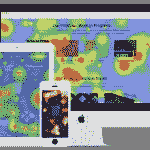

# 本周我们关注的是:卷轴魔法和切除脑叶的猫头鹰

> 原文：<https://www.sitepoint.com/radar-week-scroll-magic-lobotomized-owls/>

欢迎来到《在我们的雷达上》,这是我们每周一次的关于新闻、趋势和其他来自 web 开发世界的酷东西的综述。

## 来自谷歌的多重好处

随着万圣节的临近，一些人开始关注年底。詹姆斯·戴森基金会一直致力于自己的名单，戴森的 20 个年度最佳发明。与此同时，谷歌一直在根据他们的产品战略努力工作，其中[该公司只是做了两件事情](http://arstechnica.com/business/2014/10/googles-product-strategy-make-two-of-everything/1/)，并测试哪个更好:A/B 测试放大。他们甚至还有第二个电子邮件系统，现在叫做[收件箱](http://www.google.com/inbox/)。

谷歌也给了我们他们的[材质设计图标](https://github.com/google/material-design-icons)。一个很酷的[色彩设计器](http://coolors.co/intro/)也出现了，你可以按空格键浏览不同的色彩设计，并锁定你最喜欢的。另一方面， [Stylify Me](http://stylifyme.com/) 帮助你探索其他网站使用的颜色和主题。

## 切除脑叶的猫头鹰

本周，随着 CSS 的深入，我们已经探索了[公理化 CSS 和脑叶切除猫头鹰选择器](http://alistapart.com/article/axiomatic-css-and-lobotomized-owls)，`* + *`。Sass 也已经被覆盖，使用 Sass 和[自我意识 Sass mixin](http://lunelson.roughdraft.io/cc1b431a69360949dc01-the-self-aware-sass-mixin) 的[跨断点缩放值，我们现在有一个用于 Sass](https://www.sitepoint.com/scaling-values-across-breakpoints-using-sass/) 的[单元测试器，它将得到一些大量使用。当你完成了你的 CSS 工作，你现在也可以用 Pleeease](http://ericsuzanne.com/true/) 完成所有的[后处理，并把它加入到你的构建系统中。](https://www.sitepoint.com/css-post-processing-pleeease/)

## 可视化和网络性能

Mozilla 给了我们 Nunjucks，[一个强大的带有继承和异步控制的模板引擎](https://github.com/mozilla/nunjucks)，他们用它来取代之前存在的 Django 驱动的市场。如果你想改进你自己的网站，我们有一篇关于优化关键渲染路径的好文章，这里有[一个网页性能优化选项的精选列表](https://github.com/davidsonfellipe/awesome-wpo)帮助你深入这个主题。

这里有一个关于 D3.js 的很好的[教程，用于创建数据可视化](https://square.github.io/intro-to-d3/)。我们还探索了[七个用于特定可视化的 JavaScript 库](https://www.sitepoint.com/7-javascript-libraries-specific-visualizations/)，使得某些特定的想法更容易实现。谷歌为 Android 设计的材料激发了连锁反应的[实现，你现在可以在其他地方使用，并且](https://github.com/traex/RippleEffect) [Scroll Magic](https://github.com/janpaepke/ScrollMagic) 是一个很好的插件，提醒你使用滚动条来触发各种有趣的动画。

## 深入研究节点和单元测试

最近又收到了一些提示。首先，[如何更好地使用数组](http://www.frontendjournal.com/a-few-tips-on-how-to-work-better-with-arrays-in-js/)，如何使用[耦合实现高度可伸缩和可维护的 JavaScript](http://www.innoarchitech.com/scalable-maintainable-javascript-coupling/) 。我们还将帮助您准备 ECMAScript 6，详细介绍新的数字方法[。](https://www.sitepoint.com/es6-number-methods/)

Node.js 本周也受到了一些喜爱，它为 Android 进行了完整的 [Node.js 重写，在 Node.js](https://github.com/InstantWebP2P/node-android) 中实现了带有梯度下降的[线性回归库，在 node.js](https://github.com/lastlegion/linearReg.js) 中实现了基于[块的 web 服务器，允许您聚合来自多个来源的内容，](https://github.com/coimotion/coServ) [Synaptic](http://synaptic.juancazala.com/) 是用于 Node.js 和浏览器的无架构神经网络库。

一些好的单元测试文章包括系列[单元测试简洁地](http://code.tutsplus.com/series/unit-testing-succinctly--cms-675)，关于[为什么你应该单元测试的信息](http://code.tutsplus.com/articles/unit-testing-succinctly-why-unit-test--cms-22410)，以及[单元测试如何工作](http://code.tutsplus.com/articles/unit-testing-succinctly-how-does-unit-testing-work--cms-22416)。还有不同[单元测试工具](http://code.tutsplus.com/articles/unit-testing-succinctly-unit-test-tools--cms-22417)的指南，以及最近的[使用 NUnit](http://code.tutsplus.com/articles/unit-testing-succinctly-nunit--cms-22420) 和[高级单元测试细节](http://code.tutsplus.com/articles/unit-testing-succinctly-advanced-unit-testing--cms-22421)进行测试的指南。

## 最后但并不是最不重要的

本周最后， [PhotoMath 用你手机的摄像头](http://lifehacker.com/photomath-calculates-equations-using-your-phones-camera-1649353846)计算方程式。我上学的时候这在哪里？回顾未来，[悬浮滑板的原型在这里](http://recode.net/2014/10/20/its-not-quite-marty-mcfly-but-the-hoverboard-is-here-video/)。看着我们从这里走向何方将会令人惊叹。

哪些环节引起了你的注意？你最近切除过猫头鹰的脑叶吗？你在探索观想能带来什么样的魔力吗？或者你一直在探索 Node.js 或者单元测试能为你做什么？无论哪一个引起了你的兴趣，我们都希望听到你的想法。

此外，如果你在实现这里涉及的任何东西时有任何问题，或者只是想进一步讨论它， [SitePoint 的论坛](https://community.sitepoint.com/)是一个很好的访问地点(你可以用你的 Google、FaceBook、Twitter、GitHub 或 Yahoo 帐户登录)。

## 分享这篇文章