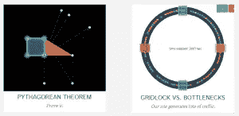

# 本周我们关注的是:苹果手表和直观的动画

> 原文：<https://www.sitepoint.com/radar-week-watch-apple-intuitive-animation/>

欢迎来到《在我们的雷达上》,这是一个来自 web 开发世界的新闻、趋势和其他酷东西的每周综述。

## 观察你的可用性

苹果发布了新 Apple Watch 的开发套件信息，包括该设备将如何工作的信息(至少在最初)，以及关于为 Apple Watch 准备好 iPhone 应用程序的细节。不用说，已经有很多关于这方面的讨论，其中包括这些[对 WatchKit](http://david-smith.org/blog/2014/11/18/initial-impressions-for-watchkit/) 的初步印象。

苹果和谷歌 Android 和 Windows Phone 等其他操作系统的移动设置 UX 也受到了关注，苹果毫发无损。然而，微软却不能这么说。[你的团队有 UX 作家吗？这是一个不太受重视的重要角色。](https://www.sitepoint.com/writers-in-ux/)

当你创建自己的用户界面时，Erik 有 7 条规则来创建华丽的用户界面，这些规则是在个人经验的烈火中来之不易的，当然，也是通过复制和学习最好的。如果你要创建自己的用户界面，桌面浏览器可能会被冷落。 [Interact.js](http://interactjs.io/) 通过为现代网络浏览器提供拖放、调整大小和多点触摸手势以及惯性和捕捉功能，填补了这一空白。

## 动画和移动到 Sass

我们正在改进浏览器处理 SVG 转换的方式。Chris 讲述了 CSS 转换的动画，浏览器的问题，以及如何通过 GreenSock 动画平台解决这些问题，这个平台被称为 T2 GSAP T3。说到在你自己的团队中管理 CSS，我们看看[将你的团队迁移到 Sass](https://www.sitepoint.com/migrating-team-sass/) 的过程，以及这个过程是否值得。

鉴于此，这里也有 [15 个必要的混合](http://www.developerdrive.com/2014/11/15-essential-sass-mixins/)来探索，和 [CSS 摘要](http://cssdig.com/)帮助你以新的方式分析你的网站的 CSS。

## 直观可视化

[直观解释](http://setosa.io/ev/)通过提供精彩的直观解释，让难以理解的想法变得直观。 [Setosa](http://setosa.io/) 的数据可视化全部建立在 [d3](http://d3js.org/) 图形库之上。如果你正在制作自己的作品，James 会看看 JavaScript 动画中的[乘数，以及如何轻松探索它们的效果。](http://jameschambers.co/writing/multipliers-in-javascript-animation/)

最近，一个不错的时尚指南资源网站引起了我们的注意。网飞也让我们很好地了解了[网飞如何诊断和修复复杂的延迟问题](http://techblog.netflix.com/2014/11/nodejs-in-flames.html)，在那里我们看到了 Node.js 的火焰。我们可能没有网飞已经准备好的资源，所以这里的康卡斯特让我们[模拟糟糕的网络连接，这样你就可以建立更好的系统](https://github.com/tylertreat/Comcast)。

脸书发布了 [Flow，这是一个 JavaScript](http://flowtype.org/) 的静态类型检查器，承诺提供一种自动的方法来寻找代码中的类型冲突问题，并让你逐渐将代码进化成类型化的代码系统。

## 最后但并不是最不重要的

最后，我一直在探索代码战争，在那里你可以编写不同类型和等级的挑战。当你的代码通过了给定的测试，你可以看看其他人是如何编写他们的解决方案的。我已经注意到许多人喜欢短小复杂的代码。但是这里有一篇有趣的文章，关于[更短的代码是如何不体贴的](https://medium.com/on-coding/shorter-code-is-inconsiderate-41cce917b51b)让我思考。主旨是代码越浓缩，就越难开发和理解。调试代码是一项比一开始就编写代码要困难得多的任务。如果你在写代码的时候达到了极限，那么调试就几乎不可能了。所以让你的代码简单易懂是很有帮助的。

哪些环节引起了你的注意？你在为 Apple Watch 做准备吗，你的动画进展如何，你对谷歌的自动字幕或乐高蠕虫有什么看法？无论您对什么感兴趣，我们都希望收到您的来信。

此外，如果你在实现这里涉及的任何东西时有任何问题，或者只是想进一步讨论它， [SitePoint 的论坛](https://community.sitepoint.com/)是一个很好的访问地点(你可以用你的 Google、FaceBook、Twitter、GitHub 或 Yahoo 帐户登录)。

## 分享这篇文章