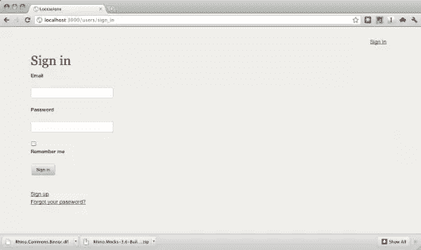
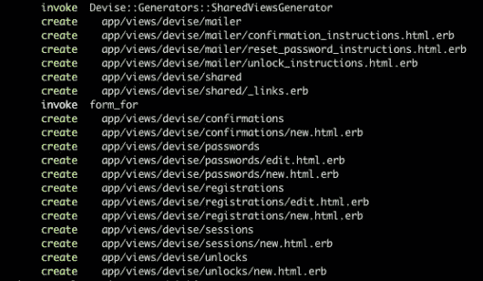

# Rails 深度剖析:位置、认证

> 原文：<https://www.sitepoint.com/rails-deep-dive-loccasions-authentication/>

在[最后一篇](https://www.sitepoint.com/rails-deep-dive-loccasions-home-page/)中，我们完成了第一个用户故事。这个用户故事非常简单，但是它丰富了我们主页的设计。下一个用户故事，*作为一名管理员，我想邀请用户参加活动*并不那么简单。

这个用户故事的含义是很大的:首先，我们有了一个新的角色，管理员，这使我们的角色变成了两个(未注册用户和管理员)。第二，管理员角色引出了*授权*的概念，其中站点的功能是基于用户角色来限制的。当然，这让我们想到了*认证*，因为我们需要知道用户是谁，然后才能知道用户可以做什么。在这个用户故事结束时，我们应该已经设置好了身份验证和授权，并准备就绪。

# 创建分支

在上一篇文章中，我忽略了为我们的新故事创建一个 git 分支。这使我们的代码与分支保持隔离，并允许我们在需要时对 master 进行不相关的更改。[这里](http://thinkvitamin.com/code/source-control/git/our-simple-git-workflow/)是一篇关于 Git 工作流的好文章。Git 使分支变得容易

```
git checkout -b inviting_users
```

我们在新的分支机构，蓄势待发。

# 编写测试

继续我们的测试驱动方法，让我们编写一个登录应用程序的测试。这里，我们将开始把我们的用户故事分解成更小的故事，以便于测试。将一个问题或一部分功能分解成更小的部分会使更大的问题更容易解决。这是我们的第一个子用户故事:*作为一名管理员，我想登录到 Loccasions* 。

因为我们是从用户的角度来写规范的，所以每个故事(和子故事)都有含义。在这个故事中,“签到”的行为可能意味着很多事情，那么我们如何衡量它以符合我们/我们的客户想要的呢？在这种情况下，我和一个客户商量，他想要一个很酷的下拉菜单，带有一个登录表单。虽然我同意这很酷，但我说服了客户使用[渐进式增强](http://www.alistapart.com/articles/understandingprogressiveenhancement)，允许我们现在为登录表单开发一个单独的页面，并在以后让它变得更性感。

有了客户的期望，我们就可以进行登录表单测试了。首先，我们将确保登录页面有一个表单和一个标题。

```
require 'spec_helper'

feature 'Sign In', %q{
  As an administrator
  I want to sign in to Loccasions
} do
  background do
    visit "/"
  end
  scenario "Click Sign In" do
    click_link "Sign In"
    page.should have_selector("title", :text => "Loccasions: Sign In")
    page.should have_selector('form')
  end
end
```

(记得在运行你的规范之前启动 MongoDB)
这个规范失败，抱怨标题不匹配。此外，当我运行我的规格时，我注意到我收到以下消息:

```
NOTE: Gem.available? is deprecated, use Specification::find_by_name. It will be removed on or after 2011-11-01.
Gem.available? called from /Users/ggoodrich/.rvm/gems/ruby-1.9.2-p290@loccasions/gems/jasmine-1.0.2.1/lib/jasmine/base.rb:64.
```

嗯……我不喜欢那样。我快速浏览了一下 [jasmine-gem github repo](https://github.com/pivotal/jasmine-gem) 显示他们是在版本 1.1.0.rc3 上。现在，我将在我的 gem 文件中碰撞这个版本，希望当我们进行客户端测试时它能工作。修改版本可以修复这个警告，从而满足即时需求。

在这里，我依靠经验来驱动我的下一步。我热衷于使用 Devise 进行身份验证，我知道它对注册、登录等有自己的看法。换句话说，是时候设置设计了。

# 安装设备

再次向令人敬畏的铁路公司致敬，让我们为设计准备好 RSpec。使用以下内容创建一个*规格/支持/设计. rb* 文件:

```
RSpec.configure do |config|
  config.include Devise::TestHelpers, :type => :controller
end
```

现在，我们来看看典型的器件设置。

```
rails g devise:install
```

这就创建了*config/initializer/device . Rb*和*config/locales/device . en . yml*。如果我们查看初始化文件，我们可以看到`require 'devise/orm/mongoid'`，所以我们知道 Devise 知道我们使用 Mongoid 的选择。`devise:install`发生器的输出给出一些指令:

*   ActionMailer 的设置`default_url_options`
*   设置默认路由(我们已经完成了)
*   确保在我们的布局中处理我们的 flash/notice 消息。

趁现在还新鲜，让我们开始吧。我补充道

```
config.action_mailer.default_url_options = { :host => 'localhost:3000' }
```

我还在*config/environments/development . Rb*中添加了:

```
%p.notice= notice
%p.alert= alert
```

到*app/views/layouts/application . html . haml*就在调用`yield`的上面。它可能不会停留在那里，但我们现在并不担心。
device 将为我们生成一个用户模型:

```
rails g devise User
```

该命令的输出显示我们获得了一个模型(用户)、一个 user_spec 和一个新的路由(`devise_for :users`)。如果我们在命令行快速执行`rake routes`，我们会看到:

```
new_user_session GET    /users/sign_in(.:format)       {:action=>"new", :controller=>"devise/sessions"}
```

这是我们希望我们的“登录”链接去的地方。让我们在应用程序布局中更改它。

```
#sign_in.sixteen.columns
  %a(href= new_user_session_path ) Sign In
```

重新运行我们的规范，我们仍然有同样的错误。现在，让我们启动服务器，看看发生了什么。



注册页面

哇…看起来相当不错。然而，标题不是我们想要的，它有一个“注册”链接，我们以后可能会想要，但还不是时候。我们需要定制 device 视图，幸运的是，device 为我们提供了一种简单的方法:

```
rails g devise:views
```



设计视图的输出

这创造了相当多的观点，他们都是 ERB 而不是 Haml…唉。谷歌了一下，我[在 device wiki](https://github.com/plataformatec/devise/wiki/How-To:-Create-Haml-and-Slim-Views)上找到了这个，详细说明了如何获得 device 的 Haml 视图。因此，`rm -rf app/views/devise`，将`gem 'hpricot', '~> 0.8.4'`
和`gem 'ruby_parser', '~> 2.2.0'`添加到您的 Gemfile，`bundle install`中的开发组，并遵循 wiki 上的说明。糟糕。不是世界末日，但也不是独角兽和彩虹。
首先，我们换个标题。由于 Devise 视图将使用相同的应用程序布局，我们需要一种方法来改变每个页面的标题。进入`ApplicationHelper`。将此方法添加到*app/helpers/application _ helper . Rb*

```
def title(page_title)
  content_for(:title) { page_title }
end
```

现在，将应用程序布局中的`title`标记替换为:

```
%title= "Loccasions: #{content_for?(:title) ? content_for(:title) : 'Home' }"
```

最后，将此添加到*app/views/device/session/new . html . haml*的顶部:

```
- title('Sign In')
```

现在，规格都通过了。

# 决策点:用户名

在与客户商议之后，我们将为用户添加一个`name`属性。让我们为我们的新属性添加一个测试。Devise 创建了 user_spec，所以让我们为`name`创建一个测试。(在*规格/型号/用户规格 rb* 中)

```
describe User do
  it "should have a 'name' attribute" do
    user = User.new
    user.should respond_to(:name)
    user.should respond_to(:name=)
  end
end
```

该规范不出所料地失败了。我们可以将它添加到 *app/models/user.rb* 中

```
field :name
attr_accessible :name
```

我希望名称是唯一的和必需的。测试(有一点重构):

```
describe User do
  describe "the 'Name' attribute" do
    before(:each) do
      @user = Factory.build(:user)
    end
    it "should exist on the User model" do
      @user.should respond_to(:name)
      @user.should respond_to(:name=)
    end
    it "should be unique" do
      @user.save
      user2 = Factory.build(:user, :email=>'diff@example.com')
      user2.valid?.should be_false
      user2.errors[:name].should include("is already taken")
    end
    it "should be required" do
      @user.name=nil
      @user.valid?.should be_false
      @user.errors[:name].should include("can't be blank")
    end
  end
end
```

警觉的读者已经注意到重构规范中对`Factory`的调用。我们需要一个用户来进行这个测试，我们将求助于工厂女孩来得到一个。添加文件 *spec/factories.rb* ,内容如下:

```
require 'factory_girl'

FactoryGirl.define do
  factory :user do
    name 'Testy'
    email 'testy@test.com'
    password 'password'
  end
end
```

运行该规范给我们带来了两个失败:


用户名规范失败

向我们的`name`字段添加一些快速验证，

```
validates :name, :presence => true, :uniqueness => true
```

我们所有的规格都通过了。我们现在可以开始实际测试登录了。

# 测试登录

我们的登录测试要确定的第一项是，当用户成功登录时会发生什么？客户认为应该将用户重定向到他们的个人“主页”。那么，用户主页上有什么呢？我们知道我们的主要业务对象是事件和场合，而场合存在于事件之中。然后，用户主页可能会列出用户的事件。然后，规范应该填写并提交表单，然后重定向到用户主页。

在我们写这个规范之前，我想让`spec`任务成为默认的 Rake 任务(我已经厌倦了输入`rake spec`，所以把它添加到你的 *Rakefile* 的底部

```
Rake::Task[:default].prerequisites.clear
task :default => [:spec]
```

现在，我们只需输入`rake`，我们的规范就会运行。啊，这样好多了。

这是我们的登录规范:

```
scenario "Successful Sign In" do
  click_sign_in
  fill_in 'Email', :with => 'testy@test.com'
  fill_in 'Password', :with => 'password'
  click_on('Sign in')
  current_path.should == user_root_path # this path is used by Devise
end
```

注意到`click_sign_in`方法了吗？我制作了一个快速助手(*spec/support/request _ helpers . Rb*)，这样我就不需要一直输入行来点击进入登录页面。

```
module RequestHelpers
  module Helpers
    def click_sign_in
      visit "/"
      click_link "Sign In"
    end
  end
end
RSpec.configure.include RequestHelpers::Helpers, :type => :acceptance, :example_group => {
 :file_path => config.escaped_path(%w[spec acceptance])
}
```

这将只包括验收测试中我们的助手，也就是说，*规范/验收*中的任何规范(注意:RSpec 定义了一堆规范“类型”，如*请求、控制器、模型*等。这里，我们只是添加了*验收*

跑步`rake`(耶！这样不是更好吗？)并且我们得到一个关于`user_root_path`未定义的预期错误。只是为了通过测试，把它添加到*配置/路由. rb*

```
match 'events' => 'home#index', :as => :user_root
```

我们将该路线称为`/events`，因为我们知道事件将是用户主页的主菜。规范现在失败了，因为 URL 不匹配。提交表单后，URL 不变。这是因为我们在数据库中没有用户。将此添加到“成功登录”场景中，就在`click_sign_in`之后

```
FactoryGirl.create(:user)
```

耶！规范现在通过了。顺便说一下，`user_root`路由是一个设计约定，用于覆盖用户成功登录后被重定向到的位置。我们还没有完全测试身份验证，但它是可行的。为了完整起见，让我们确保一个坏的登录失败。将此添加到“成功登录”场景下:

```
scenario "Unsuccessful Sign In" do
  click_sign_in
  fill_in 'Email', :with => 'hacker@getyou.com'
  fill_in 'Password', :with => 'badpassword'
  click_on 'Sign in'
  current_path.should == user_session_path
  page.should have_content("Invalid email or password")
end
```

是的，正如所料，新的情节过去了。让我们把这个推给 github。

```
git add .
git commit -m "Basic authentication"
git checkout master
git merge inviting_users
```

在这里运行您的规格，只是为了确保一切正常，然后

```
git push origin master
git branch -d inviting_users
```

# 嗯，那比我预期的要长

这篇文章有点太长了，所以我们就此打住，在下一篇文章中继续讨论我们的用户事件页面。一如既往，欢迎您对临时措施的进展发表意见。

## 分享这篇文章