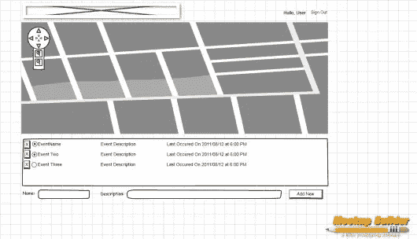
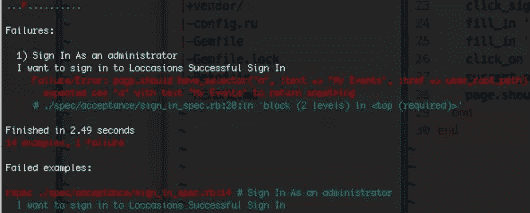
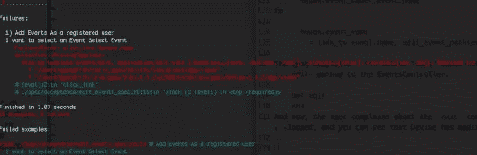

# Rails 深潜:位置，制造事件

> 原文：<https://www.sitepoint.com/rails-deep-dive-loccasions-making-events/>

我们的[上一篇文章](https://www.sitepoint.com/rails-deep-dive-loccasions-spork-events-and-authorization/)清空了事件模型，创建了一个**非常**基本的主页。希望在这篇文章结束时，我们将能够在我们的用户主页上添加、修改和删除事件。

## 肮脏的事件

除非你刚刚从长达几十年的冰冷睡眠中被解冻，否则你知道粗加工一个模型需要什么。在 Rails 领域，通常情况下，一个模型被转换成一个[REST](http://en.wikipedia.org/wiki/Representational_state_transfer)full 资源。(注意:如果你对 REST 没有很好的理解，我强烈推荐 O'Reilly 的书 [RESTful Web Services](http://oreilly.com/catalog/9780596529260/) ，我不会在这个系列中详细讨论 REST。)对于事件模型，我们需要允许我们添加(POST)、修改(PUT)、检索(GET)和删除(Um，delete)事件的 HTTP 端点。

**更新**:有读者提醒我忘记将事件路线添加到 routes.rb 文件中。因此，将它添加到 config/routes.rb 中

```
resources :events
```

这将生成事件所需的所有 RESTful 路由。

## 创建事件

由于事件是如此简单的对象，我们可以将创建它们的表单放在我们的用户主页上。我像猫一样敏捷地跳回 MockupBuilder，更改我们的事件页面，在底部添加一个表单。



添加事件

是时候编写一个测试来填充这个表单了。我添加了一个*规格/验收/添加事件规格 rb*

```
require 'spec_helper'
feature 'Add Events', %q{
  As a registered user
  I want to add Events
} do
  background do
    login_user Factory(:user)
  end
  scenario "Add Basic Event" do
    fill_in "Name", :with => "New Event"
    fill_in "Description", :with => "This is my new event"
    click_button "Create Event"
    page.should have_content("New Event")
    page.should have_content("This is my new event")
    page.should have_selector("ul > li")
  end
end
```

运行这个规范会导致对`ElementNotFound`的抱怨，因为我们还没有创建表单。所以，让我们添加一个表单到我们的*app/views/events/index . html . haml*(添加到文件的末尾)

```
= form_for Event.new do |f|
  = f.label :name
  = f.text_field :name
  = f.label :description
  = f.text_field :description
  = f.submit
```

因为我们希望这个表单是“内联的”,所以我们需要覆盖基本样式。在*app/assets/样式表/events.css.scss* 文件中添加

```
.new_event label, input[type='text'] {
  display:inline;
}
input#event_description {
  width: 500px;
}
```

(注意:Rails 在表单中添加了`new_event`类)。现在，规范抱怨在`EventsController`上没有`create`动作。好的，我们可以添加(在*app/controlles/events _ controller . Rb*中)

```
def create
  event = current_user.events.build(params[:event])
  event.save
end
```

现在规范说我们没有`events/create`模板，这是真的。但是，我们不想要那个模板，我们希望`create`动作只是呈现主页。现在，让我们重定向到事件索引页面。我补充道

```
page.current_path.should == events_path
```

符合我们的规格

```
redirect_to events_path
```

到`EventsController#create`的方法。规范抱怨页面上没有描述文本。哎呀，看起来我在创建事件列表时忽略了这一点。将*app/views/events/index . html . haml*改为

```
%h2 Your Events

map.sixteen_columns

%ul#events
  - for event in @events
    %li
      %span.event_name= event.name
      %span.event_description= event.description
= form_for Event.new do |f|
  = f.label :name
  = f.text_field :name
  = f.label :description
  = f.text_field :description
  = f.submit
```

规范通过了。

在这样的时刻，我喜欢启动服务器(`rails s`)四处看看。我注意到的第一件事是，当我登录到主页时，没有清晰的导航到**用户事件**页面。此外，当我在用户事件页面上时，事件列表看起来像垃圾。我不太在意后一个问题，但我想在那里得到一些视觉线索，让它们现在看起来更好一些。最后，我们的地图将要去的地方是一个很大的空白，但我不会处理这个问题，直到我们开始创造机会。

## 清理已登录的导航

处理上面的第一个问题，当用户登录时，应该有一个链接来访问用户事件。我打算把它叫做“我的事件”。不过，首先，我们需要编写一个测试来确保它存在。事实上，我们可以将它添加到*spec/acceptance/Sign _ In _ spec . Rb*中的“成功登录”场景中

```
current_path.should == user_root_path # This line already exists
page.should have_selector("a", :text => "My Events", :href => user_root_path)
```



我的活动链接规格

要通过这个规范，只需将这个“我的事件”链接添加到*app/views/layout/application . html . haml*文件中的 sign_in 条件中。(注:只需添加用`#Add this line`注释的行)

```
-if user_signed_in?
      Hullo #{current_user.name}
      | <br>
      = link_to "My Events", user_root_path   #Add this line
      |                                       #Add this line
      = link_to "Sign Out", destroy_user_session_path, :method => :delete
    - else
      = link_to "Sign In", new_user_session_path
```

规范通过了。如果你想启动服务器，看看我们的新登录区，去吧。

## 向事件添加更多 CRUD

我们可以创建和检索事件，但不能编辑或删除事件。现在让我们添加这样做的能力。关于编辑，我最初的想法是将“选定的”事件加载到我们用来创建事件的同一表单中。我怀疑它会保持这种方式，但它给了我们一个快速测试更新能力的方法。使用这个工作流，我们的`EventsController`的`edit`动作将从数据库中获取选定的事件，并合并一个`@event`实例变量。然后，*编辑视图*将事件信息呈现到表单中。一个重要的收获是，我们的用户事件页面也将成为我们的编辑视图。此外，用户需要一种方式来“选择”特定事件。现在，我们将使事件列表中的事件名称成为触发事件视图的超链接。让我们再写一些测试来清除它。我创建了一个*规格/验收/编辑 _ 事件 _ 规格. rb* 文件，包含:

```
require 'spec_helper'

feature 'Select Event', %q{
  As a registered user
  I want to select an Event
} do
  background do
    @user = Factory(:user)
    @event = Factory(:event, :user => @user )
    login_user @user
  end

scenario "Select Event" do
    page.should have_selector("a", :text=> @event.name)
    click_link @event.name
    page.should have_selector("li.selected", :text=> @event.name)
    page.should have_selector("input[name='event[name]']", :value => @event.name)
    page.should have_selector("input[name='event[description]']", :value => @event.description)
  end
end
```

当然，规范失败是因为页面上没有与“测试事件”(记住，这是我们的工厂事件对象名)的链接。打开*app/views/events/index . html . haml*并更改:

```
%span.event_name= event.name
```

到

```
%span.event_name
  = link_to event.name, edit_event_path(event)
```

规范抱怨`The action 'edit' could not be found for EventsController`，有道理。因此，向 EventsController 添加一个`edit`方法。

```
def edit
end
```

现在，规范抱怨说`edit`模板丢失了。顺便说一下，Rails 会告诉你它在哪里查找，你可以看到 Devise 修改了我们的视图搜索路径……非常酷。



编辑模板在哪里

正如我前面提到的，我们不会有单独的编辑模板，而是使用现有的事件索引模板，将选定的事件加载到一个实例变量中。

```
def edit
  @events = current_user.events
  @event = @events.find(params[:id])
  render 'index'
end
```

下一个问题是没有带类`selected`的`li`，所以打开事件索引模板，将其更改为:

```
%h2 Your Events

map.sixteen_columns

%ul#events
  - for event in @events
    %li{:class => @event == event ? :selected : nil}  #FIRST
      %span.event_name
        = link_to event.name, edit_event_path(event)
      %span.event_description= event.description
= form_for @event || Event.new do |f|         #SECOND
  = f.label :name
  = f.text_field :name
  = f.label :description
  = f.text_field :description
  = f.submit
```

为了节省时间，我做了所有的修改来让我们的规范通过。首先，events 循环检查当前事件是否与我们的`@event`实例变量匹配，如果匹配，就将`selected` CSS 类名添加到列表项中。其次，我们对`@event`实例变量的存在进行了`form_for`测试，如果不存在，就返回到普通的`Event.new`。

规范现在通过了。我们可以选择一个事件，将其加载到表单中。考嚯！(由“嚯！”我的意思是，将这个特性添加到同一个 *edit_event_spec.rb* 文件中)

```
feature 'Edit Event', %q{
  As a registered user
  I want to edit a selected Event
} do
  background do
    @user = Factory(:user)
    @event = Factory(:event, :user => @user )
    login_user @user
    click_link @event.name
  end

  scenario "Edit Event" do
    fill_in "Name", :with=> "Edited Event"
    click_button "Update Event"
    page.should have_selector("a", :text => "Edited Event")
  end
end
```

你可以看到我们在`background`块中选择了我们的事件(嗅嗅，嗅嗅，我闻到了助手…)，然后是更改事件名称的场景。这个规范失败是因为在`EventsController`上没有`update`动作。就像`edit`动作一样，我们需要将我们的新动作添加到控制器。然而，在此之前，我想指出 Rails 免费为我们做的一些很酷的事情。注意，在“编辑事件”场景中，我们寻找一个“更新事件”按钮。但是，我们没有在视图中放入任何代码来区分创建表单和更新表单。Rails 和`form_for`为我们做到了这一点，让表单根据传递给它的对象做正确的事情。Rails 做的一些小事，比如这个，让我想给它一个大大的拥抱。
添加`update`动作的步骤与添加`edit`动作的步骤相同。将空的`update`方法添加到`EventsController`中，观察 spec 对缺少更新模板的抱怨，然后将内容添加到`update`方法中，重定向到`index`视图，然后开始。重定向略有不同，因为在更新之后，我们只想返回到事件页面来刷新事件列表中更新的事件。

```
def update
  event = current_user.events.find(params[:id])
  event.update_attributes(params[:event])
  event.save
  redirect_to events_path
end
```

规格通过，我们可以创建和更新事件。进步是有趣的。

### 必须摧毁事件

一旦位置可以破坏事件，我们就不会再操纵事件了。首先，我们需要一些东西让用户知道一个事件已经结束了。“删除”按钮听起来像是一个好的开始，为该按钮编写测试也是如此。规格如下:

```
require 'spec_helper'

feature "Delete Event", %q{
  As a registered user,
  I want to delete an event
} do
  background do
    Capybara.current_driver = :selenium   #FIRST
    @user = Factory(:user)
    @event = Factory(:event, :user => @user, :name=>"Dead Event Walking")
    login_user @user
  end

  after do                      #afterFIRST
    Capybara.use_default_driver
  end

  scenario "Delete Event" do
    page.should have_content("Dead Event Walking")
    page.should have_selector("form[action='/events/#{@event.id}'] input[value='delete']") #SECOND
    # auto confirm the dialog
    page.execute_script('window.confirm = function() {return true;}')   #FIRST
    click_button "X"
    page.should_not have_content("Dead Event Walking")
  end
end
```

我已经用“删除事件”规范跳过了一点，所以我将试着解释发生了什么。首先，我将水豚的 test_driver 切换到 [Selenium](https://www.selenium.dev/) ，告诉页面自动确认所有对话框，然后切换回默认的测试驱动。第二，您可能想知道为什么我要测试具有这些奇怪属性的表单的存在。由于 Rails RESTful 的特性，资源的销毁路径需要使用 HTTP DELETE 方法。不使用 GET 执行 HTTP 请求的唯一方法是使用表单。然而，浏览器对 HTTP DELETE 方法的支持参差不齐， [HTML5 的支持也悬而未决](https://www.w3.org/Bugs/Public/show_bug.cgi?id=10671)，所以我们需要一个约定。当前的惯例，也是 Rails 将为您做的，是创建一个 POST 表单，其中包含一个名为`_method`的隐藏输入，它具有我们想要使用的 HTTP 动词的值。Rails 路由中间件然后检查该参数，并适当地路由请求。这就是为什么我以那种方式写这个规范，即使它比普通的验收测试更深入一点。同样，这个测试很可能会改变。
当然，规范会抱怨视图没有那些属性的表单。这是我们新的索引视图:

```
%h2 Your Events

map.sixteen_columns

%ul#events
  - for event in @events
    %li{:class => @event == event ? :selected : nil}
      %span.del_form
        =button_to "X", event, :confirm => "Are you sure?", :method => :delete
      %span.event_name
        = link_to event.name, edit_event_path(event)
      %span.event_description= event.description
      %div.clear
= form_for @event || Event.new do |f|
  = f.label :name
  = f.text_field :name
  = f.label :description
  = f.text_field :description
  = f.submit
```

如果您现在运行`rails s`，登录并进入用户事件页面，您可以看到(假设事件存在)删除按钮。查看该页面的源代码会显示删除表单:

```
<span class='del_form'>
  <form method="post" action="/events/4e67812841574e0462000002"  class="button_to">
    <div>
      <input name="_method" type="hidden" value="delete" />
      <input data-confirm="Are you sure?" type="submit" value="X" />
      <input name="authenticity_token" type="hidden" value="..elided.." />
    </div>
  </form>
</span>
```

Rails 在这里给了我们各种各样的帮助:隐藏的`_method`输入，确认框的`data-confirm`属性，以及帮助避免跨站点脚本攻击的`authenticity_token`。你买了什么 Rails？没什么，嗯？
运行规范，我们得到熟悉的关于`EventsController`错过一个动作的抱怨，在本例中是`destroy`。此时，你应该知道接下来会发生什么。添加空白方法，看着它失败，添加销毁和重定向逻辑，看着它通过，最后，自我感觉良好。一旦添加了`destroy`方法:

```
def destroy
  event = current_user.events.find(params[:id])
  event.destroy
  redirect_to events_path
end
```

所有规格都会通过。当你运行规范时，你可能会被浏览器弹出的画面吓了一跳，是吗？那是硒，很牛逼。(但是，我们以后可能会去掉它……)所以，如果您启动服务器，您应该能够添加、修改和销毁事件。下一次，我们将添加场合，也许还有地图。哦，别忘了:

```
git add .
git commit -am "CRUDed events"
git push origin adding_events
git checkout master
git merge adding_events
git push origin master
```

## 分享这篇文章