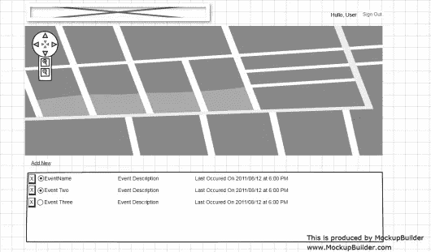
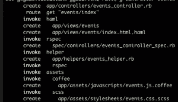
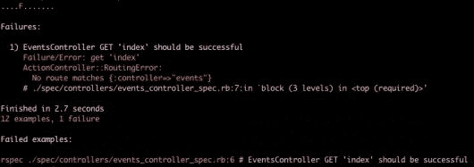

# Rails 深潜:位置、Spork、事件和授权

> 原文：<https://www.sitepoint.com/rails-deep-dive-loccasions-spork-events-and-authorization/>

在我们的上一篇文章中，我们结束了非常基本的认证工作。然而，我们在 sign_in 规范中伪造了 events_path，这就是我们将要开始的地方。成功的登录会重定向到用户事件页面，该页面可能包含该用户拥有的事件列表。让我们回到 Mockbuilder，为我们的事件页面设计一个布局。



活动页面模型

该页面的布局与主页不同，主要内容是地图。最新事件将在地图上可见，用户事件将在地图下方列出。另一个非常简单的布局，帮助我们推动网站的实施。此时，我们可以将事件识别为一个*资源*,并开始开发代表这个资源的项目。当然，我们需要一个事件模型和一个事件控制器。

## 事件模型

在这一点上，固化客户端想要跟踪的每个事件可能是一个好主意。这需要添加更多的用户故事:

> 作为注册用户，我希望按名称、描述和上次事件查看我的事件。

这个故事明确地列出了我们的属性，所以我们有足够的信息来生成我们的模型。首先，让我们创建一个 git 分支:

```
git checkout -b adding_events
```

在我们生成模型之前，快速思考一下“最后一次出现”属性。知道事件会发生，在我看来，我们实际上不会为 last_occurrence 存储一个值，而是从发生中获取最近的日期。这使得最后一次出现成为一个“虚拟属性”，因为它是在您请求时生成的。然而，我的一部分担心需要查询这个属性。另一个设计决策:创建一个虚拟属性或真实属性，每当创建一个实例时，都必须更新该属性。嗯，过早优化是万恶之源。我们将使用虚拟属性……目前是这样。

```
rails g model Event name:string description:string user:references
```

生成一个模型和规格。我们要为 Event 编写几个测试。事件属于用户(也就是我们生成器中的`user:references`),没有名字就无法存在。我继续为事件添加了一个工厂:

```
factory :event do
name "Test Event"
user
end
```

以下是对用户的测试:

```
describe Event do
  it "should belong to a user" do
    event = Factory.build(:event, :user=>nil)
    event.valid?.should be_false
    event.errors[:user].should include("can't be blank")
    event.user = User.new
    event.valid?.should be_true
  end
end<
```

失败了，直到我们把它添加到事件模型中:

```
validates :user, :presence => true
```

在我们继续活动规格之前，我对每次运行我的规格所花费的时间感到沮丧。旋转时间太长了，所以我想做点什么来加速它。我的直觉告诉我，规范必须加载 Rails 应用程序环境，这是最耗时的。我试着运行模型规格(`rake spec:models`)，但是启动时间仍然困扰着我。在谷歌搜索了很多之后，我打算试着将 [Spork](http://github.com/timcharper/spork) 添加到我们的测试环境中。

## 添加火花

将`gem 'spork', '~> 0.9.0.rc'`添加到您的 gem 文件的`development`部分和`bundle install`。现在，我们需要为 Spork 设置规范环境。谢天谢地，斯博克对此有一些帮手。从您的项目根目录中，键入`spork --bootstrap`，这将在您的 *spec/spec_helper.rb* 文件中添加一些指令，因此打开该文件。基本上，我们需要将我们的 spec_helper 分成两个块， *prefork* 和 *each_run* 。
我们只需要在每个规格运行中运行一次的任何东西都放在 *prefork* 块中。现在，我把所有东西都放在 *prefork* 块中，所以我的 *spec/spec_helper.rb* 文件看起来像这样

```
require 'rubygems'
require 'spork'
Spork.prefork do
  # Loading more in this block will cause your tests to run faster. However,
  # if you change any configuration or code from libraries loaded here, you'll
  # need to restart spork for it take effect.
  ENV["RAILS_ENV"] ||= 'test'
  require File.expand_path("../../config/environment", __FILE__)
  require 'rspec/rails'
  require 'capybara/rspec'

  # Requires supporting ruby files with custom matchers and macros, etc,
  # in spec/support/ and its subdirectories.
  Dir[Rails.root.join("spec/support/**/*.rb")].each {|f| require f}
  RSpec.configure do |config|
    # == Mock Framework
    #
    # If you prefer to use mocha, flexmock or RR, uncomment the appropriate line:
    #
    # config.mock_with :mocha
    # config.mock_with :flexmock
    # config.mock_with :rr
    config.mock_with :rspec
    # Remove this line if you're not using ActiveRecord or ActiveRecord fixtures
    # config.fixture_path = "#{::Rails.root}/spec/fixtures"

    # If you're not using ActiveRecord, or you'd prefer not to run each of your
    # examples within a transaction, remove the following line or assign false
    # instead of true.
    # config.use_transactional_fixtures = true
    # Clean up the database
    require 'database_cleaner'
    config.before(:suite) do
      DatabaseCleaner.strategy = :truncation
      DatabaseCleaner.orm = "mongoid"
    end
    config.before(:each) do
      DatabaseCleaner.clean
    end
  end
end
Spork.each_run do
  # This code will be run each time you run your specs.

end
```

我们可能会遇到重启 Spork 来获取更改的问题，但是如果发生了，我们会处理的。运行前后快速时间检查(`time rake`对`time rspec --drb spec/`)，我的 spec 运行时间下降了 20 秒！哇……这是一个值得的书呆子气。要完成我们的 Spork 更改，请将`--drb`添加到您的。rspec 文件，以便默认情况下使用 Spork。顺便说一下，由于 Spork 加载 Rails 环境，所以当环境发生变化(添加了新的路由等)时，有必要重启 Spork。)需要记住的事情。

## 回到测试

好了，现在我们可以完成我们的活动规格。让我们添加一个快速测试，确保“name”是一个必需的属性。

```
it "should require a name" do
  event = Factory.build(:event, :name=>nil)
  event.valid?.should be_false
  event.errors[:name].should include("can't be blank")
  event.name ="Event Name"
  event.valid?.should be_true
end
```

这将失败，因为我们没有验证名称。将我们添加的用于验证用户的行更改为:

```
validates :user, :name, :presence => true
```

规范通过了。

## 测试用户是否有事件

因为我们希望能够为用户构建事件，所以让我们进行一些测试来确保这是可行的:

```
describe "User Event" do
  it "can be built for a user"  do
    lambda {
     @user.events.build(:name=>"A new event")
    }.should change(@user.events, :length).by(1)
  end
  it "can be removed from a user" do
    @user.events.build(:name => "A short event")
    lambda {
      @user.events.first.destroy
    }.should change(@user.events, :length).by(-1)  end
end
```

这些规格不需要进一步编码就能通过，所以，嗯，耶？(注意:这不是真的……机警的读者 Nicolas(见评论)正确地指出，我们还有两件事要做:

1)将`embeds_many :events`添加到用户模型。
2)重启 spork 或将`ActiveSupport::Dependencies.clear`添加到 spec_helper.rb.
中的`Spork.each`部分

## 事件控制器

现在我们需要在用户事件页面上显示我们的事件。我们需要一个 EventsController 和一个索引操作/视图。发电机，嗬！

```
rails g controller events index
```


让我们撤销上一篇文章中的路由欺骗，并将 events_path 指向我们的 events#index 操作。删除`get "events#index"`并将“事件”路线改为`match 'events' => 'events#index', :as => :events`并运行规格。HMMM……他们失败了。



事件规范失败！

我没想到会失败。等等，我没写那个`events_controller_spec`。愚蠢的发电机…我不想要那个规格。带着极端偏见删除*规格/控制器*目录。我们的规格又通过了。正如我在本系列文章中提到的，我们尽可能地通过接受度测试来驱动测试。因此，我们不会有具体的控制器/视图规格。

创建文件*specs/acceptance/user _ events _ spec . Rb*来保存我们的用户事件页面的规范。为了看到用户活动页面，我们必须从我们的规范登录。因为我们使用请求规范，所以我们基本上需要模拟向服务器发送凭证。我们可以通过快速混合来实现，这将包含在我们的特性中。将此添加到*spec/support/request _ helpers . Rb*

```
def login_user(user)
  visit new_user_session_path
  fill_in "Email", :with => "testy@test.com"
  fill_in "Password", :with => "password"
  click_button "Sign in"
end
```

如您所见，我们实际上是在登录应用程序。

现在，让我们用以下内容创建*规范/验收/用户事件规范. rb* 文件

```
require 'spec_helper'

feature 'User Events Page', %q{
  As a signed in user
  I want to see my events
  on my events page
} do
  background do
    @user = Factory(:user)
    @event = Factory(:event, :user => @user)
  end
  scenario "User is not signed in" do
    visit events_path
    current_path.should == new_user_session_path
  end
end
```

我们将首先测试负面路径，也就是说，当我们不登录并尝试转到用户事件页面时会发生什么。在这种情况下，应用程序应该重定向到登录页面(即`new_user_session_path`)运行这个规范，并且路径指向一个(相当难看，请注意修复)事件 URL，所以它没有重定向。我们需要告诉*事件控制器*对用户进行身份验证。多亏了 Devise，我们所要做的就是添加这个(把它放在`class`语句的正下方)

```
before_filter :authenticate_user!
```

规范通过了。现在，让我们创造积极的道路

```
feature 'Signed In User Events Page', %q{
  As a signed in user
  I want to see my events
  on my events page
} do
  background do
    @user = Factory(:user)
    @event = Factory(:event, :user => @user)
    login_user(@user)
  end
  scenario "User is signed in" do
    visit events_path
    page.should have_content(@user.name)
    page.should have_content(@event.name)
  end
end
```

我们在这里通过简单地确保用户名和事件名称在页面上来衡量成功。很可能我们以后要加强这个测试。

运行该规范，它会抱怨在页面上找不到用户名。让我们打开*app/views/events/index . html . haml*文件，看看发生了什么。该视图仍然是基本的、生成的视图，所以我们需要尽可能地将其与我们的模型相匹配。首先，模型中的“登录区”有一个问候和用户名。该位在*app/views/layouts/application . html . haml*文件中。我把`#sign_in` div 改成了

```
#sign_in.sixteen.columns
  %span
    -if user_signed_in?
      Hullo #{current_user.name}
      |
      = link_to "Sign Out", destroy_user_session_path, :method => :delete
    - else
      = link_to "Sign In", new_user_session_path
```

运行规范，现在它报错了事件名称。进步。在这里，我们将打开*应用程序/视图/事件/索引. html.haml* 视图，并将其更改为

```
%ul#events
  - for event in @events
    %li= event.name
```

这导致规范抱怨`You have a nil object when you didn't expect it!`(我讨厌这个错误，它让我沮丧了好几个小时),因为我们正在循环一个不存在的`@events`对象。给控制器！

```
class EventsController < ApplicationController
  before_filter :authenticate_user!
  def index
    @events = current_user.events
  end
end
```

我们又回到了通过规范。

## 包裹

我们仍然只是刚刚走出与 Loccasions 的大门，但我们正在加快速度。希望下一篇文章能让我们清空事件页面的其余部分，并允许我们创建和修改事件。

## 分享这篇文章