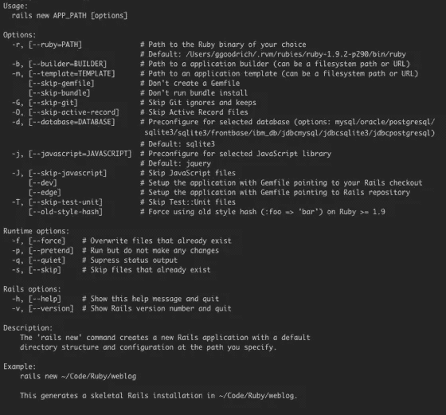
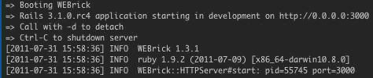

# Rails 简介，深度探讨:应用程序生成

> 原文：<https://www.sitepoint.com/rails-intro-deep-dive-app-generation/>

I’ve changed the title of this series, starting with this post, because I like the sound of “Deep Dive” much more than “101.”

`rails new`命令可能是我们都学过的 Rails 命令行的第一部分。给它一个应用程序名，这个命令将创建一个功能齐全的*(原文如此)Rails web 应用程序。配置的大部分约定在生成的结构中展开，app 目录保存我们的模型、视图、控制器和(现在，在 Rails 3.1 中)客户端资产。*

 *我在前面的陈述中对“全功能”的强调是为了指出这个站点还没有准备好生产。通常情况下，存在数据库、安全性或其他问题，但生成的应用程序是一个很好的基础。那么，我们如何调整这个基础，让我们走得更远，走得更具体呢？

`rails new`可用的选项如下截图所示。



rails 新选项

让我们逐一查看并讨论它的作用，以及为什么您可能想要使用它。

#### 红宝石路径(`-r, --ruby`)

将用于这个 Rails 应用程序的 Ruby 二进制文件的路径。你可以用它来测试你的应用程序是否与另一个版本的 Ruby 兼容，或者把它锁定在某个版本上。在开发方面，由于有像 [RVM](https://www.sitepoint.com/rails-development-101-rvm/) 这样的工具，这是不必要的，但是你的生产或登台环境可能有多个 Ruby 版本。

#### 应用构建器(`-b, --builder`)

在上一篇文章中，我简要地提到了指定应用程序构建器的能力。构建器负责创建应用程序结构，因此提供您自己的构建器允许您根据需要更改结构和内容。简而言之，您创建了一个继承自 `Rails::AppBuilder` 的类，并覆盖了您想要更改的内容。您可以指定一个不同的测试框架(比如 RSpec ),或者自动包含您喜欢的 gems 或 rake 任务……好了，您明白了。[这里](http://pivotallabs.com/users/mbarinek/blog/articles/1437-rails-3-application-builders)是我在这个过程中能找到的最好的帖子(谢谢迈克·巴里尼克！)

#### 申请模板(`-m, --template`)

应用程序模板是改变应用程序生成方式的另一种方式。在这种情况下，传递给`-m`的参数是一个 Ruby 文件，它允许向生成的 Rails 应用程序添加 gem 或初始化器。使用构建器和使用模板之间的主要区别是在定制发生的时候*。使用构建器，您可以在应用程序生成时修改它的结构(例如，我可以将 lib 目录称为“bibloteca”)，这是使用模板所做不到的。*

应用程序模板更多的是关于选择正确的 gem，运行 rake 任务，以及向基础应用程序结构添加初始化器。模板似乎是定制 Rails 应用程序生成的更流行的方法，甚至有 [RailsWizard](http://railswizard.org) 来使创建模板变得轻而易举。此外，我觉得如果不强调 Daniel Kehoe 和他的 [RailsApp](http://railsapps.github.com/) 库的出色工作，任何对 Rails 应用程序模板的提及都是不完整的。

#### 你可以跳过的事情

`rails new`命令的许多选项允许你不做某事。

*   (`--skip-gemfile`):不要创建 Gemfile，因为我是自带的，或者我没有使用 Bundler。
*   (`--skip-bundle`):生成 app 后不要运行`bundle install`，因为我想在 Bundler 做它的事情之前做一些事情。
*   (`-G, --skip-active-record`):不要包含 ActiveRecord，因为我使用的是不同的 ORM 或 NoSQL 数据库。
*   (`-J, --skip-javascript`):不要提供默认的 javascript 文件，因为我自带了。
*   (`-T, --skip-test-unit`):不要创建默认的 Test::Unit 测试文件(顺便说一句，这甚至不创建 *test* 目录)，因为我使用的是不同的测试框架(比如 RSpec)。
*   (`-F, --skip-git`):不要创建 Git 文件(。吉 gnore 和。gitkeep ),因为我使用了不同的源代码控制系统或者(不！)一个都没有。有趣的是，在[官方指南](http://guides.rubyonrails.org/command_line.html#rails-with-databases-and-scm)中，提到了一个`--git`选项。据我所知，这个选项是无效的(并被命令忽略)，但肯定是默认情况下没有创建 Git 文件时遗留下来的。

#### 指定一个数据库(`-d, --database)`

默认情况下，Rails 假定一个新的应用程序将使用一个数据库，并且该数据库将是 SQLite。这使得 Rails 应用变得容易，而不会带来典型 RDBMS 的开销。但是，如果您想要使用不同的 RDBMS，您可以使用此选项并提供一个受支持的参数来指定其中一个。支持的参数有:`mysql/oracle/postgresql/sqlite3/frontbase/ibm_db/jdbcmysql/jdbcsqlite3/jdbcpostgresql`。提供其中一个，您的 Gemfile 和 config/database.yml 将会相应地生成。

#### 指定轨道位置

有两个选项(`--dev and --edge`)允许你指向特定版本的 Rails。使用允许您指向本地 Rails Git 存储库的`--dev`。在这种情况下，本地存储库中的 Rails 版本要么需要在路径中，要么需要在生成应用程序时被指定为完整路径。例如:

```
ruby /path/to/rails/bin/rails new theapp --dev # from rubyonrails.org
```

`--edge`选项将指向主 Rails Github 库的头版本。无论哪种情况，您都希望冻结您的 Rails 版本。

#### 指定一个 javascript 库(`-j, --javascript=JAVASCRIPT)`

 `如果你不想在 jQuery 旁边使用不同的选项，你可以在-j 选项中指定‘prototype ’,用 Prototype 库得到一个 app。`

 `#### 运行时选项

各种运行时选项会影响命令的反馈，以及如何处理现有文件。参数`-f`和`--force`将覆盖任何现有文件。如果您已经损坏了一些基本文件，您可能想要这样做(真可耻！)没有使用源代码管理。参数`-s`和`--skip`与 *force* 相反，不会覆盖任何现有文件。也许我最喜欢的命令行开关是`-p, --pretend`，它实际上并不创建任何东西，但仍然发出命令的输出，所以你可以看到它*会做什么*。最后，`-q, --quiet`抑制所有输出。我喜欢跑着`rails new existential_app -p -q`,大声地想知道它是否真的存在…

最后，让我们生成一个应用程序，供本系列的其余文章使用。遗憾的是，我们将使用所有的默认值。

```
rails new deep_dive
```

这个命令的输出是[这里是](https://gist.github.com/1117147)

在我们走之前，让我们确保我们启动并运行。进入*深潜*目录，输入`rails s`。您应该会看到如下输出:



Rails 服务器输出

Now, if you open [http://localhost:3000](http://localhost:3000) you should see the familiar “Ruby on Rails: Welcome Aboard” page that we will delete with extreme prejudice in the next post and start really creating our app.`*

## *`分享这篇文章`*