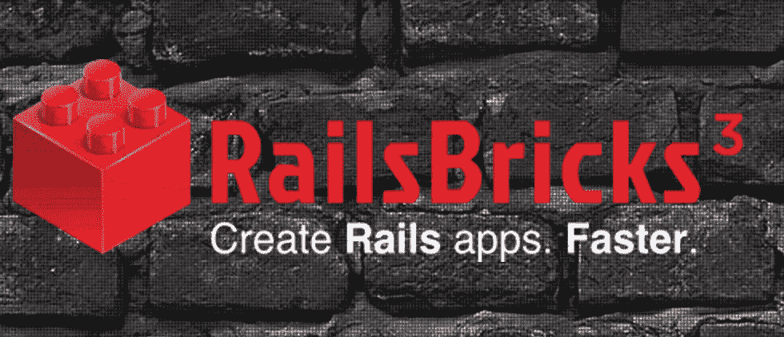
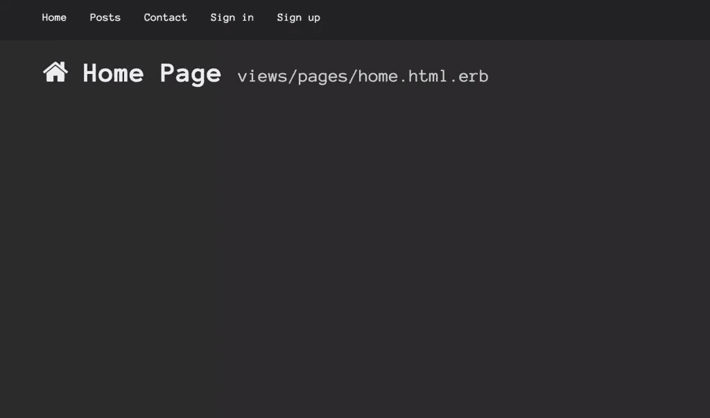
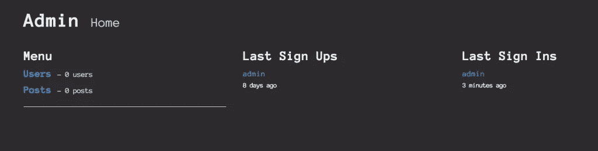
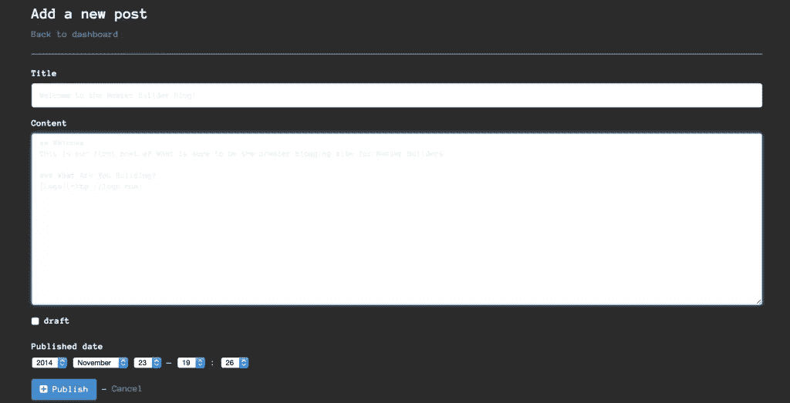

# RailsBricks:从 Rails 开始更快

> 原文：<https://www.sitepoint.com/railsbricks-start-faster-rails/>

[](http://railsbricks.net)

不久前，我们的一位作者提交了一份 Rails 教程，其中提到了将 [RailsBricks](http://railsbricks.net/) 作为应用程序的起点。我从来没有听说过 RailsBricks，所以我去查了一下，决定可能还有其他迷失的灵魂，比如我自己。

RailsBricks 是一个 gem，它“通过自动化普通的设置任务并为您配置有用的公共 gem，使您能够更快地创建 Rails 应用程序。”它也有一个乐高积木作为其标志。我喜欢乐高。如果 RailsBricks 是 Rails 的乐高积木，我就像 Flynn 一样。

简而言之，RailsBricks 将一些最常用的 Rails 精华整合到一个方便的小生成器中。这些特性/优点是:

*   用[验证设计](https://github.com/plataformatec/devise)
*   带有[引导程序](http://getbootstrap.com/)的用户界面
*   自动生成的电子邮件初始化器
*   与[费加罗](https://github.com/laserlemon/figaro)的应用秘密
*   设置数据库
*   轻松创建博客、产品页面等。
*   使用[红地毯](https://github.com/vmg/redcarpet)进行降价
*   自动创建联系人表单
*   设置 Git 存储库
*   包括易于部署到 Heroku 的 gem

如你所见，RailsBricks 有很多部分。而且，就像乐高积木一样，您可以挑选需要组装的部件来构建您的应用程序。本质上，RailsBricks 将带你走上成为建筑大师的道路。

## 建筑大师博客

所有这些关于乐高的谈话让我有心情和其他建筑大师交流。因此，我打算创建一个博客，在那里我可以讨论我所有的乐高学习，这样我的建筑智慧就可以在全世界传播。让我们开始建造吧。

### 装置

RailsBricks 是一块宝石，所以你可以出发了。gem 包含一个名为`rbricks`的可执行文件，当它自己键入时，会产生:

```
> rbricks

RailsBricks usage:
------------------

rbricks --new (or -n) :
  --> create a new RailsBricks app.

rbricks --recreate-db (or -r) :
  --> drop, create, migrate & seed the DB

rbricks --config
  --> display your app config

rbricks --version (or -v) :
  --> display the RailsBricks version

More help, tutorials and documentation at
http://www.railsbricks.net/get-started
```

入门页面提到了一个关于 Ruby 版本的注释，说用 RailsBricks 创建的应用程序支持当前的 point 版本(2.1.5)和以前的版本。我在这个演示中使用的是 2.1.5。

### 生成应用程序

`rbricks -n`提出一系列问题，RailsBricks 使用这些问题来构建您的应用程序:

```
> rbricks -n

*****************************
*                           *
*     RailsBricks 3.0.2     *
*    www.railsbricks.net    *
*                           *
*     using Rails 4.1.7     *
*                           *
*****************************

- Do you want me to help you along the way by giving you tips?
1\. Sure, help me make the right choices (default)
2\. Nope, I already know how to use RailsBricks
Your choice (1-2):
```

我选择`1`，因为我是第一次使用 RailsBrick。注意，它使用的是 Rails 4.1.7(当前的 4.1 版本是 4.1.8)。

#### 基础


```
1\. Your Rails App Name
----------------------
First of all, you need to give a name to your new app. I'll create it in
/Users/ggoodrich/projects/rubysource/. Of course, only use a valid Rails app
name.

- What do you want to name your app?
(default: railsbricks_1214)
App name: master-builder-blog

2\. Your Development Environment
-------------------------------
Before I can create your app, I need more information about your current
development environment. Note that I don't support versions of Ruby older than
2.0.0.

- Which version of Ruby do you want to use?
1\. 2.0.0
2\. 2.1.4
3\. 2.1.5 (default)
Your choice (1-3): 3

On some systems, you can't install gems by issuing a simple 'gem install
name_of_gem' command but need to prefix it with 'sudo' and issue 'sudo gem
install name_of_gem'. If this is the case, you most likely will need to input
your password at some point.

- How do you usually install new gems?
1\. gem install name_of_gem (default)
2\. sudo gem install name_of_gem
Your choice (1-2): 1

Do you usually run rake tasks by prefixing them with 'bundle exec'? I also need
to know that.

- How do you usually run rake tasks?
1\. rake some_task (default)
2\. bundle exec rake some_task
Your choice (1-2): 1
```

前两个问题要求您命名应用程序并选择一个 Ruby 版本。在我的例子中，分别是`mbblog`和 2.1.5。在那之后，当你在终端中运行命令时，问题是你是否需要`sudo`或`bundle`。我不知道。

### 数据库ˌ资料库

数据库是我们应用程序的下一块砖。


```
By default, Rails uses SQLite 3 to store the development database. I can change
that to PostgreSQL but you have to make sure that a PostgreSQL server is
installed and currently running. If it doesn't, the app creation will fail as I
won't be able to create the development database.

If you are on OS X, I struggle with the Postgres.app as the location of
pg_config keeps changing between versions. If you want to use PostgreSQL,
you'll have to use a full install which you can get through Homebrew by running
'brew install postgresql'.

- Which database engine do you want to use for development?
1\. SQLite 3 (default)
2\. PostgreSQL
Your choice (1-2): 2

Right, you decided to go with PostgreSQL. Note that I will only create a
development config. You'll have to manually edit
master_builder_blog/config/database.yml for test and production. I will create
the database so make sure it doesn't exist yet.

Right, you decided to go with PostgreSQL. Note that I will only create a
development config. You'll have to manually edit
master_builder_blog/config/database.yml for test and production. I will create
the database so make sure it doesn't exist yet.

- Your database server hostname?
example: 192.168.1.1, localhost, ...
(default: localhost)
Hostname: localhost

- What is the database port number?
(default: 5432)
Port: 5432

- What is the development database name?
(default master_builder_blog_development)
Database name:

- What is your database username?
(default: ggoodrich)
Database username: postgres

- What is your database user password?
tip: leave blank for none
(default: none)
Database user password:
```

RailsBricks 默认为 SQLite3，但提供了 PostgreSQL (PG)选项。如果您选择 PostgreSQL 路线，向导会给出一个很好的警告。必须安装 PG 并运行服务器，这很容易用 Ubuntu 上的自制软件或 T2 来完成。我已经安装并运行了 PG，所以我选择了那个选项。

### 饭桶


```
I can create a local and a remote Git repository for you. If you choose to do
so, I will also create a specific .gitignore file to make sure your secrets are
not distributed with your code.

- Create a local Git repository?
1\. Yes (default)
2\. No
Your choice (1-2): 1

- Add a remote Git repository?
1\. Yes
2\. No (default)
Your choice (1-2): 1

- What is the URL of your remote Git repository?
example: https://github.com/yourname/your_app.git
Remote URL: https://github.com/sitepoint-examples/railsbricks-tut.git
```

向导设置 git，这很简单。如果你有遥控器的话，它还会创建你的遥控器，这是一个额外的好处。

### 认证/用户


```
3\. About Your App
-----------------
If your app will have users, I can create an authentication scheme using
Devise. If you want me to create resources accessible from an admin zone (blog
posts, for example), you will need to have an authentication scheme.

- Create an authentication scheme?
1\. Yes (default)
2\. No
Your choice (1-2): 1

You can choose what credentials users will need to provide to sign in. Whether
with a username and a password or with an email address and a password.

- How will users sign in?
1\. With a username (default)
2\. With an email address
Your choice (1-2): 1

If you don't want to allow new users to register, I can disable the sign up
feature.

- Allow new users to sign up?
1\. Yes, they can click on a 'sign up' button (default)
2\. No, I don't want to allow new users to sign up
Your choice (1-2): 1

I can also create 50 test users for you if you need.

- Create test users?
1\. No, only create my Admin account (default)
2\. Yes, create 50
Your choice (1-2):1
```

如前所述，RailsBricks 将使用 Devise 设置身份验证。最重要的是，您可以选择用户如何登录(电子邮件或用户名)，以及他们是否可以在您的网站上注册。此外，如果您愿意，还会创建您的管理员用户。这真的很好，因为许多应用程序需要这些片段才能被认为是真实的。

### 帖子/博客资源


我们正在创建一个博客，所以让 RailsBricks 设置我们的帖子资源:

```
I can create a Post model which is useful if you intend to have a blog, news,
articles, etc, in your app. The appropriate model, routes, controllers and
views will be created and useable in the admin zone. You will be able to add
new posts using the Markdown syntax. To change settings such as how many posts
are displayed on a page, refer to the RailsBricks documentation.

- Create Post resources?
1\. Yes
2\. No (default)
Your choice (1-2): 1
```

### 联系方式


我们的用户想要告诉我们 MBBlog 有多棒，所以我们需要一个联系方式:

```
I can create a Contact form for you. Your visitors will be able to fill in
their name, email address and their message to you. Note that I won't allow
visitors to send you links in order to cut down on spam! To change the contact
form settings, refer to the RailsBricks documentation.

- Create a Contact form?
1\. Yes
2\. No (default)
Your choice (1-2): 1
```

### 谷歌分析


分析很重要，它能让我们看到谁来了这个网站。你需要前往[谷歌分析](http://analytics.google.com)网站并注册获得你的跟踪 ID。

```
I can already generate the necessary bits of code for using Google Analytics.
It will work with Turbolinks, don't worry. You will need to provide me with
your Google Analytics Tracking ID. It's a string like UA-000000-01\. If you
don't have one yet, I will use UA-XXXXXX-XX and you can set it later within
master_builder_blog/app/views/layouts/_footer.html.erb.

- Use Google Analytics?
1\. Yes (default)
2\. No
Your choice (1-2): 1

- What is your Google Analytics tracking ID?
(default: UA-XXXXXX-XX)
Tracking ID: UA-56761773-1
```

### 电子邮件


让我们向我们的用户发送电子邮件，让他们知道我们何时推出了全新的 Master Builder 内容:

```
Your app can send emails. It is even required if you chose to add a contact
form or let new users sign up. Let's go through the basic settings I need to
know. If you choose not to configure your email settings now, you can do it at
a later stage by editing the relevant section within
master_builder_blog/config/application.yml.

- Configure email settings?
1\. Yes (default)
2\. No
Your choice (1-2): 1

- What is the email address you will send emails from?
example: someone@example.com
Email address: glenn.goodrich@mbblog.com

- What is your SMTP server address?
example: smtp.example.com
SMTP server: smtp.gmail.com

- What is the domain name of your SMTP server?
example: 192.168.1.1, example.com, ...
Domain name: mbblog.com

- What is the SMTP server port number?
(default: 587)
SMTP port:

- What is your SMTP username?
SMTP username: glenn.goodrich@mbblog.com

- What is your SMTP password?
tip: it will be stored in master_builder_blog/config/application.yml but won't
be tracked by Git
SMTP password: ******
```

这真的很好。RailsBricks 负责设置所有的 SMTP 设置，包括密码。敏感信息不会存储在 Git 中，因为那是不好的。

### 用户界面/引导


RailsBricks 包括引导安装，如果你想它。我愿意:

```
4\. Your App UI
--------------
I will use Bootstrap 3 to build the UI of your app. You can change Boostrap
default values by editing
master_builder_blog/app/assets/railsbricks_custom.css.scss.

- Which UI scheme do you want to use for the content area?
1\. Light (default)
2\. Dark
Your choice (1-2): 2

- Which UI scheme do you want to use for the navbar?
1\. Light
2\. Dark (default)
Your choice (1-2): 2

- Which UI scheme do you want to use for the footer?
1\. Light
2\. Dark (default)
Your choice (1-2):

The primary color is expressed as a hexadecimal value such as #663399 (purple).
In master_builder_blog/app/assets/railsbricks_custom.css.scss, the primary
color is assigned to a variable named '$brand-primary'. It is used as the base
color for links, default buttons, etc... .

- What primary color do you want to use?
tip: expressed as hexadecimal such as #663399
(default: #428BCA)
Primary color:

Fonts are an important part of you app. You can see what each proposed font
looks like by searching for their names on Google Fonts.

- Which font family and fallback options do you want to use as the main one for
the UI?
1\. Open Sans, Helvetica, Arial, sans-serif (default)
2\. Arial, Helvetica, sans-serif
3\. GENTIUM BASIC, TIMES NEW ROMAN, SERIF
4\. ANONYMOUS PRO, COURIER NEW, MONOSPACE
YOUR CHOICE (1-4): 4
```

RailsBricks 配置两种主题(亮或暗)和字体中的一种。

### 生产设置


MBBlog 将在 Heroku 上托管。你猜怎么着 RailsBricks 也可以帮助我们进行设置:

```
5\. Your Production Settings
---------------------------
At some point, you will deploy your app to a production environment. I can
already set up some settings for you.

    - Do you want to set up some production settings already?
    1\. Yes (default)
    2\. No
    Your choice (1-2): 1

    If you opt to host your app with Heroku, I can already add the necessary 12
    Factor gem to a production group within your Gemfile.

    - Where will you host your app?
    1\. Heroku (default)
    2\. Somewhere else
    Your choice (1-2): 1

    - What will be the URL of your app?
    example: www.my-app.com, blog.my-app.com, ...
    tip: don't prefix the URL with http://
    URL: mbblog.net

    By default, Rails apps use WEBrick as a simple HTTP web server. Although it is
    a good web server for development purpose, it is not really advised to use it
    in a production environment. I can configure your app to use Unicorn in
    production. If you choose so, I will add the Unicorn gem to your Gemfile within
    the :production group, create a unicorn.rb file within
    master_builder_blog/config and add a Procfile to your app root. You can edit
    Unicorn settings in master_builder_blog/config/unicorn.rb if you need to.

    - Do you want to use Unicorn in production?
    1\. Yes (default)
    2\. No
    Your choice (1-2): 1
```

值得注意的是，RailsBricks 不运行`heroku create`，所以您必须手动执行。然而，RailsBricks 将`rails12factor` gem 添加到 Gemfile 并配置 Unicorn，允许我们的应用程序在生产中拥有一个可靠的多进程服务器。

### 好了，走吧！


向导询问的最后一件事是，我们是否要立即设置应用程序。为什么不呢？

```
6\. Summary
----------

- I am ready! Generate master_builder_blog now?
1\. Do it! (default)
2\. No, not now
Your choice (1-2): 1
```

顺便说一句，如果你在这里选择“否”,它会中止创建，你必须重新开始。

## 最终应用

毕竟，我们的建设选择带来了什么？启动一个 Rails 服务器(`rails s`)并打开 [http://localhost:3000](http://localhost:3000) 会出现以下页面:



点击“登录”,我们将进入登录页面。记住，RailsBricks 为我们创建了一个 admin 用户，所以用 admin/admin 登录。注意:我必须启动一个 Rails 控制台并更改管理员密码才能登录。

登录后，顶部菜单栏中会出现一个“管理”菜单。



它显示了最近的登录和注册，以及用户和帖子的数量。让我们创建一个帖子。点击“文章”，然后点击“新文章”



新的帖子格式相当标准。然而，它允许你使用 Markdown，这很酷。在我的应用程序中，文本小部件中的字体非常轻，所以我觉得我的 UI 选择可能有点不合适。不管怎样，这很酷。我可以将帖子标记为草稿，或者直接发布。


现在，文章页面列出了我的文章，已经将 markdown 转换成了 HTML。非常好。

## 开始建设

我不得不说，我对 RailsBricks 的尝试就像玩乐高一样愉快。我可以从一系列具有智能默认值的可靠工具中选择要构建的内容。总而言之，如果您想要一个具有身份验证、博客资源、已配置的生产设置等功能的 Rails 应用程序，RailsBricks 是一个很好的选择。

顺便说一下，我的 RailsBrick 生成的应用程序的源代码可以在 Github 上找到[。](https://github.com/sitepoint-examples/railsbricks-tut)

开始建设！

## 分享这篇文章