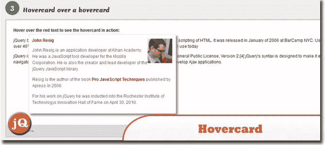
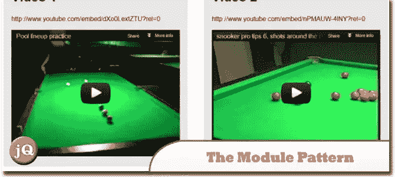
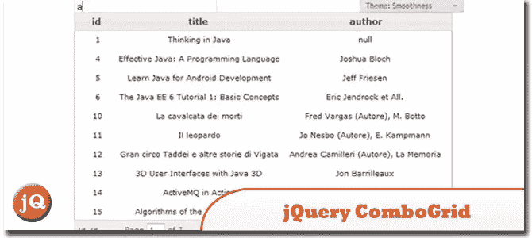
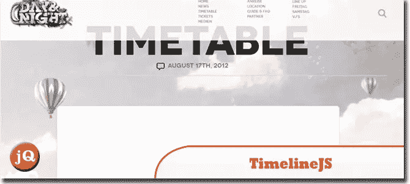
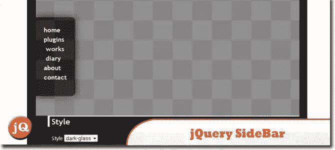
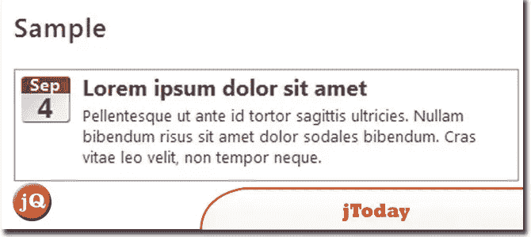
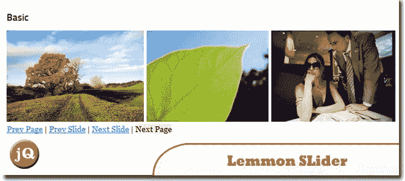

# 今天的 10 个 jQuery 随机插件

> 原文：<https://www.sitepoint.com/random-plugins-sep-12/>

在今天的 **10 个 jQuery Ramdom 插件**中，你会发现一些非常简洁但很酷的插件，你可以很容易地将它们整合到你的博客或网站中，使其更具互动性。一个插件，允许你将一个可定制的，跨浏览器的内容滑块集成到你的网页上，一些制作精美的时间线，简单，直观，等等！享受:)

**相关帖子:**

*   [**10 个随机 Ajax 和 jQuery 插件**](http://www.jquery4u.com/ajax/ajax-jquery-plugins/)
*   [**15 新随机 jQuery 插件 2012**](http://www.jquery4u.com/plugins/15-random-jquery-plugins-2012/)

## 1.悬停卡

一个免费的轻量级 jQuery 插件，使您能够显示与悬停标签、链接或您选择的任何 html 元素相关的信息。
 
[源+演示](http://designwithpc.com/Plugins/Hovercard)

## 2.使用模块模式的基本 jQuery 插件

了解如何使用模块模式创建一个基本的 jQuery 插件，该插件可以通过不同的选项重用。模块模式的主要焦点是保护您的选项和方法，并提供一个很好的公共 API 用于对象。
 
[源+演示](http://www.jquery4u.com/articles/jquery-plugin-module-pattern/#.UD2Au6AYUk4)

## 3.jQuery ComboGrid 插件

像 autocomplete 一样，当添加到输入字段时，使用户能够在键入时快速找到并从预填充的值列表中进行选择，但以表格和分页的方式进行。Combogrid 为选择项目提供了键盘导航支持。
 
[来源](http://combogrid.justmybit.com/) [演示](http://combogrid.justmybit.com/default.php)

## 4.迂回的

一个 jQuery 插件，可以轻松地将无序列表和其他嵌套的 HTML 结构转换成有趣的、交互式的、类似转盘的区域。
 
[源+演示](http://fredhq.com/projects/roundabout/)

## 5.iosSlider

一个 jQuery 插件，允许你将一个可定制的、跨浏览器的内容滑块集成到你的网页中。设计用作内容滑块、旋转木马、滚动网站横幅或图片画廊。
 
[源+演示](http://www.iosscripts.com/iosslider/)

## 6.TimelineJS

制作精美的时间线易于使用且直观。
 
[源+演示](http://timeline.verite.co/)

## 7\. jsPlumb

为开发人员提供了一种在网页上可视化连接元素的方法。它在现代浏览器中使用 SVG 或 Canvas，在 IE 8 和 jQuery 上使用 VML。
 
[来源](https://github.com/sporritt/jsplumb/) [演示](http://jsplumb.org/jquery/demo.html)

## 8.jQuery 侧栏插件

正在显示侧边栏菜单。使用这个插件，我们可以在屏幕的任何一边显示标签式的侧边栏菜单。
 
[源+演示](http://sideroad.secret.jp/plugins/jQuerySideBar/)

## 9.今天

一个 jQuery 插件，显示今天的日历，显示今天的日期或您指定的任何日期。jToday 是用 JavaScript 写的。
 
[源+演示](http://jtoday.codeplex.com/)

## 10.莱蒙滑块

基于 jQuery 的 carousel，支持可变宽度的滑动元素。它很轻便，使用起来非常简单。
 
[源+演示](http://jquery.lemmonjuice.com/plugins/slider-variable-widths.php)

## 分享这篇文章