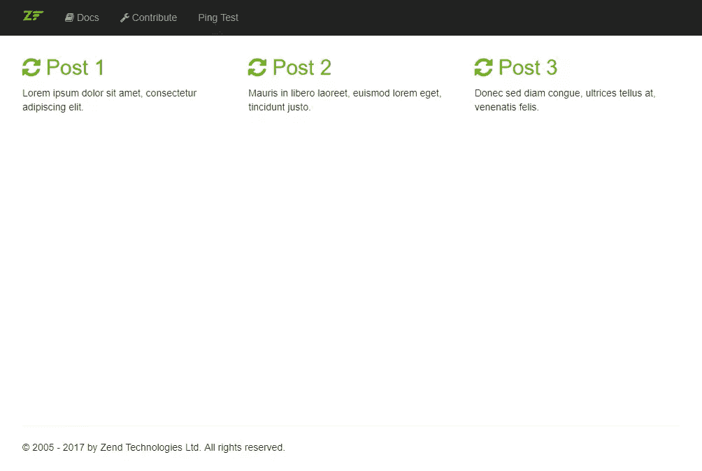

# Zend 表达模块的快速开发

> 原文：<https://www.sitepoint.com/rapid-development-zend-expressive-modules/>

我在编写 [Zend Expressive](https://docs.zendframework.com/zend-expressive/) 模块时学到了一些技巧，想和大家分享一下。

请先跟随[上一篇](https://www.sitepoint.com/rapid-enterprise-app-development-zend-expressive)建立一个合适的工作环境。我解释了如何安装和配置 Zend Expressive with Doctrine、Gulp 和一个抽象反射工厂——总共需要 10 分钟。

在本教程中，我们将在几分钟内构建一个简单的只读博客模块(一个从数据库中列出博客文章的页面)，演示使用 Zend Expressive 可以实现的快速开发。


## 模块设置

从您富有表现力的应用程序运行以下命令开始:

```
./vendor/bin/expressive module:create Blog 
```

这将为一个博客模块生成一些基本代码，并将你的模块自动注册到你的应用程序中。它还会向 Composer 自动加载程序注册您的模块。

### 原则实体和数据库表

让我们制作我们的博客实体和数据库表。首先，我们需要让我们的应用程序知道这个模块提供了原则实体。

打开`src/Blog/src/ConfigProvider.php`并添加以下内容:

```
public function __invoke()
{
    return [
        'dependencies' => $this->getDependencies(),
        'doctrine'     => $this->getDoctrine(),
        'templates'    => $this->getTemplates(),
    ];
}

/**
 * @return array
 */
public function getDoctrine(): array
{
    return [
        'driver' => [
            'orm_default' => [
                'drivers' => [
                    'Blog\Entity' => 'blog_entity',
                ],
            ],
            'blog_entity' => [
                'class' => \Doctrine\ORM\Mapping\Driver\SimplifiedYamlDriver::class,
                'cache' => 'array',
                'paths' => [
                    dirname(__DIR__) . '/config/doctrine' => 'Blog\Entity',
                ],
            ],
        ],
    ];
} 
```

在`src/Blog/config/doctrine/BlogPost.orm.yml`创建博客文章实体配置:

```
---
Blog\Entity\BlogPost:
  type: entity
  table: blog_post
  id:
    id:
      type: integer
      generator:
        strategy: AUTO
  fields:
    title:
      type: string
      length: 255
    content:
      type: string
      length: 16777215 
```

然后，运行`./vendor/bin/doctrine orm:generate-entities src`。

可悲的是，教条不支持并且可能[不会支持 PSR-4](https://github.com/doctrine/DoctrineBundle/issues/282) ,因为该标准没有强制目录结构。

为了解决这个问题，我们需要将`src/Blog/Entity`移到`src/Blog/src/Entity`。

然后，运行以下命令创建数据库表:

```
./vendor/bin/doctrine orm:schema-tool:create 
```

现在，您可以通过运行以下 SQL 来填充数据库表:

```
INSERT INTO expressive.blog_post VALUES 
(null, 'Post 1', 'Lorem ipsum dolor sit amet, consectetur adipiscing elit.'),
(null, 'Post 2', 'Mauris in libero laoreet, euismod lorem eget, tincidunt justo.'),
(null, 'Post 3', 'Donec sed diam congue, ultrices tellus at, venenatis felis.'); 
```

### 按指定路线发送

Expressive 中的模块不注册它们自己的路由。然而，我们可以用这个小技巧让他们这样做。你不必理解它。只要把文件放在适当的位置，并知道它的工作。

用以下内容创建一个`src/Blog/src/Factory/RoutesDelegator.php`:

```
<?php

namespace Blog\Factory;

use Blog\Action;
use Psr\Container\ContainerInterface;
use Zend\Expressive\Application;

class RoutesDelegator
{
    /**
     * @param ContainerInterface $container
     * @param string $serviceName Name of the service being created.
     * @param callable $callback Creates and returns the service.
     * @return Application
     */
    public function __invoke(ContainerInterface $container, $serviceName, callable $callback)
    {
        /** @var $app Application */
        $app = $callback();

        include __DIR__ . '/../../config/routes.php';

        return $app;
    }
} 
```

在`src/Blog/src/ConfigProvider.php`中，将其作为顶层数组键添加到`getDependencies()`方法中:

```
'delegators' => [
    \Zend\Expressive\Application::class => [
        Factory\RoutesDelegator::class,
    ],
], 
```

现在您可以创建一个`src/Blog/config/routes.php`文件并开始添加博客路线。

```
<?php
/**
 * Setup routes with a single request method:
 * @var \Zend\Expressive\Application $app
 *
 * $app->post('/album', App\Action\AlbumCreateAction::class, 'album.create');
 * $app->put('/album/:id', App\Action\AlbumUpdateAction::class, 'album.put');
 * $app->patch('/album/:id', App\Action\AlbumUpdateAction::class, 'album.patch');
 * $app->delete('/album/:id', App\Action\AlbumDeleteAction::class, 'album.delete');
 *
 * Or with multiple request methods:
 *
 * $app->route('/contact', App\Action\ContactAction::class, ['GET', 'POST', ...], 'contact');
 *
 * Or handling all request methods:
 *
 * $app->route('/contact', App\Action\ContactAction::class)->setName('contact');
 *
 * or:
 *
 * $app->route(
 *     '/contact',
 *     App\Action\ContactAction::class,
 *     Zend\Expressive\Router\Route::HTTP_METHOD_ANY,
 *     'contact'
 * );
 */

use Blog\Action;

// Setup routes:
$app->get('/blog', Action\BlogPostListAction::class, 'blog_post_list');
$app->get('/blog/view/:blog_post_id', Action\BlogPostViewAction::class, 'blog_post_view'); 
```

### 行动

然后，我们需要创建一个动作来响应每条路由。

创建`src/Blog/src/Action/BlogPostListAction.php`:

```
<?php

namespace Blog\Action;

use Blog\Entity\BlogPost;
use Doctrine\ORM\EntityManager;
use Interop\Http\ServerMiddleware\DelegateInterface;
use Interop\Http\ServerMiddleware\MiddlewareInterface as ServerMiddlewareInterface;
use Psr\Http\Message\ServerRequestInterface;
use Zend\Diactoros\Response\HtmlResponse;
use Zend\Expressive\Router;
use Zend\Expressive\Template;

class BlogPostListAction implements ServerMiddlewareInterface
{
    /**
     * @var Template\TemplateRendererInterface
     */
    private $templateRenderer;
    /**
     * @var EntityManager
     */
    private $entityManager;

    public function __construct(
        EntityManager $entityManager,
        Template\TemplateRendererInterface $templateRenderer = null
    ) {
        $this->templateRenderer = $templateRenderer;
        $this->entityManager = $entityManager;
    }

    public function process(ServerRequestInterface $request, DelegateInterface $delegate)
    {
        $posts = $this->entityManager->getRepository(BlogPost::class)
            ->findAll();
        $data = [
            'posts' => $posts,
        ];

        return new HtmlResponse($this->templateRenderer->render('blog::list', $data));
    }
} 
```

创建`src/Blog/src/Action/BlogPostViewAction.php`:

```
<?php

namespace Blog\Action;

use Blog\Entity\BlogPost;
use Doctrine\ORM\EntityManager;
use Interop\Http\ServerMiddleware\DelegateInterface;
use Interop\Http\ServerMiddleware\MiddlewareInterface as ServerMiddlewareInterface;
use Psr\Http\Message\ServerRequestInterface;
use Zend\Diactoros\Response\HtmlResponse;
use Zend\Expressive\Router;
use Zend\Expressive\Router\RouteResult;
use Zend\Expressive\Template;

class BlogPostViewAction implements ServerMiddlewareInterface
{
    /**
     * @var Router\RouterInterface
     */
    private $router;
    /**
     * @var Template\TemplateRendererInterface
     */
    private $templateRenderer;
    /**
     * @var EntityManager
     */
    private $entityManager;

    public function __construct(
        EntityManager $entityManager,
        Router\RouterInterface $router,
        Template\TemplateRendererInterface $templateRenderer = null
    ) {

        $this->router = $router;
        $this->templateRenderer = $templateRenderer;
        $this->entityManager = $entityManager;
    }

    public function process(ServerRequestInterface $request, DelegateInterface $delegate)
    {
        /** @var RouteResult $routeResult */
        $routeResult = $request->getAttribute(RouteResult::class);
        $routeMatchedParams = $routeResult->getMatchedParams();
        if (empty($routeMatchedParams['blog_post_id'])) {
            throw new \RuntimeException('Invalid route: "blog_post_id" not set in matched route params.');
        }
        $blogId = $routeMatchedParams['blog_post_id'];

        /** @var BlogPost $blogPost */
        $blogPost = $this->entityManager->find(BlogPost::class, $blogId);
        if (!$blogPost) {
            return new HtmlResponse($this->templateRenderer->render('error::404'), 404);
        }

        $data = [
            'post' => $blogPost,
        ];

        return new HtmlResponse($this->templateRenderer->render('blog::view', $data));
    }
} 
```

### 模板

打开`src/Blog/src/ConfigProvider.php`。并将`getTemplates()`方法更新为:

```
public function getTemplates()
{
    return [
        'paths' => [
            'blog'    => [__DIR__ . '/../templates/blog'],
        ],
    ];
} 
```

现在我们可以制作一些快速模板:

创建`src/Blog/templates/blog/list.html.twig`:

```


Blog


    <div class="row">

    

        <div class="col-md-4">
            <h2>
                <a href="/blog/view/{{ post.id }}">
                    <i class="fa fa-refresh"></i> {{ post.title }}
                </a>
            </h2>
            <p>
                {{ post.content }}
            </p>
        </div>
    
    </div>

 
```

创建`src/Blog/templates/blog/view.html.twig`:

```


{{ post.title }} | Blog 


    <div class="row">
        <div class="col-xs-12">
            <h1>{{ post.title }}</h1>
            <p>
                {{ post.content }}
            </p>
        </div>
    </div>

 
```

如果你打开`/blog` URL，你将有一个功能性的、数据库驱动的博客列表，并且能够浏览页面。



我们将把创建、编辑和删除功能的实现留给您作为家庭作业。

## 结论

在这个简短的教程中，我们看到了用 Zend Expressive 实现一个只读博客模块是多么简单。在不超过几个文件和 10 分钟的工作中，列表页面可以显示我们来自数据库的帖子，并为其他路线做好准备，如`/edit`和`/delete`。

你在你的项目中使用 Zend Expressive 吗？你喜欢/不喜欢它的什么？让我们知道你进展如何！

## 分享这篇文章