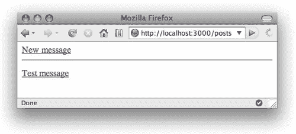

# 快速 RESTful Rails 应用——不，真的！

> 原文：<https://www.sitepoint.com/rapid-restful-rails-apps/>

**你可能已经在我的博客文章 [RESTful Rails 第一部分](https://www.sitepoint.com/restful-rails-part-i/)中读到过，RESTful Rails 是一种在你的 Rails 应用中将 HTTP 动词(`GET`、`POST`、`PUT`和`DELETE`)映射到`CRUD`动作(`Create`、`Read`、`Update`和`Delete`)的方法。如果这句话对你来说完全是胡言乱语，花点时间读读这篇博文，它可能会更有意义。**

好吧，我假设你已经有足够的时间来吸收我的帖子，你充满了污垢和休息。现在，是时候构建一个实际的例子了。

##### 休息 Tumblelog

对于这个例子，我们将构建一个(非常)基本的 tumblelog 类型的应用程序。Tumblelog 是什么？这就像一个博客，但是没有文章。Tumblelog 是一堆频繁但简短的帖子，通常只是链接、引用、快速评论等等。

首先，您需要创建一个名为`rest_tumble`的新 rails 项目，有一个模型和一个控制器。因此，启动您最喜爱的控制台并运行:

```
rails rest_tumble  

cd rest_tumble  

script/generate model post  

script/generate controller posts

Open up db/migrate/001_create_posts.rb and edit it to look like this:

class CreatePosts 

  def up      

    create_table do |t| 

      t.string :message, :null => false, :limit => 140        

      t.timestamps      

    end    

  end     

  def self.down      

    drop_table :posts    

  end  

end  然后，运行:

```
rake db:migrate

Finally, add some validation to the post model (app/models/post.rb):

class Post < ActiveRecord::Base 

  validates_presence_of :message    

  validates_length_of :message, :maximum => 140  

end

Okay, so that now we've created the Rails app, let's configure the controller and the routes. If you cast your mind back to the last article, you would remember that there are four different RESTful verbs. Let's add those four methods to our controller (app/controllers/posts_controller.rb):

class PostsController < ApplicationController    

  # GET - displays all posts    

  def index    

  end     

  # GET - shows one post (based on the supplied id)    

  def show    

  end     

  # POST - creates a new post    

  def create    

  end     

  # PUT - updates an existing post    

  def update    

  end     

  # DELETE - deletes a post    

  def destroy     

  end  

end

You can see from the comments above how each REST verb maps to the controller methods. You'll also notice that even though there are four verbs, we need five methods. The GET verb has two corresponding methods: one shows all the posts, while the other shows a specific post. We actually need two more methods -- new and edit -- to complete the controller.

We add these extra methods for two reasons. First of all, Rails uses the same endpoint (plus maybe an id) for all the verbs, so if we link to /posts (a GET method), Rails will return a list of posts. By adding these methods, we have a way to display the forms.

Let's add the extra methods and some code:

class PostsController < ApplicationController    

  # GET - displays all posts    

  def index      

    @posts = Post.find :all, :order => 'created_at ASC'    

  end     

  # GET - shows one post (based on the supplied id)    

  def show      

    @post = Post.find(params[:id])    

  end     

  # GET - displays a form which can be used to create a post 

  def new  

    @post = Post.new    

  end     

  # POST - create a new post    

  def create      

    @post = Post.new(params[:post])      

    @post.save!      

    redirect_to post_path(@post)    

    rescue ActiveRecord::RecordInvalid      

    render :action => 'new'    

  end     

  # GET - displays a form allowing us to edit an existing post 

  def edit 

    @post = Post.find(params[:id]) 

  end     

  # PUT - update an existing post    

  def update      

    @post = Post.find(params[:id])      

    @post.attributes = params[:post]      

    @post.save!       

    redirect_to post_path(@post)    

    rescue ActiveRecord::RecordInvalid      

    render :action => 'edit'    

  end     

  # DELETE - delete a post    

  def destroy      

    @post  = Post.find(params[:id])      

    @post.destroy      

    redirect_to posts_path    

  end  

end

If you've ever done any Rails coding before, there won't be any surprises here, with the possible exception of the posts_path, post_path, edit_post_path, and delete_post_path methods. These special methods will generate a path to a resource based on entries in routes.rb. If you can't remember the syntax (and it can get a little tricky with things like nested routes), you can run the ever-helpful routes rake task, like so:

rake routes

But for those special methods to work, we need to tell Rails that we have a REST resource. Open up config/routes.rb and add the following line (about halfway through the code, you should see a similar example line that has been commented out; put this line under it):

 map.resources :posts

All this does is tell Rails that we have a posts_controller that wants to be RESTful, so it needs to respond accordingly. Try out the routes rake task to see the results of your handiwork.

To complete the site, we need to add the views -- each GET action needs a corresponding view: index.html.erb, show.html.erb, new.html.erb, and edit.html.erb. I've also created a _form.html.erb partial, because the form code for the new and edit methods is basically the same.这里是`index`视图。这个文件没有什么特别的——我们再次使用`post_path`,这次是作为`link_to`标签的参数:

```
# app/views/posts/index.html.erb  

<%= link_to 'New message', new_post_path %>  

<hr />  

<% if @posts.empty? -%>    

  <p>There are no posts</p>  

<% else -%>    

  <% @posts.each do |post| -%>      

    <p>        

      <%= link_to h(post.message), post_path(post) -%>      

    </p>    

  <% end -%>  

<% end -%>

Here's is the show view. For this page, we show a delete button and edit link:

# show.html.erb  

<p><%= h(@post.message) -%></p>   

<% form_tag post_path(@post), :method => :delete do -%>    

  <%= link_to 'Edit', edit_post_path(@post) -%>    

  <button type="submit">Delete</button>  

<% end -%>

You'll notice in the above code that we have a call to a form_tag incorporating a post_path and a delete method. This instructs the form to perform a DELETE action when the button's pressed. However, when the edit link is clicked, we get taken to the special edit view.`new`和`edit`视图基本上是相同的——以至于我们使用了公共代码的一部分:

 `# app/views/posts/new.html.erb  

<%= error_messages_for('post') %>   

<% form_tag posts_path do -%>    

  <%= render :partial => 'posts/form' %>     

  <fieldset>       

    <button type="submit">Save</button>       

    <%= link_to 'Cancel', posts_path %>    

  </fieldset>  

<% end -%>   

# app/views/posts/edit.html.erb  

<%= error_messages_for('post') %>   

<% form_tag post_path(@post), :method => :put do -%>    

  <%= render :partial => 'posts/form' %>     

  <fieldset>       

    <button type="submit">Update</button>       

    <%= link_to 'Cancel', posts_path %>    

  </fieldset>  

<% end -%>` 

你会注意到，我们再次设置了一个方法属性，这次是用`PUT`。对于`new`视图，我们不需要这样做，因为表单的默认动作`POST`正好适合我们的`new`动作。

最后，让我们来看看部分表单，就 Rails 表单而言，这些表单都很普通:

 `# app/views/posts/_form.html.erb  

<fieldset>    

  <legend>Enter your message</legend>     

  <label for="post_message">Message</label>    

  <%= text_area 'post', 'message' %>  

</fieldset>`
```

让我们运行它，看看会发生什么！运行:
`ruby script/server`
并将浏览器指向`http://localhost:3000/posts`。幸运的话，您应该会看到类似这样的内容:

恭喜你！您刚刚创建了一个 RESTful Rails 应用程序！

##### XML 优点

现在，我将第一个承认这个演示并不真的令人印象深刻——我们可以使用常规的 CRUD Rails 做完全相同的事情。但是 RESTful Rails 变得令人敬畏的地方是当你能够免费发布自己的 web 服务时(嗯，几乎是免费的——我们需要添加几行代码，仅此而已)。

为此，我们需要告诉 Rails 它应该对 XML 请求做出不同的响应。谢天谢地，`respond_to`方法为我们做了所有的繁重工作。所以让我们修改 post 的控制器，如下所示:

`class PostsController < ApplicationController     

  # GET - displays all posts     

  def index       

    @posts = Post.find :all, :order => 'created_at ASC'       

    respond_to do |format|         

      format.xml { render :xml => @posts.to_xml }         

      format.html { }       

    end     

  end      

  # GET - shows one post (based on the supplied id)     

  def show       

    @post = Post.find(params[:id])       

    respond_to do |format|         

      format.xml { render :xml => @post.to_xml }         

      format.html { }       

    end     

  end      

  # GET - displays a form which can be used to create a post     

  def new       

    @post = Post.new     

  end      

  # POST - create a new post     

  def create       

    @post = Post.new(params[:post])       

    @post.save!        

    respond_to do |format|         

      format.html { redirect_to post_path(@post) }         

      format.xml { render :xml => @post.to_xml,   

        :status => :created }       

    end     

    rescue ActiveRecord::RecordInvalid       

    respond_to do |format|         

      format.html { render :action => 'new' }         

      format.xml { render :xml => @post.errors.to_xml,   

        :status => 500 }       

    end     

  end      

  # GET - displays a form allowing us to edit an existing post     

  def edit       

    @post = Post.find(params[:id])     

  end      

  # PUT - update an existing post     

  def update       

    @post = Post.find(params[:id])       

    @post.attributes = params[:post]       

    @post.save!        

    respond_to do |format|         

      format.html { redirect_to post_path(@post) }         

      format.xml { render :xml => @post.to_xml,   

        :status => :ok }       

    end     

    rescue ActiveRecord::RecordInvalid       

    respond_to do |format|         

      format.html { render :action => 'edit' }         

      format.xml { render :xml => @post.errors.to_xml,   

        :status => 500 }       

    end     

  end      

  # DELETE - delete a post     

  def destroy       

    @post  = Post.find(params[:id])       

    @post.destroy       

    respond_to do |format|         

      format.html { redirect_to posts_path }         

      format.xml { head :ok }       

    end     

  end   

end`

让我们看看我们在这里做了什么。我们引入了新的`respond_to`块，它允许我们分离`xml`和`html`请求。我们还向应用程序引入了不同类型的呈现，使用内置的 XML 类型，并利用`to_xml`将对象转换为序列化的 XML 以供输出。最后，这个例子向我们展示了如何输出不同的 HTTP 状态代码。

`index`和`show`方法非常简单:如果请求是 XML，它序列化对象(或多个对象)并把它们发送出去。如果你已经安装了 [curl](http://en.wikipedia.org/wiki/CURL) ，你可以很容易地测试这个。首先，使用 web 界面添加几篇文章，然后在终端中键入以下内容:

`curl -H 'Accept: application/xml' http://localhost:3000/posts.xml`

这个命令应该会返回您所发表的帖子的列表。

接下来的特性——创建、更新和删除——是最有趣的。如果您告诉 Rails 您发布的内容是 XML，它会自动地将数据转换(或者至少尝试转换)成一个数组，我们可以从这个数组创建一个对象。

成功完成 Tumblelog post 后，我们会发送一个 HTTP 状态代码`201 Created`，并附带一个新 post 对象的副本。在响应中发送新对象意味着 web 服务的消费者不必进行另一次查询来找到它，这给了他们一个方便的参考点。

`curl`命令看起来像这样:

`curl -H 'Accept: application/xml' -H 'Content-type: application/xml' http://localhost:3000/posts.xml -d '<post><message>A RESTful message</message></post>' -X POST`

当我们成功更新一个现有的帖子时，我们返回一个常规的状态代码`200 OK`，同样带有对象的副本。例如，如果我们有一个`id`为 4 的对象，我们可以用下面的代码更新它:

`curl -H 'Accept: application/xml' -H 'Content-type: application/xml' http://localhost:3000/posts/4.xml -d '<post><message>An updated RESTful message</message></post>' -X PUT`

在上面的两个例子中，如果提交的数据不完整，Rails 将返回 XML 格式的错误消息，状态代码为`500 Internal Server Error`。

最后一个例子是删除，它只是返回一个`200 OK`响应:

```
curl -H 'Accept: application/xml' -H 'Content-type: application/xml' http://localhost:3000/posts/4.xml -X DELETE
```

##### 在家给你做练习

您可能已经注意到，该站点 XML 版本的错误处理相当简单。如果你试图更新一篇不存在的文章，你会得到一个 HTML 错误。尝试找出一种方法来处理 XML——对其他异常也是如此。这里有一个线索:看看`rescue_from`类方法。

看看您是否能想出如何生成一个适合响应 AJAX 请求的 JSON 版本的站点。一旦开始，你会发现它比你想象的要容易！

##### 收拾一些残局

1.  这些指令使用默认的 SQLite3 数据库在 Rails 2.0.2 上运行，这就是为什么我们不需要配置 MySQL。

3.  我知道 Rails 提供了一个资源生成器，它会自动为你的 RESTful 应用程序生成模型、控制器和一组模板，但是如果我使用它，你不会学到任何东西，不是吗？

5.  正如我在上一篇文章中提到的，没有浏览器能够执行 HTTP `PUT`或`DELETE`请求。Rails 通过注入一个名为`_method`的秘密隐藏输入字段来模拟它们。尝试一下，并在编辑页面上查看源代码。您将看到表单的方法仍然是一个可靠的老方法`POST`，并且有一个额外的输入字段。

7.  I hate the fact that there’s no default delete special method, to allow you to add a deletion confirmation view. I usually add it using the `:member` attribute in the routes file (`config/routes.rb`), so our previous addition to this file would become:

    ```
    map.resources :posts, :member => { :delete => :get }这允许我添加一个`delete`视图(`delete.html.erb`)以及让我在`show`视图(`show.html.erb`)中用一个链接替换删除表单和按钮。
    ```

##### 结论

这就完成了 RESTful Rails 站点的最基本的例子。显然，对于一个正常工作的网站来说，你还需要添加一些其他的东西(比如身份验证)，但是我们所取得的成就仍然令人印象深刻。正如承诺的那样，你可以[下载完整的源代码供自己使用](https://www.sitepoint.com/wp-content/uploads/2008/02/rest_tumble.tgz)。

## 分享这篇文章

```

```