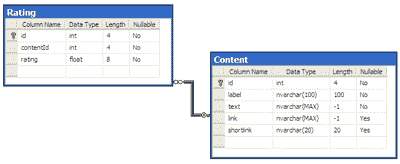
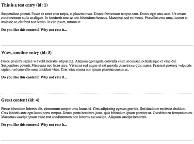
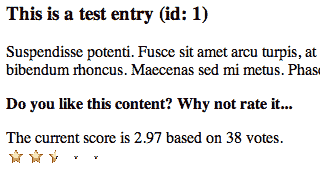
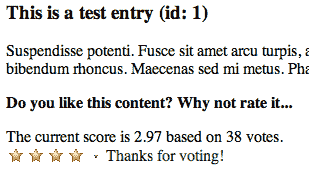

# 五星！向 ColdFusion 应用程序添加评级小部件

> 原文：<https://www.sitepoint.com/rating-widget-coldfusion/>

最新版本 ColdFusion 9 最近刚刚在 Adobe 实验室发布了测试版预览版。ColdFusion 是 Adobe 用于 web 应用程序开发的服务器端平台，我们抓住这个机会将其与全新的 ColdFusion Builder 结合使用。我们将开发一个评级小部件，这样您就可以为您的用户提供对网站内容进行评级的选项。本文的[源代码也可以下载。](https://i2.sitepoint.com/examples/coldfusion-rating-widget-code.zip)

一旦你读完了这篇文章，为什么不用我们的测试来测试一下你的知识呢？如果您是前 200 名完成测验的人之一，Adobe 将向您发送一份印刷的 **Adobe ColdFusion 福音工具包**。

在我们开始之前，我想说本教程假设您已经在非 J2EE 部署的本地开发计算机上安装了独立的 ColdFusion 9 服务器，并且该服务器运行在端口 8500 上。如果您已经将服务器设置为使用本地安装的 HTTP 服务器，如 Apache 或 IIS，那么您可能需要将我提到的文件放在硬盘上的不同位置，并将所有端口引用更改为端口 80。

##### 设置数据库

好了，我们开始吧！我们的任务是向 ColdFusion 应用程序或页面添加评级小部件。因此，我们首先需要有一个 ColdFusion 应用程序，实现这一点的最简单方法是创建几个数据库表来存储内容和评级。如果您已经遵循了 Kay Smoljak 关于构建 URL shortener 应用程序的教程，最简单的方法就是在现有的 Derby 数据库中添加一个评级表。您可以通过执行本教程下载包中的`sql/db.cfm`文件来实现。

对于 SQL Server 的用户，我们的目标是让本教程尽可能简单明了。因此，这里没有深入探讨数据库模式，而是给出了模式图的屏幕截图，以及这两个表是如何关联的。

 *数据库模式为内容和评分表([在新窗口查看大图。](https://i2.sitepoint.com/graphics/1750-db.png) )*

在 SQL Server 2005 或 2008 上创建这两个表的 SQL 脚本是[下载包](https://i2.sitepoint.com/examples/coldfusion-rating-widget-code.zip)的一部分(您必须首先创建内容表，因为这两个脚本都假设在您的 SQL Server 上已经存在一个名为“sitepoint”的数据库)。请记住，这只是一个例子；内容表的列定义是任意选择的，唯一的要求是拥有一个唯一的内容标识符，它可以绑定到评级表中，以关联两个实体。

##### 将项目导入 ColdFusion Builder

在 Kay Smoljak 和我的文章“*cold fusion 9 的新功能*”中，我们讨论了 CF9 中的各种新功能。其中包括前面提到的 ColdFusion Builder。本教程的[代码示例](https://i2.sitepoint.com/examples/coldfusion-rating-widget-code.zip)以导出的 CF Builder 项目的形式提供，可以使用 CF Builder 的文件菜单中的导入向导导入到您自己的项目中。下图显示了项目的文件和文件夹结构。

 * CF Builder 项目结构*

##### 显示内容

我们要看的第一个文件是`index.cfm`。让我们假设这是应该查询和显示内容的主应用程序文件:

```
... 
<cfscript> 
  oContent = CreateObject("component","nz.co.ventego.sitepoint.Content"); 
  data = oContent.getAllContent(); 
</cfscript> 

<body>   
  <cfoutput query="data"> 
    <h3>http://#cgi.server_name#:#cgi.server_port#/URLS/?#data.shortlink# (id: #data.id#)</h3> 
    <p>(#data.link#)</p> 
    <p> 
      <strong>Do you like this content? Why not rate it...</strong><br/> 
    </p> 
    <br/><br/> 
    <hr/> 
  </cfoutput> 
</body> 
...
```

最上面的`<cfscript>`块实例化一个 CFC (ColdFusion 组件)并调用方法`getAllContent`。该方法对我们的数据库执行一个 SQL 查询，并检索所有内容条目的列表，以及评分的数量和平均值(我们允许用户选择 1 到 5 颗星之间的分数):

```
SELECT   C.id, C.label, C.text, C.link, C.shortlink, AVG(R.rating) as average_rating, COUNT(R.id) as number_of_ratings 
FROM  Content C 
LEFT JOIN Rating R ON C.id = R.contentId 
GROUP BY C.id, C.label, C.text, C.link, C.shortlink
```

这个查询的`resultset`存储在页面上的变量数据中，现在可以在那里使用。`<cfoutput>`标签的`query`属性在查询`resultset`上循环，并且为查询的每一行创建从`<h3>`到`<hr>`的 HTML 内容，如下所示。

 *数据库输出([在新窗口中查看大图。](https://i2.sitepoint.com/graphics/1750-entries.png) )*

在`resultset`上循环时，ColdFusion 将评估嵌入在#-符号之间的表达式，并用来自`resultset`的数据替换这些表达式。正如你在代码中看到的，我们使用 Kay 的教程中的`shortlink`和`link`列来评价她的应用程序创建的缩短的 URL。让我指出，内容表也有存储标签和文本的列——所以可以随意在那里存储您喜欢的任何数据，并更改上面在`index.cfm`中显示的显示逻辑，根据您的需要调整输出。

##### 自定义标签

评级小部件将被实现为 ColdFusion 自定义标记。自定义标签早在 ColdFusion 3 或 4 时代就已引入 ColdFusion，但它仍然是为创建页面输出的直接目的而创建模块化功能的最有效、最可取的方式。从高层次的角度来看，自定义标签只不过是将一个`.cfm`文件包含到另一个`.cfm`文件中，但事实上我们在编写和访问这个自定义标签时遵循了一些指导原则和要求。

可以通过`<cfmodule>`调用 CFML 定制标签，并通过指定键值对来传递所谓的定制标签属性。我们的评级小部件需要传递三条信息:它应该绑定的内容标识符、平均当前评级以及我们已经收到的该内容的评级数量。稍后我们将在`index.cfm`中的`<strong>...</strong><br/>`块之后放置下面一行代码来嵌入我们的小部件:

```
<cfmodule template="customtags/widget.cfm" contentId="#data.id#" rating="#data.average_rating#" ratingcount="#data.number_of_ratings#"/>
```

小部件代码本身放在子文件夹`customtags`中，并命名为`widget.cfm`。后者再次表明我们的定制标签只是一个以特定方式编写的普通`.cfm`模板。定制标签本身非常简洁，部分原因是我们利用 Ajax 框架 Spry 来帮助我们管理评级机制本身。让我们先来看看自定义标记:

```
<cfif thisTag.executionMode eq "start">  

  <cfif isDefined("attributes.contentId")>  
    <cfoutput>  
      <p>  
        <cfif isDefined("attributes.rating") AND isDefined("attributes.ratingcount")>  
          <div>The current score is #DecimalFormat(attributes.rating)# based on #attributes.ratingcount# votes.</div>  
        </cfif>  
        <span id="rate_content_#attributes.contentId#" class="ratingContainer">  
            <span class="ratingButton"></span>  
            <span class="ratingButton"></span>  
            <span class="ratingButton"></span>  
            <span class="ratingButton"></span>  
            <span class="ratingButton"></span>  
            <span class="ratingRatedMsg thankyou">Thanks for voting!</span>  
          <input type="text" id="ratingValue_#attributes.contentId#" name="ratingValue_#attributes.contentId#" value="#attributes.rating#" />    
        </span>  

        <script type="text/javascript">  
          var rate_content_#attributes.contentId# = new Spry.Widget.Rating("rate_content_#attributes.contentId#", {allowMultipleRating:false, ratingValueElement:"ratingValue_#attributes.contentId#", postData:"contentId=#attributes.contentId#&rating=@@ratingValue@@", saveUrl:"rate.cfm"});  
        </script>  
      </p>  
    </cfoutput>  
  <cfelse>  
    <p>Please supply a contentId value to use this widget for rating content</p>  
  </cfif>  

</cfif> 
```

自定义标签有不同的执行模式。这一概念背后的思想是，应该能够在页面上的其他现有内容周围“包装”带有开始和结束标记的自定义标记，并将该标记提供的任何功能应用于所包含的内容。在我们的例子中，我们只想调用自定义标记一次，以实际包含评级小部件并将其附加到页面上的一个项目。因此，在自定义标记的开始，我们只是检查该标记的执行模式是否为“start”。如果在任何其他模式下使用标记，则不会创建输出，自定义标记也不会产生任何效果。

从`index.cfm`通过`<cfmodule>`标签传递到定制标签中的所有内容都在定制标签中的所谓“属性范围”中结束。我们正在检查`contentId`是否被传入，因此变量`attributes.contentId`是否被定义。如果是这样的话，我们至少可以安全地运行评级小部件。如果使用我们的`widget.cfm`的开发人员同时为`attributes.rating`和`attributes.ratingcount`传入一个值，我们将显示该内容项的当前平均分数和投票数的信息。

##### 用 Spry 添加 Ajax

在这个有条件的 CFML 代码之后，真正的评级小部件就建立起来了。如前所述，我们将使用一个名为 [Spry](http://labs.adobe.com/technologies/spry/home.html) 的 Ajax 库中的一些小部件。Spry 是一个 lightwight 集合，包含了由 Adobe 开发的小部件、效果和其他有用的 Ajax 相关类，它是在 BSD 许可下发布的。嵌套的一组`<span>`标签创建了评级小部件本身和内部的五个类`ratingButton`元素。我们还加入了一条在用户投票后显示的消息和一个存储当前评分的`<input>`元素。后者将允许我们的评级小部件在加载时显示该点的平均分数(以星为单位)(见下图)。值得一提的是，Spry 显然不是创建动态的基于 Ajax 的小部件的唯一方法；jQuery 或 extJS 等其他 JavaScript 框架也能够提供解决方案。

 *预装“星星”来反映平均分*

在嵌套的`<span>`标签部分下面，我们实际上在 JavaScript 中实例化了一个`Spry.Widget.Rating`类的对象。在我们的场景中，我们将在单个页面上有多个带有评级小部件的内容项，所以我们必须确保我们正在创建`Rating`类的单个实例。这是通过命名实例`rate_content_#attributes.contentId#`来完成的——在 HTML 被传送到客户端并在那里执行 JavaScript 之前，在服务器上评估#中的 ColdFusion 表达式。JavaScript 对象的构造函数被传递了一个对我们刚刚创建的`<span>`部分的`id`的引用，以及一个属性和设置的对象。

后者特别有趣，因为它允许我们以多种方式定制 Spry 小部件。在这里的例子中，我们允许用户在页面上只投票一次(不需要在服务器上进行额外的检查，他们可以在重新加载页面时再次投票),我们定义了一个`saveUrl`和一个`postData`查询字符串。一旦小工具的用户点击一颗星，我们就通过一个`POST`请求将当前的`contentId`和选择的评级发送到`rate.cfm`模板。

通过`POST`请求发送到 CFML 页面的数据成为表单范围内的变量；然后，`rate.cfm`的核心任务是在执行 SQL 语句将新的评级插入评级表之前，检查`contentId`和评级是否实际定义在后者中。对于这种数据访问，我们遵循与之前数据检索中使用的模式相似的模式:

1.  创建数据访问 CFC 的实例:`oRating = CreateObject("component","nz.co.ventego.sitepoint.Rating");`

3.  调用之前实例化的组件的方法:`oRating.insertRating(form.contentId,form.rating);`

`Rating.cfc`的`insertRating`方法执行以下 SQL 查询:

```
<cfquery datasource="sitepoint" name="local.qRating">  
  INSERT   
  INTO Rating(contentId,rating)  
  VALUES (<cfqueryparam cfsqltype="cf_sql_integer" value="#arguments.contentId#"/>,<cfqueryparam cfsqltype="cf_sql_integer" value="#arguments.rating#"/>)  
</cfquery>
```

##### 一个重要的提示

虽然与评级小部件教程间接相关，但值得一提的是，该查询是 CF 开发人员经常忘记的两个非常重要的最佳实践的示例:

*   当你创建动态 SQL 查询时，一定要使用`<cfqueryparam>`标签——否则你就在创建一个谷仓门大小的安全漏洞，并向 SQL 注入黑客敞开大门。`<cfqueryparam>`至少确保正确的数据类型，并额外创建一个参数绑定，这通常比仅使用 ColdFusion 变量执行得更快，如在`...VALUES ('#arguments.contentId#')...`中。
*   记住要确定函数局部变量的范围。在 ColdFusion 8 之前，这必须通过使用关键字`var`声明函数局部变量来完成，例如:`<cfset var abc=345>`。ColdFusion 9 通过将查询对象命名为`local.qRating`，提供了如上所示的本地范围，从而引入了一种新的、替代的(在我看来更好的)语法。

##### 收尾工作

随着这最后一步的完成，我们几乎涵盖了一切。当我们在教程前面查看`index.cfm`文件时，我们只看到了 CFML 代码的一部分，而不是全部。因为我们的页面和`widget.cfm`使用 Spry Rating 类，所以我们需要确保从 Spry 库中导入那些特定的 JavaScript 和 CSS 文件:

```
<!DOCTYPE html PUBLIC "-//W3C//DTD XHTML 1.0 Transitional//EN"   
    "https://www.w3.org/TR/xhtml1/DTD/xhtml1-transitional.dtd">  
<html >  
<head>  
  ...  

  <script language="JavaScript" type="text/javascript" src="js/spry/SpryRating.js"></script>  
  <link href="css/spry/SpryRating.css" rel="stylesheet" type="text/css" />  

  <style type="text/css">  
    .thankyou  
    {  
      float:left;  
      margin-top:1px;    
    }  
  </style>  
</head>
```

对于放置“感谢投票”输出的 HTML `class`,还有一个额外的样式规则。最终输出如下所示。

 *感谢留言*

用户给内容打了 4 星；这样的重新投票是不可能的。重新加载页面会更新分数和投票数量，并使该用户能够再次投票。这个小部件有多种可能的扩展来解决这个问题，每种扩展的可行性取决于小部件的用例。人们可以考虑实现一个非常简单的基于 cookie 的解决方案，但是也可以将这个小部件绑定到一个适当的认证模型中，该模型可以跟踪用户会话和标识符；这样，您可以禁止给定用户对同一内容进行多次投票。

那么你如何评价你的知识呢？[通过我们的测验](https://www.sitepoint.com/quiz/adobe/rating-widget-coldfusion)测试自己，如果您是前 200 名中的一员，将会收到一份印刷的 **Adobe ColdFusion 福音套件**。别忘了[下载 ColdFusion 9 预览版](https://www.sitepoint.com/blog/)、本文中的[源代码，并尝试构建你的第一个 ColdFusion 应用。](https://i2.sitepoint.com/examples/coldfusion-rating-widget-code.zip)

## 分享这篇文章