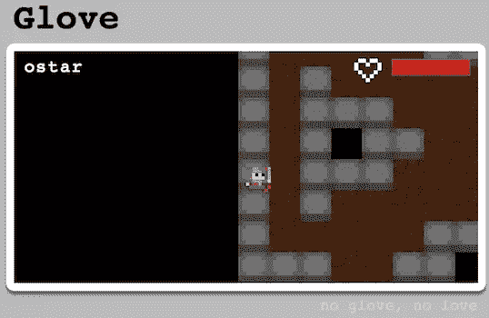
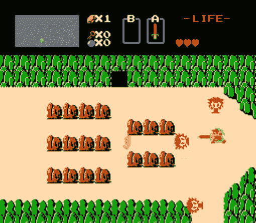

# RC9au–结束

> 原文：<https://www.sitepoint.com/rc9au-the-end/>

RailsCamp9 形成了我生命中最快的 72 个小时。当我从新南威尔士穿越边境回到昆士兰时，我能听到从我所在的地方起飞的飞机持续不断的轰鸣声。虽然我很有可能因为火山喷发的火山灰被困在这里。最后一个晚上是最棒的，毫无疑问，继续读下去就知道了！

因为 RailsCamp 会持续几天，所以每个人都有机会展示他们在课程中一直在钻研的东西。对于人们来说，这是一个互相学习的好方法，也是这个房间里所包含的知识量的一个大展示。

用我的相机拍照几乎是不可能的，但这里有一个 Glove 的截图，基于浏览器，多人游戏，由 node.js 驱动。

手套

目标是通过在地图上移动和攻击敌人来避免死亡。引发了很多对初代塞尔达游戏的回忆。

记忆

几个人用一个想法和一个周末就能完成的事情令人震惊。

构建了如此多的东西，但也许最有趣的是，人们制作的大部分东西都不是用 Ruby 制作的。每个人都对学习其他语言非常感兴趣，这可能是他们保持如此敏锐的原因。

RailsCamp 棒极了。我很想有机会去另一个。作为一个对 Ruby on Rails 知之甚少的人来说，花三天时间来研究它的想法肯定会让人望而生畏。然而，我发现了我见过的最容易接近、最友好的人。如果你对 Ruby/Rails 感兴趣，或者只是对编程感兴趣，如果有机会的话，你不应该错过。

当然，这也是 RailsCamp9 AU 的报道结束的地方。我还有一些采访需要转写，其中包括丹·谢伊的采访，他曾经负责 RubySource，也为其做出了贡献，还有大卫·琼斯，RefineryCMS 的幕后策划者之一，所以你可以期待很快看到这些采访。

## 分享这篇文章