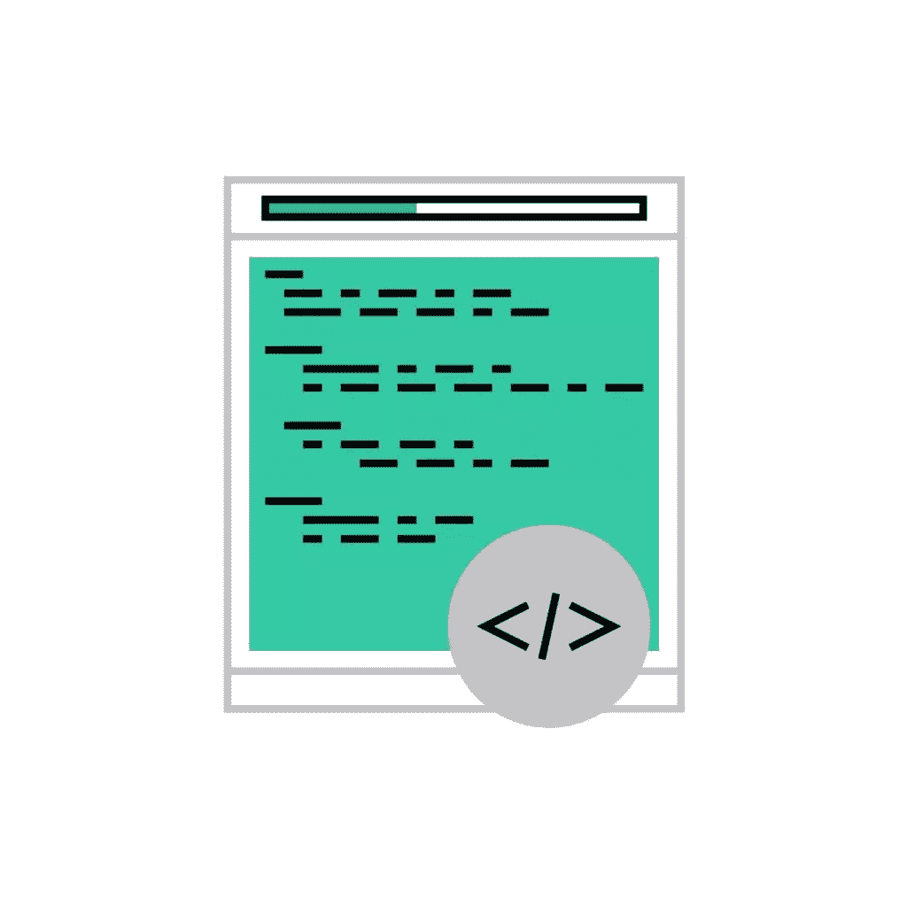
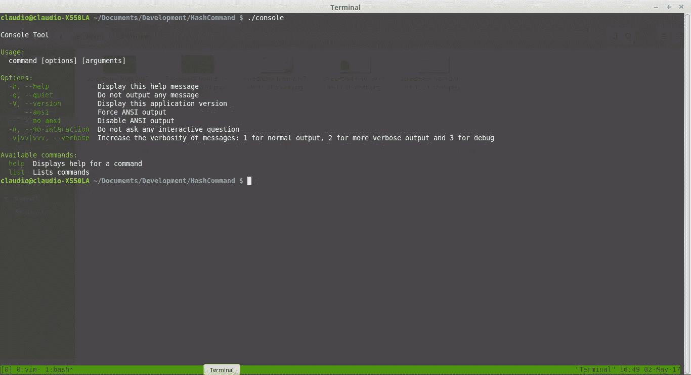
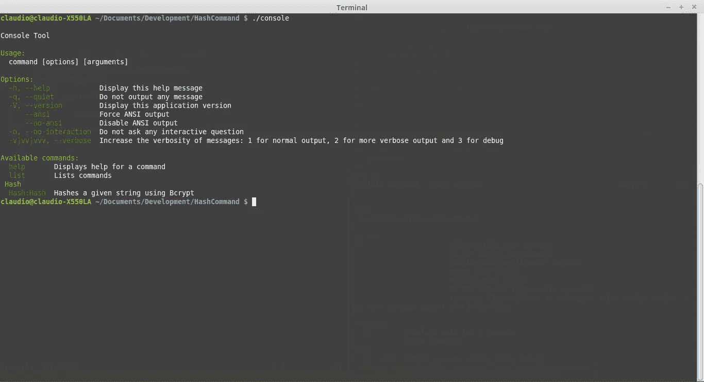
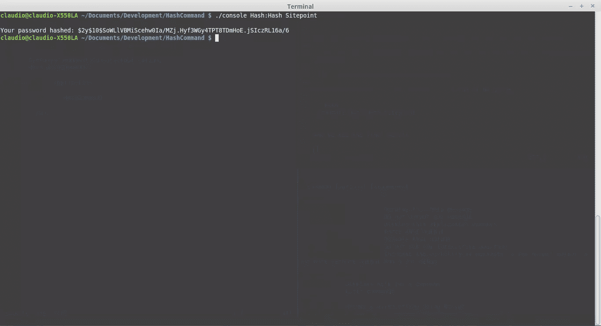

# 重新介绍 Symfony 控制台 CLI PHP 的门外汉！

> 原文：<https://www.sitepoint.com/re-introducing-symfony-console-cli-php-uninitiated/>

**这篇受欢迎的文章于 2017 年 5 月 24 日更新，对这一重要的现代工具进行了更全面的介绍。**

* * *

控制台组件简化了创建美观且可测试的命令行界面的工作

当我们访问 Symfony 控制台组件工具页面时，这就是我们受到欢迎的方式。

作为软件开发人员，我们经常觉得有必要求助于命令行工具。当我们需要执行某种重复的任务时，如迁移数据、执行导入或创建 cron 作业，这些工具非常有用。



Symfony 控制台组件工具为我们创建自己的命令行工具提供了一个简单的框架。

与 Symfony 中的许多组件不同，这是一个独立的包，由 Laravel Artisan 和许多其他著名的 PHP 包使用。

要阅读 Symfony 控制台的替代品，请看[我们的对比文章:PHP 控制台大战！](https://www.sitepoint.com/console-wars-php-cli-libraries/)

## 装置

```
composer require symfony/console 
```

*关于作曲家[的基本信息在这里](https://www.sitepoint.com/re-introducing-composer/)。*

## 创建新命令

要创建一个新命令，我们需要确保我们的文件是可执行的。为了做到这一点，让我们在项目的根目录下创建一个`console`文件。这个文件将是我们的命令管理器。

```
touch console 
```

现在，让我们确保该文件是可执行的。

```
chmod 755 console 
```

然后，让我们确保我们的文件以 [shebang](https://en.wikipedia.org/wiki/Shebang_(Unix)) 开头。符号是出现在脚本开头的字符序列(一个数字符号后跟一个感叹号)。当 shebang 出现时，`exec()`将运行 shebang 之后指定的可执行文件。在我们的例子中，它将作为 PHP 脚本运行。

在此之后，让我们定义我们的控制台应用程序。我们的命令管理器的第一次迭代将如下所示:

```
#!/usr/bin/env php

<?php 

require_once __DIR__ . '/vendor/autoload.php'; 

use Symfony\Component\Console\Application; 

$app = new Application();
$app->run(); 
```

`

让我们仔细看看这些东西。首先，我们自动加载所有的依赖项，然后从控制台组件导入`Application`包。之后，我们将创建一个新的应用程序实例并运行它。

如果我们用`./console`执行我们的脚本，我们应该得到下面的帮助消息:


这是因为我们还没有注册任何命令，我们只是为它们构建了基本框架。

让我们创建脚本，并在新创建的命令管理器中注册它。

对于这个特殊的例子，我们将实现两个简单的命令:一个用于散列字符串，另一个用于确认一个散列是否属于给定的字符串。

我们将创建一个`/src`文件夹，将我们的`Hash.php`类和内容放入其中:

```
<?php

namespace Hash;

class Hash{

    /**
     * Receives a string password and hashes it.
     *
     * @param string $password
     * @return string $hash
     */
    public static function hash($password){
        return password_hash($password, PASSWORD_DEFAULT);
    }

    /**
     * Verifies if an hash corresponds to the given password
     *
     * @param string $password
     * @param string $hash 
     * @return boolean If the hash was generated from the password
     */
    public static function checkHash($string, $hash){
        if( password_verify( $string, $hash ) ){
            return true;
        }
        return false;
    }

} 
```

是时候创建我们的司令部了。让我们创建一个名为`HashCommand.php`的新 PHP 文件。

这个类将从 Symfony 的`Command`类扩展，并实现`configure`和`execute`方法。这些方法对我们的指挥来说是必不可少的，因为它们告诉我们如何看待和行动。

完成后的命令如下所示:

```
<?php

namespace Hash;

use Symfony\Component\Console\Command\Command;
use Symfony\Component\Console\Input\InputInterface;
use Symfony\Component\Console\Output\OutputInterface;
use Symfony\Component\Console\Input\InputArgument;
use Symfony\Component\Console\Input\InputOption;
use Symfony\Component\Console\Formatter\OutputFormatterStyle;

use Hash\Hash;

class HashCommand extends Command{

    protected function configure(){
        $this->setName("Hash:Hash")
                ->setDescription("Hashes a given string using Bcrypt.")
                ->addArgument('Password', InputArgument::REQUIRED, 'What do you wish to hash)');
    }

    protected function execute(InputInterface $input, OutputInterface $output){

        $hash = new Hash();
        $input = $input->getArgument('Password');

        $result = $hash->hash($input);

        $output->writeln('Your password hashed: ' . $result);

    }

} 
```

在`configure`部分，`setName`方法是我们将如何调用我们的命令，`setDescription`是我们命令的描述，`addArgument`是我们说我们的命令将采用一个名为`Password`的参数，这是必需的。

在`execute`部分，我们通过`getArgument`函数访问参数，然后使用我们的`Hash`类散列它。最后，我们使用`OutputInterface`的`writeln`方法将结果打印到屏幕上。

如果我们像这样运行我们的命令，我们将看到什么也没有发生。这是因为我们仍然缺少一个非常重要的步骤。我们仍然需要在`console`中注册我们的命令。

```
#!/usr/bin/env php

<?php 

require_once __DIR__ . '/vendor/autoload.php'; 

use Symfony\Component\Console\Application; 
use Hash\HashCommand;

$app = new Application();

$app->add(new HashCommand());

$app->run(); 
```

命令注册在我们的`console`中，让我们运行它。

如果我们再次运行`./console`命令，我们可以看到现在注册了一个新命令。



让我们运行它:

```
./console Hash:Hash Sitepoint 
```

我们看到了最终的结果:



散列是对`Sitepoint`字符串运行 PHP `hash()`方法的结果。

对于散列确认功能，我们将使用相同的方法，但不是一个，而是两个参数。一个是要确认的字符串，另一个是我们要验证的散列。

我们将在`HashCommand`文件旁边创建一个新的命令文件。姑且称之为`ConfirmCommand`。

```
<?php

namespace Hash;

use Symfony\Component\Console\Command\Command;
use Symfony\Component\Console\Input\InputInterface;
use Symfony\Component\Console\Output\OutputInterface;
use Symfony\Component\Console\Input\InputArgument;
use Symfony\Component\Console\Input\InputOption;
use Symfony\Component\Console\Formatter\OutputFormatterStyle;

use Hash\Hash;

class ConfirmCommand extends Command{

    protected function configure(){
        $this->setName("Hash:Confirm")
                ->setDescription("Confirms an Hash given the string.")
                ->addArgument('Password', InputArgument::REQUIRED, 'What password do you wish to confirm?)')
                ->addArgument('Hash', InputArgument::REQUIRED, 'What is the hashyou want to confirm?');
    }

    protected function execute(InputInterface $input, OutputInterface $output){

        $hash = new Hash();
        $inputPassword = $input->getArgument('Password');
        $inputHash = $input->getArgument('Hash');

        $result = $hash->checkHash($inputPassword, $inputHash);

        if($result){
            $output->writeln('The hash belongs to the password!');
            return true;
        }

        $output->writeln('The hash does not belong to the password!');

    }

} 
```

然后，在`console`中注册该命令。

```
#!/usr/bin/env php

<?php 

require_once __DIR__ . '/vendor/autoload.php'; 

use Symfony\Component\Console\Application; 
use Hash\HashCommand;
use Hash\ConfirmCommand;

$app = new Application();

$app->add(new HashCommand());
$app->add(new ConfirmCommand());

$app->run(); 
```

## 测试

谈到测试，Symfony 为我们提供了一些方便的工具。其中最有用的是`CommandTester`类，因为它提供了特殊的输入和输出类来测试我们的命令，而不需要命令行。

让我们使用`CommandTester`类来实现对我们的`Hash:Hash`命令的测试。

首先，让我们在与`/src`文件夹相同的级别创建一个`/tests`文件夹。

然后，让我们在其中创建我们的测试类，并将其命名为`HashCommandTest.php`:

```
<?php

use Hash\HashCommand;
use Symfony\Component\Console\Application;
use Symfony\Component\Console\Tester\CommandTester;

require_once  './vendor/autoload.php'; 

class HashCommandTest extends \PHPUnit_Framework_TestCase{

    public function testHashIsCorrect(){

        $application = new Application();
        $application->add(new HashCommand());

        $command = $application->find('Hash:Hash');
        $commandTester = new CommandTester($command);
        $commandTester->execute(array(
            'command'      => $command->getName(),
            'Password'         => 'Sitepoint'
        ));    

        $this->assertRegExp('/Your password hashed:/', $commandTester->getDisplay());

    }

} 
```

我们通过使用`Application`类加载命令来开始我们的测试。然后，我们实例化一个新的`CommandTester`。使用 CommandTester，我们可以配置如何调用我们的命令。最后一步是使用`getDisplay()`方法将执行的结果与我们期望的结果进行比较。

`getDisplay()`方法保存命令执行的结果，就像我们在命令行上看到的一样。

## 结论

我们刚刚使用 Symfony 控制台组件创建了两个不同的命令。我们还看到了测试这些命令的好方法。我建议你看看这个组件的各种选项和特性，并在下面的评论部分给我们一些关于你的实验的反馈。

你想在 SitePoint 上看到一些更高级的关于 Symfony 控制台的教程吗？让我们知道！

*我们在本文中写的所有代码都可以在 Github 的[上获得。](https://github.com/sitepoint-editors/HashCliSymfony)*

## 分享这篇文章