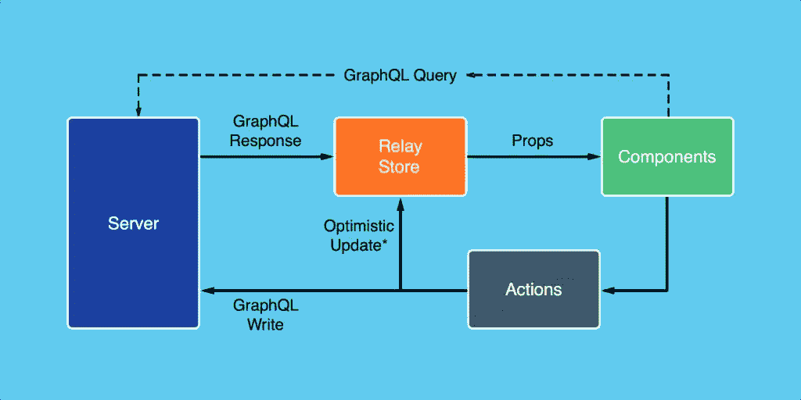

# React、GraphQL 和 Relay 入门(第 2 部分，共 2 部分)

> 原文：<https://www.sitepoint.com/react-graphql-and-relay-part-2-of-2/>

本文是微软网站开发系列的一部分。感谢您对使 SitePoint 成为可能的合作伙伴的支持。

## 介绍

上一篇文章探讨了使用 Relay 的整个开发过程以及 GraphQL 服务器的转换。准备好后端后，React/GraphQL/Relay 应用程序的第二部分是通过 React-Relay web 浏览器应用程序来使用它。通过中继使用 React 的 GraphQL 服务很难设置。这项技术相当新，因此例子的数量、文档的清晰性以及许多技术挑战(不是 bug)都必须克服。这里回顾的例子将是一个成熟的 CRUD(创建、读取、更新和删除)应用程序。除了查询数据之外，还会有一个三种突变的例子，这将对新的继电器开发人员有所帮助，因为在撰写本文时，在线突变的例子很少。

## Widget 工具应用程序

这个简单的应用程序允许用户管理一个小部件表。可以添加、删除和更新小部件。应用程序不使用任何类型的视图路由，这将导致小部件表被另一个视图替换。相反，它是一个简化版的可编辑网格。对于每个小部件，将收集以下信息:

1.  名字
2.  描述
3.  颜色
4.  大小
5.  量
6.  物主

所有者的下拉列表由当前拥有小部件的所有所有者的不同列表填充。

## 反应和传递

中继应用程序只不过是包装在中继容器中的 React 组件。中继容器描述组件所需的数据，中继根容器与 GraphQL-Relay 服务器连接以查询和变更数据。数据需求的描述是通过 GraphQL 片段完成的，而连接的根模式类型是通过中继路由指定的。从概念上讲，这是一个相对简单的设置。挑战在于设置的细节，以及准确理解为了执行各种操作 Relay 需要知道什么。



来源:[React-脸书代码](https://facebook.github.io/react/img/blog/relay-components/relay-architecture.png)

来自这篇[博客文章](https://facebook.github.io/react/blog/2015/03/19/building-the-facebook-news-feed-with-relay.html)的上图描绘了 Relay 与 React 的工作方式。组件通过中继的存储 API 触发动作，中继存储处理来自 GraphQL 服务器的响应。有趣的是，Relay 支持乐观更新的概念，这允许在等待来自服务器的最终确认时将突变记录在存储中。乐观更新允许 UI 通知用户更新已经发生，即使它没有发生。如果更新失败，必须通知用户，并更新 UI。

## 查询数据

从支持中继的 GraphQL 服务器查询数据相对简单，尤其是与突变相比。一旦创建了将使用数据的组件，就创建了描述组件所需数据的中继容器。要设置容器，需要指定容器包装的组件以及定义被查询数据的查询片段。

```
 import Relay from 'react-relay'; 
import WidgetToolComponent from '../components/widget-tool'; 

export default Relay.createContainer(WidgetToolComponent, { 
  fragments: { 
    colors: () => Relay.QL'fragment on __Type { enumValues { name description } }', 
    sizes: () => Relay.QL'fragment on __Type { enumValues { name description } }', 
    viewer: () => Relay.QL' 
      fragment on Viewer { 
        id 
        users(first: 1000) { 
          edges { 
            node { 
              id 
              firstName 
              lastName 
            } 
          } 
        } 
        widgets(first: 1000) { 
          edges { 
            node { 
              id 
              name 
              description 
              color 
              size 
              quantity 
              owner { 
                id 
                firstName 
                lastName 
              } 
            } 
          } 
        } 
      } 
    ' 
  } 
}); 
```

对于这个应用程序，需要三个片段。其中两个片段用于自省查询，以便为定义的两个枚举加载可能的值:颜色和大小。第三个片段用于查询特定查看者的应用程序数据。在这个应用程序中，只有一个未经验证的查看者。在实现身份验证和授权的应用程序中，查看器将代表经过身份验证的用户，在查看器下查询的数据通常仅限于用户可访问的数据。这个限制需要在 GraphQL 服务器中实现。

传递给用户和小部件的参数是 GraphQL-Relay 连接分页参数:`first, after, last, before`。`first`指示从开始处返回多少条边，如果指定了 after，则在光标之后返回。`last`指示返回多少条边，直到指定光标的边数`before`。继电器使用光标来确定起始位置。

一旦定义了片段，就使用中继路由来指定查询和字段，以对其执行查询(包括片段)。

```
 import Relay from 'react-relay'; 

export default class extends Relay.Route { 
  static queries = { 
    colors: () => Relay.QL'query { __type(name:"Color") }', 
    sizes: () => Relay.QL'query { __type(name:"Size") }', 
    viewer: () => Relay.QL'query { viewer }' 
  }; 
  static routeName = 'ViewerRoute'; 
} 
```

一旦中继容器和路由以及 React 组件被编码，就需要用中继根容器对它们进行配置。根容器将向 GraphQL 服务器查询满足中继容器需求所需的数据。使用中继路由和中继容器片段形成查询。一旦接收到数据，根容器将把数据传递给容器，容器将设置 React 组件的属性并呈现它。

```
 import React from 'react'; 
import Relay from 'react-relay'; 
import ReactDOM from 'react-dom'; 
import WidgetToolContainer from './containers/widget-tool-container'; 
import ViewerRoute from './routes/viewer-route'; 

ReactDOM.render( 
  <Relay.RootContainer Component={WidgetToolContainer} route={new ViewerRoute()} />, 
  document.querySelector('main') 
); 
```

在这个应用程序中，根容器将使用由`ViewerRoute`指定的数据和在`WidgetToolContainer`中定义的片段来填充`WidgetToolContainer`。

## 第一个突变:插入

设置突变需要创建一个继承自`Relay.Mutation`的新类，由`react-relay`模块提供。

```
 import Relay from 'react-relay'; 

export default class extends Relay.Mutation { 

  static fragments = { 
    viewer: () => Relay.QL'fragment on Viewer { id }' 
  } 

  getMutation() { 
    return Relay.QL'mutation { insertWidget }'; 
  } 

  // more code here... 

} 
```

需要在这个新类中配置一个名为`fragments`的静态属性。属性列出了变异的数据依赖关系。在这种情况下，小部件的变化取决于查看者 ID。这种变异依赖于查看器 ID，因为在应用程序中检索的所有数据都是通过当前查看器的上下文检索的。因此，当执行变异时，中继将确保观众 ID 总是可用的。

配置了`fragments`后，需要为突变配置`getMutation`功能。`getMutation`函数指定了要执行的 GraphQL 变异的名称，并且应该与 GraphQL 服务器上的变异名称相匹配。

`getVariables`函数将传递给变异构造函数的数据转换成 GraphQL 服务器执行变异所需的结构。传递给构造函数的数据在中继变异对象的`props`上可用。在这种情况下，`props`上的小部件字段用于构建一个新的`widget`对象，作为发送给 GraphQL 服务器上的变异的输入数据对象的属性。这个`widget`对象必须符合 GraphQL 服务器定义的`InputInsertWidget`类型。

```
 getVariables() { 
    return { 
      widget: { 
        name: this.props.name, 
        description: this.props.description, 
        color: this.props.color, 
        size: this.props.size, 
        quantity: this.props.quantity, 
        ownerId: this.props.ownerId 
      } 
    }; 
  } 
```

props 值通过变异的构造函数传递，如下所示。必须将`viewer`设置为使用中继检索的原始查看器。属性`widget`必须设置为 *null* ，因为这将是一个新的小部件，而不是现有的小部件。最后，使用`Object.assign`，来自小部件对象(包含要插入的数据)的属性被复制到传递给构造函数的对象上。

```
 Relay.Store.commitUpdate(new InsertWidgetMutation( 
  Object.assign({ viewer: this.props.viewer, widget: null }, widget) 
)); 
```

当调用`commitUpdate`时，一个新的`InsertWidgetMutation`对象被创建并被传入。函数`commitUpdate`将使用`getConfigs` `and` `getFatQuery`来确定需要更新哪些数据来完成变异。虽然这里没有显示，但是可以配置乐观更新并处理多个突变之间的冲突。这些特性真正展示了 Relay 智能处理数据突变的真正力量。

对于插入小部件变异，配置类型是`RANGE_ADD`，其中一个新的小部件被添加到小部件边缘的范围。连接名称标识小部件被添加到哪个范围的边，并标识将包含新小部件边的数据的 GraphQL 字段的名称。范围行为确定如何将小部件添加到范围中，可以配置单个或多个范围行为。对于小部件连接，默认且唯一的行为是`append`行为。其他档位操作有`prepend`、`ignore`、`refetch`和`remove`。

```
 getConfigs() { 
  return [{ 
    type: 'RANGE_ADD', 
    parentName: 'viewer', 
    parentID: this.props.viewer.id, 
    connectionName: 'widgets', 
    edgeName: 'widgetEdge', 
    rangeBehaviors: { 
      '': 'append' 
    } 
  }]; 
} 
```

`getFatQuery`用于在突变完成后检索更新应用程序所需的所有数据。名称`InsertWidgetPayload`只是附加在 camel case 版本的突变名称末尾的“有效载荷”。受突变影响的所有 GraphQL 字段都应该包含在片段中。

```
 getFatQuery() { 
  return Relay.QL' 
    fragment on InsertWidgetPayload @relay(pattern: true) { 
      viewer { 
        widgets { 
          edges { 
            node { 
              id 
              name 
              description 
              color 
              size 
              quantity 
              owner { 
                id 
                firstName 
                lastName 
              } 
            } 
          } 
        } 
      } 
      widgetEdge 
    } 
  '; 
} 
```

一旦变异完成，Relay 将更新存储，触发 React 来呈现附加到容器的组件。在 GitHub 上查看 insert widget 突变文件的[完整源代码](https://github.com/DevelopIntelligenceBoulder/react-flux-blog/blob/master/blog-post-5%2B6/src/www/js/mutations/insert-widget-mutation.js)。

## 第二个突变:更新

接下来的两个突变类似于插入突变，尽管有一些变化。首先，需要更新突变的名称来调用`updateWidget`突变。

```
 getMutation() { 
  return Relay.QL'mutation { updateWidget }'; 
} 
```

其次，`getConfigs`需要配置为使用`FIELDS_CHANGE`操作更新现有小部件的字段。

```
 getConfigs() { 
  return [{ 
    type: 'FIELDS_CHANGE', 
    fieldIDs: { 
      viewer: this.props.viewer.id 
    } 
  }]; 
} 
```

`FIELDS_CHANGE`操作需要知道 fat 查询的查看者的 ID，从 fat 查询返回的数据将用于更新本地存储。

最后，`getVariables`函数需要更新，以包含小部件的 ID，因为这将是一个更新操作，需要 ID 来标识要更新哪个小部件。

```
 getVariables() { 
  return { 
    widget: { 
      id: this.props.id, 
      name: this.props.name, 
      description: this.props.description, 
      color: this.props.color, 
      size: this.props.size, 
      quantity: this.props.quantity, 
      ownerId: this.props.ownerId 
    } 
  }; 
} 
```

在 GitHub 上查看更新小部件突变的[完整源代码](https://github.com/DevelopIntelligenceBoulder/react-flux-blog/blob/master/blog-post-5%2B6/src/www/js/mutations/update-widget-mutation.js)。

## 第三个突变:删除

类似于`updateWidget`突变，`deleteWidget`突变需要指定如下:

```
 getMutation() { 
  return Relay.QL'mutation { deleteWidget }'; 
} 
```

删除微件的范围操作是`NODE_DELETE`操作。所需的数据是父字段名称、父 ID、要从中删除小部件的连接，以及用于指定要删除的小部件的 ID 字段的字段名称:

```
 getConfigs() { 
  return [{ 
    type: 'NODE_DELETE', 
    parentName: 'viewer',  
    parentID: this.props.viewer.id, 
    connectionName: 'widgets',  
    deletedIDFieldName: 'widgetId' 
  }]; 
} 
```

修改 fat 查询以指定小部件 ID，而不是小部件边缘:

```
 getFatQuery() { 
  return Relay.QL' 
    fragment on DeleteWidgetPayload @relay(pattern: true) { 
      viewer { 
        widgets { 
          edges { 
            node { 
              id 
              name 
              description 
              color 
              size 
              quantity 
              owner { 
                id 
                firstName 
                lastName 
              } 
            } 
          } 
        } 
      } 
      widgetId 
    } 
  '; 
} 
```

最后，发送到 GraphQL 服务器的唯一值是要删除的小部件的 ID。

```
 getVariables() { 
  return { 
    widgetId: this.props.widgetId 
  }; 
} 
```

在 GitHub 上查看 delete widget 变种的[完整源代码](https://github.com/DevelopIntelligenceBoulder/react-flux-blog/blob/master/blog-post-5%2B6/src/www/js/mutations/delete-widget-mutation.js)。

## 结论

React 和 GraphQL 与 Relay 结合起来是相当强大的，一旦掌握了设置。随着时间的推移，Relay 将会有许多增强，并有大量真实世界的例子，这将大大降低学习曲线。随着 React 被用于本机应用程序，React 及其相关技术的生态系统将继续发展，并渗透到整个编程世界。

脸书将成为开源 JavaScript 编程社区的主导者，其更多的本土技术将进入软件开发领域的解决方案。

这篇文章是微软技术传道者和 [DevelopIntelligence](http://www.developintelligence.com/) 关于实用 JavaScript 学习、开源项目和互操作性最佳实践的 web 开发系列的一部分，包括[微软 Edge](http://blogs.windows.com/msedgedev/2015/05/06/a-break-from-the-past-part-2-saying-goodbye-to-activex-vbscript-attachevent/?wt.mc_id=DX_838518) 浏览器和新的 [EdgeHTML 渲染引擎](http://blogs.windows.com/msedgedev/2015/02/26/a-break-from-the-past-the-birth-of-microsofts-new-web-rendering-engine/?wt.mc_id=DX_838518)。DevelopIntelligence 通过他们的前端博客和课程网站 [appendTo](http://appendto.com/) 提供 [JavaScript 培训](http://appendto.com/courses/javascript/)和 [React 培训](http://appendto.com/courses/react-training/)课程。

我们鼓励你在包括微软 Edge(Windows 10 的默认浏览器)在内的各种浏览器和设备上进行测试，在[dev.microsoftedge.com](https://dev.windows.com/en-us/?wt.mc_id=DX_838518)上使用免费工具，包括[虚拟机](https://developer.microsoft.com/en-us/microsoft-edge/tools/vms/?wt.mc_id=DX_838518)来测试微软 Edge 和 IE6 到 IE11 的版本。此外，[访问 Edge 博客](https://blogs.windows.com/msedgedev/?wt.mc_id=DX_838518)，从微软开发者和专家那里获得最新信息。

## 分享这篇文章