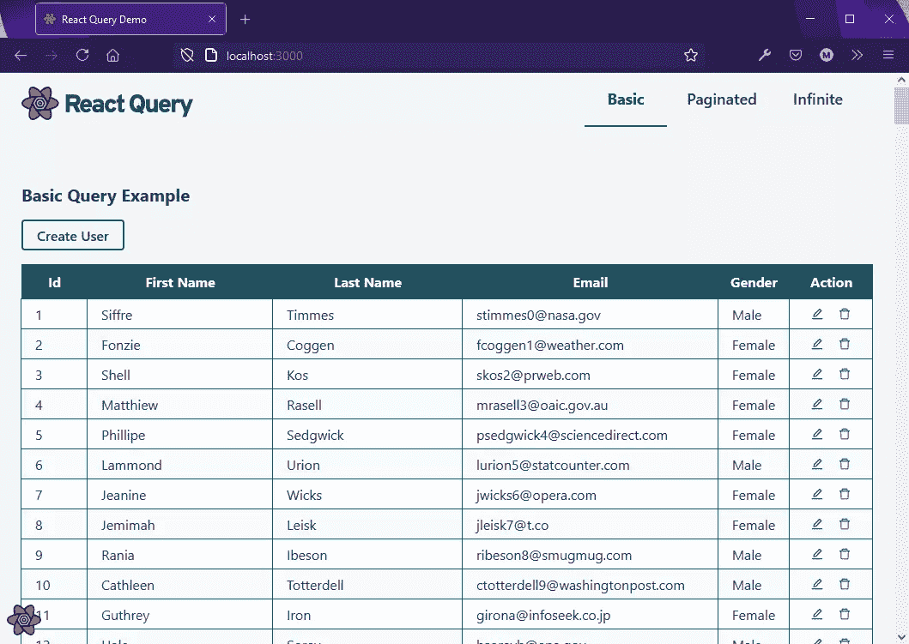
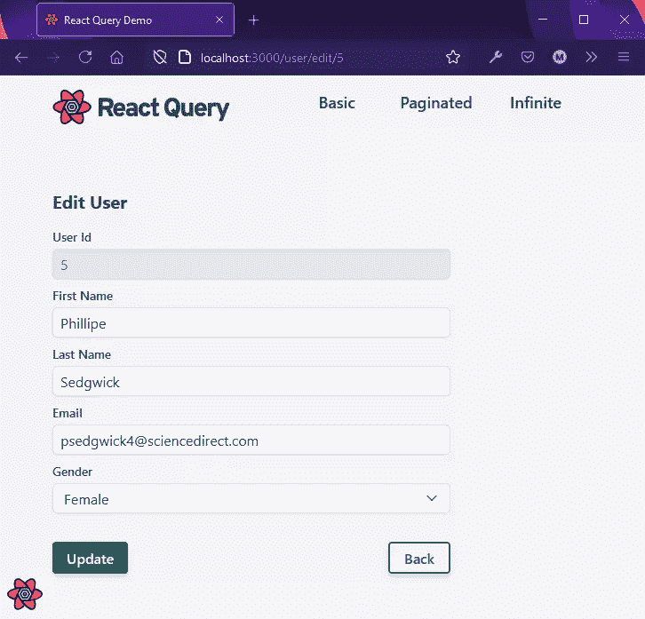
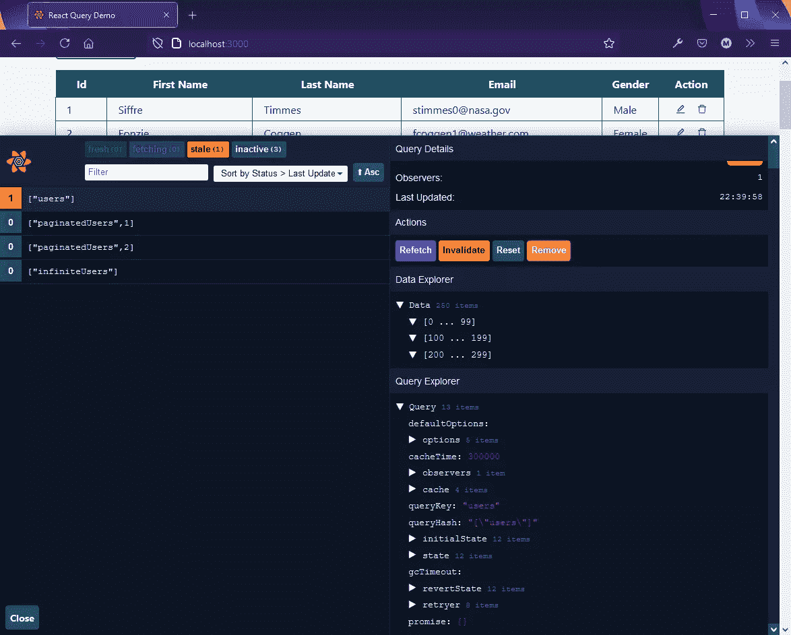
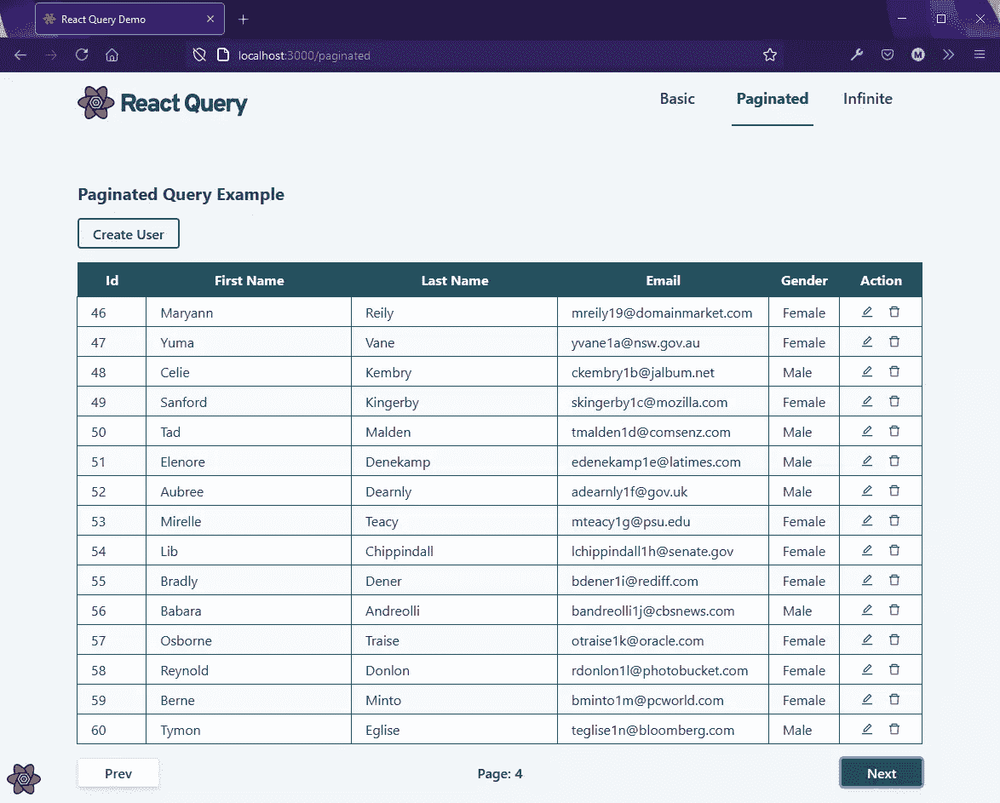
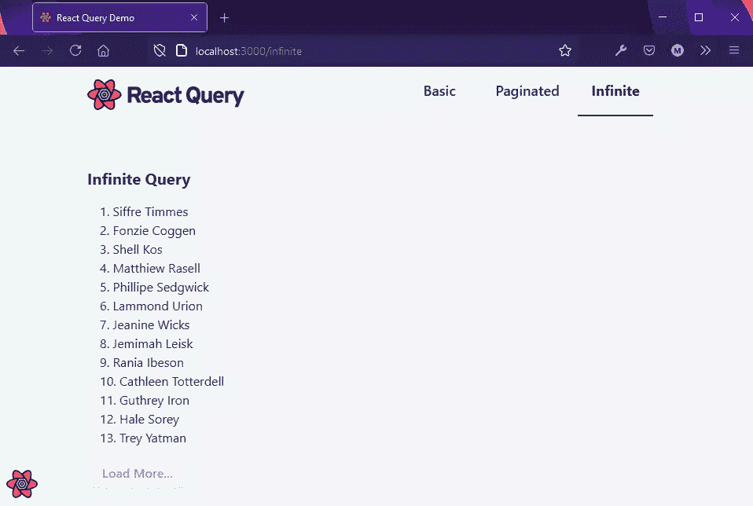

# React 查询 3:获取和管理数据指南

> 原文：<https://www.sitepoint.com/react-query-fetch-manage-data/>

构建前端 CRUD 应用程序通常从简单开始，然后随着您不断添加功能而变得复杂。对于每个 API 端点，您需要处理状态管理、同步、缓存和错误处理。在本文中，您将了解一个名为 [React Query](https://react-query.tanstack.com) 的库，以及它如何帮助解决所有这些问题。该库将自己描述为“缺失的数据提取库”，为 React 提供“服务器状态管理”。

我们将使用一个完整的 [React 查询演示](https://github.com/sitepoint-editors/react-query-demo)项目来了解该库提供的主要特性。然后你将能够把这些知识应用到你自己的项目中。首先，在开始项目设置之前，让我们熟悉一些项目。

## 关于反应查询 3

React Query 是由 [Tanner Linsey](https://github.com/tannerlinsley) 创建的开源项目。最新的主要版本 React Query 3 于 2020 年 12 月[正式发布](https://twitter.com/tannerlinsley/status/1338498989918998532)。在这个新版本中，增加了新功能，改进了现有功能。

你应该知道 React Query 2.x 有很多突破性的变化，在新版本出来之前，React Query 2 . x 非常流行。有一个[迁移指南](https://react-query.tanstack.com/guides/migrating-to-react-query-3)清楚地解释了这些变化，因为你可能会遇到许多为旧版本编写的过时教程。

新版本提供了巨大的改进，许多早期报告的错误已经得到解决。第 3 版虽然已经准备好投入生产，但仍在开发中，因为经常会有新的漏洞出现。

## 先决条件

本文面向已经掌握了以下基本技能和知识的中高级前端开发人员:

*   [反应](https://www.sitepoint.com/getting-started-react-beginners-guide/)
*   [反应路由器](https://www.sitepoint.com/react-router-complete-guide/)
*   [反应钩子](https://www.sitepoint.com/react-hooks/)
*   [REST API 数据获取](https://www.sitepoint.com/premium/courses/how-to-fetch-api-data-with-react-3178)

在开发人员的机器环境中，您需要设置以下内容:

*   [Node.js](https://www.sitepoint.com/quick-tip-multiple-versions-node-nvm/)
*   [去](https://git-scm.com/downloads)
*   休息客户端如[邮递员](https://www.postman.com/)、[失眠](https://insomnia.rest/)或 [VS Code 的休息扩展](https://marketplace.visualstudio.com/items?itemName=humao.rest-client)

这样一来，让我们开始设置演示项目。

## 关于项目

我们将要分析的演示项目是一个 React 前端应用程序，它显示由一个 [REST JSON API 服务器](https://github.com/typicode/json-server)提供的数据。该应用程序仅由五个页面组成，展示了我们将了解的 React 查询功能。这些功能包括:

*   基本查询
*   分页查询
*   无限查询
*   创造突变
*   更新突变
*   删除突变

React Query 确实提供了更多的特性，可惜超出了本文的范围。下面是我们将要使用的应用程序的预览。



## 项目设置

在我们开始设置之前，我认为最好先简单熟悉一下项目中使用的其他依赖项。其中包括:

*   Vite:一个非常快速的构建工具
*   一个非常快速的顺风 CSS 编译器
*   React 钩子表单:一个使用 React 钩子的表单生成器和验证库
*   [反应模态](http://reactcommunity.org/react-modal/):可访问的模态组件
*   Axios :基于承诺的浏览器 HTTP 客户端
*   JSON 服务器:一个完整的，假的 REST API 服务器

要在您的机器上设置 React Query 演示应用程序，请执行以下指令:

```
# Clone the project
git clone git@github.com:sitepoint-editors/react-query-demo.git

# Navigate to project directory
cd react-query-demo

# Install package dependencies
npm install

# Setup database file for `json-server`
cp api/sample.db.json api/db.json

# Start the `json-server`
npm run json-server 
```

`json-server`使用的数据库文件包含一组用户。当您执行`npm run json-server`时，一个假的 API 服务器在端口`3004`上启动。您可以通过<http:>访问用户数据。执行一个 GET 请求将产生下面的示例 JSON 响应:</http:>

```
[
  {
    "id": 1,
    "first_name": "Siffre",
    "last_name": "Timm",
    "email": "stimmes0@nasa.govz",
    "gender": "Male"
  },
  {
    "id": 2,
    "first_name": "Fonzie",
    "last_name": "Coggen",
    "email": "fcoggen1@weather.com",
    "gender": "Female"
  },
  {
    "id": 3,
    "first_name": "Shell",
    "last_name": "Kos",
    "email": "skos2@prweb.com",
    "gender": "Female"
  }
] 
```

接下来，启动将运行前端代码的开发服务器:

```
# In another terminal, start the React dev server
npm run dev 
```

打开浏览器，打开 [http://localhost:3000](http://localhost:3000) 访问应用程序。你应该有和上面预览一样的体验。请确保执行以下任务，以便彻底了解该应用程序的功能:

*   查看基本查询页面(主页)。
*   访问分页页面并与**上一页**和**下一页**按钮互动
*   访问无限页面并与**加载更多**按钮互动。
*   返回基本查询页面，点击**创建用户**按钮。您将被定向到“创建用户”页面。填写表格并点击**保存**按钮。
*   在用户表上，找到**编辑**图标。点击它。这将带您到编辑用户页面。做任何你喜欢的改变，然后点击**保存**按钮。
*   在用户表上，找到**删除**图标。点击它。这将启动一个模式对话框，要求您确认删除操作。点击**删除**按钮进行确认。

一旦我们完成了上述所有任务，我们就可以开始分解项目了。务必查看项目结构，以便了解每个构件和视图的位置。我将在整篇文章中提供这些内容的精简版本，以便您能够理解在项目中使用 React Query 的基本原理。

*注意:精简版去掉了`classNames`、本地状态和其他 UI 组件，这些都不是讨论的重点。*

## 正在安装 React 查询

React Query 可以使用以下命令安装在空白或现有的 React 项目上:

```
npm install react-query 
```

这个包提供了您需要的一切——包括 Devtools 实用工具特性，我们将在后面的小节中探讨它。安装完软件包后，您需要更新最顶层的组件——`App.jsx`——如下所示:

```
import { QueryClient, QueryClientProvider } from "react-query";

function App() {
  const queryClient = new QueryClient();

  return (
    <QueryClientProvider client={queryClient}> /* place application containers/views here */ </QueryClientProvider>
  );
}

export default App; 
```

`QueryClientProvider`的任何子组件都可以访问 React 查询库提供的钩子。我们将在本文中使用的挂钩是:

*   [T2`useQuery`](https://react-query.tanstack.com/reference/useQuery)
*   [T2`useInfiniteQuery`](https://react-query.tanstack.com/reference/useInfiniteQuery)
*   [T2`useMutation`](https://react-query.tanstack.com/reference/useMutation)
*   [T2`useQueryClient`](https://react-query.tanstack.com/reference/useQueryClient)

以下是`App.jsx`的更新(简化)版本，包含我们将使用的子视图:

```
import { QueryClient, QueryClientProvider } from "react-query";

import BasicQuery from "./views/BasicQuery";
import InfiniteQuery from "./views/InfiniteQuery";
import PaginatedQuery from "./views/PaginatedQuery";
import CreateUser from "./views/CreateUser";
import EditUser from "./views/EditUser";

function App() {
  const queryClient = new QueryClient();

  return (
    <QueryClientProvider client={queryClient}>  <Switch>  <Route path="/" exact>  <BasicQuery />  </Route>  <Route path="/paginated">  <PaginatedQuery />  </Route>  <Route path="/infinite">  <InfiniteQuery />  </Route>  <Route path="/user/create">  <CreateUser />  </Route>  <Route path="/user/edit/:id">  <EditUser />  </Route>  </Switch>  </QueryClientProvider>
  );
}

export default App; 
```

### UI 组件

在我们进入下一节之前，我认为最好先了解一下项目中用于显示、创建和更新用户数据的主要 UI 组件。我们从`components/UserTable.jsx`开始。这是显示用户数据的表格组件，由`BasicQuery.jsx`和`PaginatedQuery.jsx`页面使用。它需要一个道具，一个**用户阵列**。下面是完整文件的精简版本:

```
import React, { useState, useContext } from "react";
import { Link } from "react-router-dom";
import EditIcon from "../icons/edit";
import DeleteIcon from "../icons/delete";

function UserTable({ users }) {
  const rows = users.map((user, index) => (
    <tr key={index}>  <td>{user.id}</td>  <td>{user.first_name}</td>  <td>{user.last_name}</td>  <td>{user.email}</td>  <td>{user.gender}</td>  <td>  <Link to={`/user/edit/${user.id}`}>  <EditIcon />  </Link>  <button onClick={() => showDeleteModal(user.id)}>  <DeleteIcon />  </button>  </td>  </tr>
  ));

  return (
    <React.Fragment>  <div>  <Link to="/user/create">Create User</Link>  </div>  <table>  <thead>  <tr>  <th>Id</th>  <th>First Name</th>  <th>Last Name</th>  <th>Email</th>  <th>Gender</th>  <th>Action</th>  </tr>  </thead>  <tbody>{rows}</tbody>  </table>  </React.Fragment>
  );
} 
```

接下来我们来看`components/UserForm.jsx`。这个表单组件被`views/CreateUser.jsx`和`views/EditUser.jsx`页面用来执行它们的任务。下面是该组件的简化版本:

```
import React from "react";
import { useForm } from "react-hook-form";
import { useHistory } from "react-router-dom";

import "./form.css";

function UserForm({ user, submitText, submitAction }) {
  const {
    register,
    formState: { errors },
    handleSubmit,
  } = useForm({
    defaultValues: user || {},
  });

  const history = useHistory();

  return (
    <div>  <form onSubmit={handleSubmit(submitAction)}>  {user && (
          <section className="field">  <label htmlFor="id">User Id</label>  <input type="text" name="id" value={user.id} disabled />  </section>
        )}  <section className="field">  <div>  <label htmlFor="first_name">First Name</label> <input
              type="text" {...register("first_name", { required: true })} /> <span className="errors">  {errors.first_name && "First name is required"}  </span>  </div>  <div>  <label htmlFor="last_name">Last Name</label> <input type="text" {...register("last_name", { required: true })} /> <span className="errors">  {errors.last_name && "Last name is required"}  </span>  </div>  </section>  <section className="field">  <label htmlFor="email">Email</label> <input
            type="email" {...register("email", { required: true, pattern: /^\S+@\S+$/i })} /> <span className="errors">  {errors.email &&
              errors.email.type === "required" &&
              "Email is required"}  {errors.email &&
              errors.email.type === "pattern" &&
              "Provide a valid email address"}  </span>  </section>  <section className="field">  <label htmlFor="gender">Gender</label> <select {...register("gender", { required: true })}> <option value=""></option>  <option value="Male">Male</option>  <option value="Female">Female</option>  </select>  <span className="errors">  {errors.gender && "Gender is required"}  </span>  </section>  <div>  <button type="submit">  {submitText}  </button>  <button type="button" onClick={() => history.goBack()}> Back </button>  </div>  </form>  </div>
  );
}

export default UserForm; 
```

`UserForm`组件设计用于对提交的用户数据进行验证。它需要以下道具:

*   `user`:数据对象(可选)
*   `submitText`:提交按钮**的文本值**
*   `submitAction`:功能处理表单提交



在下一节中，我们将开始研究 React Query 的主要特性。

## 基本查询

使用 React Query 获取数据非常简单。您需要做的就是定义一个获取函数，然后将它作为参数传递给`useQuery`变异。你可以在下面看到一个`views/BasicQuery.jsx`页面的例子:

```
import React from "react";
import { useQuery } from "react-query";

import UserTable from "../components/UserTable";

function BasicQuery() {
  const fetchAllUsers = async () =>
    await (await fetch("http://localhost:3004/users")).json();

  const { data, error, status } = useQuery("users", fetchAllUsers);

  return (
    <div>  <h2>Basic Query Example</h2>  <div>  {status === "error" && <div>{error.message}</div>}  {status === "loading" && <div>Loading...</div>}  {status === "success" && <UserTable users={data} />}  </div>  </div>
  );
}

export default BasicQuery; 
```

让我们来分解一下:

1.  首先，我们通过语句`import { useQuery } from "react-query"`导入`useQuery`。
2.  接下来，我们声明一个 promise 函数——`fetchAllUsers`——它从我们的假 JSON API 服务器中检索数据。
3.  接下来，我们启动`useQuery`钩子函数。下列参数是必需的:
    *   一个**查询键**，可以是字符串，也可以是数组。它用于识别和跟踪查询结果，以便进行缓存。
    *   一个**查询函数**，它必须返回一个承诺，要么解析数据，要么抛出一个错误。
4.  `useQuery`函数返回以下状态变量:
    *   `data`:这是 fetch (promise)函数的结果。
    *   `error`:如果抛出一个错误，这个将被设置。否则，如果获取请求成功，则为空。
    *   `status`:这个字符串的值可以是`idle`、`loading`、`error`或`success`。

`useQuery`钩子接受更多的参数并返回更多的变量，这些都记录在 React 查询文档的[中。上面的例子旨在演示使用库执行 API 请求所需的最小设置。](https://react-query.tanstack.com/reference/useQuery)

另外，注意`status`变量是如何反应的。初始设置为`loading`。然后，当请求成功时，它被设置为`success`，导致 React 重新呈现组件并更新 UI。

## 查询单个记录

查询单个记录可以使用上一节中使用的类似语法来实现。这里的区别在于:

*   您需要通过匿名函数向 fetch 函数传递一个参数
*   您需要为每条记录指定一个唯一的查询名，这可以通过使用一个数组来实现:`[queryName, {params}]`

```
function() {
   const fetchUser = async (id) =>
    await (await fetch(`http://localhost:3004/users/${id}`)).json();

  const { data, error, status } = useQuery(["user", { id }], (id) =>
    fetchUser(id)
  );

  return (...)
} 
```

然而，还有一种传递参数的替代方式。考虑以下代码:

```
const { data, error, status } = useQuery(["user", { id }], fetchUser); 
```

使用上面的语法，您需要修改`fetchUser`函数来接受一个`queryKey`对象，如下所示:

```
const fetchUser = async ({ queryKey }) => {
  const [_key, { id }] = queryKey;
  const response = await fetch(`http://localhost:3004/users/${id}`);

  if (!response.ok) {
    throw new Error(response.statusText);
  }

  return response.json();
}; 
```

由于我们使用 Fetch API，404 响应[不被认为是错误](https://github.com/github/fetch/issues/155)。这就是为什么我们需要编写额外的逻辑来处理这种情况。使用 Axios API 客户端库时，不需要执行这个额外的检查。

查看`views/EditUser.jsx`看看整个代码是如何实现的。这里有一些突变代码，我们将在本文后面讨论。

## 开发工具

使用 [Devtools](https://react-query.tanstack.com/devtools) 可以很容易地调试 React 查询代码。这是一个在应用程序代码执行时实时可视化 React Query 内部工作的实用程序。它的设置如下:

```
import { ReactQueryDevtools } from "react-query/devtools";

function App() {
  return (
    <QueryClientProvider client={queryClient}>  {/* The rest of your application */}  <ReactQueryDevtools initialIsOpen={false} />  </QueryClientProvider>
  );
} 
```

当您运行您的应用程序时，左下角会有一个图标，您可以单击它来展开 Devtools 面板。



正如您在上面的截图中看到的，您可以观察许多属性来帮助您调试应用程序。在下一节中，我们将查看几个配置选项，以帮助您理解这些属性和操作。

## 配置

在 React 查询应用程序中，当页面第一次加载时，库将从 API 获取数据，呈现给你，然后缓存它。发生这种情况时，您会注意到一条“正在加载”的消息。

当您第二次访问该页面时，React Query 将首先从缓存中返回数据，然后在后台执行提取。一旦异步过程完成，它就更新页面上的数据。当这种情况发生时，你根本看不到“正在加载”的消息。

缓存允许您的前端应用程序变得更快，特别是如果您有一个缓慢的 API 服务器。但是，它可能会出现用户开始使用过时数据的情况。在 React 查询中，这被称为陈旧数据。

有几个配置选项可以帮助您优化应用的性能或可靠性:

*   **缓存时间**:默认为 5 分钟或 300000 毫秒
*   **staleTime** :默认为 0 毫秒

`cacheTime`确定数据在丢弃之前可以在缓存中保存多长时间。`staleTime`确定数据过期的时间。当数据变得陈旧时，它会被标记为重新获取。这将在用户下次再次访问该页面或重新聚焦浏览器窗口/选项卡时发生。

如果您知道正在获取的数据被更新的可能性很低，那么增加`staleTime`值可以提高应用程序的性能。您可以通过向`useQuery`钩子传递第三个参数来定义这些设置:

```
 function Todos() {

   const result = useQuery('todos', () => fetch('/todos'), {
     staleTime: 60 * 1000 // 1 minute
     cacheTime: 60 * 1000 * 10 // 10 minutes
   })

 } 
```

您也可以在任一属性上设置`Infinity`。这将禁用对`cacheTime`的垃圾收集，并使`staleTime`的数据永远不会过时。

## 分页查询

在基本查询示例中，所有 250 条记录都是一次性加载的。一种更加用户友好的方法是对数据进行分页。我们可以使用`useQuery`钩子来实现。在 React Query 的以前版本中，这是使用`usePaginateQuery`钩子完成的，React Query 3 中不再提供这个钩子。

分页实现实际上是从后端 API 服务器开始的。幸运的是，`json-server`确实有[分页支持](https://www.npmjs.com/package/json-server#paginate)。要访问此功能，您需要将以下参数附加到端点的 URL:

*   `_page`:页码
*   `_limit`:每页记录数

例: [http://localhost:3004/users？_page=5 & _limit=10](http://localhost:3004/users?_page=5&_limit=10) 。

现在让我们看看如何使用`useQuery` hook 实现分页:

```
import React, { useState } from "react";
import { useQuery } from "react-query";

const pageLimit = 15;

const fetchUsers = async (page = 1) =>
  await (
    await fetch(`http://localhost:3004/users?_page=${page}&_limit=${pageLimit}`)
  ).json();

function Users() {
  const [page, setPage] = useState(1);
  const { data } = useQuery(["paginatedUsers", page], () => fetchUsers(page), {
    keepPreviousData: true,
  });
} 
```

这个例子与我们之前看到的基本查询非常相似。然而，有几个关键的区别:

1.  promise 函数`fetchUsers`现在接受一个整数`page`参数。使用变量`pageLimit`设置页面尺寸。
2.  `useQuery`钩子签名看起来很不一样:
    *   第一个参数是一个数组`["paginatedUsers", page]`。这是为了单独跟踪每个页面的数据。
    *   第二个参数是匿名函数。这样定义是为了将`page`参数传递给`fetchUsers`函数。
    *   第三个参数是一个对象配置，我们可以在其中传递多个设置。在这种情况下，将`keepPreviousData`属性设置为 true 会通知 React Query 缓存以前获取的数据。默认情况下，此设置为 false，这将导致刷新以前查看的页面。

为了进一步提高页面导航性能，您可以在用户导航到下一页之前预取该页。这里有一个例子:

```
import { useQuery, useQueryClient } from "react-query";

function Example() {
  const queryClient = useQueryClient();
  const [page, setPage] = React.useState(0);

  // Prefetch the next page!
  React.useEffect(() => {
    if (data?.hasMore) {
      queryClient.prefetchQuery(["paginatedUsers", page + 1], () =>
        fetchUsers(page + 1)
      );
    }
  }, [data, page, queryClient]);
} 
```

注意`data.hasMore`是一个特定于服务器 API 的属性。不幸的是，我们的假 API 服务器不支持这一点。当使用真正的 API 后端时，您可能会得到类似这样的响应:

```
{
  "items": [
    {
      "lives": 9,
      "type": "tabby",
      "name": "Bobby"
    },
    {
      "lives": 2,
      "type": "Ginger",
      "name": "Garfield"
    },
    ...
  ],
  "meta": {
    "itemCount": 10,
    "totalItems": 20,
    "itemsPerPage": 10,
    "totalPages": 5,
    "currentPage": 2
  },
  "links" : {
    "first": "http://cats.com/cats?limit=10",
    "previous": "http://cats.com/cats?page=1&limit=10",
    "next": "http://cats.com/cats?page=3&limit=10",
    "last": "http://cats.com/cats?page=5&limit=10"
  }
} 
```

注意，响应主体结构中提供了额外的元数据，可以帮助验证分页按钮。使用`json-server`，执行分页请求会得到以下输出:

```
HTTP/1.1 200 OK
X-Powered-By: Express
Vary: Origin, Accept-Encoding
Access-Control-Allow-Credentials: true
Cache-Control: no-cache
Pragma: no-cache
Expires: -1
X-Total-Count: 250
Access-Control-Expose-Headers: X-Total-Count, Link
Link: <http://localhost:3004/users?_page=1&_limit=10>; rel="first", <http://localhost:3004/users?_page=4&_limit=10>; rel="prev", <http://localhost:3004/users?_page=6&_limit=10>; rel="next", <http://localhost:3004/users?_page=25&_limit=10>; rel="last"
X-Content-Type-Options: nosniff
Content-Type: application/json; charset=utf-8
ETag: W/"567-FwlexqEes6H/+Xt0qULv2G4aUN4"
Content-Encoding: gzip
Date: Thu, 29 Apr 2021 15:24:58 GMT
Connection: close
Transfer-Encoding: chunked

[
  {
    "id": 42,
    "first_name": "Whitby",
    "last_name": "Damrell",
    "email": "wdamrell15@i2i.jp",
    "gender": "Female"
  },
  {
    "id": 43,
    "first_name": "Fairleigh",
    "last_name": "Staner",
    "email": "fstaner16@tripod.com",
    "gender": "Female"
  },
  ...
] 
```

注意标题部分中提供的**链接**属性。我们可以使用这些信息来编写更好的分页代码。不幸的是，数据的格式不适合 JavaScript 代码使用。我们将在下一节研究如何处理这个问题。现在，我们将只使用一个简单的检查来确定我们是否到达了最后一页。

下面是最终`views/PaginatedQuery.jsx`页面的精简版:

```
import React, { useState } from "react";
import { useQuery } from "react-query";

import UserTable from "../components/UserTable";

const pageLimit = 15;

const fetchUsers = async (page = 1) => {
  const response = await fetch(
    `http://localhost:3004/users?_page=${page}&_limit=${pageLimit}`
  );
  return response.json();
};

function PaginatedQuery() {
  const [page, setPage] = useState(1);
  const { data, isLoading, isError, status, error } = useQuery(
    ["paginatedUsers", page],
    () => fetchUsers(page),
    {
      keepPreviousData: true,
    }
  );

  const prevPage = () => {
    if (page > 1) setPage(page - 1);
  };

  const nextPage = () => {
    setPage(page + 1);
  };

  return (
    <div>  <h2>Paginated Query Example</h2>  <div>  {isError && <div>{error.message}</div>}  {isLoading && <div>Loading...</div>}  {status === "success" && <UserTable users={data} />}  </div>  {/* start of pagination buttons */}  <div>  <button onClick={prevPage} disabled={page <= 1}> Prev </button>  <span>Page: {page}</span>  <button onClick={nextPage} disabled={data && data.length < pageLimit}> Next </button>  </div>  {/* end of pagination buttons */}  </div>
  );
}

export default PaginatedQuery; 
```

在上面的代码示例中，我们添加了函数和按钮来提供分页交互。请注意，我们还使用了`isLoading`和`isError`状态，这是使用`status`状态的简单方便的替代方法。

下面是`PaginatedQuery`页面截图。



## 无限查询

到目前为止，我们只使用了`useQuery`钩子来管理从后端 API 获取的数据。在本节中，您将学习如何实现“无限滚动”特性。用户需要点击**加载更多**按钮来触发数据获取。

为了实现这一点，我们将使用`useInfiniteQuery`钩子，它与`useQuery`钩子非常相似，但是有几个关键的区别。首先，您需要一个支持光标分页的后端 API:

```
fetch("/api/projects?cursor=0"); 
```

不幸的是，我们的后端没有。出于我们的目的，我们将使用现有的分页支持来实现一个变通方法，以使无限查询工作。让我们看看如何定义我们的`fetchUsers`函数:

```
const pageLimit = 5;

const fetchUsers = ({ pageParam = 1 }) =>
  axios.get(
    `http://localhost:3004/users?_page=${pageParam}&_limit=${pageLimit}`
  ); 
```

函数`fetchUsers`类似于`PaginatedQuery`的版本，除了我们返回一个完整的`Response`对象，而不是一个解析的数据数组。我们这样做是为了能够访问头中提供的`Link`对象:

```
Link: <http://localhost:3004/users?_page=1&_limit=10>; rel="first",
<http://localhost:3004/users?_page=2&_limit=10>; rel="next",
<http://localhost:3004/users?_page=25&_limit=10>; rel="last" 
```

`Link`头返回一个字符串，该字符串包含关于页面当前位置的元数据。在使用 Axios 时，我们可以使用`response.headers.link`访问上述信息。当使用 Fetch API 发出请求时，使用`response.headers.get('Link')`来访问它。

接下来，我们需要将`Link`元数据转换成一种我们可以在代码中轻松访问的格式。我们可以使用 Josh Frank 的文章中记载的函数进行转换:

```
const parseLinkHeader = (linkHeader) => {
  const linkHeadersArray = linkHeader
    .split(", ")
    .map((header) => header.split("; "));
  const linkHeadersMap = linkHeadersArray.map((header) => {
    const thisHeaderRel = header[1].replace(/"/g, "").replace("rel=", "");
    const thisHeaderUrl = header[0].slice(1, -1);
    return [thisHeaderRel, thisHeaderUrl];
  });
  return Object.fromEntries(linkHeadersMap);
}; 
```

当我们将`Link`的头字符串传递给函数时，我们会收到下面的 JavaScript 对象:

```
{
  first: "http://localhost:3004/users?_page=1&_limit=5",
  next: "http://localhost:3004/users?_page=2&_limit=5",
  last: "http://localhost:3004/users?_page=50&_limit=5"
} 
```

现在我们可以通过使用 [URLSearch 函数](https://www.sitepoint.com/get-url-parameters-with-javascript/)来提取下一页的值。您需要提供一个格式为`?_page=2&_limit=5`的部分 URL，它才能工作。下面是我们提取`nextPage`值的代码片段:

```
const nextPageUrl = parseLinkHeader(response.headers.link)["next"];
// split URL string
const queryString = nextPageUrl.substring(
  nextPageUrl.indexOf("?"),
  nextPageUrl.length
); // returns '?_page=2&_limit=5'
const urlParams = new URLSearchParams(queryString);
const nextPage = urlParams.get("_page"); // returns 2 
```

使用我们到目前为止定义的代码，我们现在有了一个针对伪 API 后端的“光标”特性解决方案。使用支持游标分页的真正 API 后端，您可能会感觉更轻松。有了这个逻辑，我们就可以这样定义我们的`useInfiniteQuery`:

```
const {
  data,
  error,
  fetchNextPage,
  hasNextPage,
  isFetchingNextPage,
  status,
} = useInfiniteQuery("infiniteUsers", fetchUsers, {
  getNextPageParam: (lastPage) => {
    // The following code block is specific to json-server api
    const nextPageUrl = parseLinkHeader(lastPage.headers.link)["next"];
    if (nextPageUrl) {
      const queryString = nextPageUrl.substring(
        nextPageUrl.indexOf("?"),
        nextPageUrl.length
      );
      const urlParams = new URLSearchParams(queryString);
      const nextPage = urlParams.get("_page");
      return nextPage;
    } else {
      return undefined;
    }
  },
}); 
```

上面的代码片段看起来很复杂，所以让我为您澄清一下`useInfiniteQuery`的语法:

```
const { ... } = useInfiniteQuery(queryKey, queryFn, {...options}) 
```

我们只需要提供三个参数:

*   第一个参数是`queryKey`。
*   第二个参数是获取游标分页数据的 promise 函数。
*   第三个参数是一个 config JavaScript 对象，您可以在其中定义选项，如`staleTime`和`cacheTime`。

在`useInfiniteQuery`的情况下，为了让**无限滚动**按钮工作，你必须提供一个名为`getNextPageParam`的函数。这个函数决定了要加载的下一页。它具有以下语法:

```
{
  getNextPageParam: (lastPage, allPages) => {
    // lastPage: the last page(in our case last `Response` object) fetched by `fetchUsers` function
    // allPages: List of all pages that have already been fetched
    // return int|undefined : return `nextPage` as integer. Return `undefined` when there are no more pages
  };
} 
```

务必阅读注释以理解函数输入和输出的目的。现在让我们看看钩子返回的额外状态:

*   `data`:返回页面数组，`data.pages[]`
*   `fetchNextPage`:该函数执行时，加载下一页，依靠`getNextPageParam`函数工作
*   `hasNextPage`:如果有下一页，返回 true
*   `isFetchingNextPage`:用`fetchNextPage`取下一页时返回 true

下面是如何使用返回的状态来定义我们的`Load more`按钮的片段:

```
<button
  onClick={() => fetchNextPage()}
  disabled={!hasNextPage || isFetchingNextPage}
> Load More... </button> 
```

对于`data.pages[]`数组，每个`page`项都是一个包含数据记录的数组。每次用户点击 **Load more** 按钮，一个新的`page`项目就会被添加到`data.pages[]`数组中。我们需要定义一个新的函数来从这个嵌套结构中提取记录。注意，在这种情况下，每个`page`都是一个 Axios `Response`对象，所以我们需要指定`page.data`来访问每个用户记录。

下面是我们用来将每个用户映射到一个`<li>`标签的代码片段:

```
userList = data.pages.map((page, index) => (
  <React.Fragment key={index}>  {page.data.map((user) => (
      <li key={user.id}>  {user.id}. {user.first_name}  {user.last_name}  </li>
    ))}  </React.Fragment>
)); 
```

现在，你应该对如何使用`useInfiniteQuery`钩子有了基本的了解。现在让我们看看整个`views/InfiniteQuery.jsx`是什么样子的:

```
import React from "react";
import { useInfiniteQuery } from "react-query";
import axios from "axios";

function InfiniteQuery() {
  const pageLimit = 5;

  const fetchUsers = ({ pageParam = 1 }) =>
    axios.get(
      `http://localhost:3004/users?_page=${pageParam}&_limit=${pageLimit}`
    );

  const parseLinkHeader = (linkHeader) => {
    const linkHeadersArray = linkHeader
      .split(", ")
      .map((header) => header.split("; "));
    const linkHeadersMap = linkHeadersArray.map((header) => {
      const thisHeaderRel = header[1].replace(/"/g, "").replace("rel=", "");
      const thisHeaderUrl = header[0].slice(1, -1);
      return [thisHeaderRel, thisHeaderUrl];
    });
    return Object.fromEntries(linkHeadersMap);
  };

  const {
    data,
    error,
    fetchNextPage,
    hasNextPage,
    isFetchingNextPage,
    status,
  } = useInfiniteQuery("infiniteUsers", fetchUsers, {
    getNextPageParam: (lastPage) => {
      // The following code block is specific to json-server api
      const nextPageUrl = parseLinkHeader(lastPage.headers.link)["next"];
      if (nextPageUrl) {
        const queryString = nextPageUrl.substring(
          nextPageUrl.indexOf("?"),
          nextPageUrl.length
        );
        const urlParams = new URLSearchParams(queryString);
        const nextPage = urlParams.get("_page");
        return nextPage;
      } else {
        return undefined;
      }
    },
  });

  let userList;

  if (data) {
    userList = data.pages.map((page, index) => (
      <React.Fragment key={index}>  {page.data.map((user) => (
          <li key={user.id}>  {user.id}. {user.first_name}  {user.last_name}  </li>
        ))}  </React.Fragment>
    ));
  }

  return (
    <div>  <h2>Infinite Query</h2>  <div>  {error && <div>An error occurred: {error.message}</div>}  {isFetchingNextPage && <div>Fetching Next Page...</div>}  {status === "success" && <ul className="my-8 ml-4">{userList}</ul>}  </div>  <div>  <button
          onClick={() => fetchNextPage()}
          disabled={!hasNextPage || isFetchingNextPage}
        > Load More... </button>  </div>  </div>
  );
}

export default InfiniteQuery; 
```

希望现在完成的代码应该是有意义的，因为所有的部分都已经解释过了。下面是“无限查询示例”页面的截图。我将`db.json`缩短为 13 个用户，以展示以下结果:



请注意， **Load more** 按钮被禁用，因为我们已经到达最后一页。这标志着我们对查询钩子的探索结束了。让我们看看如何使用 React 查询库实现 CRUD 功能。

## 突变

到目前为止，我们已经学习了不同的数据查询方法。在本节中，您将学习如何使用`useMutation`钩子创建、更新和删除数据。

`useMutation`钩子只需要一个 promise 函数，它将数据发送到后端 API。它将返回以下状态:

*   `isLoading`:异步运行时返回真
*   `isError`:如果出现错误，返回真
*   `error`:如果存在，返回一个错误对象
*   `isSuccess`:变异成功后返回真

为了执行实际的突变动作，您所要做的就是执行`mutation.mutate(data)`。您可以将其封装为一个函数，并将其分配给按钮的 click 事件。

下面是`views/CreateUser.jsx`页面的快照。您可以看到每个状态变量是如何用于呈现各种 UI 元素的。

```
import { useMutation } from "react-query";
import axios from "axios";
import { Redirect } from "react-router-dom";
import UserForm from "../components/UserForm";

const postUser = async (newUser) =>
  await (await axios.post("http://localhost:3004/users", newUser)).data;

function CreateUser() {
  const mutation = useMutation((newUser) => postUser(newUser));
  const { isLoading, isError, error, isSuccess } = mutation;

  const onSubmit = async (data) => {
    mutation.mutate(data);
  };

  if (isSuccess) {
    return <Redirect to="/" />;
  }

  return (
    <div>  <h2>New User</h2>  {isError && <div>An error occurred: {error.message}</div>}  {isLoading && <div>Loading...</div>}  <UserForm submitText="Create" submitAction={onSubmit} />  </div>
  );
} 
```

更新和删除动作的突变是相似的。唯一的区别是您提供的 promise 函数和所需的参数。

一个更新突变的例子:

```
const mutation = useMutation((updatedUser) =>
  axios.put(`http://localhost:3004/users/${id}`, updatedUser)
); 
```

一个删除突变的例子:

```
const deleteMutation = useMutation((id) =>
  axios.delete(`http://localhost:3004/users/${id}`)
); 
```

如果您的变异代码在显示查询数据的页面上运行，您会注意到提交后没有任何变化。为了在成功变异后触发数据重新获取，您需要执行`queryClient.invalidateQueries()`函数。请参见下面的示例，了解在哪里调用它:

```
import { useMutation, useQueryClient } from "react-query";

function UserTable() {
  const deleteMutation = useMutation(
    (id) => axios.delete(`http://localhost:3004/users/${id}`),
    {
      onSuccess: () => {
        queryClient.invalidateQueries();
      },
    }
  );
} 
```

查看`useMutation`的完整[参考文档](https://react-query.tanstack.com/reference/useMutation)，了解它支持的所有状态和功能。

## 摘要

总之，React Query 是一个优秀的服务器状态管理库，可以简化您的数据获取需求。还有很多我们没有看到的特性可以帮助您实现更高级的用例。如果你想知道 React Query 是否有其他选择，你应该查看他们的[比较指南](https://react-query.tanstack.com/comparison)以获得每个库提供的特性的详细视图。

## 分享这篇文章