# 如何构建一个使用 Rails 5.1 API 的 React 应用程序

> 原文：<https://www.sitepoint.com/react-rails-5-1/>

**React + Ruby on Rails =🔥**

React 已经席卷了前端开发领域。这是一个用于构建用户界面的优秀 JavaScript 库。它与 Ruby on Rails 结合起来非常棒。你可以[在后端使用 Rails，在前端以各种方式使用 React](https://learnetto.com/blog/3-ways-to-use-react-with-ruby-on-rails-5)。

在本实践教程中，我们将构建一个使用 Rails 5.1 API 的 React 应用程序。

你可以在这里观看这个教程的视频版本。

[](https://learnetto.com/tutorials/rails-5-api-and-react-js-tutorial-how-to-make-an-idea-board-app)

要学习本教程，您需要熟悉 Rails 并了解 React 的基础知识。

如果不使用 Rails，也可以用自己选择的语言或框架构建 API，React 部分就用这个教程。

本教程涵盖了无状态功能组件、基于类的组件、使用 Create React App、使用 axios 进行 API 调用、不变性助手等等。

## 我们将要建造的

我们将建立一个**想法板**作为一个单页应用程序(SPA)，以方块的形式显示想法。

你可以添加新的想法，编辑和删除它们。当用户离开编辑表单时，想法会自动保存。

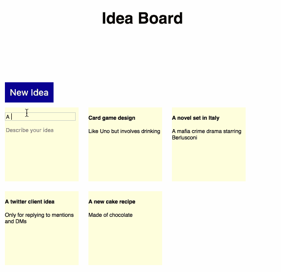

在本教程结束时，我们将有一个功能性的 CRUD 应用程序，我们可以在未来的教程中添加一些增强功能，如动画，排序和搜索。

你可以在 GitHub 上看到该应用的完整代码:

[Ideaboard Rails API](https://github.com/learnetto/ideaboard-api)

[Ideaboard 反应前端](https://github.com/learnetto/ideaboard)

## 设置 Rails API

让我们从构建 Rails API 开始。我们将使用 Rails 的内置特性来构建纯 API 应用程序。

确保您安装了 5.1 版或更高版本的 Rails gem。

```
gem install rails -v 5.1.3 
```

在撰写本教程时，5.1.3 是最新的稳定版本，所以我们将使用它。

然后用`--api`标志生成一个新的 Rails API 应用程序。

```
rails new --api ideaboard-api
cd ideaboard-api 
```

接下来，让我们创建数据模型。对于有两个字段的想法，我们只需要一个数据模型——标题和正文，都是类型`string`。

让我们生成并运行迁移:

```
rails generate model Idea title:string body:string

rails db:migrate 
```

现在我们已经在数据库中创建了一个 ideas 表，让我们用一些记录来播种它，这样我们就有一些想法可以显示了。

在 [`db/seeds.rb`](https://github.com/learnetto/ideaboard-api/blob/master/db/seeds.rb) 文件中，添加以下代码:

```
ideas = Idea.create(
  [
    {
      title: "A new cake recipe",
      body: "Made of chocolate"
    },
    {
      title: "A twitter client idea",
      body: "Only for replying to mentions and DMs"
    },
    {
      title: "A novel set in Italy",
      body: "A mafia crime drama starring Berlusconi"
    },
    {
      title: "Card game design",
      body: "Like Uno but involves drinking"
    }
  ]) 
```

请随意添加您自己的想法。

然后运行:

```
rails db:seed 
```

接下来，让我们在 [`app/controllers/api/v1/ideas_controller.rb`](https://github.com/learnetto/ideaboard-api/blob/master/app/controllers/api/v1/ideas_controller.rb#L3) 中创建一个带有索引操作的 IdeasController:

```
module Api::V1
  class IdeasController < ApplicationController
    def index
      @ideas = Idea.all
      render json: @ideas
    end
  end
end 
```

请注意，控制器位于`app/controllers/api/v1`之下，因为我们正在对 API 进行版本控制。这是一个很好的实践，可以避免中断更改，并提供一些与 API 的向后兼容性。

然后将想法作为资源添加到 [`config/routes.rb`](https://github.com/learnetto/ideaboard-api/blob/master/config/routes.rb) :

```
Rails.application.routes.draw do
  namespace :api do
    namespace :v1 do
      resources :ideas  
    end
  end
end 
```

好了，现在让我们测试我们的第一个 API 端点！

首先，让我们在端口 3001 上启动 Rails API 服务器:

```
rails s -p 3001 
```

然后，让我们测试使用 curl 获得所有想法的端点:

```
curl -G http://localhost:3001/api/v1/ideas 
```

它以 JSON 格式打印了我们所有的想法:

```
[{"id":18,"title":"Card game design","body":"Like Uno but involves drinking","created_at":"2017-09-05T15:42:36.217Z","updated_at":"2017-09-05T15:42:36.217Z"},{"id":17,"title":"A novel set in Italy","body":"A mafia crime drama starring Berlusconi","created_at":"2017-09-05T15:42:36.213Z","updated_at":"2017-09-05T15:42:36.213Z"},{"id":16,"title":"A twitter client idea","body":"Only for replying to mentions and DMs","created_at":"2017-09-05T15:42:36.209Z","updated_at":"2017-09-05T15:42:36.209Z"},{"id":15,"title":"A new cake recipe","body":"Made of chocolate","created_at":"2017-09-05T15:42:36.205Z","updated_at":"2017-09-05T15:42:36.205Z"}] 
```

我们还可以在浏览器中通过进入[http://localhost:3001/API/v1/ideas](http://localhost:3001/api/v1/ideas)来测试端点。

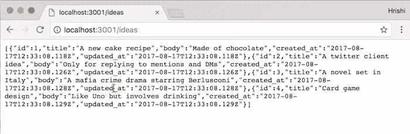

## 使用 Create React App 设置我们的前端应用程序

现在我们有了一个基本的 API，让我们使用 [Create React app](https://github.com/facebookincubator/create-react-app) 来设置我们的前端 React App。Create React App 是脸书的一个项目，它可以帮助你在没有任何配置的情况下快速使用 React App。

首先，确保您已经安装了 Node.js 和 npm。可以从 [the Node.js 网站](https://nodejs.org)下载安装程序。然后运行以下命令安装 Create React 应用程序:

```
npm install -g create-react-app 
```

然后，确保您在 Rails 目录之外，并运行以下命令:

```
create-react-app ideaboard 
```

这将生成一个名为 ideaboard 的 React 应用程序，我们现在将使用它与我们的 Rails API 进行对话。

让我们运行 React 应用程序:

```
cd ideaboard
npm start 
```

这将在 [http://localhost:3000](http://localhost:3000) 上打开它。

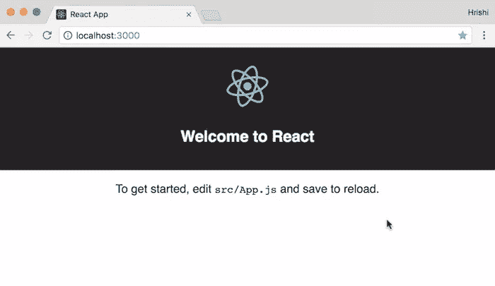

该应用程序有一个默认页面，其中包含一个名为 app 的 React 组件，显示 React 徽标和一条欢迎消息。

页面上的内容通过`src/App.js`文件中的 React 组件呈现:

```
import React, { Component } from 'react'
import logo from './logo.svg'
import './App.css'

class App extends Component {
  render() {
    return (
      <div className="App">  <div className="App-header">    <h2>Welcome to React</h2>  </div>  <p className="App-intro"> To get started, edit <code>src/App.js</code> and save to reload. </p>  </div>
    );
  }
}

export default App 
```

## 我们的第一个反应组件

我们的下一步是编辑这个文件，以使用我们刚刚创建的 API，并在页面上列出所有的想法。

首先，让我们将欢迎信息替换为一个带有我们应用程序标题“Idea Board”的`h1`标签。

让我们再添加一个名为`IdeasContainer`的新组件。我们需要导入它并将其添加到渲染函数中:

```
import React, { Component } from 'react'
import './App.css'
import IdeasContainer from './components/IdeasContainer'

class App extends Component {
  render() {
    return (
      <div className="App">  <div className="App-header">  <h1>Idea Board</h1>  </div>  <IdeasContainer />  </div>
    );
  }
}

export default App 
```

让我们在`src/components`目录下的一个新文件`src/IdeasContainer.js`中创建这个`IdeasContainer`组件。

```
import React, { Component } from 'react'

class IdeasContainer extends Component {
  render() {
    return (
      <div> Ideas </div>
    )
  }
}

export default IdeasContainer 
```

让我们也将`App.css`中的样式改为白色标题和黑色文本，并删除我们不需要的样式:

```
.App-header {
  text-align: center;
  height: 150px;
  padding: 20px;
}

.App-intro {
  font-size: large;
} 
```

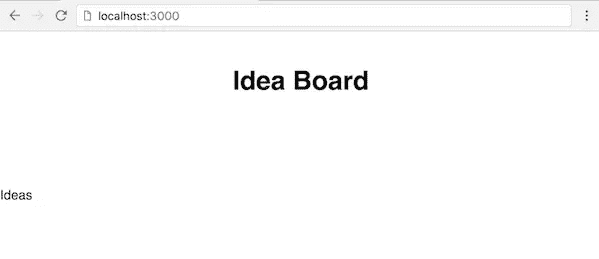

该组件需要与我们的 Rails API 端点对话，以获得所有想法并显示它们。

### 用 axios 获取 API 数据

我们将对 IdeasContainer 组件的 [`componentDidMount()`](https://facebook.github.io/react/docs/react-component.html#componentdidmount) 生命周期方法中的 API 进行 Ajax 调用，并将想法存储在组件状态中。

让我们从用 ideas 作为空数组初始化构造函数中的状态开始:

```
constructor(props) {
  super(props)
  this.state = {
    ideas: []
  }
} 
```

然后我们将更新`componentDidMount()`中的状态。

让我们使用 [axios](https://github.com/mzabriskie/axios) 库来进行 API 调用。如果您喜欢，也可以使用 fetch 或 jQuery。

使用 npm 安装 axios:

```
npm install axios --save 
```

然后在`IdeasContainer`中导入:

```
import axios from 'axios' 
```

并在`componentDidMount()`中使用:

```
componentDidMount() {
  axios.get('http://localhost:3001/api/v1/ideas.json')
  .then(response => {
    console.log(response)
    this.setState({ideas: response.data})
  })
  .catch(error => console.log(error))
} 
```

现在如果我们刷新页面…它不会工作！

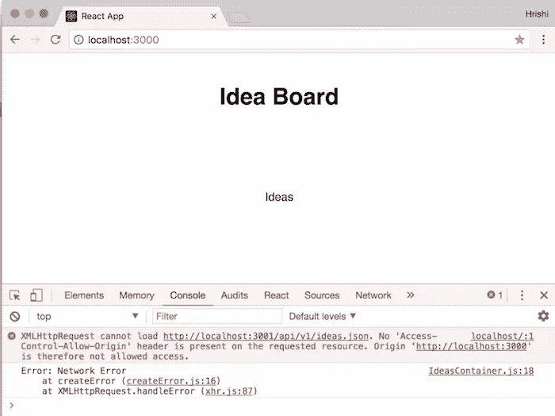

我们将得到一个“No Access-Control-Allow-Origin header present”错误，因为我们的 API 在一个不同的端口上，我们还没有启用跨源资源共享(CORS)。

#### 启用跨来源资源共享(CORS)

因此，让我们首先使用 Rails 应用程序中的 [rack-cors gem](https://github.com/cyu/rack-cors) 来启用 CORS。

将宝石添加到宝石文件中:

```
gem 'rack-cors', :require => 'rack/cors' 
```

安装它:

```
bundle install 
```

然后将中间件配置添加到 [`config/application.rb`](https://github.com/learnetto/ideaboard-api/blob/master/config/application.rb#L33) 文件中:

```
config.middleware.insert_before 0, Rack::Cors do
  allow do
    origins 'http://localhost:3000'
    resource '*', :headers => :any, :methods => [:get, :post, :put, :delete, :options]
  end
end 
```

我们在`http://localhost:3000`将来源限制在我们的前端应用程序，并允许访问所有资源的标准 REST API 端点方法。

现在我们需要重启 Rails 服务器，如果我们刷新浏览器，我们将不再得到 CORS 错误。

该页面将正常加载，我们可以看到控制台中记录的响应数据。

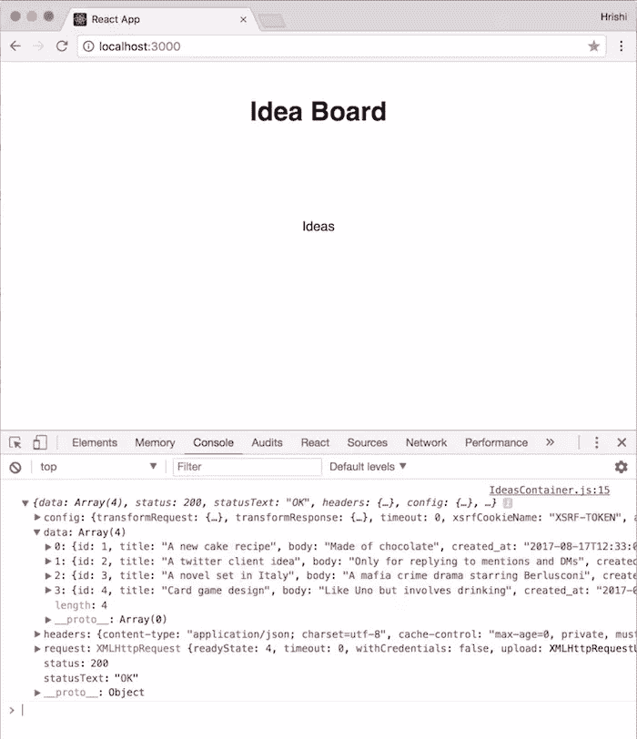

现在我们知道我们能够从 API 中获取想法，让我们在 React 组件中使用它们。

我们可以更改 render 函数，从状态开始遍历列表想法，并显示每个想法:

```
render() {
  return (
    <div>  {this.state.ideas.map((idea) => {
        return(
          <div className="tile" key={idea.id} >  <h4>{idea.title}</h4>  <p>{idea.body}</p>  </div>
        )       
      })}  </div>
  );
} 
```

这将显示页面上所有的想法。

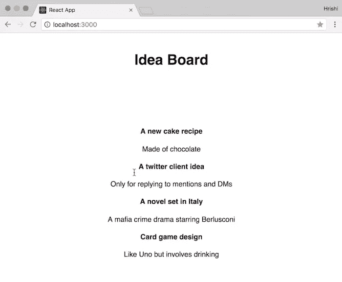

注意图块 div 上的 [`key`属性](https://facebook.github.io/react/docs/lists-and-keys.html#keys)。

我们需要在创建元素列表时包含它。关键字有助于识别哪些项目已经更改、添加或删除。

现在让我们在`App.css`中添加一些样式，使每个想法看起来像瓷砖:

```
.tile {
  height: 150px;
  width: 150px;
  margin: 10px;
  background: lightyellow;
  float: left;
  font-size: 11px;
  text-align: left;
} 
```

我们设置高度、宽度、背景颜色，并使瓷砖向左浮动。

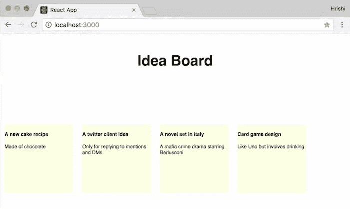

### 无状态功能组件

在我们继续之前，让我们重构到目前为止的代码，并将 idea tiles 的 JSX 移到一个名为`Idea`的单独组件中。

```
import React from 'react'

const Idea = ({idea}) =>
  <div className="tile" key={idea.id}>  <h4>{idea.title}</h4>  <p>{idea.body}</p>  </div>

export default Idea 
```

这是一个无状态的功能组件(或者有人称之为“哑”组件)，这意味着它不处理任何状态。这是一个纯函数，接受一些数据并返回 JSX。

然后在`IdeasContainer`中的 map 函数内部，我们可以返回新的 Idea 组件:

```
{this.state.ideas.map((idea) => {
  return (<Idea idea={idea} key={idea.id} />)
})} 
```

不要忘记导入`Idea`:

```
import Idea from './Idea' 
```

很好，这是我们应用程序完成的第一部分。我们有一个 API 和一个 React 应用程序，API 带有获取想法的端点，React 应用程序将想法显示为板上的瓷砖。

### 添加新记录

接下来，我们将添加一种创造新想法的方法。

让我们从添加一个按钮来添加一个新想法开始。

在`IdeasContainer`的渲染函数中，添加:

```
<button className="newIdeaButton"> New Idea </button> 
```

让我们在`App.css`中为它添加一些样式:

```
.newIdeaButton {
  background: darkblue;
  color: white;
  border: none;
  font-size: 18px;
  cursor: pointer;
  margin-right: 10px;
  margin-left: 10px;
  padding:10px;
} 
```

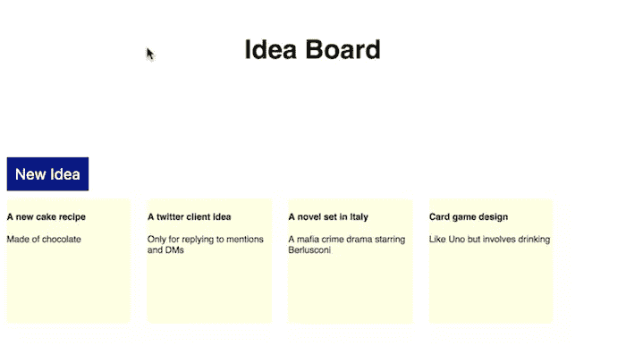

现在，当我们单击按钮时，我们希望出现另一个带有表单的图块来编辑想法。

一旦我们编辑了表单，我们想把它提交给我们的 API 来创建一个新的想法。

#### 用于创建新想法的 API 端点

因此，让我们首先在`IdeasController`中创建一个用于产生新想法的 API 端点:

```
def create
  @idea = Idea.create(idea_params)
  render json: @idea
end

private

  def idea_params
    params.require(:idea).permit(:title, :body)
  end 
```

由于 Rails 使用了[强参数](http://guides.rubyonrails.org/action_controller_overview.html#strong-parameters)，我们定义了私有方法`idea_params`来将我们需要的参数— `title`和`body`列入白名单。

现在我们有了一个 API 端点，我们可以向其发布想法数据并创建新想法。

回到我们的 React 应用程序，现在让我们添加一个名为`addNewIdea`的点击处理程序到新想法按钮:

```
<button className="newIdeaButton"
  onClick={this.addNewIdea} > New Idea </button> 
```

让我们将`addNewIdea`定义为一个函数，它使用 axios 对我们的新创意端点进行 POST 调用，并带有一个空白创意。现在让我们只记录对控制台的响应:

```
addNewIdea = () => {
  axios.post(
    'http://localhost:3001/api/v1/ideas',
    { idea:
      {
        title: '',
        body: ''
      }
    }
  )
  .then(response => {
    console.log(response)
  })
  .catch(error => console.log(error))
} 
```

现在，如果我们尝试单击浏览器中的“新想法”按钮，我们将在控制台中看到响应包含一个数据对象，其中包含我们的新想法，标题和正文为空白。

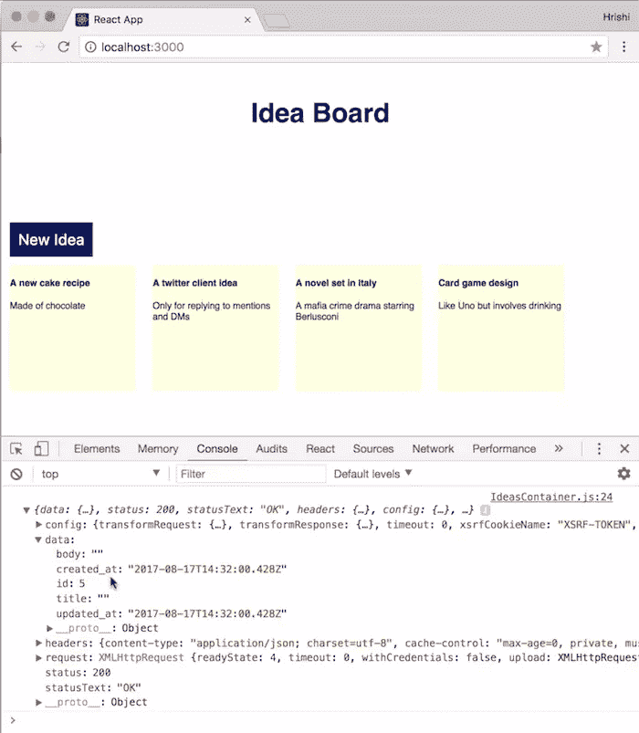

当我们刷新页面时，我们可以看到一个代表我们新想法的空白区域。

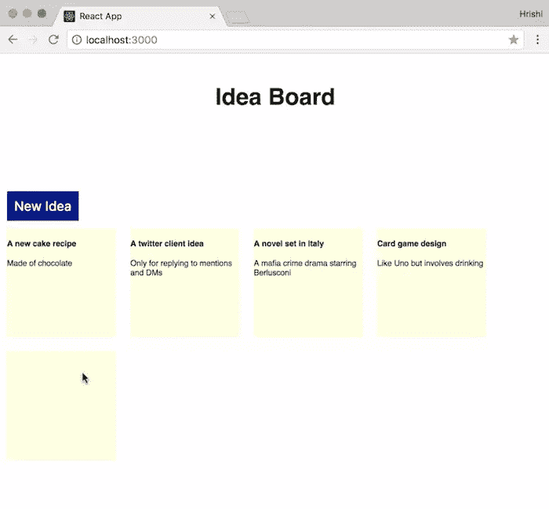

我们真正希望发生的是，当我们点击“新想法”按钮时，一个想法立即被创建，一个用于*编辑*该想法的表单出现在页面上。

这样，我们可以使用相同的形式和逻辑来编辑教程中的任何想法。

在此之前，让我们先将页面上的想法按时间倒序排列，这样最新的想法会出现在顶部。

因此，让我们改变`IdeasController`中`@ideas`的定义，按照`created_at`时间的降序排列想法:

```
module Api::V1
  class IdeasController < ApplicationController
    def index
      @ideas = Idea.order("created_at DESC")
      render json: @ideas
    end
  end
end 
```

好了，现在最新的想法先展示出来。

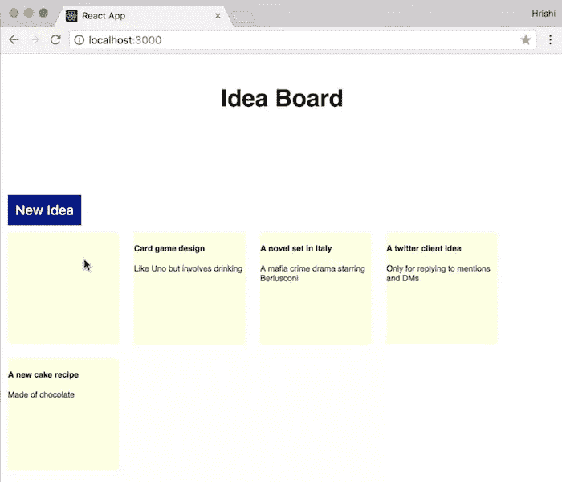

现在，让我们继续定义`addNewIdea`。

首先，让我们使用来自`POST`调用的响应来更新状态中的想法数组，这样当我们添加一个新想法时，它会立即出现在页面上。

我们可以将这个新想法应用到数组中，因为这只是一个示例应用程序，但是使用不可变数据是一个很好的实践。

所以让我们使用[immutanbility-helper](https://github.com/kolodny/immutability-helper)，这是一个不用直接改变数据就可以更新数据的好包。

用 npm 安装它:

```
npm install immutability-helper --save 
```

然后导入`IdeasContainer`中的`update`函数:

```
import update from 'immutability-helper' 
```

现在让我们在`addNewIdea`中使用它，将我们的新想法插入到一系列想法的开头:

```
addNewIdea = () => {
  axios.post(
    'http://localhost:3001/api/v1/ideas',
    { idea:
      {
        title: '',
        body: ''
      }
    }
  )
  .then(response => {
    console.log(response)
    const ideas = update(this.state.ideas, {
      $splice: [[0, 0, response.data]]
    })
    this.setState({ideas: ideas})
  })
  .catch(error => console.log(error))
} 
```

我们制作了一个`this.state.ideas`的新副本，并使用`$splice`命令在该数组的第 0 个索引处插入新想法(在`response.data`中)。

然后我们使用这个新的想法数组来更新使用 [`setState`](https://facebook.github.io/react/docs/react-component.html#setstate) 的状态。

现在，如果我们在浏览器中尝试应用程序，并单击“新想法”按钮，一个新的空磁贴会立即出现。

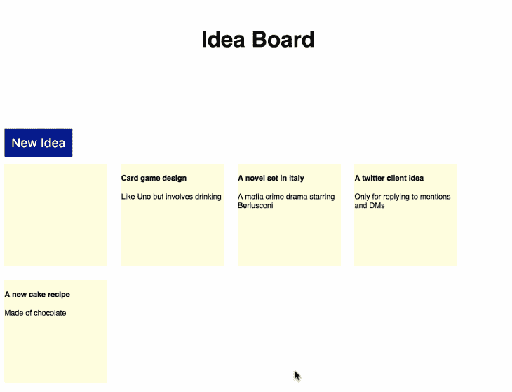

现在我们可以继续编辑这个想法。

首先，我们需要一个新的状态属性`editingIdeaId`，它记录当前正在编辑的想法。

默认情况下，我们不编辑任何想法，所以让我们用一个空值初始化状态中的`editingIdeaId`:

```
this.state = {
  ideas: [],
  editingIdeaId: null
} 
```

现在当我们添加一个新想法时，除了添加到`state.ideas`之外，我们还想把它的 id 设置为`state.editingIdeaId`的值。因此，让我们修改`addNewIdea`中的`setState`调用，以包括也设置`editingIdeaId`:

```
this.setState({
  ideas: ideas,
  editingIdeaId: response.data.id
}) 
```

因此，这表明我们刚刚添加了一个新的想法，我们想立即编辑它。

完整的`addNewIdea`函数现在看起来像这样:

```
addNewIdea = () => {
  axios.post(
    'http://localhost:3001/api/v1/ideas',
    { idea:
      {
        title: '',
        body: ''
      }
    }
  )
  .then(response => {
    const ideas = update(this.state.ideas, {
      $splice: [[0, 0, response.data]]
    })
    this.setState({
      ideas: ideas,
      editingIdeaId: response.data.id
    })
  })
  .catch(error => console.log(error))
} 
```

#### 表单组件

现在我们可以在 render 函数中使用`state.editingIdeaId`,这样我们就可以显示一个表单，而不是仅仅显示一个普通的 idea tile。

在`map`函数中，让我们将返回值更改为一个条件语句，如果一个想法的 id 与`state.editingIdeaId`匹配，则呈现一个`IdeaForm`组件，否则呈现一个`Idea`组件:

```
{this.state.ideas.map((idea) => {
  if(this.state.editingIdeaId === idea.id) {
    return(<IdeaForm idea={idea} key={idea.id} />)
  } else {
    return (<Idea idea={idea} key={idea.id} />)
  }
})} 
```

让我们在`IdeasContainer`中导入`IdeaForm`组件:

```
import IdeaForm from './IdeaForm' 
```

且让我们在`IdeaForm.js`中定义一下。我们将从一个简单的类组件开始，该组件呈现了一个表单，表单中有两个输入字段，分别用于创意标题和主体:

```
import React, { Component } from 'react'
import axios from 'axios'

class IdeaForm extends Component {
  constructor(props) {
    super(props)
    this.state = {
    }
  }

  render() {
    return (
      <div className="tile">  <form>  <input className='input' type="text"
            name="title" placeholder='Enter a Title' />  <textarea className='input' name="body"
            placeholder='Describe your idea'></textarea>  </form>  </div>
    );
  }
}

export default IdeaForm 
```

让我们在`App.css`中添加一些 CSS 来设计表单的样式:

```
.input {
  border: 0;
  background: none;
  outline: none;
  margin-top:10px;
  width: 140px;
  font-size: 11px;
}

.input:focus {
  border: solid 1px lightgrey;
}

textarea {
  resize: none;
  height: 90px;
  font-size: 11px;
} 
```

现在，当我们单击“新想法”按钮时，会出现一个新的互动程序，其中包含一个表单:

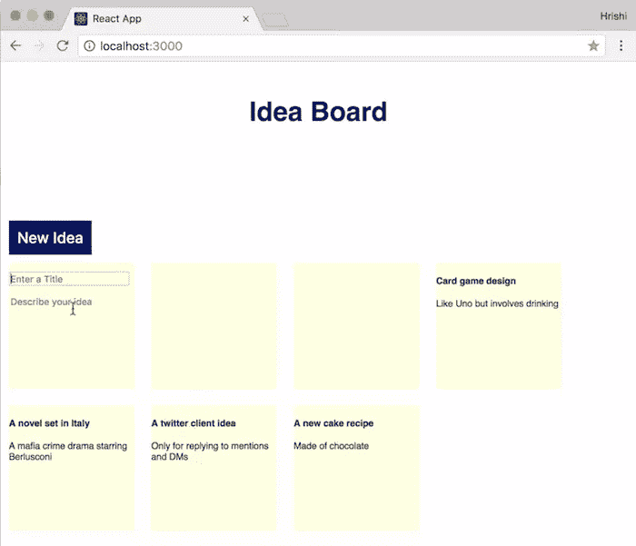

现在让我们把这个表单功能化！

我们需要将表单输入字段连接到州。

首先，让我们从`IdeasContainer`接收到的`idea`属性中初始化`IdeaForm`组件状态值:

```
class IdeaForm extends Component {
  constructor(props) {
    super(props)
    this.state = {
      title: this.props.idea.title,
      body: this.props.idea.body
    }
  } 
```

然后将表单字段值设置为它们对应的状态值，并设置一个`onChange`处理程序:

```
<form>  <input className='input' type="text"
    name="title" placeholder='Enter a Title'
    value={this.state.title} onChange={this.handleInput} />  <textarea className='input' name="body"
    placeholder='Describe your idea'
    value={this.state.body} onChange={this.handleInput}>  </textarea>  </form> 
```

我们将定义`handleInput`,这样，当我们在任何一个输入字段中键入时，相应的状态值和字段的值都会得到更新:

```
handleInput = (e) => {
  this.setState({[e.target.name]: e.target.value})
} 
```

#### 在 React 开发工具中跟踪状态变化

让我们用 React Developer Tools 浏览器扩展来看看这些状态变化。你可以在这里得到 Chrome 的[，在这里](https://chrome.google.com/webstore/detail/react-developer-tools/fmkadmapgofadopljbjfkapdkoienihi)得到火狐的[。](https://addons.mozilla.org/en-US/firefox/addon/react-devtools/)

安装后，刷新应用程序页面并打开开发人员控制台。您应该会看到一个新的 React 选项卡。

当你点击它的时候，你会在左边看到我们的应用组件树，在右边看到与每个组件相关的所有属性和状态。

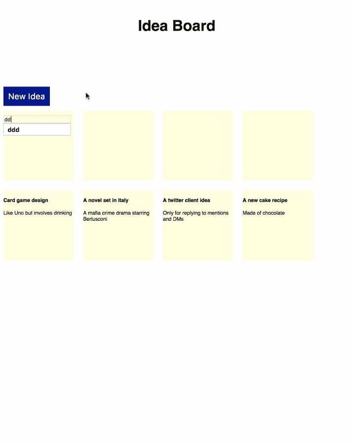

现在我们正在更新表单字段，但是我们仍然没有保存编辑过的想法。因此，接下来需要的是，当我们模糊了一个表单字段时，我们希望提交表单并更新想法。

#### 用于更新想法的 API 端点

首先，我们需要为更新想法定义一个 API 端点。所以让我们在`IdeasController`中添加一个`update`动作:

```
def update
  @idea = Idea.find(params[:id])
  @idea.update_attributes(idea_params)
  render json: @idea
end 
```

回到`IdeaForm.js`，我们将为表单设置一个名为`handleBlur`的`onBlur`处理程序:

```
<form onBlur={this.handleBlur} > 
```

我们将定义`handleBlur`来对我们的 API 端点进行`PUT`调用，以便用来自状态的 idea 数据更新 idea。现在，让我们将响应记录到控制台，看看我们的调用是否有效:

```
handleBlur = () => {
  const idea = {
    title: this.state.title,
    body: this.state.body
  }

  axios.put(
    `http://localhost:3001/api/v1/ideas/${this.props.idea.id}`,
    {
      idea: idea
    })
  .then(response => {
    console.log(response)
  })
  .catch(error => console.log(error))
} 
```

我们还需要在这个文件中导入 axios，以便能够使用它:

```
import axios from 'axios' 
```

现在，如果我们单击“新建议”按钮，编辑其标题并模糊该字段，我们将看到控制台中记录了我们的 API 响应，以及新编辑的建议数据。

如果我们编辑身体并模糊掉那个区域，也会发生同样的事情。

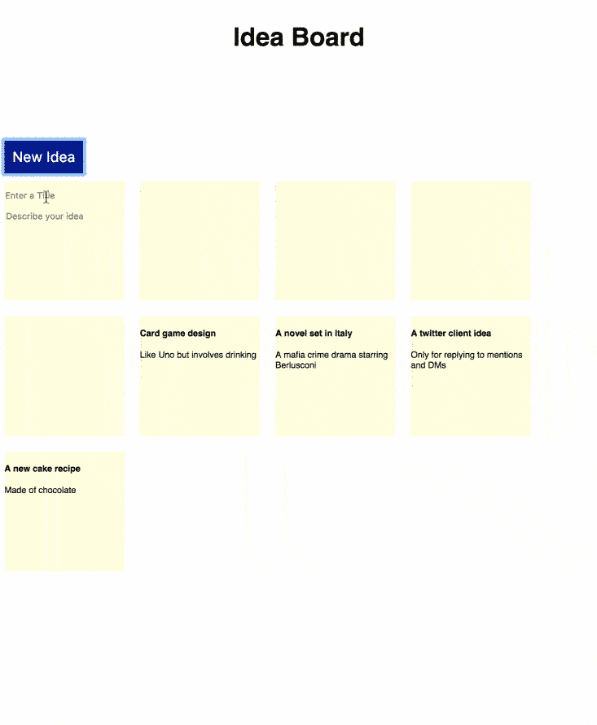

所以我们的`onBlur`处理器工作了，我们可以编辑我们的新想法，但是我们还需要将编辑过的想法数据发送回`IdeasContainer`，这样它也可以更新自己的状态。

否则，`state.ideas`将不会有我们刚刚编辑的意见的更新值。

我们将使用一个叫做`updateIdea`的方法，我们将把它作为道具从`IdeasContainer`传递给`IdeaForm`。我们将用 API 调用的响应数据调用`updateIdea`:

```
handleBlur = () => {
  const idea = {
    title: this.state.title,
    body: this.state.body
  }

  axios.put(
    `http://localhost:3001/api/v1/ideas/${this.props.idea.id}`,
    {
      idea: idea
    })
  .then(response => {
    console.log(response)
    this.props.updateIdea(response.data)
  })
  .catch(error => console.log(error))
} 
```

现在在`IdeasContainer`中，让我们发送一个`updateIdea`函数作为 IdeaForm 的道具:

```
<IdeaForm idea={idea} key={idea.id}
 updateIdea={this.updateIdea} /> 
```

让我们定义一个函数来对`state.ideas`中的想法进行不可变的更新:

```
updateIdea = (idea) => {
  const ideaIndex = this.state.ideas.findIndex(x => x.id === idea.id)
  const ideas = update(this.state.ideas, {
    [ideaIndex]: { $set: idea }
  })
  this.setState({ideas: ideas})
} 
```

首先，我们在数组中找到已编辑想法的索引，然后使用`$set`命令用新值替换旧值。最后，我们调用 setState 来更新`state.ideas`。

我们可以在打开 React Developer Tools 选项卡的浏览器中看到这一点。

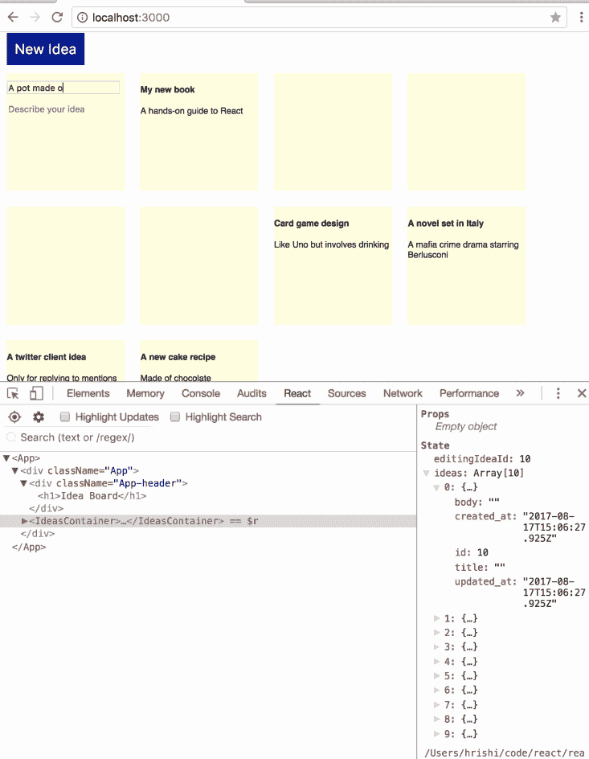

#### 显示成功通知

现在我们可以添加一个新的想法并编辑它，但是当这个想法被保存时，用户得不到视觉反馈或确认。因此，让我们添加一条通知消息，告诉用户某个想法何时被成功保存。

让我们在“新建议”按钮旁边添加一个 span，以显示来自状态值的通知:

```
<span className="notification">  {this.state.notification}  </span> 
```

让我们将`state.notification`初始化为一个空字符串:

```
constructor(props) {
  super(props)
  this.state = {
    ideas: [],
    editingIdeaId: null,
    notification: ''
  }
} 
```

现在，每当一个想法得到更新，我们将用一个我们想显示给用户的成功通知来更新`state.notification`。

所以在`setState`调用`updateIdea`中，除了更新`ideas`，我们也更新`notification`:

```
this.setState({
  ideas: ideas,
  notification: 'All changes saved'
}) 
```

现在，当我们编辑一个想法并模糊输入字段时，该想法会被保存，我们会看到成功通知。

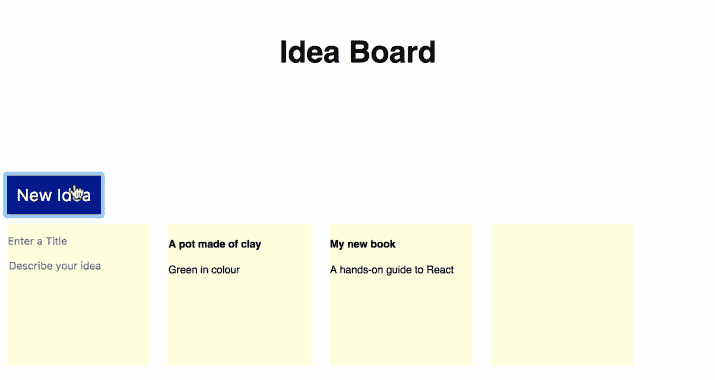

我们还想在用户做出尚未保存的更改时立即重置通知。

所以在`IdeaForm`组件的`handleInput`函数中，让我们调用一个名为`resetNotification`的函数来重置通知消息:

```
handleInput = (e) => {
  this.props.resetNotification()
  this.setState({[e.target.name]: e.target.value})
} 
```

现在，在`IdeasContainer`的`render`函数内部，我们也把`resetNotification`作为道具传递给`IdeaForm`:

```
<IdeaForm idea={idea} key={idea.id}
  updateIdea={this.updateIdea}
  resetNotification={this.resetNotification} /> 
```

让我们将`resetNotification`定义为:

```
resetNotification = () => {
  this.setState({notification: ''})
} 
```

现在，成功通知出现后，如果我们再次编辑该想法，通知就会消失。

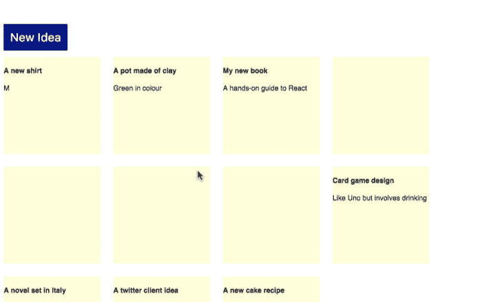

### 编辑现有想法

接下来，让我们添加编辑现有想法的功能。当我们点击一个 idea tile 时，我们想要改变 tile，以便它用一个`IdeaForm`组件替换`Idea`组件来编辑该 idea。

然后我们可以编辑这个想法，它会保存在模糊。

为了添加这个特性，我们需要在我们的 idea tiles 上添加一个点击处理程序。

所以首先我们需要将我们的`Idea`组件从一个功能组件转换成一个类组件，然后我们可以为标题和正文定义一个点击处理函数`handleClick`。

```
import React, { Component } from 'react'

class Idea extends Component {

  handleClick = () => {
    this.props.onClick(this.props.idea.id)
  }

  render () {
    return(
      <div className="tile">  <h4 onClick={this.handleClick}>  {this.props.idea.title}  </h4>  <p onClick={this.handleClick}>  {this.props.idea.body}  </p>  </div>
    )
  }
}

export default Idea 
```

注意，我们必须添加`this.props.`来使用 props 值，因为不像在 functional 组件中，我们不再析构 props 对象。

`handleClick`用意见 id 呼叫`this.props.onClick`。

现在，在`IdeasContainer`的`render`函数内部，我们也把`onClick`作为道具传递给`Idea`:

```
return (<Idea idea={idea} key={idea.id} onClick={this.enableEditing} />) 
```

我们将定义`enableEditing`来将`state.editingIdeaId`的值设置为被点击的想法的 id:

```
enableEditing = (id) => {
  this.setState({editingIdeaId: id})
} 
```

现在，当我们点击一个瓷砖，它立即成为可编辑的！

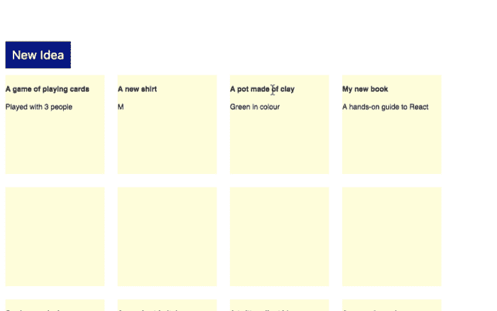

当我们单击一个磁贴时，一旦表单出现，让我们也将光标焦点设置到标题输入字段。

我们可以通过在`IdeaForm`中的标题输入字段添加一个 [ref](https://facebook.github.io/react/docs/refs-and-the-dom.html) 来实现:

```
<input className='input' type="text"
  name="title" placeholder='Enter a Title'
  value={this.state.title} onChange={this.handleInput}
  ref={this.props.titleRef} /> 
```

我们需要将 ref 作为一个属性传递，因为我们想在父组件`IdeasContainer`中使用它，在这里我们可以将 ref 定义为一个回调函数:

```
<IdeaForm idea={idea} key={idea.id}
  updateIdea={this.updateIdea}
  titleRef= {input => this.title = input}
  resetNotification={this.resetNotification} /> 
```

现在我们可以在`enableEditing`中使用这个 ref 来设置标题输入字段中的焦点:

```
enableEditing = (id) => {
  this.setState({editingIdeaId: id},
    () => { this.title.focus() })
} 
```

注意，我们在调用了`setState`之后，并没有把`this.title.focus()`作为一个单独的函数来调用。相反，我们在回调中将它作为第二个参数传递给了`setState`。

我们这样做是因为`setState`并不总是立即更新组件。通过在回调中传递我们的焦点调用，我们确保它只在组件更新后被调用。

现在，如果我们在浏览器中尝试该应用程序，当我们单击一个想法磁贴时，它会变成可编辑的表单，光标会聚焦在其标题输入字段中。

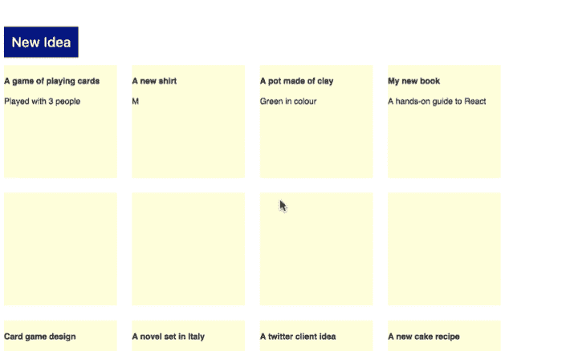

所以现在我们可以添加和编辑想法。

### 删除想法

最后，我们希望能够删除想法。

当我们将鼠标悬停在一个创意板块上时，我们希望在右上角出现一个删除按钮(以红叉的形式)。单击该十字应该会删除该想法，并从板上移除该图块。

所以让我们从添加一些标记和 CSS 来显示悬停时的删除按钮开始。

在`Idea`组件中，添加一个带有类`deleteButton`和文本‘x’的 span:

```
<div className="tile">  <span className="deleteButton"> x </span> 
```

然后，让我们在`App.css`中添加一些 CSS 来默认隐藏这个范围，并使它在我们悬停在一个图块上时可见:

```
.deleteButton {
  visibility: hidden;
  float: right;
  margin: 5px;
  font-size: 14px;
  cursor: pointer;
  color: red;
}

.tile:hover .deleteButton {
  visibility: visible;
} 
```

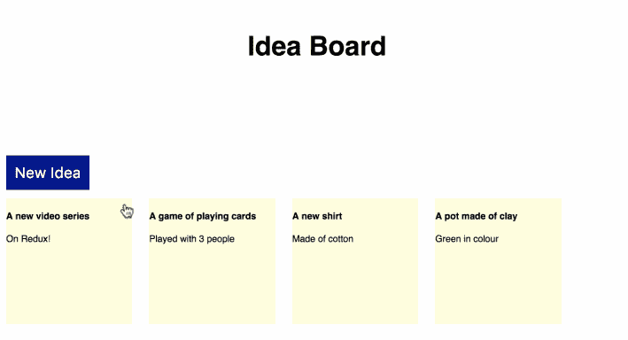

接下来，让我们添加一个点击处理程序`handleDelete`到这个删除按钮，然后删除这个想法:

```
<span className="deleteButton" onClick={this.handleDelete}> x </span> 
```

与`handleClick`类似，我们将把`handleDelete`定义为一个箭头函数，它调用另一个函数`this.props.onDelete`,该函数具有图块的想法 id:

```
handleDelete = () => {
  this.props.onDelete(this.props.idea.id)
} 
```

从`IdeasContainer`传`onDelete`做道具吧:

```
<Idea idea={idea} key={idea.id}
  onClick={this.enableEditing}
  onDelete={this.deleteIdea} /> 
```

我们稍后将定义`deleteIdea`，但是首先让我们添加一个 API 端点来删除`IdeasController`中的想法:

```
def destroy
  @idea = Idea.find(params[:id])
  if @idea.destroy
    head :no_content, status: :ok
  else
    render json: @idea.errors, status: :unprocessable_entity
  end
end 
```

现在让我们将`IdeasContainer`中的`deleteIdea`定义为一个函数，该函数使用 idea id 对我们的 API 进行`DELETE`调用，并在成功时更新`state.ideas`:

```
deleteIdea = (id) => {
  axios.delete(`http://localhost:3001/api/v1/ideas/${id}`)
  .then(response => {
    const ideaIndex = this.state.ideas.findIndex(x => x.id === id)
    const ideas = update(this.state.ideas, { $splice: [[ideaIndex, 1]]})
    this.setState({ideas: ideas})
  })
  .catch(error => console.log(error))
} 
```

我们再次查找被删除想法的索引，使用`update`和`$splice`命令创建一个新的想法数组，然后用它更新`state.ideas`。

现在我们可以在浏览器中尝试一下。当我们将鼠标悬停在意见板块上时，会出现红色的删除按钮。单击它会删除该想法，并从板上移除该图块。

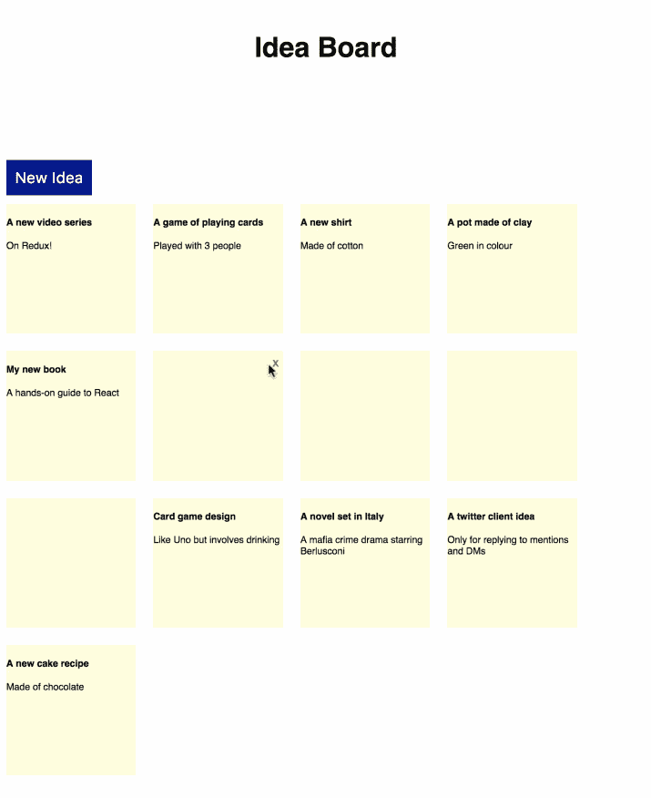

万岁，我们现在有一个功能性的应用程序，具有所有基本的 CRUD 功能！

## 包裹

在本教程中，我们使用 Rails 5.1 API 和前端 React 应用程序构建了一个完整的 CRUD 应用程序。

我们的 API 有三个端点，分别用于创建、更新和删除想法。

我们使用 Create React App 来制作 React App。这使得设置完全没有痛苦和容易。我们可以直接构建我们的应用程序，而不是配置任何东西。

我们使用 axios 对 API 和 immunity-helper 进行 Ajax 调用，以进行数据更新。

在未来的教程中，我们可以看看如何将这个应用程序部署到生产服务器，并添加一些动画和过渡来增加 UI 的趣味。例如，我们可以淡入新的想法标题，淡出已删除的标题，淡入和淡出通知消息。

你可以在这里观看这个教程的视频版本。

你可以在 GitHub 上看到该应用的完整代码:

[Ideaboard Rails API](https://github.com/learnetto/ideaboard-api)

[Ideaboard 反应前端](https://github.com/learnetto/ideaboard)

## 分享这篇文章