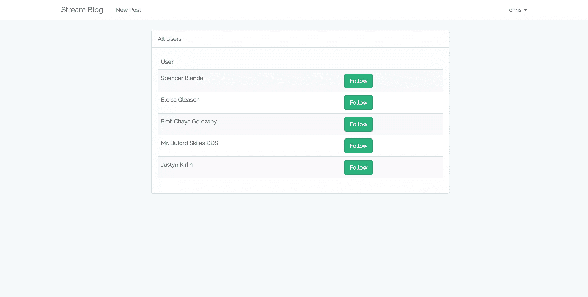
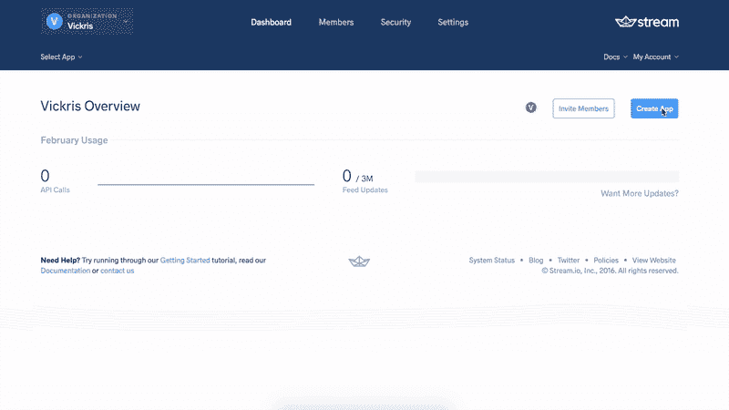
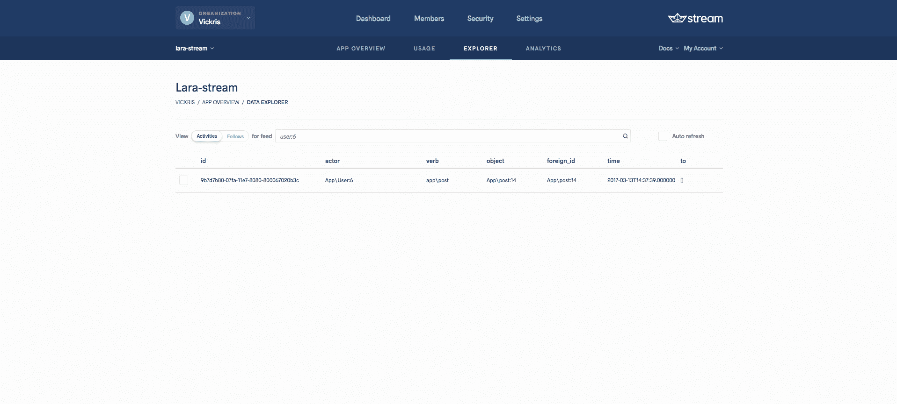

# 实时通知和跟踪？当然，用流！

> 原文：<https://www.sitepoint.com/real-time-laravel-notifications-follows-sure-stream/>

*这篇文章由[沃恩·安切塔](https://www.sitepoint.com/author/wancheta)和[尤尼斯·拉菲](https://www.sitepoint.com/author/yrafie)进行了同行评审。感谢 SitePoint 的所有同行评审员使 SitePoint 的内容尽可能做到最好！*

* * *

使用 Laravel，可以很容易地创建新闻订阅站点、博客甚至论坛，人们可以在那里发布内容、发表评论，甚至将其中的一些帖子标记为收藏夹。为了增加趣味，我们可以通过为其他用户执行的操作添加通知来使应用程序更加生动。在本教程中，我们将依靠一个名为 [Stream](https://www.getstream.io/) 的服务来为我们的应用程序添加这一功能。

> Stream 是一个用于构建提要、活动流和通知系统的 API


该 API 可以用于许多语言和框架。访问[网站](https://www.getstream.io/)，点击`Try the API`。选择 PHP 作为语言选择，因为我们将使用 PHP。本教程应该让您很好地了解我们可以通过 Stream 获得的通知类型。Laravel 有一个官方包，这使得将这项服务集成到任何 Laravel 应用程序中变得更加容易。

对于本教程，我们将使用一个现有的项目来测试流 API。只需克隆[这个回购](https://github.com/vickris/simple-blog)。这是一个简单的 Laravel 5.4 博客，用户可以在这里对博客文章执行 CRUD 操作。我们将很快添加关注其他用户的功能。然后，我们将创建具有不同类型通知的提要部分，告诉我们谁在何时做了什么。在本教程中，我们主要关注的是人们创建新的博客帖子并互相关注。这个教程的完整代码可以在[这里](https://github.com/vickris/laravel-stream)找到。

## 项目设置

建议您使用 [Homestead Improved](https://www.sitepoint.com/quick-tip-get-homestead-vagrant-vm-running/) 快速启动并运行包含您可能需要的一切的专业开发环境。

```
git clone https://github.com/vickris/simple-blog 
```

在本地设置好 repo 之后，我们应该在运行任何迁移之前准备一个数据库。在本教程中，我们将使用 MySQL。建立数据库后，运行:

```
cp .env.example .env 
```

我的`.env`文件中的数据库连接部分如下所示:

```
DB_HOST=localhost
DB_DATABASE=homestead
DB_USERNAME=homestead
DB_PASSWORD=secret 
```

由于这不是一个全新的 Laravel 安装，我们将不得不运行`composer install`来安装这个项目的各种包和依赖项:

```
composer install 
```

然后运行:

```
php artisan migrate
php artisan db:seed 
```

该应用程序有一些种子数据来生成 10 个帖子。如果我们提供我们的应用程序并访问`/posts`，我们应该会收到十个帖子。

一切就绪！我们现在可以注册新用户，甚至创建博客帖子。创建新帖子的链接在导航栏中。让我们添加关注其他用户的功能。通过关注另一个用户，我们将了解他们的最新活动，即创建新帖子或关注其他用户。

## 关注用户

为此，我们将首先在迁移的同时生成一个`Follow`模型。注意。但是，对于大型项目，建议创建`followers`和`following`表，以便更容易地查询关系:

```
php artisan make:model Follow -m 
```

让我们将新生成的迁移的 up 方法更新为:

```
public function up()
{
    Schema::create('follows', function (Blueprint $table) {
        $table->increments('id');
        $table->integer('user_id')->index();
        $table->integer('target_id')->index(); // ID of person being followed
        $table->timestamps();
    });
} 
```

这里，我们添加了一个`user_id`列，因为一个关注属于一个用户。现在让我们运行`migrate`命令来创建*跟随表*:

```
php artisan migrate 
```

我们还没有定义`follows`和`users`之间的关系。打开`User`模型文件并添加关系:

*app/User.php*

```
[...]
class User extends Authenticatable
{
    [...]
    public function follows() {
        return $this->hasMany(Follow::class);
    }
} 
```

在`app/Follow.php`中，让我们将`target_id`添加到质量可分配属性列表中。我们还将定义一个关系，指定一个`follow`属于一个`user`:

*app/Follow.php*

```
[...]
class Follow extends Model
{
    protected $fillable = ['target_id'];

    public function user()
    {
        return $this->belongsTo(User::class);
    }
}
[...] 
```

定义好关系后，我们现在可以添加关注其他用户的功能。让我们定义跟随和取消跟随操作的路线。

```
[...]
Route::group(['middleware' => ['auth']], function () {
    [...]
    Route::get('/users', 'FollowController@index');
    Route::post('/follow/{user}', 'FollowController@follow');
    Route::delete('/unfollow/{user}', 'FollowController@unfollow');
});
[...] 
```

我们希望将`follow`和`unfollow`操作限制为经过身份验证的用户，这就是为什么我们将这些路由放在具有`auth`中间件的路由组中。

第一条路线将把我们带到一个列出所有用户的页面。接下来，我们应该创建`FollowController`:

```
php artisan make:controller FollowController 
```

然后我们在这个控制器中定义一个`index`动作。在`index`动作中，我们将检索除当前登录用户之外的所有用户。我们不希望出现用户可以跟随自己的场景:

*app/Http/Controllers/follow controller . PHP*

```
[...]
use App\User;
use App\Follow;
use Illuminate\Support\Facades\Auth;
[...]

class FollowController extends Controller
{
    public function index()
    {
        return view('users.index', [
            'users' => User::where('id', '!=', Auth::id())->get()
        ]);
    }
} 
```

我们仍然没有`users.index`视图。让我们创建它:

*resources/views/users/index . blade . PHP*

```
@extends('layouts.app')

@section('content')
    <div class="container">
        <div class="col-sm-offset-2 col-sm-8">

            <!-- Following -->
            <div class="panel panel-default">
                <div class="panel-heading">
                    All Users
                </div>

                <div class="panel-body">
                    <table class="table table-striped task-table">
                        <thead>
                            <th>User</th>
                            <th> </th>
                        </thead>
                        <tbody>
                            @foreach ($users as $user)
                                <tr>
                                    <td clphpass="table-text"><div>{{ $user->name }}</div></td>
                                </tr>
                            @endforeach
                        </tbody>
                    </table>
                </div>
            </div>
        </div>
    </div>
@endsection 
```

通过访问 URL `/users`，我们应该可以看到属于注册用户的名字。我们想在用户名旁边添加一个按钮，允许用户相互关注和取消关注。

让我们通过添加`follow`和`unfollow`方法来更新我们刚刚创建的控制器。但在此之前，我们需要确保在执行 follow 操作之前，没有人在跟踪另一个人，反之亦然。为了实现这一点，我们必须在我们的`User`模型中创建一个小的助手函数:

*app/User.php*

```
class User extends Authenticatable
{
    [...]
    public function isFollowing($target_id)
    {
        return (bool)$this->follows()->where('target_id', $target_id)->first(['id']);
    }
} 
```

我们现在可以继续为*跟随*和*取消跟随*动作编写逻辑代码:

*app/Http/Controllers/follow controller . PHP*

```
class FollowController extends Controller
{
    [...]
    public function follow(User $user)
    {
        if (!Auth::user()->isFollowing($user->id)) {
            // Create a new follow instance for the authenticated user
            Auth::user()->follows()->create([
                'target_id' => $user->id,
            ]);

            return back()->with('success', 'You are now friends with '. $user->name);
        } else {
            return back()->with('error', 'You are already following this person');
        }

    }

    public function unfollow(User $user)
    {
        if (Auth::user()->isFollowing($user->id)) {
            $follow = Auth::user()->follows()->where('target_id', $user->id)->first();
            $follow->delete();

            return back()->with('success', 'You are no longer friends with '. $user->name);
        } else {
            return back()->with('error', 'You are not following this person');
        }
    }
} 
```

然后让我们为所有用户更新视图列表，让用户名旁边的*跟随*和*取消跟随*按钮。因为我们希望按钮基于 follow 状态有不同的变化，所以我们将利用我们创建的 helper 函数。在我们的`users.index`视图中，在显示名称的`<td>`标签之后插入代码块:

*resources/views/users/index . blade . PHP*

```
[...]
@if (Auth::User()->isFollowing($user->id))
    <td>
        <form action="{{url('unfollow/' . $user->id)}}" method="POST">
            {{ csrf_field() }}
            {{ method_field('DELETE') }}

            <button type="submit" id="delete-follow-{{ $user->target_id }}" class="btn btn-danger">
            <i class="fa fa-btn fa-trash"></i>Unfollow
            </button>
        </form>
    </td>
@else
    <td>
        <form action="{{url('follow/' . $user->id)}}" method="POST">
            {{ csrf_field() }}

            <button type="submit" id="follow-user-{{ $user->id }}" class="btn btn-success">
            <i class="fa fa-btn fa-user"></i>Follow
            </button>
        </form>
    </td>
@endif
[...] 
```

如果我们现在重新加载 users `index`页面，我们应该会看到如下所示的视图:



尝试跟随列表中的第一个人。请注意按钮的颜色变化。

## 引入流

Stream 将帮助我们在我们关注的人执行某个操作时获得通知。对于本教程，我们希望在他们创建新帖子或关注其他用户时得到通知。我们还希望在有人跟踪我们时收到通知。

### 设置

让我们通过 [Composer](https://www.sitepoint.com/php-dependency-management-with-composer/) 安装它:

```
composer require  get-stream/stream-laravel 
```

然后，我们将`GetStream\StreamLaravel\StreamLaravelServiceProvider`添加到`config/app.php`中的提供者列表，以注册服务:

```
'providers' => [
  // Other providers
  [...]
        GetStream\StreamLaravel\StreamLaravelServiceProvider::class,
    ], 
```

并在`config/app.php`中为其创建一个别名:

```
'aliases' => [
  // other aliases
   [...]
        'FeedManager' => 'GetStream\StreamLaravel\Facades\FeedManager',
   ], 
```

然后，我们通过运行以下命令发布配置文件:

```
php artisan vendor:publish --provider="GetStream\StreamLaravel\StreamLaravelServiceProvider" 
```

这将创建`config/stream-laravel.php`文件。一旦在 Stream Dashboard 中创建了凭证，我们就应该在这个文件中设置凭证。

### 流仪表板

让我们前往 [GetStream.io](https://getstream.io/) 并创建一个新的应用程序。你可以给这个应用取任何你想要的名字。对于`select server location`，我选择了`US East`，但是您可以选择离您最近的位置:



一旦创建了应用程序，我们就会得到`API key`、`API secret`和`API app id`。这些键可以从仪表板上访问。

仍然在仪表板上，让我们为这个应用程序创建我们想要的提要组。默认情况下，我们应该创建以下内容:

*   `user`类型为`flat`的 feed(*平面 feed 呈现没有任何分组的活动，这是流*中的默认 feed 类型)。此提要显示特定用户的所有操作。
*   `timeline`也是类型`flat`的进给。此源显示最近发生的事情。
*   `timeline_aggregrated`是类型`aggregated` ( *聚合提要根据活动类型*以分组格式呈现活动)。这种类型的提要允许用户指定聚合格式。
*   `notification`类型为`notification`的进给。然而，与聚合提要类似，通知可以标记为已读，您可以获得未看到和未读通知的数量。

### Stream-Laravel 配置文件

我们应该在`config/stream-laravel.php`文件中设置接收到的`API key`、`API secret`和`API app id`，以便与 Streams API 通信。我们还应该额外设置`location`。

让我们将这些键和它们对应的值放在我们的`.env`文件中，然后用 Laravel 提供的`env`助手将它们加载到我们的`config/stream-laravel.php`中。

*。环境*

```
STREAM_KEY=xxxxxxxxxx
STREAM_SECRET=xxxxxxxxxxxxxxxxxxxxxxxx
STREAM_APP_ID=xxxxxx 
```

*config/stream-laravel . PHP*

```
'api_key' => env('STREAM_KEY'),
'api_secret' => env('STREAM_SECRET'),
'api_app_id' => env('STREAM_APP_ID'),
'location' => 'us-east', 
```

这应该可以让我们开始使用 Stream。现在让我们探索一下 Stream 附带的一些特性。

### 将帖子添加为活动——雄辩的 ORM 集成

Stream-Laravel 提供了与雄辩模型的即时集成–通过包含`GetStream\StreamLaravel\Eloquent\ActivityTrait`，我们可以自动跟踪`Post`模型到用户反馈:

*app\Post.php*

```
class Post extends Model
{
    use \GetStream\StreamLaravel\Eloquent\ActivityTrait;
    [...] 
```

每次创建帖子时，它都会存储在创建它的用户的 feed 中，当删除一个帖子实例时，它也会被删除。

自动！

让我们通过创建一个新帖子来测试一下。如果我们现在转到流仪表板并点击 *Explorer* 选项卡，我们应该会看到一个新的活动:



我建议我们删除这个活动，因为我们将很快更新我们的`Post`模型，将动词改为`created`。照目前的情况来看，动词是`app/Post`。要删除该活动，只需选中该活动旁边的框，一个带有删除该活动选项的菜单将会弹出。如果我们不这样做，我们以后在呈现提要时会遇到问题。

## 结论

我必须承认设置 Stream 花了一些时间，但是一旦完成，我们就可以开始使用 stream-laravel 包提供的各种方法来构建提要和通知了。在本系列的下一部分中，我们将看看如何配置我们的模型，以便它们可以作为活动存储在提要中。我们还将了解如何获取不同类型的提要并在视图上呈现它们。敬请期待！

## 分享这篇文章