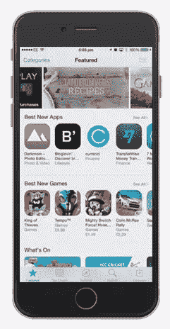
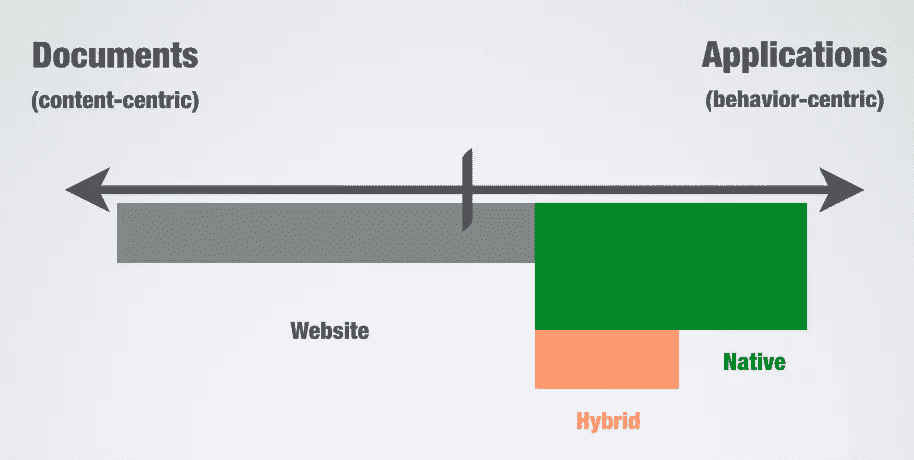
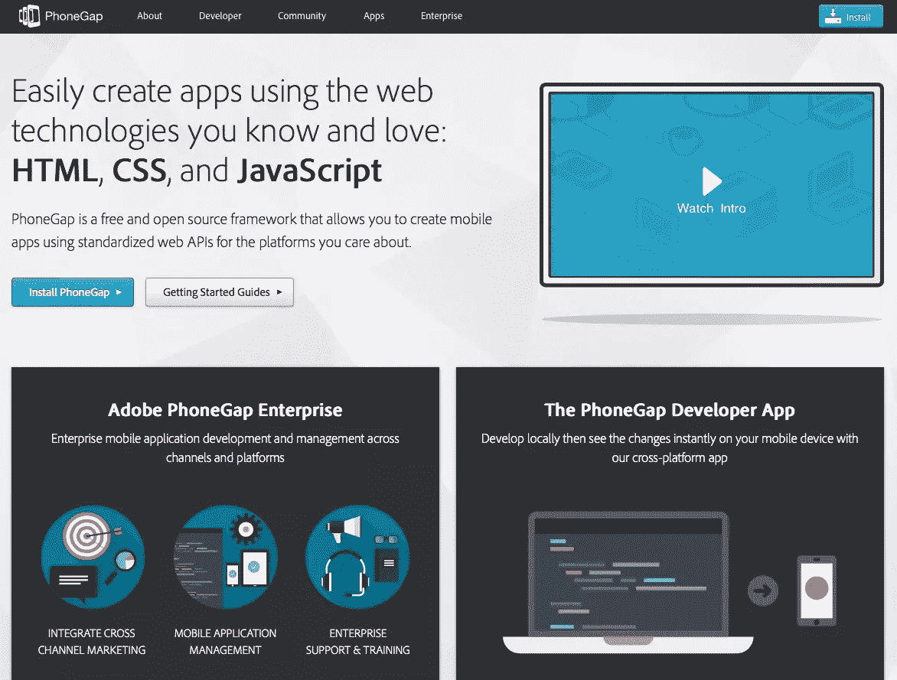

# 你真的需要一个应用程序吗？

> 原文：<https://www.sitepoint.com/really-need-app/>

首先，每个人都想要一个网站。然后 Flash 出现了，所以人们想要一个 Flash 网站。然后是脸书，它成了必须要成为其中一部分的东西。现在每个人都想要一个移动应用程序。但是他们真的需要吗？

毕竟，创建移动应用程序的过程并非没有挑战。

我在本文结尾的一个可学的截屏中对这个话题进行了更深入的研究,看了一些案例研究，在这些案例中，本地化的决定可能不是最好的。

## 本土化的问题

app store 里有这么多应用，曝光率并不是开发一个应用的理由。

当智能手机应用商店首次推出时，出现了一股满足消费者对本地应用需求的热潮。在早期，有一些难以置信的机会。但是那些日子已经过去了。

iTunes 和 Android 商店都有超过 100 万个应用程序，供过于求。

更糟糕的是，在缺乏复杂搜索功能的商店里很难找到。曾经在 App Store 上提供了前所未有的曝光率，仍然有一些方法可以[提高你的应用市场排名](https://www.sitepoint.com/5-proven-tips-improve-app-marketplace-ranking/)，今天你的应用很可能很少被看到。

即使用户确实看到了你的应用并下载了它，也不能保证他们会继续使用它。由于存储空间有限，用户只能在设备上保存这么多应用程序。他们在删除应用程序时很无情。用户倾向于只保留他们经常使用的应用。

原生应用的最大问题是它们的成本。与学习 HTML 和 CSS 不同，开发原生移动应用程序有很高的门槛。这意味着雇佣应用程序开发人员比他们的网络同行要昂贵。

但是真正的成本在于支持许多平台和设备。不像网络，你不可能一次就建立起来，并确信它在任何地方都能工作。你甚至不能使用同一种语言在多个平台上编码。

不仅构建应用程序的成本很高，而且随着时间的推移维护应用程序的成本也很高。每一款发布的新设备都可能迫使你更新应用。屏幕尺寸、分辨率和操作系统的变化会导致应用程序的改变。

尽管如此，有些情况下成本是值得的，因为用例证明了这一点。

## 当本地应用是个好主意时

如果你有一个基于任务的应用程序，比如更新社交网络或拍照，那么本地构建它可能更明智。

在有些情况下，拥有一个本机应用程序非常有意义。

### 功能

首先，有些功能是基于网络的替代方案所不具备的。大多数智能手机限制访问一些原生功能，除非你建立一个原生应用程序。例如，基于网络的应用程序无法访问 iPhone 上的地址簿。

### 速度

速度可能是本土化的另一个原因。虽然缓存一个移动友好网站是可能的，但它们永远不会像本地应用程序那样响应迅速。因此，当速度至关重要时，就值得考虑原生选项。

### 焦点

其中，原生应用 excel 用于支持用户定期完成明确定义的任务。拍照、更新社交网络、给朋友发消息都由原生应用来处理更好。这是因为它们是面向任务的，用户希望它们随时可用。

手机网站的响应式设计和其他改进已经改变了用户的态度。

### 甜蜜的家

想要一个原生应用程序的主要原因之一是要在应用程序商店出现在人们的主屏幕上。这个理由一度可能是合理的。但现在不会了。多亏了响应式设计，手机友好网站的质量得到了提高。这意味着用户使用起来更加舒适。

此外，用户可以像任何其他应用程序一样将网站添加到他们的主屏幕上。网站甚至可以像原生应用一样发送通知。

决定建立一个本地应用程序或一个移动友好的网站取决于使用频率和它提供的功能。

## 内容与行为

尽管决定使用原生应用程序还是移动友好网站是一个复杂的问题，但有一个经验法则。一般来说，如果你试图帮助用户完成任务，那么本地应用程序可能是一个不错的选择。但是，如果你主要是提供内容，那么首先转向移动友好的网站。

任务更适合本机应用程序。网站在传递内容方面做得更好。

一个网站*可以*容纳基于任务的应用，特别是在简单的用例中；不幸的是，就像生活中的许多事情一样，它不是非黑即白的。

## 混合应用

更复杂的是，还有第三种选择——混合应用程序。像 [PhoneGap](http://phonegap.com) 这样的框架允许你使用 HTML、CSS 和 JavaScript 构建原生应用；跨许多平台工作的应用程序。

像 PhoneGap 这样的框架允许你用 HTML、CSS 和 Javascript 构建原生应用。

乍一看，混合应用程序似乎是完美的解决方案。进入门槛更低，您可以一次构建，同时跨多个平台交付。它还让您可以访问本机应用程序中的许多功能。

但是在您匆忙构建您的第一个混合应用程序之前，值得注意的是它们确实有一些缺点。

首先，混合应用程序不能提供本机应用程序的所有功能。它们也存在一些性能和兼容性问题。

但也许最大的问题是感知。通常，它们不像是本地应用程序。与移动友好网站不同，用户希望混合应用像本地应用一样运行。他们希望它的外观和行为像 iPhone 或 Android 应用程序。

如果您只构建一次，然后跨所有平台交付，这是不可能的。因此，混合应用程序有时会让人觉得是这两种方法之间令人不舒服的折衷。

## 那么答案是什么呢？

每种方法都有自己的缺点，决定如何进行是一个困难的挑战。和所有的事情一样，它归结为投资回报。

我们需要考虑决定是开发一个本地应用程序还是移动友好网站。我们不能做出“每个人都有一个应用，所以我们也需要一个”的膝跳反应相反，需要有一个坚实的商业案例。

目前，这通常意味着一个响应迅速的网站。但是，随着手机继续以指数速度增长，情况可能会发生变化。除此之外，蜂窝网络的速度也在提高，也许我们会考虑第四种选择——基于网络的应用。但那是未来的事，事实是:移动市场仍在快速发展。在将大量资金投入到几年后可能会过时的应用程序之前，我们需要认真思考。

## 深入研究案例

[https://www.youtube.com/embed/5Xd4S6qWhoY?start=382](https://www.youtube.com/embed/5Xd4S6qWhoY?start=382)

## 分享这篇文章