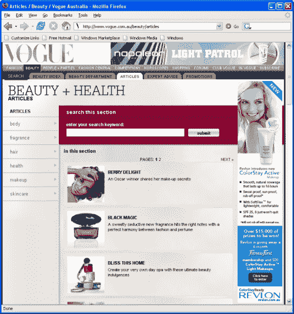
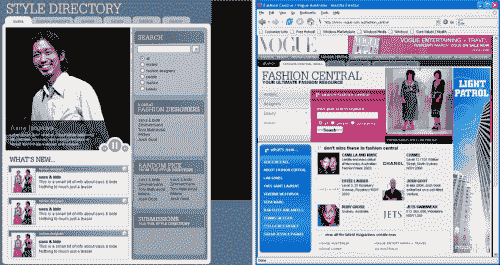
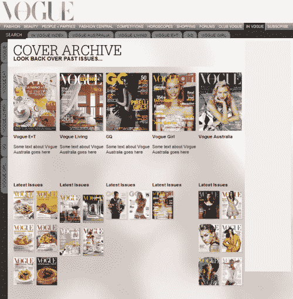
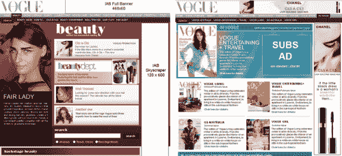
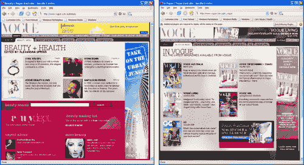
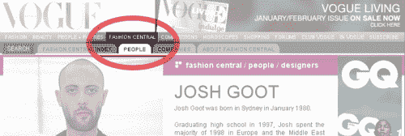

# 重建 Vogue.com.au

> 原文：<https://www.sitepoint.com/rebuilding-vogue-com-au/>

2005 年 11 月 22 日，澳大利亚《Vogue》网站[Vogue.com.au](http://www.vogue.com.au)的重新开发开始了，此前几个月一直在讨论该网站未来几年的发展方向。

该项目的目标是:

*   简化网站的日常维护。这是通过引入内容管理系统(CMS)实现的。
*   改善用户体验。信息架构和视觉设计都得到了改善。
*   创造一个 Vogue.com.au 成长的基础。这是由 CMS 提供的，通过跨几个域部署站点来构建。

除了这些主要目标，我们还必须确保任何旧的内容，不能带到新的内容管理系统仍然可以通过 Vogue.com.au 交付。

##### 信息架构

***场地结构***

重新设计 Vogue.com.au 的第一步是审视现有的场地结构。在此分析中，我们评估了新内容将来自何处(例如，哪些现有部分正在增长，哪些新部分即将上线)，并相应地更新了结构。

过去，为 Vogue.com.au 采购内容的流程面临着诸多挑战，包括:

*   缺乏敬业的编辑人员
*   现有内容的版权问题
*   担心免费复制太多内容会损害杂志

如果没有一个公认的常规内容来源，就很难产生一个完整的、不会让网站看起来空洞的网站结构。我们还必须注意我们在导航栏上有多少可用空间，因此必须就有限数量的部分达成一致。

旧址由以下部分组成:

*   美人
*   显示覆盖范围
*   事件
*   竞争
*   购物
*   订阅
*   论坛
*   时尚俱乐部
*   街头时尚
*   标题

在旧网站上，更新最活跃的部分是节目报道、美女、比赛、标题和事件。

尽管《街头时尚》很受欢迎，但考虑到寻找高质量参与者的工作，很难建立一个定期的内容流。

购物被视为表现不佳的领域，主要是因为我们缺乏资源来扩展这一领域。我们决定在今年晚些时候解决这个问题。

剩下的版块，论坛，时尚俱乐部和订阅，被认为是网站长期发展的关键。订阅是 Vogue.com.au 的原始收入来源，论坛是网站流量的支柱，时尚俱乐部提供了收集信息和确保与网站受众持续沟通的手段。

新网站有所有这些部分，外加一个名为时尚中心的新部分。为了给时尚中心让路,“街头时尚”部分与“人+派对”合并了。将它与事件中的内容结合起来，将使我们能够确保街头时尚部分不会显得陈旧。

除了这次合并，时尚版块也有所扩大。节目报道成为时尚的一个子部分(尽管它仍然构成了大部分内容)，这给了我们在这个部分放置更多类型内容的机会。例如，在旧的结构下，没有自然的地方放置最近的“嘉玛·沃德的后台日记”内容，因此它被存储在标题部分，与文章出现的问题放在一起。在新的网站结构中，内容可以位于时尚的一个子部分，并无限期地保留在那里。

经过这些更改，新的站点结构如下所示:

*   时尚(包括节目报道)
*   美人
*   人群+派对(融合活动和街头时尚)
*   时尚中心
*   竞争
*   购物
*   论坛
*   时尚俱乐部
*   流行(包含标题)
*   订阅

该站点结构在 CMS 上被复制为一系列文件夹，然后每个文件夹被分配一个模板来确定该部分的布局。

***档案***

在旧网站下，每个版块前面都有一个版块索引，显示最新的内容，并有一个包含该版块所有内容的存档。



随着 Vogue.com.au 网站内容的预期增加，该网站的栏目也扩大了。章节索引也有同样的目的，但是我们采用了新的方法来组织存档，这意味着内容被组织成更多的子章节。例如，美容的文章子部分包括化妆品、香水、身体等类别。

特定的模板被分配给节索引。在子部分中(例如，美容>文章)，使用“通用文件夹视图”来显示文件夹的内容。常规文件夹视图显示基本导航、搜索和内容列表。这使得 CMS 的用户只需点击几下鼠标就可以创建新的站点子部分。

***内容结构***

在旧的 Vogue.com.au 网站下，所有的内容项都是作为独立的网页构建的，每个网页都有自己的样式信息和标记。相似页面之间共享的数据非常少。

对于新的 Vogue.com.au 网站，CMS 上的大部分内容被分成“类”,从这些“类”中可以构建“对象”(这些“对象”可以被认为是你在网上看到的页面)。每个类都与其自己的模板(或多个模板)相关联，具体取决于所查看的部分。

例如，在《美容》、《时尚》等杂志上有许多关于 Vogue.com.au 的文章。).每篇文章都是作为“文章类”中的“对象”构建的。但是如果你在美容版块看一篇文章，你会注意到它的格式和设计与时尚版块的文章不同。使用 CMS 管理网站的人所要担心的只是一篇普通的文章，因为网站知道如何显示它所提供的信息。其他类别包括事件、杂志标题和幻灯片。

***会计遗留等内容？***

在规划网站重建时，我们认为不可能通过 CMS 交付所有内容。不受 CMS 控制的内容包括节目报道、比赛和购物。网站的这些区域由独立管理的系统控制，重新设计功能的任务将使我们远远超出项目的最后期限。

我们为网站选择的 CMS 是 eZ publish，这是一个基于 PHP 的产品，它引入了一个重要的限制:域名(Vogue.com.au)不能共享 CMS 管理的和非 CMS 管理的内容。因此，没有上传到 eZ publish 的内容不会出现在 Vogue.com.au 上，我们也无法将传统网页存储在 Vogue.com.au 网络服务器的子目录中。

虽然可以通过将 eZ publish 安装到域上的一个文件夹中并在同一个域中包含传统网页来解决这一限制，但 Vogue.com.au 的重新开发项目是一个更大项目的一部分，该项目旨在从 eZ Publish 的一个安装中控制多个网站，因此排除了这一潜在的变通方法。

解决方案是在一个子域(如 http://showcoverage.vogue.com.au)上托管非 CMS 内容，并创建一个指向非 CMS 内容的“重定向”对象。重定向对象包含 Vogue.com.au 上其他类的许多属性(如标题、描述、缩略图)，但内容链接被替换为子域的位置。

***新增栏目:时尚中央***

时尚中心的目标是成为寻找澳大利亚时尚和美容信息的人们的主要资源。该项目旨在解决公司缺乏内容制作资源的问题，并通过提供只有新媒体才能提供的服务来支持杂志。


上图:时尚中环从最初提出到现在的演变

本质上，时尚中心是原始网站的“推荐网站”页面的一个大大增强的版本。它被开发用来保存两种类型的信息:

1.  人物简介

3.  关于公司的信息

有时，当存在密切关系时，这些项目被链接在一起(例如，将时装设计师链接到时装标签)，这有效地向用户提供了相关信息的快捷方式。

网站的这一部分将成为 Vogue.com.au 其他部分的基础。在六个月的时间里，用户将能够观看最新的澳大利亚时装秀，如果他们喜欢这位设计师的作品，他们将能够阅读这个人的历史(在相关的时尚中心个人资料中)，并找到该品牌的零售商在哪里(通过他们的时尚中心时尚标签信息页面)。


新章节:封面档案–2006 年晚些时候推出

封面档案将成为 Vogue.com.au 的一部分，允许用户查看《时尚澳大利亚》、《时尚生活》、《时尚娱乐+旅行》、《时尚澳大利亚》和《时尚女孩》杂志的每个封面(如果可能的话)。封面将以足够高的分辨率呈现，以允许用户阅读所有封面行。对于封面档案中的每本杂志，还将提供该杂志内容的简要概述。

这是一个我们可以定期添加的部分，一旦建立了完整的归档，只需要很少的额外工作。发行新杂志时，以前杂志的信息会被移至封面档案。CMS 会自动重新格式化该页面，以便它可以通过封面存档提供—除了位置之外，不需要工作人员添加额外的信息或编辑文档的任何详细信息。

这是一个类似于 Fashion Central 的项目，它的开发是为了克服内容制作的问题，并为网站的其余部分提供额外的支持。当一篇文章来源于上一期《Vogue Australia》杂志时，封面档案中将提供该期杂志概述的链接。长期计划是将所有提及过去问题的链接到该杂志的过期问题部分。

##### 重新设计

Vogue.com.au 的重新开发带来的最明显的变化是它的外观:部分被重新设计(如美容)，导航被修改(如标签)，网站不太依赖弹出窗口(如幻灯片)，增加了交互性(如下拉搜索选项)。

最初，该项目的范围是在 CMS 上复制网站，以简化其日常维护。

然而，在项目过程中，很明显这个计划是有缺陷的。有太多的新页面允许我们使用这种简单的方法。

起初，我们开始根据需要设计新页面。例如，有一个标题的“章节索引”的需求(现在叫做 Vogue)，因此产生了一个设计。然而，这种方法最终也是有缺陷的，因为所需的新页面的数量和设计过程的孤立性质注定会导致网站的不同部分之间存在严重的不一致，并使用户体验总体上不太令人满意。


以上设计显示了最初设计过程的不一致性

因此，我们需要重新思考 Vogue.com.au 所有主要部分的设计，试图使网站看起来更加一致，并与杂志保持一致。虽然我们需要在所有部分保持一致的外观，但我们也希望每个部分都有自己的布局，以避免给 Vogue.com.au 的各个部分一种通用的感觉。


新的重新设计，在不同部分之间提供一致的外观和感觉

***选项卡式导航***

虽然部分的重新设计相当重要，但我们也对 Vogue.com.au 的整体导航做了一些微妙的改变。每个部分现在都包含子部分，这些子部分在模板上表示为选项卡。这为用户提供了一个快速的视觉参考，表明他们在 Vogue.com.au 的位置，如果用户从外部来源(例如，通过谷歌上的链接)到达网站深处的页面，这将特别有用。


时尚中心的“人物”子栏目中使用的标签示例

##### 重新编码

正如您所看到的，网站重新设计过程需要大量的工作来改善用户体验，并适应我们希望对结构所做的更改。然而，整体外观可以被认为是前一个网站的演变，而不是一个激进的重新思考。用于显示新网站的 XHTML 代码就不一样了。

CMS 中的所有 XHTML 都是从头开始重写的，与之前的网站没有任何相似之处。我们的目标是实现高水平的标准符合性(最终是 XHTML 1.0 Strict)并尽我们所能生成语义标记。所有的布局都是通过整个 Vogue.com.au 站点共享的级联样式表(CSS)的集合来控制的。

选择这种方法是因为它可以提供:

*   减少带宽使用
*   提高搜索引擎曝光率
*   更容易实现未来的变更(设计和代码)
*   缩短开发时间
*   设计人员和开发人员之间更高效的工作流程/#eli#

***降低带宽***

这种现代的标记方法意味着站点的 XHTML 代码不再充斥着与页面结构无关的额外标签。过去，网站使用表格进行布局。在一个例子中，下面的代码用于使单词 Vogue 出现在屏幕的一半。

```
<table width="100%">  

   <tr>  

      <td width="50%"> </td>  

     <td><p>Vogue</p></td>  

   </tr>  

</table>
```

该标记现在将被替换为如下内容:

```
<h1>Vogue</h1>
```

这段代码将与包含在一个单独文件中的样式信息结合在一起。这个非常简单的例子展示了将表示信息存储在一个单独的文件中的方法是如何大大减少标记的。这种方法应用于 Vogue.com.au 的一个典型页面时，节省了大约 10 KB。如果该页面在一个月内被查看 100 万次，则文件大小的减少将节省近 10，000MB 的数据。

***改进搜索引擎曝光***

Vogue.com.au 所有新页面上使用的标记已经被重写，以使内容更容易被搜索引擎发现。

1.  Title 标签以正在浏览的页面名称开始，以网站名称结束，因为搜索引擎更重视标题开头的文本。

3.  URL 包含与内容相关的关键字。例如，我们的美容版块有一篇关于拿破仑·珀迪斯的文章。那篇文章的网址是 http://www . vogue . com . au/Beauty/articles/make up/Napoleon _ Perdis
    不用查看页面，你就能推断出它与美容、化妆和 Napoleon Perdis 有关。

5.  语义标记用于帮助描述页面上的某些单词并赋予其权重。例如，H1 (header1 = high priority)标记出现在每个文档的开头，显示页面的名称。我们还广泛使用列表和文档定义来更准确地描述每个页面的内容。

7.  在传统上我们使用图像和图像标签来表示非标准字体的地方，已经使用了图像替换技术。这种方法旨在当搜索引擎对页面内容进行索引时，赋予其更大的意义。

***更容易实现未来的变化***

通过将内容(XHTML)和设计(CSS)分开，我们现在能够在几秒钟内对 Vogue.com.au 网站上的基本视觉元素做出改变。使用这种方法还可以快速进行更基本的更改。

例如，今年晚些时候，我们计划扩大网站上所有页面的宽度，以便它们不再为 800×600 浏览器提供默认支持。这个项目不需要我们改变 Vogue.com.au 上使用的任何 XHTML 模板；相反，所有更改都将在 CSS 和 CMS 级别进行。受影响区域数量的减少将大大降低我们进行这一变更时出现错误的风险。

***开发时间减少***

为了减少开发时间，我们为设计人员和开发人员创建了一个一致同意的 XHTML 规范。设计人员必须按照 XHTML 规范实现他的设计，开发人员必须确保后端按照相同的规范交付 XHTML 文档。这种方法完全消除了开发过程中的一个步骤，在这个步骤中，设计人员和开发人员需要花费时间将他们的工作合并到一个文档中。

例如，在为 Beauty 制作节索引时，设计人员通过处理链接到静态 XHTML 文档的 CSS 文件来创建布局。开发人员将设计师的 CSS 文件链接到他按照相同的 XHTML 规范构建的模板。

当设计人员完成了 CSS，开发人员完成了动态 XHTML 模板的编码时，工作就 100%完成了。由于开发人员和设计人员同时在同一个页面上工作，开发人员可以看到他的工作进展到完成的页面。

##### 工作流程

这个项目最初的目标之一是让具备基本网络技能的员工能够更容易地将内容快速上传到 Vogue.com.au。

在过去，这个角色必须由网页设计师或开发人员来担任。旧的方法意味着我们过度依赖关键员工，并在工作流程中造成了巨大的瓶颈。

随着 eZ Publish 的使用，以及从 eZ Publish 的开发者那里额外购买在线编辑器，我们现在有了一种方法来让员工上传文章、幻灯片和其他内容，而不需要个人具备任何 XHTML 技能，只需要基本的 Photoshop 技能。

例如，现在从打开原始 Adobe InDesign 文件开始，不到十分钟就可以制作和发布一篇基本的美容文章。在旧系统下，这至少需要 40 分钟，有时甚至更长。

有了这个基础设施，我们能够在 CMS 上定义几个用户帐户，允许 Vogue.com.au 团队的各个成员开始将内容上传到将于 2 月 1 日上线的各个部分。

我们采用的方法意味着我们只需要两周的开发就可以做到这一点。然而，我们决定等到直播日期前两周，这样上传内容的团队成员可以更好地查看他们上传的内容。两个星期后，我们有了所有内容的规范，但我们只有 20%的模板可见。

在开发的最后两周，我们有两名员工上传内容，两名成员完成后端/前端任务。这些角色都被很好地定义了，以至于没有必要手动同步每个人正在做的工作。每项任务一完成，所有的工作就在新的地点集中起来。

在开发过程中，定义了几个角色，团队的一些成员承担了多个角色:

1.  设计师

3.  HTML 编码器

5.  CSS 编码器

7.  后端开发人员

9.  内容管理器

11.  图像编辑器

以这种方式定义角色，并采用我们使用的编码方法，有助于防止团队成员被手头的任务压垮，特别是在小团队的情况下。

成员们不必经常考虑“大局”,只需专注于手头的任务。例如，一个成员不必考虑生成整个 Beauty 部分，而只需考虑为 Beauty 生成 XHTML，不管设计看起来如何，CSS 如何编写，后端如何插入。

##### 内容管理系统

eZ Publish 被选为我们的内容管理系统，因为它具有极大的灵活性、出色的支持、丰富的文档和活跃的在线社区。

***所见即所得编辑***

eZ publish 安装扩展了在线编辑器，为 CMS 用户提供了所见即所得的显示。Vogue.com.au 现在使用编辑器的方式意味着页面布局非常灵活(例如，我们可以在页面的任何位置使用无限数量的图像)。

***远程工作***

由于该网站的管理区现在托管在一个网络服务器上，我们不再需要第三方软件来维持网站的日常运行。实际上，这意味着当记者或其他内容制作人在办公室外工作时，他们对《Vogue》IT 部门的依赖会减少。Vogue.com.au 团队成员可以使用任何装有现代浏览器的电脑在网站上工作。

***一次安装多个网站***

eZ publish 提供了许多安装选项。我们站点的基本代码安装在一个通用域上，并且这个安装已经被配置为允许其他域指向它。然后，eZ publish 知道用户从哪个域访问网站，并显示相应的网站(例如 Vogue.com.au)。

从长远来看，这个相同的基础安装将用于运行其他网站。这种方法的好处是，无论 eZ publish 支持多少个站点，都只维护一个安装。这对以下方面至关重要:

*   安全更新
*   软件升级
*   降低对 IT 资源的依赖
*   减少新站点的安装时间

***跨多个站点安装功能***

eZ publish 最激动人心的特性之一是，它让您能够在网站上开发功能，并将这些功能作为“包”导出，安装到另一个运行 eZ publish 的网站上。

在实践中(取决于测试)，这应该允许在一个网站上开发一个互动功能，如对 Vogue.com.au 投票，然后安装在另一个网站上，如 VogueGirl.com.au。这将减少共享特性的开发时间。

***表现***

使用 eZ publish 时，性能是我们最关心的问题。在研究 CMS 的时候，我们遇到了一些人的报告，他们发现响应速度很慢，或者更糟的是，他们发现一旦切换到 eZ publish，他们的整个网站将无法运行。

进一步的研究表明，这些报告是不良软件实施或不良服务器配置的结果。我们还研究了基准测试，测试显示 eZ publish 在一个非常低规格的服务器设置上一个月可以处理超过 250 万个页面请求。

Vogue 的 IT 部门提供了一个专用的前端服务器，以补充 http://forums.vogue.com.au 已经使用的数据库服务器。web 服务器被配置为使用 Zend optimizer，据报道，它将 PHP 代码的交付速度提高了 80%。未来 12 个月的预计性能改进将绰绰有余，未来的硬件改进将意味着适度的性能升级将是直截了当的。我们也在考虑将 eZ publish 放入一个集群环境中，如果流量在未来几年以意想不到的速度增长的话。

##### 旧与新

以下概述了该站点的管理方式与我们之前的方法之间的一些主要差异。

***人为失误少***

随着 eZ publish 在 Vogue.com.au 网站上的实施，运行网站所需的许多任务都实现了自动化。这减少了可能蔓延到公共网站的错误数量。

例如，在过去，如果我们希望在网站的不同部分推广一篇文章，网站管理员必须在他们希望文章出现的每个页面上手动重新输入该文章的名称、描述和缩略图。使用新的 Vogue.com.au，管理员选择他们希望文章出现的部分，并将该部分的一部分“指向”该文章。CMS 代表管理员处理标题、描述和缩略图。

***更快上传内容***

在旧的 Vogue.com.au 系统下，每个网页都必须手动创建，图像必须加载到特定的目录中，所有相关的内容都必须手动链接在一起，然后才能传输到生产 web 服务器，在那里它们会立即出现在网上。

在新系统下，内容直接从文件服务器(如 Word 格式)获取，粘贴到 CMS 中，图像直接加载到页面中，以备排版。一旦布局完成，内容通过 CMS 发布到网站。

***发布前预览内容，隐藏内容***

为了预览旧网站上的内容，用户必须创建一个页面，将其上传到 live web 服务器，并在链接到网站的其他部分之前进行检查。任何有权访问该 URL 的人都可以查看该页面。要隐藏一个页面，工作人员必须将其重命名为公众猜不到的名称，然后手动取消该页面在网站其他地方的所有引用链接。

使用新的 Vogue.com.au，员工可以完成创建内容的所有步骤，然后查看预览。在此过程中，公众始终无法查看这些内容。他们可以通过在 CMS 的对象属性中选择“隐藏”来隐藏实时内容。一旦内容被隐藏，对该内容对象的所有引用也被隐藏，这意味着不需要手动取消链接，也不会出现断开的链接。

***内容版本化***

旧的 Vogue.com.au 站点让我们无法跟踪对文档所做的更改。如果工作人员上传了一篇文章，然后对其进行了修改，后来发现修改不正确，该文件不应该被编辑，他们唯一的选择是找到原始材料，然后根据原始材料重新制作内容。

在新网站上，所有文档更改都记录为“版本”。当员工编辑页面(对象)时，会创建一个新的“版本”，包含他们所做的所有更改。现在，如果我们需要回滚内容，我们只需调用文档的以前版本并重新发布它。

***多张图片上传和动态调整大小***

在旧网站上，调整图像大小并将其传输到 web 服务器(作为 zip 文件)是一个手动过程。在新网站上，这是在 CMS 中执行的，这也为团队成员提供了将图像调整到所需大小的完全自由。

新网站还允许图像在页面上的显示顺序以及标题来源于图像的文件名。因此，按照惯例，“01 Vogue Photo.jpg”将首先出现，并被命名为“Vogue Photo”。

##### 启动网站

2006 年 2 月 1 日下午 4 点是新 Vogue.com.au 工厂第一阶段启动的最后期限。时间到了，团队已经完成了进行切换所需的所有任务。

尽管我们渴望将停机时间降至最低，但我们还是留出了两个小时来进行所有必要的更改。这个项目和建立一个新站点的最大区别是，在这种情况下，有许多独立的系统可能会受到转换的影响。

我们不得不修改我们的节目报道、邮件列表、论坛和比赛。我们需要大约 30 分钟来切换、测试和启用所有这些独立的系统。

主站点的最终切换是通过从旧服务器到新服务器的 DNS 条目的变化来处理的。这确保了不会发生意外的环境变化。

总的来说，除了在共享图像和样式表的实现中出现了一点小问题，导致主 web 服务器上的资源意外耗尽之外，发布过程非常顺利。这个问题被隔离并解决后，新站点在下午 5:30 完全正常运行。

##### 结论

让更多的人接受使用 CMS 的培训已经对网站内容产生了巨大的影响。我们现在可以轻松地每天更新内容，超过 50 家新的美容公司已经将信息上传到时尚中心。

基于 XHTML + CSS 构建网站让我们可以在几秒钟内做出大范围的改变。例如，在我们启动网站后，我们需要给所有选项卡上的文本一个稍微高一点的对比度。一行代码被调整，Vogue.com.au 的每一个标签都增加了对比度。这只是这次彻底重建预计带来的诸多主要好处中的一个例子。

## 分享这篇文章