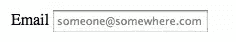
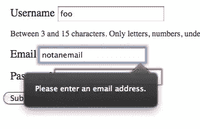
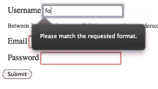
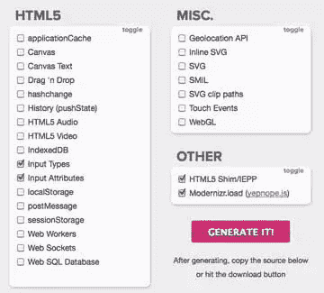

# 使用 Modernizr 和 Yepnope 进行回归增强

> 原文：<https://www.sitepoint.com/regressive-enhancement-with-modernizr-and-yepnope/>

Alex Sexton 的 1.0 版本的 [yepnope.js](http://yepnopejs.com/) 脚本加载器上周发布了，所以我认为这是一个很好的机会向您展示如何将 yepnope 与 Modernizr 结合起来，以利用 HTML5 的特性，而不会为使用最新浏览器的用户带来额外的下载。

## 什么是回归增强？

你可能已经熟悉了*渐进*增强的概念:设计一个能在所有浏览器中工作的功能的基线版本，然后为更有能力的浏览器添加功能。

“ [polyfill](http://remysharp.com/2010/10/08/what-is-a-polyfill/) ”或“回归增强”技术只是意味着您继续使用新功能，然后使用 JavaScript 来模拟旧浏览器中的本机行为。因此，不用使用脚本在所有浏览器上为您提供投影，您只需编写带有`box-shadow`属性的 CSS，然后包含一个脚本，该脚本透明地获取该属性，并使用您指定的值在 JavaScript 中创建投影。

## 什么是 Modernizr？

对于那些不熟悉它的人来说， [Modernizr](http://www.modernizr.com/) 是一个小的(3.7KB gzipped) JavaScript 库，可以检测浏览器中 HTML5 和 CSS3 特性的存在。Raena 在她最近的[教程中使用了它来创建一个逐渐增强的图像库](https://www.sitepoint.com/build-an-awesome-image-gallery-with-jquery-modernizr-and-css3/)，凯文[在 SitePoint pocast 的最近一集采访了该库的创建者之一保罗·爱尔兰](https://www.sitepoint.com/podcast-95-the-undetectables-with-paul-irish/)。

Modernizr 非常适合回归增强，因为它让您知道何时可以依赖浏览器功能，何时需要依靠 JavaScript 或替代样式。

使用 Modernizr 有两种主要方式。最常见的方法是依赖它添加到 html 标记中的 HTML 类。当在最新的 Firefox 4 beta 中使用 Modernizr 查看页面时，我在开始的标签中看到了以下内容:

```
<html class="  js flexbox canvas canvastext webgl no-touch geolocation postmessage  no-websqldatabase indexeddb hashchange history draganddrop no-websockets  rgba hsla multiplebgs backgroundsize borderimage borderradius boxshadow  textshadow opacity no-cssanimations csscolumns cssgradients  no-cssreflections csstransforms no-csstransforms3d csstransitions  fontface video audio localstorage no-sessionstorage webworkers  applicationcache svg inlinesvg smil svgclippaths" lang="en">
```

所有这些类告诉我哪些特性在浏览器中可用。例如，我有@font-face、web workers 和 CSS3 box-shadow、text-shadow 和 border-image，但是我没有 websockets 或 3D CSS 转换。所以，在我的 CSS 中，我可以这样做:

```
.borderradius .box {
  -moz-border-radius: 5px;
  -webkit-border-radius: 5px;
  border-radius: 5px;
}

.no-borderradius .box {
  // fallback code providing an alternate styling to browsers that don't support border-radius
} 
```

这很简单。很酷的一点是，Modernizr 还为您提供了一个 JavaScript API，它可以告诉您某个特性是否可用，包括一些没有出现在`<html>`标签类中的特性。例如，假设我有一些为输入元素提供占位符值的 JavaScript 代码。如果浏览器支持占位符属性，我就不需要运行这段代码，所以在执行我的代码片段之前，我可以使用 Modernizr 来检查这一点:

```
if(!Modernizr.input.placeholder) {
 // custom placeholder code
} 
```

这样，我的代码将只在没有内置浏览器支持占位符文本的情况下运行。

## 问题是

不过，这里还有一个小问题。如果浏览器*支持*占位符属性，我仍然要求它下载一堆代码，这些代码除了模拟该属性的行为之外什么也不做。我相信你会同意这有点浪费！进入 [yepnope.js](http://yepnopejs.com/) 。如果满足某些条件，Yepnope 将加载脚本。最好的部分是它与 Modernizr 完美地结合在一起，所以一切都井井有条。

图书馆网站上最简单的例子是这样的:

```
yepnope({
  test : Modernizr.geolocation,
  yep  : 'normal.js',
  nope : ['polyfill.js', 'wrapper.js']
}); 
```

如果浏览器支持地理定位，该代码片段将从服务器加载 normal.js 文件；否则，它将同时加载 polyfill.js 和 wrapper.js。

## 一个实例

现在您已经知道了所有部分的工作原理，让我们将它们放在一个真实的例子中。假设您有一个简单的注册表单，由用户名、密码和电子邮件地址字段组成。下面是标记:

```
 <!doctype html>
<html lang="en">
<head>
  <meta charset="UTF-8">
  <title>yepnope.js test</title>
  <style>
    div { margin: 10px; }
    div p { font-size: 12px; color: #333; }
  </style>
</head>
<body>
  <form>
    <div>
      <label for="username">Username</label>
      <input type="text" required pattern="[a-z0-9_-]{3,15}" name="username" id="username">
      <p>Between 3 and 15 characters. Only letters, numbers, underscores (_) and hyphens (-) are allowed.</p>
    </div>
    <div>
      <label for="email">Email</label>
      <input type="email" required placeholder="someone@somewhere.com" name="email" id="email">
    </div>
    <div>
      <label for="password">Password</label>
      <input type="password" required name="password" id="password">
    </div>
    <input type="submit" value="Submit">
  </form>
</body>
</html> 
```

表单使用了许多 HTML5 特性:required 属性、`placeholder`属性和`pattern`属性。在支持的浏览器(如 Firefox 4 beta)中，这提供了占位符文本和一些基本的客户端验证:

 **占位符属性提供占位符文本**

 **邮件输入类型提供内置格式验证**

 **模式属性提供基于正则表达式的验证**

然而，在不支持的浏览器中，你什么也得不到。让我们使用一个基于 JavaScript 的 polyfill 和 Modernizr 来解决这个问题，并让 Yepnope 只在需要的时候加载它。

### 第一步:下载 Modernizr 和 Yepnope

新的定制 Modernizr 构建器允许您将 yepnope 直接捆绑到 Modernizr 中，让我们开始吧。前往[http://modernizr.github.com/Modernizr/2.0-beta/](http://modernizr.github.com/Modernizr/2.0-beta/)。在这种情况下，我们需要检测的只是表单属性和输入类型，所以单击这两个复选框，选中 HTML5 Shim 和 Modernizr.load (yepnope.js)框。



单击 Generate，然后下载 Build 来获取您的定制 Modernizr 库。

### 第二步:在你的页面中加入 Modernizr

因为 Modernizr 需要确定是否应该运行其他脚本，并添加 CSS 可能需要的类，所以它应该放在 HTML 的顶部，而不是像通常建议的那样放在底部:

```
<script src="modernizr.custom.02401.js"></script> 
```

(记住用您自己的版本号替换自定义的版本号。)

### 步骤 3:测试功能支持

现在我们想测试一下浏览器是否支持新的输入类型和属性:

```
yepnope({
  test: Modernizr.inputtypes.email && Modernizr.input.required && Modernizr.input.placeholder && Modernizr.input.pattern,
  nope: 'h5f.min.js'
});
```

我们正在加载 Ryan Seddon 的 [H5F](https://github.com/ryanseddon/H5F) 库，它模拟了我们在这个例子中使用的所有新的输入类型和属性。在这种情况下，我们有一个 polyfill 脚本，它涵盖了一系列不同的功能，因此我们会一次检查所有功能，如果其中有一个功能不受支持，就加载 polyfill。这并不总是理想的，但是为了便于说明，我们保持事情简单。

您还会注意到，我们在这个 yepnope 调用中没有使用“yep”。这很好:如果我们正在检测的所有特性都存在，那么 Yepnope 将不会做任何事情，这正是我们想要的。

### 步骤 4:执行回调代码

您可能想在下一行代码中调用新包含的库，但这是行不通的。Yepnope.js 异步加载脚本*，因此浏览器不会等待脚本加载完成后再移动到代码的下一行。这意味着如果你试图使用你刚刚告诉 Yepnope 加载的特性，你可能会得到一个错误。*

 *相反，Yepnope 允许您为加载的每个脚本设置一个回调函数，在脚本下载完成后运行。这是如何工作的:

```
yepnope({
  test: Modernizr.inputtypes.email && Modernizr.input.required && Modernizr.input.placeholder && Modernizr.input.pattern,
  nope: 'h5f.min.js',
  callback: function(url, result, key) {
    H5F.setup(document.getElementById("signup"));
  }
});
```

每次加载脚本时，您指定为回调的函数将被调用*。这意味着如果你同时指定了 yes 和 no，回调将被调用两次。幸运的是，回调传递了三个有用的参数:`url`是加载结果的 URL，`result`是表示测试是否通过的布尔值，`key`是使用键引用特定资源的一种方式(现在不需要担心这个)。*

在上面的例子中，我只在 nope 上加载了一个脚本。结果，回调无论如何只会被调用一次，而且只有在测试失败的情况下，所以我不需要担心参数。

### 第五步:你完成了！

信不信由你，你完了。有了上面的代码，支持新表单特性的浏览器将使用它们的内置功能，而旧浏览器将加载一个 JavaScript 后备。JavaScript 将只在那些不支持的浏览器中加载，所以你是在奖励现代浏览器更快的加载时间。更好的是，因为 polyfill 与新属性挂钩，并且不需要任何额外的类，所以该解决方案是面向未来的。随着时间的推移，越来越少的访问者会下载 polyfill，直到最终没有人会下载。

## 下一步是什么？

我只讨论了最简单的 yepnope，js 用例。对于这样一个小小的库来说，它包含了很多功能，所以你绝对应该通读一下[项目的页面](http://yepnopejs.com/)，看看一些更高级的用法示例。即使您没有将它用于 HTML5 或 CSS3 polyfills，异步和按需加载脚本也有潜在的性能提升，因此 Yepnope 仍然值得研究。

现在，你所要做的就是开始在你的网站上使用新的 HTML5 和 CSS3 特性，你可以安全地为旧浏览器的用户提供一个全功能的后备，而不会影响最新访问者的体验。* 

## *分享这篇文章*